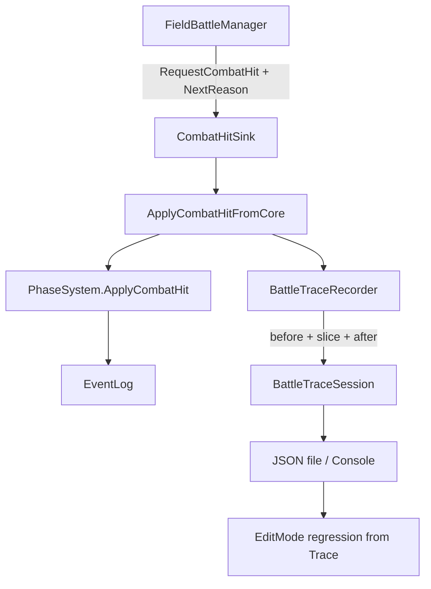

# BattleTrace 可执行落地计划

## 目标与边界

- **做**：统一门禁旁路打点 → 语义化 JSON → DevTest 一键导出 → EditMode 回归模板（含 1 条合成「反击致死」用例作样板）。
- **不做**：改 `DealDamage`/反击规则、效果原子插桩、完整 command replay、恢复海量旧模拟对局。
- **硬约束**：打点失败吞掉；`CombatHitPresentationResult` 返回值与结算路径不变。

## 架构（已锁定）



- **最小原子**：`BattleTraceOp` = 一次结算门（优先 `ApplyCombatHit`），不是效果 DSL 原子。
- **挂载方式**：统一入口旁路，不按卡写打点。

## 文件改动清单

### 新增

| 文件 | 职责 |
|------|------|
| [`Assets/Scripts/Flow/Diagnostics/BattleTraceModels.cs`](Assets/Scripts/Flow/Diagnostics/BattleTraceModels.cs) | `BattleTraceSession` / `BattleTraceOp` / `BattleTraceCardSnap` / `BattleTraceEventRow` POCO |
| [`Assets/Scripts/Flow/Diagnostics/BattleTraceRecorder.cs`](Assets/Scripts/Flow/Diagnostics/BattleTraceRecorder.cs) | 单例式静态 recorder：`Enabled`、`NextReason`、`RecordCombatHit`、`ExportJson`、`Clear` |
| [`Assets/Scripts/Flow/Diagnostics/BattleTraceJson.cs`](Assets/Scripts/Flow/Diagnostics/BattleTraceJson.cs) | 手写/ `JsonUtility` 友好序列化（避免依赖第三方） |
| [`Assets/Scripts/NineGrid.Foundation/NineGrid.Core.Tests/CombatHitDeathRegressionTests.cs`](Assets/Scripts/NineGrid.Foundation/NineGrid.Core.Tests/CombatHitDeathRegressionTests.cs) | 回归模板 + 1 条合成反击致死样板 |

### 修改（薄包装）

| 文件 | 改什么 |
|------|--------|
| [`InBattleManagerSingleton.cs`](Assets/Scripts/Flow/InBattleManagerSingleton.cs) | `ApplyCombatHitFromCore` / `ResolvePostKillBoardFromCore` / `BootstrapRun`+`StartBattleNode` 外包 try 记录；`AvatarDefeated` 时自动 `ExportJson` |
| [`FieldBattleManagerSingleton.cs`](Assets/Scripts/Cards/FieldBattleManagerSingleton.cs) | 玩家攻前 `NextReason=PlayerAttack`；`PlayCounterAttackCoreAsync` 内 `NextReason=CounterAttack`（仅设字符串，不改结算） |
| [`InBattleManagerDevKeys.cs`](Assets/Scripts/NineGrid.Foundation/NineGrid.DevTest/Flow/InBattleManagerDevKeys.cs) | 增绑一键：导出当前 Trace / 开关 Enabled（如 Keypad4） |
| [`CombatHitSink.cs`](Assets/Scripts/Cards/CombatHitSink.cs) | **不改委托签名**；reason 走 `BattleTraceRecorder.NextReason` 环境变量式传递，避免 Cards↔Flow 签名扩散 |

> `BattleTraceRecorder` 放 Flow 程序集；Cards 只设一个公开静态 `NextReason` 时，若程序集引用不允许，则把 `NextReason` 放到 Cards 侧极薄静态类 `BattleTraceReason`（仅 string），Flow 读取——优先选**零引用扩散**：在 `CombatHitSink` 旁加 `public static string PendingTraceReason`（Cards 已有，Flow 注册桥时读取）。

**已选默认**：在 [`CombatHitSink`](Assets/Scripts/Cards/CombatHitSink.cs) 增加 `public static string PendingTraceReason`；Field 写入，`ApplyCombatHitFromCore` 读取并清空。不改 `Func<int,int,...>` 签名。

## JSON 语义契约（给后续 AI 用）

每条 Op 必须能直接回答「谁、为何、打前数值、门内事件、打后是否死」：

```json
{
  "schemaVersion": 1,
  "seed": 42,
  "sessionId": "20260710-...",
  "ops": [
    {
      "opIndex": 0,
      "opKind": "CombatHit",
      "reason": "CounterAttack",
      "apiPath": "PhaseSystem.ApplyCombatHit",
      "phaseBefore": "InteractionLoop",
      "phaseAfter": "Defeat",
      "attacker": { "uid": 3, "defId": "...", "kind": "Monster", "atk": 5, "hp": 4, "armor": 0 },
      "target": { "uid": 1, "defId": "Avatar", "kind": "Avatar", "atk": 2, "hp": 3, "armor": 0 },
      "eventStartIndex": 120,
      "eventEndIndex": 135,
      "events": [
        {
          "sequence": 121,
          "type": "DamageDealt",
          "actionName": "DealDamage",
          "actorUid": 3,
          "targetUid": 1,
          "amount": 5,
          "delta": 3,
          "remainingHp": 0,
          "remainingArmor": 0,
          "sourceDefId": "",
          "cause": "",
          "summary": "#121 ShowDamage ..."
        }
      ],
      "presentation": {
        "accepted": true,
        "damageAmount": 5,
        "targetKilled": false,
        "avatarDefeated": true
      },
      "verdictHints": {
        "avatarDefeated": true,
        "targetKilled": false,
        "extraDamageDealtCount": 0,
        "effectTriggeredIds": []
      }
    }
  ]
}
```

导出路径：`Application.persistentDataPath/BattleTraces/trace-{timestamp}.json`，并 `Debug.Log` 完整路径 + 末两条 Op 的短摘要。

## 实现步骤（按序执行）

### Step 1 — Trace 模型与 Recorder

- 实现 POCO + `BattleTraceRecorder`：
  - `Enabled` 默认在 `UNITY_EDITOR || DEVELOPMENT_BUILD` 为 true
  - `BeginSessionIfNeeded(seed)`
  - `RecordOp(op)`
  - `TryCaptureCard(uid) → BattleTraceCardSnap`（读 `CardRegistry` + `IStatSystem` 有效 ATK/HP/Armor）
  - `SliceEvents(start,end)` → 填 `BattleTraceEventRow`（可复用 `PresentationEventMap`/`ActionLogRow` 的 summary 逻辑，避免 Flow 强依赖时可手写精简 summary）
  - 全部包 try/catch，失败只 `Debug.LogWarning`

### Step 2 — 挂统一门禁

在 `ApplyCombatHitFromCore`：

1. 读 `PendingTraceReason`（空则 `CombatHit`）并清空
2. `startIndex`、before 双方 snap、`phaseBefore`
3. 调用现有 `phase.ApplyCombatHit`（**逻辑零改动**）
4. 填 summary（现有循环保留）
5. 若 Enabled：写 Op（events 切片、`phaseAfter`、`presentation`、`verdictHints`）
6. 若 `AvatarDefeated`：自动 `ExportJson()`

同样薄包 `ResolvePostKillBoardFromCore`（`opKind=PostKillBoard`）与 `StartBattleNode` 成功后（`opKind=StartNode`，记 seed/开局 avatar snap）。

### Step 3 — 标记反击 reason

- `CombatHitSink.PendingTraceReason`
- [`FieldBattleManagerSingleton`](Assets/Scripts/Cards/FieldBattleManagerSingleton.cs) 玩家命中前设 `PlayerAttack`；`PlayCounterAttackCoreAsync` 内 `RequestCombatHit` 前设 `CounterAttack`

### Step 4 — DevTest 导出键

- [`InBattleManagerDevKeys`](Assets/Scripts/NineGrid.Foundation/NineGrid.DevTest/Flow/InBattleManagerDevKeys.cs)：`Keypad4` → `BattleTraceRecorder.ExportJson()`；可选 `Keypad5` 开关 Enabled
- 按项目 skill：若需进 Stack，只加 binding；**不改**场景 `.unity` 手编（组件已在场景则仅脚本；新组件用 Unity MCP）

### Step 5 — EditMode 回归模板

在 `CombatHitDeathRegressionTests`：

1. 复用 `CoreOperationContractTests` harness（`ResetForTests` + `Seed` + `StartNode` + `SliceEvents`）
2. **样板用例** `ApplyCombatHit_Counter_CanDefeatAvatar`：造高攻怪、低血 Avatar（或 cheat 降血），`ApplyCombatHit(avatar,monster)` 未击杀 → `ApplyCombatHit(monster,avatar)` → 断言出现 Avatar `HpChanged` RemainingHp≤0 与/或 `PhaseChanged→Defeat`
3. **对照用例** `Attack_SameSetup_DocumentsPathDifference`：同初始态跑一次 `Attack(slot)`，只记录/断言与分段路径相关的关键差异（允许先 `Assert.Pass` 注释期望，但至少跑通两边）
4. 注释写明：真实死亡 Trace 的 JSON 如何改成下一条测试（填 seed、defId、期望 Amount）

### Step 6 — 编译与冒烟

- `refresh_unity` + `read_console` 无编译错误
- Play：入场 → 点怪触发反击 → 确认 Console 有 Trace 路径；死亡自动导出
- EditMode：跑新测试类通过

## 验收标准

- 打点开关关闭或 Recorder 抛错时，战斗胜负/数值与改前一致
- 一次「反击致死」JSON 含：`reason=CounterAttack`、双方 before 数值、`DamageDealt` amount/delta/remainingHp、`avatarDefeated=true`
- 不打开每张卡的专用脚本；仅统一门禁
- `CombatHitDeathRegressionTests` 至少 1 条反击 Defeat 断言稳定绿

## 明确不做

- 不改 `PhaseSystem.ApplyCombatHit` / `Attack` 语义去「修死亡」
- 不做效果原子级 trace
- 不手改 `.unity`
- 不在本轮实现完整 A/B 自动化工具（对照用例仅作模板；真实分流靠人工读 JSON）
