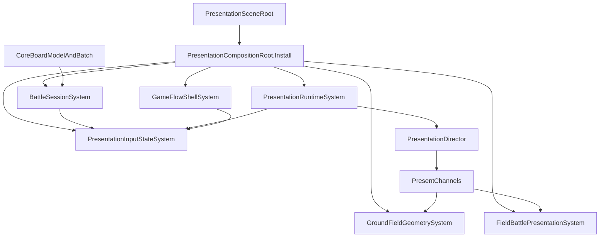

# Issue #43 三大宿主与门禁重构计划

## 已定设计

- 保持 ADR-0001/0002：`PresentationDirector` 独占 `BattleTimeline`，Batch/ack、Core `BoardModel` 占格权威和卡面 Commit 时机不变。
- 不按方法机械拆类；目标是少量深 module，细分协作者只作为实现内部 seam。外部调用统一走 Command、Query、Event 和只读 System/BindableProperty。
- [PresentationSceneRoot.cs](Assets/Scripts/NineGrid.Presentation/Setup/PresentationSceneRoot.cs) 是唯一生产场景入口，[PresentationCompositionRoot.cs](Assets/Scripts/NineGrid.Presentation/Setup/PresentationCompositionRoot.cs) 是唯一生产导演装配入口。
- `CombatHitSink` 不整体换名保留；门禁、锁和诊断成员逐一迁走后删除类型。`PresentationLocked` 不产生新副本，直接使用导演 external hold 与 `MainlineBusy`。
- 骷髅卡组既有 bug 只保留基线记录，不在 #43 中修复；只有重构新增回归阻塞本票。
- 最终保留原 `.meta`/GUID，将四个类型重命名为 `BattleSessionController`、`GroundFieldView`、`FieldBattleView`、`GameFlowController`。

## 实施批次

### 0. 固化行为与迁移护栏

- 在 [Assets/Scripts/NineGrid.Presentation/Tests](Assets/Scripts/NineGrid.Presentation/Tests) 补足接口级 characterization：导演单条缓冲、Batch 未完成不得 ack、Opening/overlay/board-select 门禁矩阵、external hold 必定释放、Ground 双向索引、resolved combat uid、流程状态顺序。
- 记录 `MainScene`、`UITestSence` 的四个脚本 GUID 与 `PresentationSceneRoot` 绑定快照；后续只允许预期字段迁移。
- 保留行为测试，删除或改写只依赖旧私有字段、静态 Sink 或 Singleton 形状的结构测试。
- 不吸收当前工作区 [NineGrid.Presentation.asmdef](Assets/Scripts/NineGrid.Presentation/NineGrid.Presentation.asmdef) 的换行差异。

### 1. 收敛为单一生产 Runtime

- 引入不可变 `PresentationSceneBindings`；让 `PresentationSceneRoot` 负责 Install、逐帧 Tick 和幂等 Shutdown，不再由各宿主自行装配/关停。
- 将 [InBattleManagerSingleton.cs](Assets/Scripts/NineGrid.Presentation/Flow/InBattleManagerSingleton.cs) 中 Channel、三个 Intent Factory、`RoutingIntentScriptFactory` 与 Director 的构造迁入 `PresentationCompositionRoot.Install(bindings)`。
- 让 [PresentationRuntimeSystem.cs](Assets/Scripts/NineGrid.Presentation/Systems/PresentationRuntimeSystem.cs) 成为唯一 `IPresentationRuntimeSystem`，生产与测试共用同一 interface；Command 不再在两种 runtime 之间 fallback。
- 同批删除 `DirectorIntentRuntime`、`EnsurePresentationDirectorRequested` 懒装配链、InBattle 的 Director 字段/Tick/teardown 和第二份 busy 同步。
- 扩展 [PresentationCompositionRootTests.cs](Assets/Scripts/NineGrid.Presentation/Tests/PresentationCompositionRootTests.cs) 与 [PresentationRuntimeSystemTests.cs](Assets/Scripts/NineGrid.Presentation/Tests/PresentationRuntimeSystemTests.cs)，断言生产只有一个 started runtime、重复安装失败且 Shutdown 不误关外来实例。

### 2. 建立分型只读门禁并删除 CombatHitSink

- 新增 `PresentationInputStateSystem`，只读聚合 Runtime `MainlineBusy`、Choice 会话、BoardSelection phase、BattleSession Opening phase、Ground/Battle 运动状态；它只做派生投影，不拥有第二份可写真相。
- 为 Explore、Attack、Pickup、UseItem、BoardSelection 分别提供结构化 Query，返回执行/交给导演缓冲/路由到选卡/拒绝原因，避免一个万能 `IsBusy` 破坏不同输入语义。
- overlay、board-select、opening 的写入迁到各自 System，并由 Command 改变源状态；HitProxy、Hand、Field 等调用者只读 Query/BindableProperty。
- Pickup、BoardDrain、RewardDrain 通过 runtime external-hold Command 获取和释放导演租约；删除独立 `PresentationLocked`、Reset/ForceEnd 静态锁。
- 将 [CombatHitSink.cs](Assets/Scripts/NineGrid.Presentation/Cards/CombatHitSink.cs) 中 DTO/枚举移至独立 contracts 文件，将 `PendingTraceReason` 迁入可消费的诊断上下文，然后删除 `CombatHitSink`；把 [CombatHitSinkOpeningGateTests.cs](Assets/Scripts/NineGrid.Presentation/Tests/Cards/CombatHitSinkOpeningGateTests.cs) 改为 input-state 行为测试。

### 3. 深化 GroundField module

- 反转当前 [GroundFieldGeometrySystem.cs](Assets/Scripts/NineGrid.Presentation/Systems/GroundFieldGeometrySystem.cs) 的透传关系：System 真正拥有几何注册、双向索引、busy、Clock/Beat/Lease/Barrier、飞牌和运动执行；实现内部保留 `GroundOccupancyIndex`、`GroundMotionExecutor`、`DealFlightCoordinator` 等 seam。
- 将 [GroundFieldManagerSingleton.cs](Assets/Scripts/NineGrid.Presentation/Cards/GroundFieldManagerSingleton.cs) 收缩为锚点、布局参数、Skeleton presenter 与 Transform 操作的场景 view adapter；不再持有占格表、CTS 或业务门禁。
- System interface 不返回具体宿主；读取走 Slot/Card/Snapshot Query，写入走 Place/Vacate/Relocate/Clear Command，导演内部以封闭的 `GroundPresentation` 请求执行 Rotate/Hop/Deal/Remove/Fusion。
- 保证几何注册仅是表现镜像；冲突显式失败并诊断，禁止恢复 force-sync 自愈。骷髅 Fusion 只机械迁移，算法与既有 bug 均不改。

### 4. 深化 FieldBattle module

- 让 [FieldBattlePresentationSystem.cs](Assets/Scripts/NineGrid.Presentation/Systems/FieldBattlePresentationSystem.cs) 真正拥有 busy、CTS、目标解析、攻击/反击/致死/AvatarDefeat/RemovedCard 的表现执行和取消后 final-state guard。
- 将 [FieldBattleManagerSingleton.cs](Assets/Scripts/NineGrid.Presentation/Cards/FieldBattleManagerSingleton.cs) 收缩为 `CardAttackBasicAdapter` 与 `BattleEncounterCatalogSO` 的场景 view；删除 `fieldManager`、运行时 Find 和 `Battle` pass-through 属性。
- Director Channel 直接调用 System；点击由 `AttackInputController` 经 Query 与 `SubmitAttackIntentCommand` 提交。Resolve 批捕获的 `resolvedCombatUid` 必须贯穿表现，禁止命中后重算嘲讽目标。
- Handoff 迁入卡牌生命周期 module，不继续挂在交战公开 interface。

### 5. 拆除 InBattle 上帝类

- 将节点启动、Opening generation、取消与结算一次性门迁入 `BattleSessionSystem`；通过 Event 通知流程，不再持有 `MainGameLoop`。
- 将 EventLog 扫描与六类 `On*BatchProjected` 迁入 `CoreBatchProjectionCoordinator`；它只构造投影并路由 Channel，不拥有 Unity 场景对象。
- 将 Drain、Deal、Move、Rotate、Fusion、Shuffle、UseItem board delta 收口为 `BoardPresentationPlayer`；将伤害/金币/Trigger/卡面 Commit 路由收口为 `PresentationOutputProjector`。
- 将 Reward/StatBoost 与 BoardSelect 分别迁入 `ChoicePresentationSystem`、`BoardSelectionSystem`；完成、取消、恢复均以 Command/Event 表达。
- Cheat HP/Attack/ForceVictory 迁到 DevTest Commands，不进入生产 BattleSession interface。
- 每个子路径采用“新增 module → 切换调用 → 同批删除旧实现”，最终删除 `ResolveManagers`、运行时 Find、`CombatHitBridgeHook`、BoardPresent 静态桥及兼容 forwarder；`BattleSessionController` 只剩 Unity 生命周期/场景绑定。

### 6. 将流程权威迁入 GameFlow

- 扩展 [GameFlowShellSystem.cs](Assets/Scripts/NineGrid.Presentation/Systems/GameFlowShellSystem.cs)，使 `GameFlowShellState`、node index、run mode、generation 与取消生命周期只有一个权威；公开 interface 只读，写入均经 Command。
- 以内部 `GameFlowOrchestrator` 的 `Start/Signal/Stop` 深接口承载节点循环、Reward、RoomChoice、RoomEvent、Victory/Defeat 顺序；Controller 只转换主菜单输入和订阅 BattleSession/Choice Event。
- 从 [MainGameLoopManagerSingleton.cs](Assets/Scripts/NineGrid.Presentation/Flow/MainGameLoopManagerSingleton.cs) 删除 `_state`、异步流程、对 InBattle/Selector 的持有和枚举镜像 cast；Notice/UI 由输出 Controller 投影。
- QuickTest 菜单、调速和作弊改走独立 DevTest Command/Query，保持 DevTest 内部重构不扩张到玩法规则。

### 7. Contract 收缩、改名与场景迁移

- 删除所有已切流的 Hook、动态 `FindObjectOfType/AddComponent` 安装、System→旧宿主透传、临时 adapter 和旧四类名；加入结构测试防止这些入口回流。
- 同时移动 `.cs` 与原 `.meta`，保留 GUID：`InBattleManagerSingleton`→`BattleSessionController`、`GroundFieldManagerSingleton`→`GroundFieldView`、`FieldBattleManagerSingleton`→`FieldBattleView`、`MainGameLoopManagerSingleton`→`GameFlowController`；不保留旧类继承别名。
- 使用 Unity Pipeline 更新 `MainScene`/`UITestSence` 的 `PresentationSceneRoot` 显式引用并重存场景；检查四组件各一份、必填引用完整、无 Missing Script、GUID 未变。
- 更新 [Assets/Docs/九宫牌局-代码文档](Assets/Docs/九宫牌局-代码文档) 中仍需保留的轻量 Code Map；按父 Spec 弃用与新结构冲突的源码镜像说明。

## 验证与完成条件

- 每批完成后：`unity command recompile`、增量 Console、受影响 EditMode、Core 全量 EditMode、Presentation 全量 EditMode；任一批不绿不进入下一批。
- 最终静态断言：无四个旧类型名、无 `CombatHitSink`、无 `DirectorIntentRuntime`、无生产 Director 本地 `new`、Ground/Field System 不暴露具体 View、MainGameLoop 无第二份 `_state`。
- 最终真实场景复验：Opening、Explore、Attack/Counter、Pickup/UseItem/BoardSelect、Fusion/Drain/Shuffle、Reward/Room、Victory/Defeat、busy 单条缓冲、Batch/ack、Commit、占格权威；Console 与 Battle/Flow 日志无新增异常。
- 骷髅卡组已知问题按重构前基线记录，不在 #43 中修复；若行为相对基线恶化则视为重构回归。

