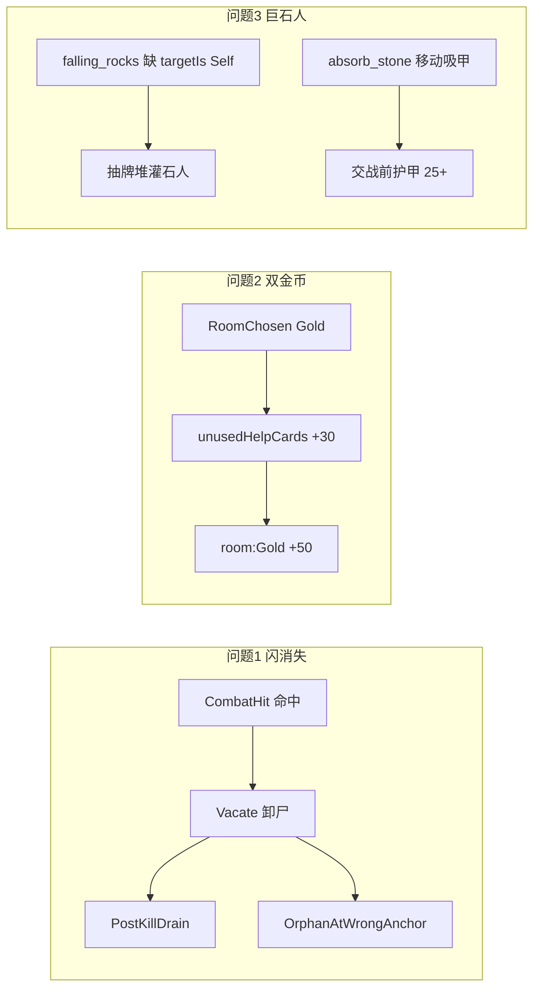

# 三问题日志排查与修改方案

日志：`Assets/Notes/Logs/{CoreLog,PerfLog,OtherLog/BattleLog}/*-20260711-151955-seed1.json`

---

## 问题1：交战怪物凭空消失+出现

### 结论

**表现接线问题**（非 Core 占格错误）。用户点名的节点与 Perf Anomaly 强对齐：

| 对局        | 怪               | uid | 击杀 CombatHit | Anomaly                                       |
| --------- | --------------- | --- | ------------ | --------------------------------------------- |
| node2 第2只 | `stone_man`     | 34  | beat 60      | `OrphanAtWrongAnchor emptySlot=2 cardSlot=-1` |
| node2 第3只 | `growing_stone` | 38  | beat 69      | 同上 slot=6                                     |
| node3 第1只 | `stone_thrower` | 54  | beat 114     | 同上 slot=2                                     |

机制链（`[FieldBattleManagerSingleton](Assets/Scripts/Cards/FieldBattleManagerSingleton.cs)` + `[CardAttackBasicAdapter](Assets/Scripts/Cards/CardAttackBasicAdapter.cs)`）：

1. 命中回调结算击杀 → `MarkFieldDead` → `VacateSlotForExplore(..., playRemoveAnim: false)`（格已空，尸体仍留在锚点）
2. `FinalizeLethalVictimAsync` 异步等死亡特效再 `Release`
3. 同拍内进入 Drain；CombatHit `BeatClose` 时探测到「空槽锚点上仍有未登记 uid」→ `OrphanAtWrongAnchor`
4. 多段交战（如增生石块）每次非致死命中还有 `FinalStateGuard.HardSnap killedTween=1`，会加重「弹回/闪一下」感

**未抓到**：`VisOffWhileCombatant`（本局 VisChange 的 `active` 常为空，该 Anomaly 基本失效）。

### 修改方案（表现层）

1. **击杀卸尸立刻离场视觉**：`Vacate` 后立刻把尸体移出格锚点或关渲染（`playRemoveAnim`/强制 `RemovedMode`），再异步播死亡；避免空槽上残留 orphan。
2. **Anomaly 降噪**：`[PerfTraceRecorder](Assets/Scripts/Flow/Diagnostics/PerfTraceRecorder.cs)` 对 `IsFieldDead` 尸体跳过 `OrphanAtWrongAnchor`（或单独 code `DeadCorpseAtVacatedSlot`）。
3. **插桩补强**：`VisChange` 写入真实 `active`/`enabled`；BoardSnap 标 `fieldDead=1`，便于下次区分「真闪隐」vs「尸体残留」。

复测：同 seed 打到 node2 第2–3 怪、node3 第1 怪，确认击杀拍无 orphan 闪影、非致死 HardSnap 不造成可见闪烁。

---

## 问题2：金币房金币加了两次

### 结论

**不是 `room:Gold` 双发**。CoreLog beat 108 明确两笔不同 reason：

- `GoldGained delta=30 reason=unusedHelpCards`（`SelectRoom` 后，`[MainGameLoopManagerSingleton](Assets/Scripts/Flow/MainGameLoopManagerSingleton.cs)` ~553）
- `GoldGained delta=50 reason=room:Gold`（`EnterRoom` 后，~626）

金额：135→165→215。同拍两次飞币，体感像「选金币房加了两次」。

### 修改方案（流程壳 / UX）

1. **拆开演出时机**：未用帮助卡结算挪到 `RewardChosen` 之后、`RoomPresented` 之前（或 RoomChoice 面板打开前），金币房只飞 `room:Gold`。
2. **若保留同拍**：飞币文案/颜色区分 `unusedHelpCards` vs `room:Gold`，避免误判。
3. **日志**：`GoldGained` 已够用；可选加 `uiBatch` 标明同屏合并。

不改 Core 经济公式（两笔语义都合法）。

---

## 问题3：巨石人超高护甲 + 死后仍补怪

### 结论（分层）

**A. 落石提前狂补石人 — 内容/DSL bug（应修）**

`[skill.falling_rocks.cumulative](Assets/Scripts/NineGrid.Foundation/NineGrid.Content/Catalog/TableNineContentCatalog.cs)` 的 `OnCumulative armorLost` **缺少 `targetIs:Self`**。同文件 `skill.rascality.armor_lost` 有 `targetIs:Self`，对照鲜明。

`[OnCumulativeTrigger.MatchesEvent](Assets/Scripts/NineGrid.Foundation/NineGrid.Core/Effects/EffectAtomLibrary.cs)`：无 `targetIs` 时统计**批次内任意护甲减少**。

Battle 证据：uid 60（megalith）在 **进场前**（仍在抽牌堆，Opening 未上板；真正 `DealAttempt` 在 beat 150）就多次 `EffectTriggered skill.falling_rocks`，把 `monster.stone_man` 洗入牌堆。设计语义应为「本卡累计损失 10 护甲」。

**B. 出场超高护甲 — 吸石按设计工作**

巨石人基础护甲 12；进场后 `skill.absorb_stone`（`OnSelfMove`）在 PostKill 旋转/移动时吸光相邻护甲（日志：12→23→29，交战时 snap 为 25）。属精英机制，不是「出生表写错」。

**C. 「杀死后还补怪」— 残局抽牌，非死后技能续命**

op#121 击杀后有 `EffectDeactivated card=60 cause=kill`；之后石人来自**已洗入抽牌堆**的牌。根因是 A 的错误累计，不是死后触发。

另：设计写「随机石人军团（除巨石人）」，实现写死 `monster.stone_man` — 次要设计偏差，可另开。

### 修改方案

1. **主修**：`falling_rocks.cumulative` 增加 `"targetIs":"Self"`；同步 Luban `effects.json` / StreamingAssets；必要时补 EditMode：他卡掉甲不触发、仅 Self 掉甲满 10 才洗入。
2. **可选**：为 MonsterSkill 加 `[场上]`/区域门禁，抽牌堆内实例不响应（若激活模型允许）。
3. **不改** absorb 数值，除非策划要求「进场第一次移动不吸甲」。

---

## 日志系统改进（本次抓漏）

| 缺口                     | 建议                                          |
| ---------------------- | ------------------------------------------- |
| VisChange `active` 常空  | 写真实 activeSelf / renderer enabled           |
| 击杀尸体被算 Orphan          | 排除 `IsFieldDead` 或改 code                    |
| Effect 触发不带 owner zone | Core/Battle 摘要加 `ownerZone=DrawPile|Board`  |
| 金币同拍易误判                | Economy 事件加 `phase`/`uiBatch`               |
| CombatHit 内嵌 Drain 拍切换 | Close 时注明 `closedBy=OpenBeat:PostKillDrain` |

---

## 建议落地顺序

1. **P3 落石 `targetIs:Self`**（数值/体验伤害最大，改动面小）
2. **P1 击杀卸尸立刻离锚点 + Anomaly 降噪**
3. **P2 未用帮助卡飞币提前到进房前**
4. 插桩补强，便于下一盘验证

