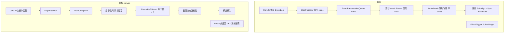

# 串行队列原子化落地计划

## 已锁定决策

- **原子边界**：旋转与补牌**并行启动**，`WhenAll(盘面编排完成, 飞牌全部落地)` 才算一个原子结束（严格对齐 canvas）。
- **内核时序**：一次玩家操作内 Core **连续结算**写满 EventLog；表现只按队列缓释；**玩家输入锁到稳态**（不跨操作追赶）。

## 现状 vs canvas

| 维度 | 现网 | canvas 目标 | 冲突/缺口 |
|------|------|-------------|-----------|
| 转+补 | Rotate step 后再 Deal step；飞翔不 await | 同原子并行，WhenAll 就绪 | **最大缺口**：[`DrainDealsAsync`](Assets/Scripts/Flow/InBattleManagerSingleton.cs) 收集 `DealFlightHandle` 后直接返回 |
| 多转保序 | StepProjector + 逐步 await 已有 | 原子内盘面步骤仍须可理解地转完 | 并行的是「转编排 ‖ 飞牌」，**不是**把多次旋转压成一次 |
| 输入锁 | `PresentationLocked` 覆盖整泵 | 锁到稳态 | 接近；缺**表现层稳态校验**才解锁 |
| Effect | `PresentEffectTriggersFromEventLog` 已 Forget | 异步发射后不管 | 已对齐；勿把「效果导致的盘面变更」当 Forget |
| 回收入组 | `LaunchReturnFieldCardToDeck` / shuffle 可与旋转重叠 | 应是独立队列原子 | **未入队**，易抢 transform |
| 尾部 Sync | 每 drain `force` Sync | 校验失败才硬修 | Sync 仍是「闪现恢复」制造机 |
| Core 表现闸 | `PresentationSyncSystem` 未接线 | 不需要双闸 | 本阶段**继续只用** Cards `PresentationLocked` |

已验证可复用：[`BoardPresentationStepProjector`](Assets/Scripts/Flow/BoardPresentationStepProjector.cs)、[`BoardPresentationQueue` 泵](Assets/Scripts/Flow/InBattleManagerSingleton.cs)、[`CombatHitSink.PresentationLocked`](Assets/Scripts/Cards/CombatHitSink.cs)、[`GroundSlotDealFlightCoordinator`](Assets/Scripts/Cards/GroundSlotDealFlightCoordinator.cs)、开局路径已有的 [`WaitDealFlightsSettledAsync`](Assets/Scripts/Flow/InBattleManagerSingleton.cs)。

## 目标架构（本阶段落地）

### 1. 两层模型：Step（投影）→ Atom（播放）

- **Step**：保持现有 `BoardPresentationStep`（Rotate/Swap/Move/Deal/Remove），继续由 EventLog 保序投影，不改 Core。
- **Atom**：新增编排层（建议 `BoardPresentationAtomComposer` + 播放器），把 steps 打包成可 `await` 的原子：

**合成规则（写死，避免再分叉）**

1. 扫过保序 steps，遇到 **Remove**（含合体退场）→ 单独 `RemoveAtom`（同步 await 退场完成）。
2. 遇到一段连续的 **Rotate/Swap/Move**，若其后紧跟一段连续 **Deal** → 合成一个 **`RotateRefillAtom`**：
   - **启动**：立刻 `DrainDeals` 发射全部飞翔（复用现有 decoy / pendingRotate 预算）；同时开始串行播放该段 Rotate→Swap→Move。
   - **结束**：`WhenAll(盘面段全部 await 完, WaitDealFlightsSettledAsync(handles))`。
3. 仅有盘面步、无 Deal → `BoardChoreoAtom`（串行 await，与现 `DrainBoardStepsAsync` 同语义）。
4. 仅有 Deal、无前置盘面步 → `DealAtom`（发射并 **必须** await 落地）。
5. 回收/入组（shuffle-into、场→组）→ `ReturnToDeckAtom`（同步 await；禁止与旋转并行 Forget）。
6. Effect 触发脉冲 → `EffectEmitAtom`：**发射即完成**（入队仅为时序锚点，不 await VFX）。

一次玩家操作：Core 算完 → 投影 steps → 合成 atoms → **整表入队**（「有多少入列多少」）→ 泵串行 drain → **稳态校验** → 解锁。

### 2. 稳态强校验（解锁门闩）

在队列泵 `finally`、释放 `PresentationLocked` **之前**增加表现层门闩（canvas「添加强校验」）：

- 对照 Core `BoardModel`：每个应有牌的槽位，Cards 侧占格 uid 一致，且卡面世界坐标相对锚点在容差内。
- **卡组空导致的空槽允许**；其余空槽视为失败。
- 无未结束的 `DealFlight` / 无 `MotionBegin` 无配对 `MotionEnd` 的开放运动（可复用 Perf 探针计数）。
- **通过**：可跳过或降级尾部 `Sync`（禁止无故 `KillMotion`+硬吸）。
- **失败**：记 CoreLog/Perf 异常 → 再走现有 `SoftAlign` + `SyncBoardOccupancyFromCore(force)` 作为**修复路径**，并打明确 reason。

### 3. 必须收编的竞态源

| 路径 | 现状 | 目标 |
|------|------|------|
| `DrainDealsAsync` | 不 await 飞翔 | 原子结束条件包含 `WaitDealFlightsSettledAsync` |
| 尾部 Sync | 每请求强制 | 仅稳态失败 / 取消 / 切节点 |
| `LaunchReturnFieldCardToDeck` | Forget，可叠旋转 | `ReturnToDeckAtom` 或原子内 await |
| `_pendingShuffleInto` | 部分 flush，调度 Forget | 入原子队列，与 Deal 前序关系保留但可 await |
| 击杀尸体 `FinalizeLethalVictimAsync.Forget` | 与 post-kill drain 并行 | 入队或 await 到不占锚点，再开 RotateRefill |
| Explore 空槽发牌 | Forget probe | 若与主队列重叠，须走同一锁/空闲门，或并入原子 |

**不纳入本阶段**：接线 Core `PresentationSyncSystem`；重做战斗 rig（仍在 hit 后 `RequestDrainPostKillBoard`）。

### 4. 与「占格先写、动画后追」的关系

现网旋转先改 `_uidBySlot` 再 hop——逻辑占格 ≠ 视觉就位。  
**解锁只认表现稳态**，不认「占格表已满」。原子内可继续早写占格（decoy/追飞依赖），但门闩必须看锚点距离 + 飞行句柄清空。

## 仍存在的盲区（计划内默认处理，不阻塞开工）

1. **多转 + 多补**：原子内盘面 steps **串行**（保住虚空多转可读性），飞牌与整段盘面 **并行**；不把多次 `BoardRotated` 压成一次旋转。
2. **Swap 夹在转与补之间**：落在同一 `RotateRefillAtom` 的盘面串行段内（先转/换位播完逻辑上属于同一联动块时与飞牌并行启动）。
3. **效果造成的二次盘面**（离场后再补）：Core 已写在同一 EventLog 切片里则同一请求内合成多个原子；若将来 Core 分多次写，靠「一次操作持锁到队列空」仍安全。
4. **超时**：稳态校验或飞翔 await 超时 → 走修复 Sync + 打点，避免死锁输入。
5. **合体**：继续走现有 fusion remove 分支，升级为显式 `RemoveAtom`，完成前不启动后续 RotateRefill。

## 主要改动面（非 Core）

- [`Assets/Scripts/Cards/CombatHitSink.cs`](Assets/Scripts/Cards/CombatHitSink.cs) — 原子契约（种类、完成条件），可选扩展 step 元数据。
- [`Assets/Scripts/Flow/InBattleManagerSingleton.cs`](Assets/Scripts/Flow/InBattleManagerSingleton.cs) — AtomComposer、改泵为 drain atoms、`DrainDeals` await、稳态门闩、降级 Sync。
- 新建 `BoardPresentationAtomComposer.cs`（与 StepProjector 并列）。
- [`GroundFieldManagerSingleton`](Assets/Scripts/Cards/GroundFieldManagerSingleton.cs) / DealFlight — 暴露「全飞行已结算」与稳态采样所需查询。
- 回收路径：[`CardDeckManagerSingleton.LaunchReturnFieldCardToDeck`](Assets/Scripts/Cards/CardDeckManagerSingleton.cs) 改为可 await / 入队。
- 诊断：[`FieldTraceHelper`](Assets/Scripts/Flow/Diagnostics/FieldTraceHelper.cs) / Perf — `AtomBegin/End`、`SteadyGatePass/Fail`。
- 测试：扩展 [`BoardPresentationStepProjectorTests`](Assets/Scripts/Cards/Tests/BoardPresentationStepProjectorTests.cs) + 新增 AtomComposer EditMode；补「Deal 必须 settled 才结束原子」断言。

## 实施顺序

1. **止血**：`DrainDealsAsync` 结束前 `WaitDealFlightsSettledAsync`（开局已有先例）——立刻砍掉最大闪现链。
2. **AtomComposer + RotateRefill WhenAll 播放**；泵改为原子串行；保留 step 级 trace。
3. **稳态门闩**；成功则跳过强制 Sync，失败才修复。
4. **收编** ReturnToDeck / Shuffle / 击杀尸体与队列的时序。
5. **回归**：EditMode（合成规则、WhenAll、门闩）+ 虚空 QuickTest（多转 + 补牌）；对照 Core/Perf：`BoardRotated` 数 = choreo 数，原子结束前无 `SnapDuringMotion`，门闩 Pass 时无尾部硬 Snap。

## 明确不做

- 不改 `.unity`；不改 QFramework Core 表现闸接线。
- 不把 Effect 主通道 VFX 改成阻塞原子（脉冲保持发射即完）。
- 不以「逻辑占格已满」替代表现稳态。
