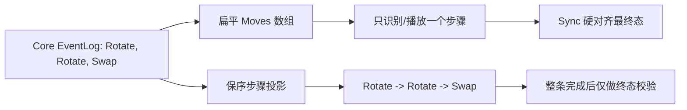

# 修复虚空卡组多转编排

## 已确认的故障链
- 最新 QuickTest `20260713-124002` 中，Core 同一操作可产生 `2~3` 条 `BoardRotated`，夹杂 `CardSwapped`；但 [`FillBoardDeltaFromEventLog`](Assets/Scripts/Flow/InBattleManagerSingleton.cs) 将所有 `CardMoved` 无边界地塞进一个 `Moves[]`，还会把“稍后被移除”的 uid 从整批历史移动中全局删除。
- [`TryClassifyOuterRingRotation`](Assets/Scripts/Cards/GroundFieldManagerSingleton.cs) 只接受“一次旋转”的移动数和一步拓扑；`18/26` 条混合移动因此退化到 general-hop。general-hop 对重复 uid 只能登记/播放其中一组，日志 beat 89 明确出现 `18 MotionPlan → 6 MotionBegin/End → 3 Ground.Place.Snap`。
- [`DrainPostKillBoardCoreAsync`](Assets/Scripts/Flow/InBattleManagerSingleton.cs) 随后调用 `SoftAlignBoardAnchorsToCore()` 和 `SyncBoardOccupancyFromCore()`；后者用 `skipBusyGuard: true`、`KillMotion`、`snapToAnchor: true` 对齐最终 Core 快照，所以视觉上就是“一次旋转后强制跳到多转终态”。现有 BoardQueue 只串行“整份摘要”，没有串行摘要内部的 Core action；`PresentationLocked` 本身并未失效。

## 实施步骤
1. 在 [`CombatHitSink.cs`](Assets/Scripts/Cards/CombatHitSink.cs) 增加非 Core 的盘面表现步骤契约（Rotate / Swap / Move / Deal / Remove，并携带 sequence、actionId、方向、moves）；保留旧汇总字段作安全回退，不改 QFramework Core 契约。
2. 在 [`InBattleManagerSingleton.cs`](Assets/Scripts/Flow/InBattleManagerSingleton.cs) 新增纯投影器，按 EventLog 的 actionId、`BoardRotated`、`CardSwapped` 和事件 sequence 生成步骤流；所有 combat、pickup、click-empty、use-item、reward 入口统一填充该步骤流。移除“最终被移除 uid 反向删掉此前移动”的全批过滤，移除/补牌只在其实际步骤到达时演出。
3. 改造现有 BoardPresentationQueue：一份请求内部逐步 `await`，旋转使用 `BoardRotated.Amount` 明确方向，换位按单个 `CardSwapped` action 播放，普通移动只消费该 action 的 moves；整条步骤流期间持续持有 `PresentationLocked`，每个旋转获得独立 choreoSeqId，失败/取消时关闭当前 choreo 后再走最终恢复。
4. 收紧 [`SyncBoardOccupancyFromCore`](Assets/Scripts/Flow/InBattleManagerSingleton.cs) 与 `SoftAlignBoardAnchorsToCore`：正常路径只在整条步骤流结束后执行一次；若队列/Choreo 正在运行，外部 Sync 仅置 pending，待队列尾部统一 flush。取消、异常、切节点仍允许最终硬同步，保留安全网但不再覆盖中间帧。
5. 扩充 [`FieldTraceHelper.cs`](Assets/Scripts/Flow/Diagnostics/FieldTraceHelper.cs) 与现有 Choreo trace：记录 requestId、stepIndex/stepCount、coreSequence/actionId、stepKind、真实 choreoSeqId；增加“timeline 活跃时 Sync”“Core BoardRotated 数与 ChoreoBegin 数不等”“步骤回退为扁平 general-hop”异常，避免 SessionSummary 的 `0 partial` 掩盖语义丢失。
6. 在 [`Assets/Scripts/Cards/Tests`](Assets/Scripts/Cards/Tests) 增加 EditMode 回归：单转、双转、三转夹换位、旋转触发移除、逆时针、取消恢复；断言投影顺序、每步独立完成、最终占格一致、队列未完成前锁不释放、正常多转没有中途 Sync/Snap。

## 验证
- 用 Unity MCP 等待编译结束并读取 Console，运行新增 EditMode 测试及相关 Cards/Core 测试。
- 用现有 QuickTest 虚空首牌组复测；同 session 对照 Core/Perf/Registry：`BoardRotated count == ChoreoBegin/End rotate count`，每步均有完整 `RingShift + MotionBegin/End`，步骤间无 `Ground.Place.Snap`，最终 SyncDiff 为 0，队列结束后 `presentationLocked=false`。
- 不修改任何 `.unity` 文件；若仍有终态兜底 Snap，只允许出现在取消/异常恢复路径并带明确 reason。