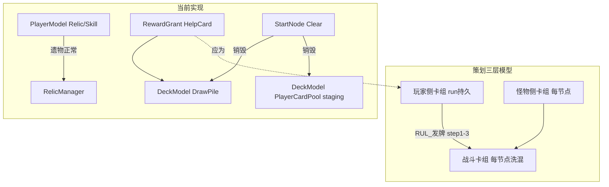

# 奖励选择断线排查与修复计划（策划案权威核对版）

> 权威来源：`Assets/Docs/九宫牌局/`（机制正文）+ `Assets/Docs/九宫牌局-元设计/`（纯机制 ID）+ `虚构对照表.md` 术语映射。两目录内容一致，以机制正文表述落地，元设计 ID 作实现对照。

---

## 一、策划案权威模型：三层卡组

`[EVT_牌组配置.md](Assets/Docs/九宫牌局-元设计/05-事件层-EVT/EVT_牌组配置.md)` + `[牌组系统.md](Assets/Docs/九宫牌局/02-卡牌/牌组系统.md)` 定义：


| 卡组    | 策划名                   | 代码现状                                                       | 生命周期        |
| ----- | --------------------- | ---------------------------------------------------------- | ----------- |
| 玩家侧卡组 | 化身侧卡组 / EVT_DECK_006  | **缺失 run 存储**；`DeckModel.PlayerCardPool` 仅本节点 staging      | **跨节点保留**   |
| 怪物侧卡组 | 敌方侧卡组 / EVT_DECK_007  | `NodeDeckOptions.EnemyCards` 每节点 `BuildNodeDeckOptions` 生成 | 仅本节点        |
| 战斗卡组  | 运行时抽牌堆 / EVT_DECK_008 | `DeckModel.DrawPile`                                       | 仅本节点（开局洗混后） |


开局发牌（`[RUL_发牌.md](Assets/Docs/九宫牌局-元设计/02-规则层-RUL/RUL_发牌.md)` / `[发牌机制.md](Assets/Docs/九宫牌局/01-机制规则/发牌机制.md)`）：

1. 玩家侧卡组抽 3 → 放空槽
2. 怪物侧卡组抽 3（有精英/Boss 则必出 1）→ 放空槽
3. 两侧剩余牌洗混 = 战斗卡组
4. 战斗卡组继续补满空槽

**核心结论**：玩家选中的奖励卡必须进入 **玩家侧卡组**，下一节点 `StartNode` 时再按 RUL_发牌汇入战斗流程。写入 `DrawPile` 只适用于 **本节点战斗内** 的即时掉落。

---

## 二、授予目标分流表（策划权威）

### 2.1 必须写入「玩家侧卡组」（跨节点）


| 来源                        | 策划文档                                                                                                              |
| ------------------------- | ----------------------------------------------------------------------------------------------------------------- |
| 通关 `helpCardChoice` 三选一选中 | `[层级系统.md](Assets/Docs/九宫牌局/05-职业与层级/层级系统.md)` §关卡循环 step6；`[帮助卡系统.md](Assets/Docs/九宫牌局/02-卡牌/帮助卡系统.md)` §帮助卡选择环节 |
| 商店购买                      | `[商店.md](Assets/Docs/九宫牌局/05-职业与层级/商店.md)`「购买后立即加入玩家侧卡组」                                                          |
| 酒馆「购物」随机帮助卡               | `[层级系统.md](Assets/Docs/九宫牌局/05-职业与层级/层级系统.md)` §房间类型                                                              |
| 通关结算残留帮助卡回库               | `[战斗机制.md](Assets/Docs/九宫牌局/01-机制规则/战斗机制.md)` §通关判定：「全部回到玩家侧卡组，每张 +10 金币」                                         |
| 标注「使用后复原」的卡               | `[EVT_帮助卡模板.md](Assets/Docs/九宫牌局-元设计/05-事件层-EVT/EVT_帮助卡模板.md)` PRO_013                                            |
| 职业初始牌组（开局一次）              | `[职业.md](Assets/Docs/九宫牌局/05-职业与层级/职业.md)`：恢复药水×3、普通宝箱×1、飞刀×3、属性提升×1                                              |
| 遗物 `[每关卡开始时] 加入玩家侧卡组`     | `[遗物数据.md](Assets/Docs/九宫牌局-元设计/06-数据/遗物数据.md)`                                                                   |
| 遗物 `[获得时] 加入玩家侧卡组`        | 同上（金色宝箱卡×2 等）                                                                                                     |
| 技能 `军械库` OnNodeEnd        | `[玩家技能数据.md](Assets/Docs/九宫牌局-元设计/06-数据/玩家技能数据.md)`：飞刀/爆弹/破击锤之一                                                   |
| 技能 `轻车熟路` OnNodeEnd 三选一   | 同上 + `[职业.md](Assets/Docs/九宫牌局/05-职业与层级/职业.md)` 初始技能                                                              |
| 红色帮助卡（遗物/技能生成）            | `[帮助卡数据.md](Assets/Docs/九宫牌局/07-数据/帮助卡数据.md)`                                                                     |


**当前实现**：以上除「职业初始牌（每节点重放 staging）」外，几乎全部走 `ShuffleIntoDrawPile` 或 ephemeral `PlayerCardPool`，下一节点 `SetupNodeDeckAction.Clear()` 后丢失。

### 2.2 必须写入「战斗卡组」（仅本节点）


| 来源                     | 策划文档                                                                           |
| ---------------------- | ------------------------------------------------------------------------------ |
| 精英/Boss 击杀掉落           | `[层级系统.md](Assets/Docs/九宫牌局/05-职业与层级/层级系统.md)` §精英/层主击杀奖励：「removeCard 后洗入战斗卡组」 |
| 遗物「洗入帮助卡/怪物卡到战斗卡组」     | `[遗物数据.md](Assets/Docs/九宫牌局-元设计/06-数据/遗物数据.md)`                                |
| 怪物技能洗入怪物卡              | `[怪物技能.md](Assets/Docs/九宫牌局/04-技能/怪物技能.md)`                                    |
| 帮助卡「传送卡」洗回战斗卡组         | `[通用牌组.md](Assets/Docs/九宫牌局/02-卡牌/通用牌组.md)`                                    |
| 局内宝箱卡（蓝/金/红）使用 → 遗物三选一 | 产物为遗物（`PlayerModel.RelicDefIds`），非帮助卡持久化问题                                     |


**当前实现**：`RewardSystem.ReactToKill` → `ShuffleIntoDrawPile` **符合策划**，本节点内可用。

### 2.3 已接通（对照组）


| 类型               | 持久层                                         | 状态  |
| ---------------- | ------------------------------------------- | --- |
| 遗物（宝箱/宝箱房/血液转换等） | `PlayerModel.RelicDefIds` + `ActivateRelic` | 正常  |
| 玩家技能（导师卡三选一）     | `PlayerModel.SkillDefIds`                   | 正常  |
| 金币/属性            | `PlayerModel` Stats/Coins                   | 正常  |


---

## 三、节点流程权威时序（对照实现）

`[层级系统.md](Assets/Docs/九宫牌局/05-职业与层级/层级系统.md)` / `[FLOW_关卡循环.md](Assets/Docs/九宫牌局-元设计/03-流程层-FLOW/FLOW_关卡循环.md)`：

```
clearCheck（抽牌堆空 + 场上无怪物）
  ├─ 并行：结算残留帮助卡 → 回玩家侧卡组 + 每张 +10 金币（不阻塞）
  └─ 弹出 helpCardChoice 三选一（新选卡不参与本次结算）
helpCardChoice 结束
  → roomChoice 二选一
  → roomResolve（商店/金币房/宝箱房/温泉/酒馆）
  → nextNode
```

**当前 `PhaseSystem.CompleteNodeIfCleared` 时序**：

1. `NodeCompleted` + `NodeCompletedAction` → 触发 `OnNodeEnd`（轻车熟路、军械库等）
2. `SettleUnusedHelpCards`（**仅金币，不回库**）
3. `RewardItemChoice` + `help.choice`

**新增断线**：

- `OnNodeEnd` 的 `skill.arsenal` 用 `Spawn → PlayerCardPool`，节点末写入 ephemeral staging，下节点清空 → **丢失**
- `skill.easy_road` 的 `OfferRewardChoice(help.white.choice)` 在 `NodeCompleted` 触发，与 step3 的 `help.choice` **叠加**；小丑职业每关应有 **两次**帮助卡三选一（白色池 + 全品质池），但 Flow 层目前只驱动一次 `PlayRewardChoiceAsync`
- 结算顺序：策划要求「先结算回库，再三选一」；当前先 `OnNodeEnd`（可能又发牌），再结算，顺序需对齐

---

## 四、玩家侧卡组管理规则（策划要求 vs 实现）

`[卡组管理.md](Assets/Docs/九宫牌局/02-卡牌/卡组管理.md)`：


| 规则      | 策划                      | 当前实现                                                                    |
| ------- | ----------------------- | ----------------------------------------------------------------------- |
| 初始牌组    | 选职业后固定，整局使用             | `AppendInitialPlayerCards` **每节点重放** 8 张进 staging → 若配合快照修复前会「每关白送 8 张」 |
| 节点快照    | 节点开始快照；结束恢复未用、移除已用、新增合并 | **完全未实现**                                                               |
| 使用消耗    | 帮助卡使用默认永久移除             | Core 有 `RemoveCardAction`，但未同步扣减 run 玩家侧卡组                              |
| 同名上限    | 同名称最多 3 张               | 未实现                                                                     |
| 总量上限    | 第1/2/3层 12/18/24        | 未实现                                                                     |
| 商店候选    | 通用+职业可购买池；达上限不进候选       | `AddAllNonRedHelpCards` 用 **catalog 全量**                                |
| 通关三选一候选 | 通用+职业牌组                 | 同上，**未按牌组过滤**                                                           |


---

## 五、金币与 Skip 规则（策划核对）

`[金币.md](Assets/Docs/九宫牌局/00-核心概念/金币.md)` / `[RES_资源定义.md](Assets/Docs/九宫牌局-元设计/01-资源层-RES/RES_资源定义.md)`：


| 操作           | 策划金额       | 当前实现                                            |
| ------------ | ---------- | ----------------------------------------------- |
| 跳过帮助卡三选一     | +10        | `AwardSkipHelpChoice` 已接线                       |
| 跳过遗物三选一（宝箱卡） | +20        | `AwardSkipRelicChoice` **定义但未调用**，遗物 Skip 走 +10 |
| 未使用帮助卡结算     | +10/张 + 回库 | 仅 +10，不回库                                       |
| 商店删卡         | +10/张      | `DeleteHelpCard` Core 有，Flow UI 未接              |


---

## 六、根因总结（为何遗物对、卡牌错）




奖励 **UI → PendingChoice → SelectReward** 已接通；断线在 **Grant 写错容器** + **缺少玩家侧卡组 run 层** + **每节点重建不读 run 状态**。

---

## 七、修复方案（按策划优先级分阶段）

### Phase A — 建立玩家侧卡组 run 层（阻塞项）

**数据模型**（扩展 `[PlayerModel.cs](Assets/Scripts/NineGrid.Foundation/NineGrid.Core/Models/PlayerModel.cs)`）：

- `IReadOnlyList<HelpCardStackEntry>`：`defId + count`（同名堆叠，对齐策划）
- API：`AddHelpCard` / `TryRemoveHelpCard` / `GetStacks` / `CountByDefId` / `TotalCount`

**Bootstrap 一次性种子**（`[InitialGameFactory](Assets/Scripts/NineGrid.Foundation/NineGrid.Core/Setup/InitialGameFactory.cs)` 或 `BootstrapRun`）：

- 从 `ProfessionCatalog.InitialCards` 写入 run 玩家侧卡组（小丑 8 张）
- **移除** `RewardSystem.AddDefaultPlayerCards` 每节点重放逻辑

**节点开始汇入**（`[RewardSystem.BuildNodeDeckOptions](Assets/Scripts/NineGrid.Foundation/NineGrid.Core/Systems/RewardSystem.cs)`）：

- `Options.PlayerCards` 从 run 玩家侧卡组实例化（`CreateDraft` × count）
- 走现有 `SetupNodeDeckAction` → `OpeningDealAction`（不改 RUL_发牌链）

### Phase B — 授予路由对齐策划分流表

改 `[RewardGrantActionSupport](Assets/Scripts/NineGrid.Foundation/NineGrid.Core/Domain/Actions/ContentActions.cs)`，新增 `GrantHelpCardToPlayerSideDeckAction`：


| 入口                                                       | 目标                               |
| -------------------------------------------------------- | -------------------------------- |
| `GrantRewardChoiceAction` 且节点已通关 / 商店 / 房间               | 玩家侧卡组                            |
| `GrantRewardChoiceAction` 且 `InteractionLoop` 中局内宝箱（遗物池） | 遗物：已有；若未来有局内帮助卡池则 DrawPile       |
| `ReactToKill` 精英/Boss 掉落                                 | 战斗卡组（保持）                         |
| DSL `Spawn zone=PlayerCardPool`（军械库、遗物关开始）               | 玩家侧卡组（**不再写 ephemeral staging**） |
| DSL `Spawn zone=DrawPile/战斗卡组`                           | 战斗卡组（保持）                         |


判定可复用：`CurrentPhase` + `IsNodeCleared()` + `poolId`（`shop.helpCards` / room context）。

### Phase C — 结算 + 快照（策划完整规则）

`**SettleUnusedHelpCards` 扩展**（`[EconomySystem.cs](Assets/Scripts/NineGrid.Foundation/NineGrid.Core/Systems/EconomySystem.cs)`）：

1. 枚举 DrawPile / PlayerCardPool / ItemSlots / Board 未使用 HelpCard
2. 按 defId 累加回 run 玩家侧卡组
3. 移除 ephemeral 实例
4. 再发 +10 金币/张

**节点快照**（`[卡组管理.md](Assets/Docs/九宫牌局/02-卡牌/卡组管理.md)` §节点快照）：

- `StartNode` 前：对 run 玩家侧卡组做 `Snapshot`（深拷贝 stacks）
- 节点内：`UseItem` 永久消耗 → 扣减 run 卡组（已用不再恢复）
- 节点末：从 Snapshot 恢复「本节点初存在且未消耗」的牌 + 合并本节点新增（三选一/商店/结算回库/技能授予）
- 「使用后复原」卡：节点末特殊回库（卡面 DSL 优先，覆盖默认）

**上限裁剪**（节点末）：

- 同名 >3：按策划「强制移除最后加入的」
- 总量 > 层数上限（12/18/24）：同上
- 商店/三选一 **候选池过滤**：达上限的 defId 不进入 `RollPool`

### Phase D — 次要奖励流与时序

1. **轻车熟路二次三选一**：`NodeCompleted` 触发 `help.white.choice` 后，Flow 需再驱动一次 `PresentRewardChoice`（或在 MainGameLoop 串联两次 reward phase）；授予目标仍为玩家侧卡组
2. **SkipRelicChoice**：宝箱卡 Skip 走 `AwardSkipRelicChoice`（+20），与帮助卡 Skip（+10）分流
3. **表现层**：通关选牌后更新牌组预览（可选）；下一节点 Opening 应展示 run 卡组新增的卡

### Phase E — 契约测试


| 测试                               | 断言                                               |
| -------------------------------- | ------------------------------------------------ |
| `HelpCardRewardPersistenceTests` | 通关三选一 → AdvanceNode → StartNode → 玩家侧卡组含选中 defId |
| `InitialDeckNotDuplicatedTests`  | 连续 2 节点初始牌总量不翻倍                                  |
| `SettleReturnAndGoldTests`       | 残留卡回库 + 金币同时增加                                   |
| `ArsenalNodeEndTests`            | 军械库 OnNodeEnd 授予下节点可见                            |
| `ShopPoolCapFilterTests`         | 达同名 3 张后 RollPool 不含该 defId                      |
| 扩展 `ShopBuyGoldContractTests`    | 购买后跨节点仍存在                                        |


---

## 八、验证清单（Play + EditMode）

1. 小丑开局：玩家侧卡组 8 张，第一节点发牌可见
2. 通关三选一选卡 → 下一节点战斗卡组/场上可出现
3. 商店购买 → 下一节点可见；金币正确扣除
4. 关内精英掉落（蓝宝箱等）→ **仅本节点**战斗卡组可抽到（不进入玩家侧卡组）
5. 遗物宝箱房 → 遗物栏正常；Skip 遗物 +20
6. 关末残留帮助卡 → 回玩家侧卡组且 +10/张
7. 小丑「轻车熟路」→ 白色三选一 + 常规三选一均弹出且持久化
8. 日志无 `跳过通关奖励` Warning

---

## 九、涉及文件


| 文件                                                                                                       | 改动                     |
| -------------------------------------------------------------------------------------------------------- | ---------------------- |
| `[PlayerModel.cs](Assets/Scripts/NineGrid.Foundation/NineGrid.Core/Models/PlayerModel.cs)`               | run 玩家侧卡组 stacks       |
| `[InitialGameFactory.cs](Assets/Scripts/NineGrid.Foundation/NineGrid.Core/Setup/InitialGameFactory.cs)`  | Bootstrap 种子           |
| `[ContentActions.cs](Assets/Scripts/NineGrid.Foundation/NineGrid.Core/Domain/Actions/ContentActions.cs)` | 授予分流 + 新 Action        |
| `[EffectActions.cs](Assets/Scripts/NineGrid.Foundation/NineGrid.Core/Domain/Actions/EffectActions.cs)`   | Spawn zone 路由修正        |
| `[RewardSystem.cs](Assets/Scripts/NineGrid.Foundation/NineGrid.Core/Systems/RewardSystem.cs)`            | 汇入 + 池过滤               |
| `[EconomySystem.cs](Assets/Scripts/NineGrid.Foundation/NineGrid.Core/Systems/EconomySystem.cs)`          | 结算回库                   |
| `[PhaseSystem.cs](Assets/Scripts/NineGrid.Foundation/NineGrid.Core/Systems/PhaseSystem.cs)`              | 快照钩子 + 二次 reward 时序    |
| `[MainGameLoopManagerSingleton.cs](Assets/Scripts/Flow/MainGameLoopManagerSingleton.cs)`                 | 多轮 reward presentation |
| 新测试文件                                                                                                    | 见 Phase E              |


**不改** `.unity`；Core 层遵循 QFramework 规则。

---

## 十、与旧版 plan 的差异说明


| 旧判断                              | 策划核对后修正                                    |
| -------------------------------- | ------------------------------------------ |
| 只修 Grant 路由 + DrawPile           | 须建立完整 **玩家侧卡组 run 层**，对齐 EVT_牌组配置          |
| `AppendInitialPlayerCards` 每节点注入 | 策划要求 **Bootstrap 一次**；每节点重放是独立 bug         |
| 节点快照标为「后续」                       | 策划 **明确要求**快照恢复，应纳入 Phase C                |
| 池子用 catalog 全量                   | 策划要求 **通用+职业牌组** + 上限过滤                    |
| 只关注 help.choice/shop             | 还须覆盖 **OnNodeEnd 技能/遗物关开始/结算回库/轻车熟路二次三选一** |


