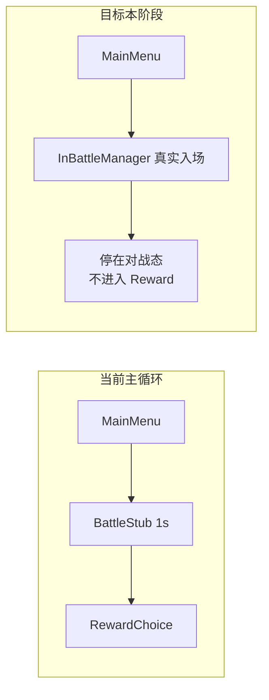

# 局内真实数据接线计划

## 现状摘要

| 组件 | 现状 |
|------|------|
| [`MainGameLoopManagerSingleton.cs`](Assets/Scripts/Flow/MainGameLoopManagerSingleton.cs) | `PlayBattleStubAsync` 仅 `Delay(1s)`，不接局内 |
| [`InBattleManagerSingleton.cs`](Assets/Scripts/Flow/InBattleManagerSingleton.cs) | 已实现 `BootstrapRun` + `StartBattleNodeAsync`（Core StartNode → 表现入场），DevTest Keypad1 可单独测 |
| [`CardManagerSingleton.SpawnView`](Assets/Scripts/Cards/CardManagerSingleton.cs) | 创建视图后**不**同步 Core 数值；[`StandardCardView`](Assets/Scripts/Cards/StandardCardView.cs) 仍用 Inspector 默认 3/5/0 |
| [`GroundCardHitProxy`](Assets/Scripts/Cards/GroundCardHitProxy.cs) | 正交格上**所有**场卡先走 `TryHandleBattleClick`，未按 `CardKind` 区分「打 / 拿」 |
| Core 数据通道 | [`CoreViewSnapshotFactory`](Assets/Scripts/NineGrid.Foundation/NineGrid.Core/Presentation/CoreViewSnapshot.cs) / PresentationBatch 存在但**本任务明确不用** |



## 阶段 A：主流程 → 真实单局战斗

**改动文件：** [`MainGameLoopManagerSingleton.cs`](Assets/Scripts/Flow/MainGameLoopManagerSingleton.cs)

1. 增加 `[SerializeField] InBattleManagerSingleton inBattleManager`（留空则 `Instance` 解析，与现有 Flow 单例一致）。
2. 将 `PlayBattleStubAsync` 替换为 `PlayRealBattleAsync`：
   - `EnsureBindings` + `panelRouter.ShowInRunShell(inBattle: true)`
   - 首次节点或 phase 非法时：`inBattleManager.BootstrapRun()`
   - 确保 Content Catalog 已加载（`IContentSystem.HasCatalog` 为 false 时调用 `ContentCatalogBootstrap.Load()` 并 `Load` 进 Core——Flow 已引用 [`NineGrid.Content`](Assets/Scripts/Flow/NineGrid.Flow.asmdef)）
   - 用 `IRewardSystem.BuildNodeDeckOptions(_nodeIndex, monsterDeckId: null)` 构建节点牌组（失败则回退 `NodeDeckOptions.CreateDefaultBattle()`）
   - `await inBattleManager.StartBattleNodeAsync(options, ct)`
3. **按你的要求：逻辑未就绪则不进入后续节点**——`RunNodeCycleAsync` 在 `PlayRealBattleAsync` 完成后 **直接 return**，暂时注释/跳过 `PlayRewardChoiceAsync` → `PlayRoomChoiceAsync` → `PlayRoomEventAsync` 链路；保留代码结构并加 `// TODO: 节点结算就绪后再进入奖励`。
4. `LoopState.BattleStub` 可保留枚举值（避免序列化/外部引用破坏），日志文案改为「真实局内已入场，等待后续结算接线」。

**DevTest：** [`MainGameLoopManagerDevKeys.cs`](Assets/Scripts/NineGrid.Foundation/NineGrid.DevTest/Flow/MainGameLoopManagerDevKeys.cs) 无需改键位；Keypad0 / StartRun 行为变为「进主循环 → 真实对战 → 停住」。

## 阶段 B：Core 映射读取层（不用 Snapshot）

**新建：** [`Assets/Scripts/Flow/CoreCardPresentationMapper.cs`](Assets/Scripts/Flow/CoreCardPresentationMapper.cs)

职责：表现层**只读** Core 模型，复用与 `CoreViewSnapshotFactory.CaptureCardStats` 相同的统计口径（`CardRegistry` + `IStatSystem.GetEffectiveInt`），但不构造 Snapshot。

```csharp
// 核心 API（示意）
public readonly struct CardPresentationRead {
  public CardKind Kind;
  public int Attack, Hp, Armor; // effective int
  public string DefId;
}
public static bool TryRead(int uid, out CardPresentationRead read);
public static void ApplyToManagedCard(ManagedCard card, bool animate = false);
public static void SyncAllSpawnedCards(); // 遍历 CardManager.CardsByUid
```

**视觉同步：**
- 数值 → `StandardCardView.SetAttack/SetHealth/SetArmor(..., animate: false)`（本阶段「只接不改」，首次入场不播 punch 动画）
- 图标/框色 → 参照 [`RelicManagerSingleton`](Assets/Scripts/Flow/RelicManagerSingleton.cs) 模式，用 [`ContentVisualResolver`](Assets/Scripts/NineGrid.Foundation/NineGrid.Content/Catalog/ContentVisualResolver.cs) + 场景内 HelpCard/Monster 等 VisualCatalog SO（Editor 下 LoadAssetAtPath，Runtime 可 SerializeField 或 Resources 兜底）

**挂载点（同步时机）：**
1. [`InBattleManagerSingleton.PresentOpeningAsync`](Assets/Scripts/Flow/InBattleManagerSingleton.cs) 末尾：`CoreCardPresentationMapper.SyncAllSpawnedCards()`
2. [`InBattleManagerSingleton.CaptureOpeningPresentationPlan`](Assets/Scripts/Flow/InBattleManagerSingleton.cs) 内每次 `SpawnView` 后立即 `ApplyToManagedCard`（避免入场动画过程中仍显示默认 3/5/0）

**可选调试：** 在 `InBattleManager` 入场完成后，用 [`UiPanelRouter.InGameInfoText`](Assets/Scripts/Flow/UiPanelRouter.cs) 显示 Avatar 有效 HP/护甲（只读一行），便于肉眼核对。

## 阶段 C：CardKind 驱动的「拿 / 打」路由（只读，不改 Core）

**原则：** 现有交战/拖拽仍是**纯表现**（笔记已说明 Adapter 不结算 Core 伤害）；本阶段只让路由读真实 `CardKind`，不写 `PickupCardAction` / 伤害 Action。

**改动：**

1. [`ManagedCard`](Assets/Scripts/Cards/CardManagerSingleton.cs) 增加 `internal CardKind CoreKind { get; set; }`（由 Flow 映射层写入，Cards 程序集不引用 Core）。
2. [`GroundCardHitProxy.OnMouseDown`](Assets/Scripts/Cards/GroundCardHitProxy.cs) 调整优先级：
   - `CoreKind == Monster` 且正交交战格 → `TryHandleBattleClick`（**打**）
   - `CoreKind` 为 `HelpCard` / `Item` / `PlayerCard` → 跳过交战，走 `TryBeginDragFromGround`（**拿**）
   - `Avatar` / `Unknown` → 不响应场上下行
3. [`InBattleManagerSingleton.BootstrapRun`](Assets/Scripts/Flow/InBattleManagerSingleton.cs) 内补充 Catalog 加载（阶段 A 已述），保证 `BuildNodeDeckOptions` 能抽到 [`TableNineContentCatalog`](Assets/Scripts/NineGrid.Foundation/NineGrid.Content/Catalog/TableNineContentCatalog.cs) 里的真实怪物数值。

## 明确不在本阶段范围

- 不消费 `CoreViewSnapshot` / `PresentationBatch` / `CoreCommandDispatcher`
- 不向 Core 发送 Pickup / Attack / UseItem / 结算 Command
- 不实现 `OnNodeSettlementReady` 驱动主循环前进（后续局内逻辑补齐再接）
- 不改动 `.unity` 场景文件（若需补 Inspector 引用，走 Unity MCP `manage_components` + `refresh_unity`）

## 验证步骤

1. Play → **小键盘 0** 或点 StartRun：应看到卡组 Entry、Avatar Reveal、环序发牌（与 Keypad1 一致），**不会** 1 秒后弹出 RewardPanel。
2. 场卡与 Avatar 显示 Catalog/Core 真实攻/血/护甲（非默认 3/5/0）；Help 卡有正确图标。
3. 怪物正交格点击 → 交战动画；帮助/玩家/道具场卡点击 → 拖入手牌。
4. 交互过程中 Core `CardInstance.Stats` 不变（可用 Console 打 `[InBattleManager] BootstrapRun` 后 uid 对照，或临时 log 一次 read 值）。
5. Unity MCP `refresh_unity` + Console 无新增编译错误。

## 后续衔接（不在此次实现，供你下一轮）

- `MainGameLoop` 订阅 `InBattleManager.OnNodeSettlementReady` 或表现层胜负信号 → 再进入 Reward/Room
- 表现动画与 Core 扣血时序（你提到的「动画未播完就扣血」）单独做「写回层」，与本次只读映射分离
