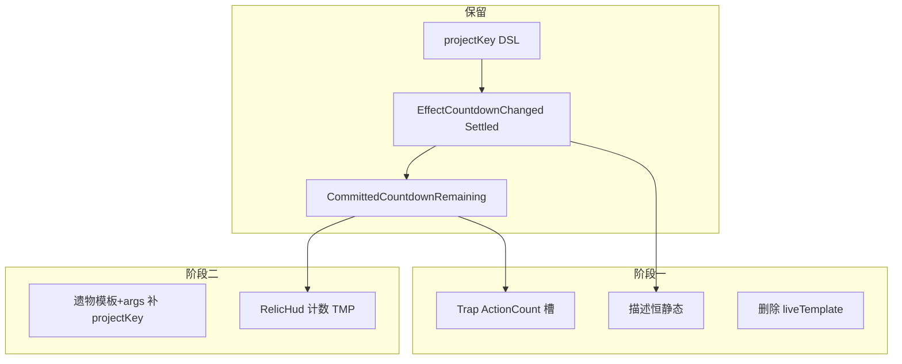

# 投影 → 行动计数 两阶段改造

## 背景共识

仓库里「卡面投影」主要指 [ADR-0035](docs/adr/0035-dual-description-projection-and-assembly-param-refs.md) 的**局内描述投影**：`projectKey` → `EffectCountdownChanged` → `CommittedCountdownRemaining` → `liveTemplate` 改写 `Basic_Description`。

玩家卡无此需求；怪物已走节奏 `ActionCount`；真正需要「还差几次」体感的是**部分机关**与**部分遗物**。改造目标：

- **保留** Core 倒计时基础逻辑（`projectKey` / `CommitEffectCountdownRemainingAction` / Settled）
- **删除**「描述里动态插剩余次数」以及配置字段 `liveTemplate`
- **机关**：改写预制体上的行动计数数值（节点已在 [机关卡标准模版.prefab](Assets/Resources/Prefabs/机关卡标准模版.prefab)）
- **遗物**：继续走遗物栏图标左下角 `计数` TMP（[标准遗物图标模板.prefab](Assets/Prefabs/标准遗物图标模板.prefab)）

不在本票做 ADR-0038 机关 `rhythmSource` 全量改配。

---

## 阶段一：表现收口 + 删除 liveTemplate 契约

**目标**：场上描述不再因倒计时变字；机关行动计数槽动态；配置/编辑器/校验不再出现 `liveTemplate`；文档与 ADR 同步。

### 1. 机关：EffectCountdown → ActionCount

关键改动点：

- [`CardFacePresentationBinder.ApplyStats`](Assets/Scripts/NineGrid.Presentation/Cards/Presentation/CardFacePresentationBinder.cs) 的 `Trap` 分支：除 `Hp` 外，按「有活跃效果倒计时」写 `ActionCount` 并显隐（对照 Monster 的 `HasActiveRhythm` 分支）。
- [`CoreCardPresentationMapper.CommitCountdownRemaining` / `ClearCountdownRemaining`](Assets/Scripts/NineGrid.Presentation/Flow/CoreCardPresentationMapper.cs)：
  - 继续写 `CommittedCountdownRemaining`
  - **Trap**：把该键剩余解析为 `ActionCount`；字典空则隐藏（可用现有 `HasActiveRhythm` 作「应显示行动计数」标志，或加更贴切的 `ShowActionCount`——实现时选语义更清晰的一种，避免与怪物节奏语义长期混淆）
  - **不再**用 `liveTemplate` + remaining 重写 `BasicDescription`
- 出生首帧：机关若装配带 `projectKey` 且 period>1，在首次挂面时用装配 `every`/`threshold` 初值填 `ActionCount`（对齐遗物 [`RelicCountdownProjection`](Assets/Scripts/NineGrid.Presentation/Flow/RelicCountdownProjection.cs) 的「未 Settled 前用初值」）。可抽共享解析，避免 Trap/Relic 各写一份。

当前内容已有 `projectKey` 的机关仅：

- `trap.flame`（every=3）
- `trap.revive_stone`（every=6）

### 2. 描述路径恒静态

- [`CardFaceDescriptionProjector`](Assets/Scripts/NineGrid.Presentation/Cards/Presentation/CardFaceDescriptionProjector.cs)：Instance 与 Inspect 一样，只填检查描述 + 装配**初始**实参，**永不**消费 `committedRemaining`，也不再接受/使用模板参数。
- `TryApplyJsonPresentation` / Inspect 调用点去掉对 `liveTemplate` 的依赖。
- 描述里仍可有 `{装配id.键}` 的静态插值（如「每 5 次」显示初始 5），但不随剩余跳动。

### 3. 删除 `liveTemplate` 字段（契约层）

| 层 | 文件 |
|----|------|
| DTO | [`CardPresentationConfigDto.cs`](Assets/Scripts/NineGrid.Foundation/NineGrid.Content/CardPresentation/CardPresentationConfigDto.cs) |
| 校验 | [`CardDescriptionTokenRules.cs`](Assets/Scripts/NineGrid.Foundation/NineGrid.Content/CardPresentation/CardDescriptionTokenRules.cs)——删除「有 projectKey 必须填 liveTemplate / 模板须引用令牌」；改为：Trap 有 period>1 的 projectKey 时由行动计数槽承载（文档约定即可，不必强校验 prefab） |
| 编辑器 UI / 批量 IO | [`CardPresentationEditorWindow.cs`](Assets/Scripts/NineGrid.Foundation/NineGrid.Content.Editor/CardPresentationEditorWindow.cs)、[`CardDescriptionBulkIO.cs`](Assets/Scripts/NineGrid.Foundation/NineGrid.Content.Editor/CardDescriptionBulkIO.cs)、[`CardPresentationJsonIO.cs`](Assets/Scripts/NineGrid.Foundation/NineGrid.Content/CardPresentation/CardPresentationJsonIO.cs) |
| 内容 JSON | `Assets/StreamingAssets/ContentVisual/cards/**` 与镜像 `Assets/Arts/ContentVisual/cards/**`：去掉所有 `liveTemplate` 键（含 `trap_flame` / `trap_revive_stone` / `relic_terror_mask` 非空值） |

### 4. 文档（阶段一必做）

按 code-map 维护规范，**先/同改**文档再改业务：

- **修订** [ADR-0035](docs/adr/0035-dual-description-projection-and-assembly-param-refs.md)：否决「实例表面走局内模板改写剩余」；改为「效果倒计时剩余只进机关 ActionCount / 遗物栏计数；卡面描述恒静态检查描述」；保留 projectKey + Settled + 遗物 HUD addendum。
- 更新 [`CONTEXT.md`](CONTEXT.md)「局内描述投影」词条、[`docs/code-map/presentation.md`](docs/code-map/presentation.md) 描述投影与效果倒计时段落。

### 5. 阶段一验证

- `unity command recompile` + Console：无本票新增 Error/Exception/Assert
- 手动：烈焰 / 复活石场上行动计数随移动/互动变化，描述不变；恐怖面罩遗物栏计数仍可用

---

## 阶段二：遗物内容补齐 projectKey

**目标**：所有「累计阈值、period>1、玩家应看见进度」的遗物，左下角计数真正显示。

框架已通（`RelicHudHook` → `RelicIconSlotView.SetCounter`）。缺口在**模板 DSL 未暴露 `projectKey`** + **装配 args 未填**。

### 纳入清单（OnCumulative + threshold>1）

| 遗物 | 模板 | 建议 projectKey |
|------|------|-----------------|
| `relic.blood_demon` | `tpl.relic.blood_demon.damage` | `relic.blood_demon.damage.threshold` |
| `relic.body_potential` | `tpl.relic.body_potential.hp_lost` | `relic.body_potential.hp_lost.threshold` |
| `relic.junk_cycler` | `tpl.relic.junk_cycler.use` | `relic.junk_cycler.use.threshold` |
| `relic.junk_body` | `tpl.relic.junk_body.use` | `relic.junk_body.use.threshold` |
| `relic.punch_card_knife` | `tpl.relic.punch_card_knife.remove` | `relic.punch_card_knife.remove.threshold` |
| `relic.rotation_trick` | `tpl.relic.rotation_trick.remove` | `relic.rotation_trick.remove.threshold` |
| `relic.terror_mask` | 已有 | 跳过 |

每张改两处（StreamingAssets + Arts 镜像同步）：

1. `effect_templates.json` 对应 body：`OnCumulative` 增加 `"projectKey":"{{projectKey}}"`（阈值仍可用字面或 `{{threshold}}`，与 terror_mask 对齐即可）
2. 卡 JSON `argsJson` 增加 `"projectKey":"..."`，并保证 `threshold` 与装配 id 一致

### 明确不纳入

- **`relic.forge_tool`**：`threshold` 是 `OnNodeStart` 护甲门槛条件，不是累计倒计时，不加 projectKey / 不显示计数。

### 阶段二验证

- 上述 6 张遗物装备后图标左下角显示初值 period，累计推进后数字变化，触发后按既有逻辑重置/隐藏
- recompile + Console 清洁

---

## 刻意不做

- 不把机关改配成 ADR-0038 `rhythmSource`（另票）
- 不批量给怪物/玩家加效果倒计时 UI
- 不复活 `DescriptionDisplayHook`
- 不删战斗流里的 `*Projector`（EventLog 表演，非卡面描述投影）
