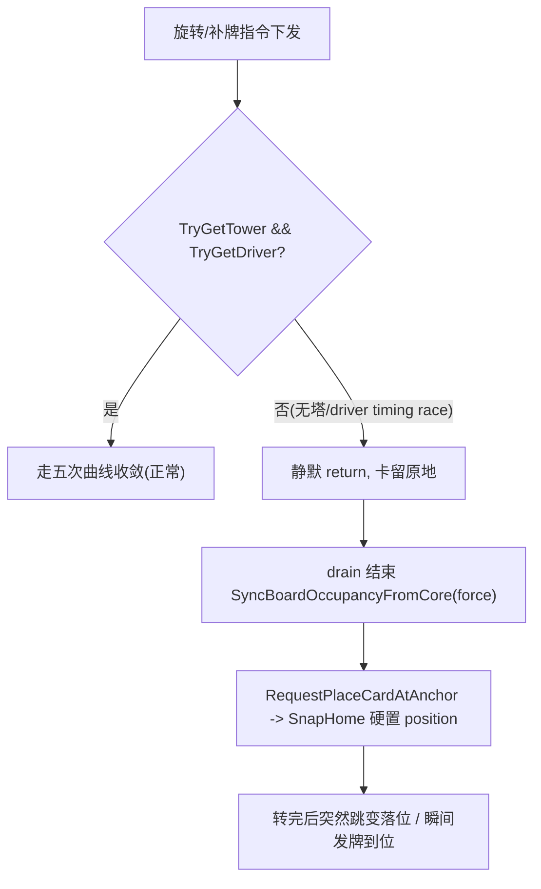

## 收敛静默失败收口 · 落地方案

依据：[表现层收敛范式重构落地质量评估-2026-07-15.md](Assets/Notes/表现层收敛范式重构落地质量评估-2026-07-15.md) + 实测症状（复杂卡组后期偶发"某卡留原地、转完硬跳落位"/"瞬间发牌到位"）。

范式本身已验证无问题，本轮只做"收口"：把没覆盖到的静默失败入口彻底清干净，不发明新架构。策略为**诊断先行**（评估文档"第一个短迭代"）。

### 根因定位（已静态确认）

"没有运动路径"是原罪。链路：

- 旋转掉队：`SlotFrameConvergence.ConvergeVisualToWorld` 无塔/无 driver 时静默 `return`（[SlotFrameConvergence.cs:129](Assets/Scripts/Cards/Convergence/SlotFrameConvergence.cs)）。
- 发牌不飞：`BeginDealFromLaunch` 同样静默失败（[SlotFrameConvergence.cs:99](Assets/Scripts/Cards/Convergence/SlotFrameConvergence.cs)），末尾 `SnapHome` 硬置（[SlotDealFlightService.cs:383](Assets/Scripts/Cards/Convergence/SlotDealFlightService.cs)）。
- 硬跳兜底：`RequestPlaceCardAtAnchor` -> `SlotFrameConvergence.SnapHome`（[GroundFieldManagerSingleton.cs:406](Assets/Scripts/Cards/GroundFieldManagerSingleton.cs)）、`SyncBoardOccupancyFromCore(force:true)`（[InBattleManagerSingleton.cs:2246](Assets/Scripts/Flow/InBattleManagerSingleton.cs)）。
- 为何后期偶发：中途 spawn 的补牌/融合结果/refill 卡的塔与 driver 装配存在 timing race，入口那一刻 `TryGet*` 返回 false。

### 阶段 A（P0 · 诊断先行）：点亮所有静默失败点

目标：一轮实测就能用日志证明"哪张卡、哪个入口、为什么没走曲线"。风险最低，先做。

- 复用现有 `CardPresentationProbe.Anomaly` / `RegistryMiss`（[CardPresentationProbe.cs:319](Assets/Scripts/Cards/CardPresentationProbe.cs)）。给以下每个"静默 return / 无塔 fallback / 硬 snap"点补一条带 uid + site + 原因（noTower/noDriver）的报警：
  - `SlotFrameConvergence.ConvergeVisualToWorld` / `BeginDealFromLaunch` / `SnapHome` 的无塔无 driver 分支。
  - `EffectFrameConvergence.ParkRootAtWorld` / `SnapHome` 的无塔分支（[EffectFrameConvergence.cs:130](Assets/Scripts/Cards/Convergence/EffectFrameConvergence.cs)）。
  - `RotateOuterRingInternalAsync` 里 `RegistryMiss("AnimateSkip")` 已有，追加"是否 driver 缺失"字段。
  - `SkeletonDeckPresentationManager` 融合结果卡 `resultCard.Transform.position = mergeCenter` 无塔路径（[SkeletonDeckPresentationManager.cs:309](Assets/Scripts/Cards/SkeletonDeckPresentationManager.cs)）。
- `DrainLegacyBoardDeltaAsync`（[InBattleManagerSingleton.cs:2283](Assets/Scripts/Flow/InBattleManagerSingleton.cs)）触发时写一条 CoreLog（requestId + move/deal/remove 数量），证明 `stepCount==0` 回退频率。
- `SyncBoardOccupancyFromCore` 的 Phase 2 硬落位每命中一张卡写一条"forceSnap"诊断（区别于正常收敛完成）。
- 验收：跑一局后期骷髅/复杂卡组战斗，导出日志到 `Assets/Notes/Logs/`，按 battlelog-analysis skill 产出"静默失败/硬跳清单"，锁定真凶入口。

### 阶段 B（P1 · 根治）：收敛入口无塔/无 driver 从"静默吞掉"改为"补齐后继续走曲线"

目标：直接消灭"没有运动路径"。这是硬问题核心。

- 在 `SlotFrameConvergence.TryGetTower/TryGetDriver` 失败时，改为调用 `CardTransformTower.EnsureTower` + `LayerConvergenceDriver.Ensure(root, SlotFrame)`（[LayerConvergenceDriver.cs:67](Assets/Scripts/Cards/Convergence/LayerConvergenceDriver.cs) 已有 Ensure）补齐，成功则继续走曲线；仍失败才报警 + 兜底。L3 `EffectFrameConvergence` 同理。
- 收敛入口调用点前置保证：`CardManagerSingleton.SpawnView`（[CardManagerSingleton.cs](Assets/Scripts/Cards/CardManagerSingleton.cs)）与融合 `RevealResultCardAsync` 在卡进入复杂域前强制补塔 + 两层 driver，消除 timing race。
- `AnimateCardHopToSlotAsync` 收敛前的 `RefreshDisplayMode`（[GroundFieldManagerSingleton.cs:1621](Assets/Scripts/Cards/GroundFieldManagerSingleton.cs)）确认不会因 `ApplyDisplayMode` 重置 localScale/rotation 干扰刚补的塔。
- 验收：重跑阶段 A 场景，静默失败清单归零，掉队/瞬移症状消失；EditMode 补一条"无塔卡进入 ConvergeVisualToWorld 会自动补塔并走曲线"测试。

### 阶段 C（P2）：真实就位栅栏（时间语义 -> 执行语义）

目标：栅栏能证明参与卡的 driver 真完成，而非只看 sourceTime 预算。

- `BeatGrid.Register` 增加可绑 `LayerConvergenceDriver.Completed` 的 completion adapter（[BeatGrid.cs:90](Assets/Scripts/Cards/Convergence/BeatGrid.cs)），`AreAllComplete` 同时校验时间到 + driver 已 Complete。
- 旋转 `RotateOuterRingInternalAsync` 的 `_beatGrid.Register` 传入实际 driver（[GroundFieldManagerSingleton.cs:1541](Assets/Scripts/Cards/GroundFieldManagerSingleton.cs)）；barrier 不满足（redirect 拉长/driver 被取消/无法注册）时写明确报警。
- 验收：扩展 [BeatGridBarrierTests.cs](Assets/Scripts/Cards/Tests/BeatGridBarrierTests.cs)，覆盖"某 driver 未完成则 barrier 不满足"。

### 阶段 D（P3）：排序通道与 RefreshDisplayMode 抢位收口

目标：消灭飞行途中 sortingOrder 被打回地面层的闪烁。

- `ApplyDisplayMode` 写 sortingOrder 前检查 `FlightSortingChannel.IsArmed(uid)`（[FlightSortingChannel.cs:131](Assets/Scripts/Cards/Convergence/FlightSortingChannel.cs)），飞行中不覆写排序（改由飞行通道完成时统一掉回）。修改点 [CardManagerSingleton.cs:720](Assets/Scripts/Cards/CardManagerSingleton.cs)。
- 复核 `AnimateCardHopToSlotAsync` 收敛前后两次 `RefreshDisplayMode` 是否必要，收敛前的可去除或改为不动排序/位姿。
- 验收：扩展 [FlightSortingChannelTests.cs](Assets/Scripts/Cards/Tests/FlightSortingChannelTests.cs)，覆盖"armed 期间 RefreshDisplayMode 不改 sortingOrder"。

### 本轮不做（放一放）

- Legacy Steps/双轨完全删除（评估 P0 建议先观测比例，删除留待日志证明后）。
- 手牌/牌库净土域重写、DAG、纪律 C 全局升级、L3 lease 产品化、S/C 内容侧标签（评估 P4/P5，明确未来项）。
- `KillMotion` 分层 API 拆分（评估 P3，非当前闪烁跳变主因，放后）。

### 约束红线（沿用原 plan）

- 禁止手改 `.unity`；预制体塔改造走 MCP/Editor 脚本。
- 收敛/塔/调度代码在 Cards 层，不得用 QFramework；不改 Core。
- 改脚本后 `refresh_unity` 读 Console 确认编译通过。

[{"id": "diag-silent", "content": "\u9636\u6bb5A: \u7ed9 SlotFrameConvergence/EffectFrameConvergence \u7684\u65e0\u5854\u65e0driver\u9759\u9ed8return\u5206\u652f\u3001\u878d\u5408\u65e0\u5854position\u5206\u652f\u3001SnapHome\u786c\u843d\u4f4d\u3001DrainLegacy\u56de\u9000\u3001SyncBoardOccupancy forceSnap \u5168\u90e8\u8865\u5e26 uid+site+\u539f\u56e0\u7684 Anomaly/RegistryMiss \u8bca\u65ad\u6807\u7b7e"}, {"id": "diag-run", "content": "\u9636\u6bb5A: \u8dd1\u4e00\u5c40\u540e\u671f\u9ab7\u9ac5/\u590d\u6742\u5361\u7ec4\u6218\u6597,\u5bfc\u51fa\u65e5\u5fd7\u81f3 Assets/Notes/Logs/,\u6309 battlelog-analysis skill \u4ea7\u51fa\u9759\u9ed8\u5931\u8d25/\u786c\u8df3\u6e05\u5355,\u9501\u5b9a\u771f\u51f6\u5165\u53e3"}, {"id": "fix-ensure", "content": "\u9636\u6bb5B: \u6536\u655b\u5165\u53e3\u65e0\u5854\u65e0driver\u65f6\u6539\u4e3a EnsureTower + LayerConvergenceDriver.Ensure \u8865\u9f50\u540e\u7ee7\u7eed\u8d70\u66f2\u7ebf;SpawnView/\u878d\u5408\u7ed3\u679c\u5361\u8fdb\u5165\u590d\u6742\u57df\u524d\u5f3a\u5236\u8865\u5854\u6d88\u9664timing race"}, {"id": "fix-verify", "content": "\u9636\u6bb5B: \u91cd\u8dd1\u9636\u6bb5A\u573a\u666f\u9a8c\u8bc1\u9759\u9ed8\u5931\u8d25\u5f52\u96f6\u3001\u6389\u961f/\u77ac\u79fb\u6d88\u5931;\u8865 EditMode \u6d4b\u8bd5(\u65e0\u5854\u5361\u8fdb\u5165\u6536\u655b\u81ea\u52a8\u8865\u5854\u8d70\u66f2\u7ebf)"}, {"id": "barrier", "content": "\u9636\u6bb5C: BeatGrid.Register \u7ed1 driver.Completed \u7684 completion adapter,AreAllComplete \u540c\u65f6\u6821\u9a8c\u65f6\u95f4\u5230+driver\u5b8c\u6210;\u65cb\u8f6c\u8def\u5f84\u4f20\u5165\u771f driver;barrier\u4e0d\u6ee1\u8db3\u62a5\u8b66;\u6269\u5c55 BeatGridBarrierTests"}, {"id": "sorting", "content": "\u9636\u6bb5D: ApplyDisplayMode \u5199 sortingOrder \u524d\u68c0\u67e5 FlightSortingChannel.IsArmed,\u98de\u884c\u4e2d\u4e0d\u8986\u5199\u6392\u5e8f;\u590d\u6838 AnimateCardHopToSlot \u4e24\u6b21 RefreshDisplayMode \u5fc5\u8981\u6027;\u6269\u5c55 FlightSortingChannelTests"}]