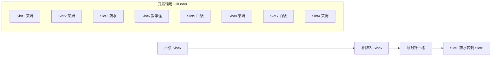

# 教程第一关：莱姆保序 + 正右方框选 + 半黑屏挖洞

## 现状（为什么会怪、为什么框不住）

当前 `[TutorialDeckPlan.cs](Assets/Scripts/NineGrid.Presentation/Flow/Tutorial/TutorialDeckPlan.cs)` 并不是「随机种子抽歪」，而是**写死了一套不像第一关的保序表**：

- `monster.dragon_follower`（幽灵炎，`deck.stone_legion` / 第 2 层主题）
- `trap.flame`（烈焰，特殊机关，正式开局池明确排除）
- `trap.spike` / `trap.bear_trap`（常规机关）
- `monster.beggar`（人面莱姆，莱姆卡组 **sequence 5**，60 血层主档）
- `help.gold_card`（Red，不是第一关常规白装）

教学交互格写死 **Slot 2（玩家正上方）**（`[TutorialCoach.FirstBattleTargetMonsterSlot](Assets/Scripts/NineGrid.Presentation/Flow/Tutorial/TutorialCoach.cs)`）。顶部 `InfoWindow` 会盖住上排卡，道具/门看起来像「没框到」。

框选本身 `[TutorialPromptBoxPresenter.TryCalculateWorldBounds](Assets/Scripts/NineGrid.Presentation/Flow/Tutorial/TutorialPromptBoxPresenter.cs)` 会合并目标下**所有** `SpriteRenderer`（描述格、计数图标等），道具卡/门的卡框更容易跑偏。

自然第一关虽走 `TutorialDeckPlan`，但 **本层主题卡组要到 1-2 才 `FindMonsterDeck` 随机绑定**。第 1 层 WeakElite 池是 `deck.dragon`（莱姆）**和** `deck.orc_legion`（植物），首次游玩后续房间仍可能不是莱姆。

已对齐：第一关**不塞常规机关**；`trap.leave` 仍放抽牌堆后半段，第 10 步门教学保留，门落点不强制正右方。

## 1. 开局载荷与本层卡组

改 `[TutorialDeckPlan](Assets/Scripts/NineGrid.Presentation/Flow/Tutorial/TutorialDeckPlan.cs)`：

- 怪物**只允许** `monster.melee_3`（小小莱姆，莱姆卡组 sequence 1）。
- 道具只用第一关会见到的 **White** `deck.help`：`help.healing_potion`、`help.throwing_knife`、`help.sturdy_shield`（去掉 Red 金卡、烈焰/哥布怪、常规机关）。
- 唯一机关：`trap.leave`，仍在抽牌堆后半段（现 DrawPile 下标 ≥ 4）。
- `PreserveDealOrder` 保持。

固定 16 张（FillOrder `1,2,3,6,9,8,7,4`）：

| 序          | 落点              | 卡                   |
| ---------- | --------------- | ------------------- |
| 0          | Slot 1          | 小小莱姆                |
| 1          | Slot 2          | 小小莱姆                |
| 2          | Slot 3          | 恢复药水（旋转后到 Slot 6）   |
| 3          | Slot 6          | 小小莱姆（**第 1 轮教学目标**） |
| 4–7        | 9/8/7/4         | 莱姆 + 白装，无机关         |
| 8          | 补入死亡格再转到 Slot 9 | 小小莱姆                |
| 9–11,13–15 | 抽牌堆             | 莱姆 / 白装             |
| 12         | DrawPile[4]     | `trap.leave`        |

击杀 Slot 6 → 优先补回 Slot 6 → 顺时针：Slot 3 药水进入 Slot 6，成为第 2 轮教学目标。与现行 Slot1→Slot2 同构，只是转到正右方，躲开顶部文案。

**本层钉死莱姆**：自然首局 / 菜单教程在 Bootstrap 后立刻 `RunModel.TryBindFloorMonsterDeck("deck.dragon")`（`[GameFlowOrchestrator](Assets/Scripts/NineGrid.Presentation/Flow/GameFlow/GameFlowOrchestrator.cs)` 走 `TutorialDeckPlan` 的分支）。这样 1-2 起 `BuildNodeDeckOptions` 用莱姆卡组，并恢复常规三张机关注入。已完成 1–9 的正式开局不钉，第 1 层仍按种子在莱姆/植物间抽。

## 2. 教练目标格与框选几何

`[TutorialCoach](Assets/Scripts/NineGrid.Presentation/Flow/Tutorial/TutorialCoach.cs)`：

- `FirstBattleTargetMonsterSlot` / `FirstBattleCollectiblePotionSlot`：`2` → `**6**`
- 步骤 4/6 白名单、`ShowTarget`、回归测试一并改 Slot 6
- 步骤 4/6 优先 `Field.TryGetCardAt(6)` 拿 `ManagedCard` 再框（与门教学同一条路径），避免只框空锚点

`[TutorialPromptBoxPresenter](Assets/Scripts/NineGrid.Presentation/Flow/Tutorial/TutorialPromptBoxPresenter.cs)`：

- 包围盒优先 **卡框**（节点名 `卡框` / `Card Frame` / `[CardFaceSlotNodeMap](Assets/Scripts/NineGrid.Presentation/Cards/Slots/CardFaceSlotNodeMap.cs)`），不要 Encapsulate `Basic_Description`、计数、血攻图标
- 找不到卡框再退回保守默认尺寸（约 2×2.8），不要用「全体子 Sprite」把框拉飞
- 门教学继续跟真实落点，不改强制格

## 3. 半黑屏挖洞（单独表现，不走局内覆层）

场景 `[UI面板/半黑屏BG](Assets/Scenes/MainScene.unity)` 已挂 `BattleUiDimmerOverlay` + 全屏 collider（`UI/-1`，黑、α≈0.95）。**禁止** `TryAcquire`：会吞点击、挡住推进/白名单攻击。

新建 `TutorialSpotlightPresenter`（与提示框同生命周期）：

- 视觉：复制半黑屏的 Sprite / 颜色 / sorting，做成**无 collider** 的教学层（子节点或兄弟，例如 `教学挖洞遮罩`）
- `SpriteMask` custom range 只打到这层：框内透明、框外半黑；Mask 尺寸跟提示框呼吸同一套 `sin` 偏移
- `ShowTarget` 开、`HidePrompt` 关；步骤 3/5/7–9 无框时不铺黑
- 教学提示框保持 `UI/999`，文案 `InfoWindow` 不被这层压住

## 4. 文档与测试

- `[docs/adr/0042-tutorial-level-module.md](docs/adr/0042-tutorial-level-module.md)` 补记：首局钉 `deck.dragon`；第一关只小小莱姆 + 白装 + 后置门；教学格 Slot 6
- `[docs/code-map/presentation.md](docs/code-map/presentation.md)` `Tutorial/` 行同步

测试（改旧 + 少量新断言）：

- `[TutorialOpeningDeckPayloadRegressionTests](Assets/Scripts/NineGrid.Presentation/Tests/TutorialOpeningDeckPayloadRegressionTests.cs)`：Slot 6 小小莱姆；旋转后 Slot 6 药水；无 `trap.flame` / `trap.spike` / `trap.bear_trap` / `monster.dragon_follower` / `monster.beggar`；怪物全是 `monster.melee_3`；门仍在抽牌堆后半段；钉层后 `FloorMonsterDeckId == deck.dragon`
- `[TutorialCoachSteps1To9RegressionTests](Assets/Scripts/NineGrid.Presentation/Tests/TutorialCoachSteps1To9RegressionTests.cs)`：白名单 Slot 6
- 框选：卡框包围盒不含描述格
- Spotlight：随 Show/Hide；不把 `BattleUiDimmerOverlay.IsActive` 置 true

验证：`recompile` + Console 无本改动新 Error；有机会再 Play 走一遍自然首局步骤 4/6/10。