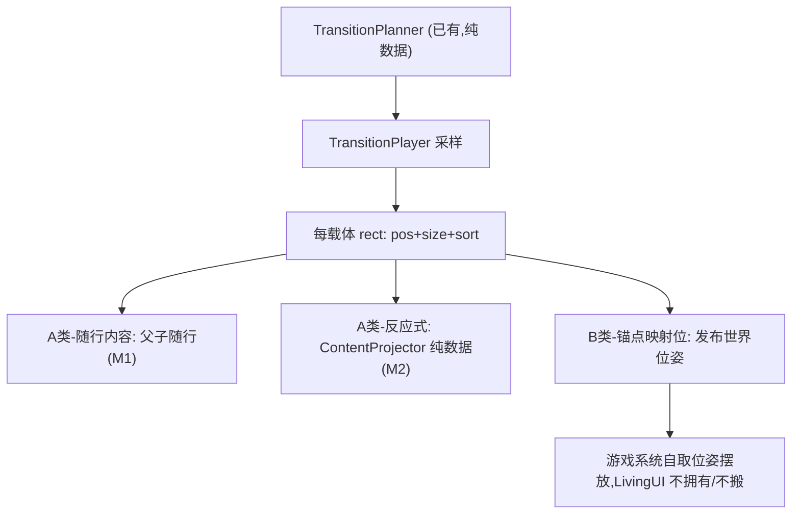

# 灵动 UI 内容层落地计划

## 现状锚定（已探查）

- 载体运动已跑通：`LivingUiDirector.ApplyCurrentPlanSample`（[Assets/Scripts/UI/LivingUI/Unity/LivingUiDirector.cs](Assets/Scripts/UI/LivingUI/Unity/LivingUiDirector.cs)）每帧写 `transform.position` 与 `SpriteRenderer.size`（9-slice 绘制尺寸，**不是** `localScale`）。
- 载体身份 = 每个 `大盘构型` 根下名为 `1`…`12` 的 `SpriteRenderer`，由 `LivingUiSceneLayoutSource.Capture` 快照（[LivingUiSceneLayoutSource.cs](Assets/Scripts/UI/LivingUI/Unity/LivingUiSceneLayoutSource.cs)）。
- **内容层完全没接线**：`Anchors` 目录里美术填的图标/文字/占位当前**无人抓取**，只有 `1`…`12` 被快照。这正是本计划要补的缺口。
- 关键物理事实：载体尺寸走 9-slice `size`，所以把内容挂成载体子物体只能"位置随行"（场景 a 免费），**不会**随边界缩放/交错（场景 b/c 需额外驱动）。

## 核心心智模型

载体运动是权威（已有）；内容按**声明的策略**挂接/反应。"面板带着内容走" = 内容对载体采样位姿的**声明式响应**，不是又一套屏幕投影追逐（区别于已废弃的 `LivingTextWorldBinder` 追背板）。

## 一、内容分类法（问题1 的组织/管理答案）

对每个 `Anchors` 节点与占位内容，判定归入两类之一，并给 A 类指定跟随策略：

- **A 类 · 随行内容（载体拥有）**：标题、菜单文字、装饰图标等属于"面板表现"的内容。挂到载体子树，按策略驱动：
  - `RigidTravel`（M1）：纯位置随行（场景 a）。
  - `BoundaryReactive`（M2）：随载体 `size` 依边界依次缩放进/退场、按归一化位置错峰（场景 b）。
  - `PartialFollow`（M2）：贴一条边按比例位移、不缩放、持续存在（场景 c）。
  - `HideDuringTransit` / `SwapOnFace`（M1）：切构型时刻显隐 / 换文案（逻辑内容位）。
- **B 类 · 锚点映射位（游戏/受保护场地拥有）**：仅给一个"点/区域"让游戏内生成知道往哪放（问题2 的现状）。载体发布该锚点的当前世界位姿；游戏系统自取位姿摆放自己的对象，**LivingUI 不拥有、不搬动**，场地覆层期只遮不重排。
  - B1（HUD 随动）：载体停稳后游戏系统重取位姿重新摆放。
  - B2（受保护场地）：LivingUI 只覆盖、绝不移动。

分类依据 = 美术预览图（`Assets/Screenshots/*preview*`、`LivingUI-*` 等）+ MCP 读层级。产出一张**内容绑定表**（延用已存在的 `Assets/Notes/世界字-文字背板绑定表-2026-07-18.md`，扩展成"内容ID → 载体ID → 类别 → 策略 → 局部位姿"）。

## 二、数据模型与接线口

- 新增纯数据 `LivingUiContentBinding {contentId, carrierId, localPose, policy, envelope}`，与 `LivingUiTerminal` 同域（[LivingUiContracts.cs](Assets/Scripts/UI/LivingUI/Core/LivingUiContracts.cs)）。
- 新增 `CarrierView` MonoBehaviour：持有 `SpriteRenderer` 皮肤 + 暴露一个 `ContentAttach` 子 Transform（A 类挂点）+ 一个 `CarrierAnchorRegistry`（B 类按名发布世界位姿）。作为将来 spec §8 帧栈（`LayoutFrame/ImpactFrame/FlipFrame`）插入的**局部化 seam**，M1 先不建整栈。
- 扩展 `LivingUiSceneLayoutSource`：在抓 `1`…`12` 的同时抓各载体下的内容绑定（按名/标记），烘焙进快照。

## 三、M1 — 主菜单切片（本次实际落地目标）

范围：仅 `大盘构型0-主菜单`，证明场景 a + 显隐/换文案 + hover 局部变体。全程 **Unity MCP**，禁止手改 `.unity`；文字走 `.cursor/skills/table-nine-world-living-text/`（世界 TMP 挂载体子树、`NoPixelSnap`+UICamera、`TmpBitmapPixelOutline`）。

1. 分类主菜单 `Anchors`（标题/开始/设置/结束游戏/版本信息/图标）为 A/B，产出绑定表。
2. 把 A 类随行内容改挂到对应载体的 `ContentAttach` 下（标题→载体 `4` 等，具体载体号用 MCP 层级读 + 预览图确定）；菜单文字迁移为世界 TMP 子物体。
3. 右侧三个小载体做 **hover 局部变体**：进入稳定触发区 → 该载体 pop（位置/尺寸变）→ 其标签 `RigidTravel` 跟随；用 `StableHitZoneRoot`（不随预演载体动，避免自激振荡），复用 `LivingUiDemoInput` 的稳定 hover 思路（[LivingUiDemoInput.cs](Assets/Scripts/UI/LivingUI/Demo/LivingUiDemoInput.cs)）。
4. 显隐/换文案：进主菜单时刻某些内容 `HideDuringTransit`。
5. 验收：数字键/hover 切换时标题与菜单字丝滑随行、清晰无 Snap、有扫描线与黑边、hover 不抖。

## 四、M2 — 反应式内容投影器（主菜单切片已落地）

- 纯数据 seam `LivingUiContentProjector`：输入（载体采样 size、作者局部位姿、策略参数）→ 输出内容的 `scale/offset/visible`。与 `TransitionPlanner` 同哲学，**不是**屏幕追逐。
- `BoundaryReactive`：缩放随 `size` 相对基线映射，错峰按内容在载体内的归一化切比雪夫距离（场景 b）。主菜单：`menu.title` / `menu.icon.pack`。
- `PartialFollow`：只跟一条边、按 `±0.5·Δsize` 位移、不缩放（场景 c）。主菜单：`menu.version` 贴左边。
- **随行包裹抬高流动下限**：A 类 envelope 聚合后交给 `TransitionPlanner` 的 per-carrier flow floor。
- Face 显隐：转场中允许匹配 `committed` Face，以便出场反应式投影可见。

## 五、游戏内生成内容路径（问题2）

- B 类锚点：`CarrierView.CarrierAnchorRegistry` 按名发布"当前世界位姿"；游戏系统在"载体停稳"事件（或按需查询）时自取位姿摆放。LivingUI 不持有其对象。
- 受保护场地（九宫格/手牌/卡组）= B2：只被场地覆层遮盖，绝不被 LivingUI 重排（对齐 spec §7/§16、CONTEXT「受保护场地/活性遮盖」）。
- 主菜单里 B 类很少；此处仅**立规矩+建 registry**，战斗 HUD/场地覆层留到后续切片压。

## 六、测试与验收

- **纯数据 EditMode 测试**（镜像 `LivingUiTransitionPlannerTests`）：`RigidTravel` 保持相对偏移不变；`HideDuringTransit` 在标记时刻切显隐；（M2）`BoundaryReactive` 缩放在坍缩→0/展开→1 且错峰顺序由位置决定；`PartialFollow` 只位移不缩放；随行 envelope 正确抬高载体尺寸下限。
- **切片人验（非单测）**：Play 截图与美术预览图**逐构型比对**（预览图 = 构型样板视觉真值 / 验收目标），配合诊断遥测（随行是否跟随、hover 是否自激、显隐时刻）。
- 预览图三用途：分类 A/B 依据、验收比对目标、推导 M2 的内容包裹 envelope。

## 七、边界与非目标

- 不改 Core、不用 QFramework、不依赖 Cards 收敛塔/租约（spec §2）。
- M1 不建整套帧栈、不建碰撞求解器/场地覆层/输入仲裁；只补内容层最小可跑核 + 分类立规。
- 不恢复屏幕槽 Binder 追逐为权威（spec 明确废弃）。
- 不手改 `.unity`；场景改动一律 MCP。