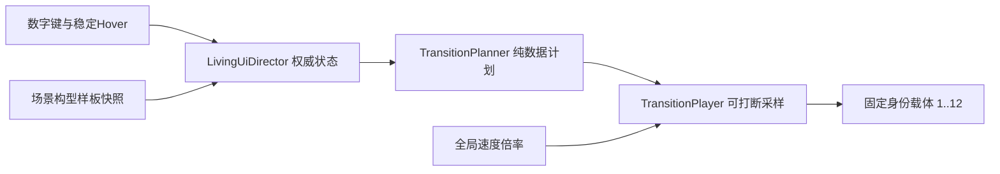

# 灵动 UI 核心动态布局落地

## 已确认的场景与交互

- 目标场景为 [`Assets/Scenes/UITestSence.unity`](Assets/Scenes/UITestSence.unity)，现有构型样板 `0、1、2、2-1、2-2、3、4`，每组都有固定身份面板 `1..12`；场景只通过 Unity MCP 装配和保存，绝不文本修改 `.unity`。
- 键位固定为：主键盘 `1→0、2→1、3→2、4→3、5→4`。
- 从其他构型按 `3` 先进入构型 `2`；已提交构型为 `2` 时再按 `3` 进入 `2-1`，在 `2-1` 再按 `3` 返回 `2`。
- 已提交构型为基础 `2` 时，鼠标进入面板 `12` 在构型 `2` 的固定终态区域，预演 `2-2`；离开该稳定区域清除预演并回到当前已提交构型。预演或 `2-1` 中按其他数字键可立即提交其他大盘构型，不被子状态锁住。

## 核心结构

- 在 [`Assets/Scripts/UI/LivingUI/`](Assets/Scripts/UI/LivingUI/) 建独立 `NineGrid.LivingUI` 程序集，仅引用 Unity/TMP 必需程序集，不引用 Core、Cards、Flow 或 QFramework。
- 增加纯数据契约：`LivingUiLayoutId`、面板终态/实况、转场意图、分代计划、面板运动程序和 `ILivingUiTransitionPlanner`。场景样板只负责在初始化时提供权威终态，之后运行时只驱动一套载体；预留后续 ScriptableObject/烘焙器替换布局来源的接口。
- `LivingUiSceneLayoutSource` 在 `Awake` 按构型根命名与面板 ID `1..12` 一次性快照位置、`SpriteRenderer.size` 和排序信息，并严格校验每个构型身份集合一致。构型 `0` 的 12 个对象作为本切片固定载体，运行时不 `SetParent`，其余根只作隐藏样板。

## 曲线、卡农与打断

- 新增 UI 域中立的有限时长五次 Hermite/最小 jerk 标量曲线，支持位置、速度求值和从任意实况重定向；不依赖 Cards 的 `ConvergenceCurve`。
- 尺寸通道使用带边界验证的分段曲线：优先选择无越界的直达五次曲线，必要时先连续制动再到目标，保证尺寸始终大于流动下限且普通执行不靠逐帧 clamp；位置和尺寸都精确命中终态。
- `TransitionPlanner` 每次请求从当前采样实况生成新分代：按“出画领先、场内重排居中、入画稍后”的重叠波次安排起始偏移，再在组内按空间投影形成卡农，而非全串行。基础时长、距离影响、卡农跨度、出画领先量、入画滞后量均集中到一份可调风格参数。
- 目标矩形完全离开相机舞台边界的面板标为 `Expelled`：只做自然位置出画，保持当前尺寸，不进入场内尺寸/布局约束计算；入画和场内面板才参与位置+尺寸收敛。
- 新请求会先采样所有载体当前的位置/速度、尺寸/尺寸速度，再重解新计划；递增 generation 使旧计划立即失效。连续快速 `A→B→C`、Hover 进出和子状态跨大盘都不会从静止重启或等待前一段完成。
- `LivingUiDirector` 暴露一个 Inspector `playbackSpeed` 总速度倍率；播放器用它缩放时间推进，因此运行中调快/调慢会整体改变演出速度，同时保持各面板卡农比例与曲线形状。

## 场景演示接入

- 新增 [`Assets/Scripts/UI/LivingUI/Unity/LivingUiDirector.cs`](Assets/Scripts/UI/LivingUI/Unity/LivingUiDirector.cs) 与 [`Assets/Scripts/UI/LivingUI/Demo/LivingUiDemoInput.cs`](Assets/Scripts/UI/LivingUI/Demo/LivingUiDemoInput.cs)。所有 Inspector 序列化字段都按项目约定带完整 `[Tooltip]`，自动查找字段明确写明查找方式和留空行为。
- 通过 Unity MCP 在 `Directors` 下创建 `LivingUI` 对象并装配组件；禁用会抢占主键盘 `1..5` 的旧 `UITestBootstrap`，同时在此测试场景禁用正常 `MainGameLoopManagerSingleton`，避免旧流程/显隐路由与新布局权威并行竞争。
- Hover 不跟随移动后的面板碰撞体，而是使用构型 `2` 中面板 `12` 的快照矩形作为稳定触发区；只在“已提交基础构型 2”时拥有预演权，切换构型会清理预演。
- 初始化时隐藏所有样板根，只显示固定载体根并精确落在构型 `0`；保存当前包含新构型 `3` 的场景状态。

## 测试与视觉验收

- 在 [`Assets/Scripts/UI/LivingUI/Tests/Editor/`](Assets/Scripts/UI/LivingUI/Tests/Editor/) 增加纯数据 EditMode 测试，覆盖：精确终态、generation 更新、任意中段重定向的 C1 连续、尺寸下限、出画不改尺寸、卡农保持并行而非退化为全串行。
- Unity 编译后检查 Console，再运行该 EditMode 测试程序集。
- Play Mode 人工/接口驱动验收：快速乱序 `1→5→2→4→3`；`3→3→3` 往返 `2/2-1`；面板 `12` 快速 Hover 进出；Hover 中直接按 `1/2/4/5`；转场中反复改目标与动态调整 `playbackSpeed`。重点观察无跳帧式回弹、无停顿等前段、出画自然、卡农并行且终态准确，并截取 Game View 结果验证。
