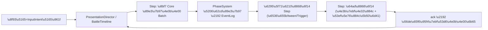

# 表演编排统一时间线重构 · 落地方案

对标依据：[Lost For Swords 表现层解析](C:/Users/jinji/Desktop/寻剑迷途解包/LostForSwords/docs/表现层交互与编排解析.md)（反编译求证：`ActionExecutor.Exec` 逐步驻留、`DelayAction` 真局是真步骤、`Moving/StaticCardPositionSystem` 单写者互斥）。
根决策：[ADR-0001](docs/adr/0001-battle-presentation-unified-timeline-batch-ack.md)。位置地基沿用：[多层级代理约束收敛驱动控制-范式设计.md](Assets/Notes/多层级代理约束收敛驱动控制-范式设计.md)。

## 已锁定边界（grill 对齐）

- **根**：统一时间线 + 批次锁步（碰 Core 边缘：把 `RunToCompletion` 整局解算切成一拍一 ack，接已有闲置 `PresentationSyncSystem`/`CoreCommandDispatcher` 缝）。
- **并发**：一条串行主线（输入互斥只认它）+ 单 Step 可 fork 并行子流 + 极少量旁路装饰道。
- **输入**：转 `InputIntent`，忙时缓冲最早一条 + `uiPick` 预告，Phase/战败/换层硬清空；**暂不做 tick 加速**（留门，保留墙钟 `PresentationClock`）。
- **位置范围**：编排层收编所有域上时间线 + 全局租约纪律；**位置基元不强制统一**——净土域（手牌/卡组）保留 DOTween 黑盒，边界走 `Evict/Admit`。
- **FX/音效**：脉冲 `Trigger`（发即完成、可降级），卡时序靠显式 `Delay`，音效走统一 sink 带 debounce。
- **占格**：消除 Cards 侧 `_uidBySlot` 占格权威，Core 单一真相；Cards 只留几何注册（命中测试），合法性由 Flow 在 idle 对 `BoardModel` 裁决；`SyncBoardOccupancyFromCore(force)` 降级为断言。
- **迁移**：按流程垂直切片渐进，新旧共存，逐条 PerfLog+人眼验收还原后拆旧，全迁完硬切。
- **God Object**：strangler——每迁一条流程即把编排逻辑从 `InBattleManagerSingleton` 抽到 Director + Step handler。

## 红线

- 禁手改 `.unity`/预制体，走 Unity MCP 或 Editor 脚本；改脚本后 `refresh_unity` 读 Console。
- Director/时间线/Step/Intent/Trigger 全部落 **Flow 层**（Cards 零 Core 引用不破）；不使用 QFramework（非内核）。
- Core 侧仅动"解算切批"边缘，不改规则语义、不动黑盒内部。

## 目标数据流

## 现状靶点（strangler 收编/拆除对象）

- 三套机制：`FieldBattleManagerSingleton` 战斗 rig async 链、`InBattleManagerSingleton._boardPresentationQueue` pump、`_pendingShuffleInto`/融合旁路队列 → 收编到唯一 Director。
- 核先行源头：[PhaseSystem.ResolveInteractiveRotation](Assets/Scripts/NineGrid.Foundation/NineGrid.Core/Systems/PhaseSystem.cs)（一次 Enqueue fill+rotate 后 `RunToCompletion`）→ 切批。
- 双真相：[GroundFieldManagerSingleton](Assets/Scripts/Cards/GroundFieldManagerSingleton.cs) `_uidBySlot` + `SyncBoardOccupancyFromCore(force)` → 镜像退场/断言。
- 粗门禁：`CombatHitSink.PresentationLocked` + 各 `IsBusy` → 收成"主线在跑"单一真相。
- 复用资产：[CoreCommandDispatcher/PresentationSyncSystem](Assets/Scripts/NineGrid.Foundation/NineGrid.Core/Presentation/CoreCommandDispatcher.cs)（已建、仅测试用）、`Convergence/*` 的 `LeaseArbiter/BeatGrid/PresentationClock`、[BoardPresentationStepProjector](Assets/Scripts/Flow/BoardPresentationStepProjector.cs)、`BoardMotionStepScheduler`。

## 阶段划分

### 阶段 0：Director 骨架 + 批次锁步缝 + 输入意图（最小可跑核）
- 新建 `PresentationDirector` + `BattleTimeline`（Flow）：串行主线，`Step` 抽象（`Step(...)→Continue/Finished` 逐帧步进语义，对标 `ActionExecutor`），支持 fork 并行子流与旁路装饰道。
- Step 类型：`ResolveBatchStep`（调 `CoreCommandDispatcher.Send`/`PhaseSystem` 分批 + `OpenBatch/FinishBatch`）、`PresentStep`（投影→播表演→ack）、`DelayStep`、`TriggerStep`（脉冲）。
- `InputIntent` + 忙时缓冲最早一条 + `uiPick` 预告 + Phase/战败/换层硬清空；"主线在跑"= 唯一 busy 真相。
- EditMode 测试（纯逻辑，假时钟/假通道）：时间线步进/驻留、批次 ack 顺序、意图缓冲与硬清空、并行子流/旁路道语义。

### 阶段 1：首条垂直切片（最简单完整流程：空格 explore 或拾取）
- 选最简单一条完整流程整条迁到 Director（`ResolveBatch`→`Present`→ack 端到端跑通），验证批次锁步真实闭环。
- 拆该流程旧路径；PerfLog + 人眼验收还原。

### 阶段 2：攻击 → 击杀补牌旋转（承重切片）
- 把 [ResolveInteractiveRotation](Assets/Scripts/NineGrid.Foundation/NineGrid.Core/Systems/PhaseSystem.cs) 切成分拍 Batch（hit 一拍、fill/rotate 一拍），由表演 ack 驱动前进；hit-frame 不再核先行。
- 攻击 lunge/受击/击退走 L3 + 旁路装饰道并行飘字；旋转/hop 走 L2 收敛 + Sync 租约；补牌 `Deal` 并行子流。
- 收编 `FieldBattleManagerSingleton` rig 与 `_boardPresentationQueue` 到 Director；拆旧；验收还原。

### 阶段 3：其余流程逐条迁移
- 用牌/帮助卡、融合/合成、洗回牌库、drain 补牌 refill（中途 `FillEmptySlots` 升格为离散 ack Batch）逐条迁移 + 拆旧 + 逐条验收。
- 扩展 `BoardPresentationStepProjector` 贴 commitment 与多跳 S/C（沿用已有）。

### 阶段 4：占格真相收敛
- 移除 `_uidBySlot` 占格权威与 `SyncBoardOccupancyFromCore(force)` 硬对账；`force sync` 降级为"永不触发"断言。
- Cards 仅留"格位→卡视图/Transform"几何注册；目标合法性上移 Flow 在 idle 对 `BoardModel` 裁决（承接输入意图）。

### 阶段 5：strangler 收尾 + 诊断回放 + 硬切
- `InBattleManagerSingleton` 瘦成 Core 桥注册 + 薄适配；FX/音效全量脉冲 Trigger + 统一音效 sink debounce。
- batch/ack/时间线步进写入诊断 sink（PerfLog/CoreLog，见 battlelog-analysis skill），构建可探查表演链路回放。
- 全流程迁完，删净旧三套机制残余，硬切。

## 范围外（留门，不做）

- 收敛基元全域统一（手牌/卡组迁收敛、干掉 `CardDeckTween` 世界空间写）。
- tick 加速（忙时连点整线提速）。
- 灵动 UI 交互的具体接入（本轮只保证 `InputIntent` 出口对其开放，不实现）。
- 纪律 C（承诺即锁排队）、依赖 DAG、固定步长逻辑帧——沿用范式文档留门。

## 主要风险

- **切批触碰 Core**：`ResolveInteractiveRotation` 拆分可能牵动 `ActionPipelineSystem` 语义；须先小样验证一条流程可切批再铺开；受阻则回退 ADR-0001 的 B 方案（只统一表现侧）。
- **还原保真**：复杂演出（多跳、融合、并行补牌+飘字）是回归高发区；靠 by-flow 逐条 PerfLog+人眼验收兜住。
- **新旧共存期**：迁移中途两套占格/门禁并存，需明确"未迁流程仍走旧路径、已迁走 Director"的边界开关，避免交叉污染。