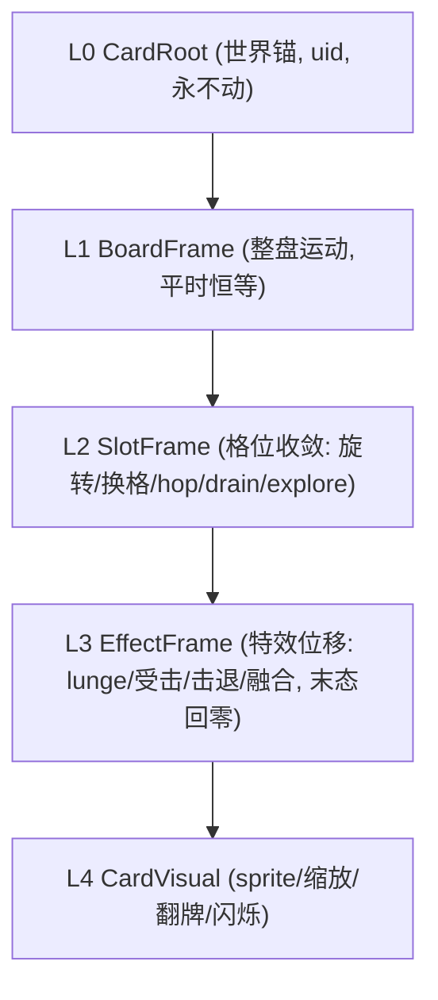

# 表现层收敛范式重构 · 落地方案

范式依据：[多层级代理约束收敛驱动控制-范式设计.md](Assets/Notes/多层级代理约束收敛驱动控制-范式设计.md)

## 已确认边界

- **推进方式**：大爆改（bigbang），最小化新旧双轨脚手架，允许阶段中间态暂不可玩。
- **域范围**：严守文档"范围外"声明。只重构**复杂域＝场上卡**（旋转/hop/补牌/换位/移除/融合/lunge/受击）。净土域（手牌布局、牌库布局、纯战斗黑盒）**内部不动**，仅补 `Evict/Admit` 交接口（C 阶段速度填 0）。
- **Core**：本轮不改。`InBattleManagerSingleton` 表演中途回写 Core（如 `DrainPostRemoveRefillAsync` 调 `FillEmptySlots`）保持现状。"内核重掌控制权"本轮兑现为：表现层不再靠 `SoftAlignBoardAnchorsToCore` 硬 snap 兜底，改由确定性收敛＋栅栏保证就位。Core 编排/黑盒内化留待后续轮次。
- **起点**：自底向上。先五次基元＋塔（EditMode 测护栏），再调度中枢，再逐能力接入，最后切驱动源＋拆旧。
- **初版范围**：一次性落地文档"初版全套"——塔 + 五次 + 栅栏 + 租约纪律 B + 交接 C 阶段 + StepProjector 贴 commitment + 多跳 S/C + 排序离散通道。文档"范围外"项（净土域重写、非位移通道收敛、固定步长时钟、Y 过冲策略、DAG、纪律 C、逐对象飞行排序）本轮不做，仅留升级门。

## 约束红线

- **禁止手改 `.unity`**：卡牌预制体加塔层节点必须走 Unity MCP 或 Editor 装配脚本（参考 [StandardCardPrefabSetup.cs](Assets/Scripts/Cards/Editor/StandardCardPrefabSetup.cs)），不得文本编辑场景/预制体。
- **QFramework 归属**：新塔/收敛/调度/租约代码全部落在 Cards（非内核），**不得使用 QFramework**。Flow 层（`BoardPresentationStepProjector` 等）可沿用现状。
- 改脚本后 `refresh_unity` 并读 Console 确认编译通过。

## 目标塔结构

世界位置 = 各层 local 叠加。L2 与 L3 物理隔离、永不互相 KillMotion。

## 现状靶点（将被替换/删除）

- 病灶控制器（文档点名）：`GroundSlotDealFlightCoordinator`、`GroundSlotDealDecoyTracker`、`CardDeckTween.ChaseAnchorAsync/TrackQuadraticBezierAnchorAsync`、`TryReleaseFlightForHop`。
- 竞争写 world position 的入口（探查已列全）：`CardDeckTween` Move/Hop、`GroundFieldManagerSingleton` Place/Relocate/Move、`SoftAlignBoardAnchorsToCore` 硬 snap 兜底。
- God Object：[InBattleManagerSingleton.cs](Assets/Scripts/Flow/InBattleManagerSingleton.cs)（218KB）的 `DrainPostKillBoardCoreAsync` 直调 `fieldManager.Rotate/Hop/Move` 路径。

## 阶段划分（自底向上，工作量均衡）

### 阶段 0：五次收敛基元（纯逻辑）
- 新建 `ConvergenceCurve`（Cards）：给定 `p0,v0,p1,v1=0,T` 解析唯一五次多项式，`t=T` 精确命中、末速度/加速度=0；支持中途以"当前 local 位置+当前速度"重解（C1 连续）；写成通用标量维度（未来接缩放/透明度）。
- 墙角策略：默认 X 冲刺（纯五次基线）；预留 `ICornerReshapePolicy` 唯一注入点（Y 过冲留门，本轮不实现）。
- EditMode 测试（参考 [DealFlightMathTests.cs](Assets/Scripts/Cards/Tests/DealFlightMathTests.cs) 纯数学范式）：到点必达、C1 重定向连续、墙角冲刺不 NaN、通用维度一致。

### 阶段 1：固定塔 + 单卡 L2 丝滑落格（最小可跑核）
- 新建 `CardTransformTower` 组件：L0-L4 固定命名空节点，编译期定死、永不换父；提供 Editor Gizmo 可视化各层 local（可后置）。
- 预制体改造（Unity MCP / Editor 脚本）：在 [StandardCardPrefabSetup.cs](Assets/Scripts/Cards/Editor/StandardCardPrefabSetup.cs) 基础上插入塔层，`CardVisual` 承载现有 sprite/数值子节点。
- `SpawnView`（[CardManagerSingleton.cs](Assets/Scripts/Cards/CardManagerSingleton.cs)）挂塔。
- 单层收敛驱动器：用 `ConvergenceCurve` 每帧收敛 `L2.localPosition` 到目标 local；变长帧 `Time.deltaTime` 驱动、sourceTime 用墙钟秒（留固定步长升级门）。
- 交接协议：`HandoffState { localPosition, localVelocity }` + `Evict()→HandoffState` / `Admit(HandoffState)`，全域一致接口，C 阶段 `Evict` 速度恒填 0。
- 验收：一张场上卡在 L2 用五次曲线丝滑精确落格。

### 阶段 2：调度中枢（时钟 + 栅格 + 栅栏 + 租约）
- 新建**权威调度时钟**（区别于仅做日志计数的 [DiagBeatClock.cs](Assets/Scripts/Flow/Diagnostics/DiagBeatClock.cs)）。
- 节拍栅格：指令挂 beat，同 beat 共享 sourceTime（整环旋转同曲线/同 startTime/同 sourceTime ⇒ 刚体同步）。
- 就位栅栏：barrier beat 上所有收敛 sourceTime ≤ 栅栏时刻。
- 租约仲裁 `LeaseArbiter`：同步表演申请 lease 独占（卡,层,时间窗）；异步无租约。四象限裁决（异步 vs 异步后发先至；同步持锁拒异步；异步被同步带速度征用；同步撞同步→纪律 B 报警）。按层粒度。
- EditMode 测试（纯逻辑，假时钟/假通道）：栅栏语义、租约四象限、交接往返（C 填 0 / B 透传）。

### 阶段 3a：复杂域格位能力接入（L2）
- 旋转 hop / 换格 / hop / drain 补牌 / explore 补牌 全部改为写 `L2.localPosition` 五次收敛。
- 消灭替身与握手：删除 `GroundSlotDealDecoyTracker`、`TryReleaseFlightForHop`；"换格"退化为改 L2 目标重收敛，零 SetParent。
- [GroundFieldManagerSingleton.cs](Assets/Scripts/Cards/GroundFieldManagerSingleton.cs) 退化为逻辑编排大脑：算汇聚点/长尾预算、向卡的 L2 下发（目标 local + sourceTime），不再直接写 world position。

### 阶段 3b：特效位移 + 融合 + 排序离散通道（L3）
- lunge / 受击 / 击退 / 融合牵引 改写 `L3.localPosition`，末态回零，与 L2 物理隔离。
- 融合：编排大脑算中点 → A/B 各自 L3 收敛到同一世界点（各自反算 local）→ 共享到达时刻同时撞点 → 释放控制权（非 SetParent），交给回库表演器带速度接管。
- 排序离散通道（方案 A）：收敛开始抬全局飞行层，L2 完成事件触发时掉回目标 `sortingOrder`（跳变发生在已就位瞬间）。

### 阶段 4：切换驱动源 + StepProjector 标签 + 拆旧（bigbang 切换点）
- [BoardPresentationStepProjector.cs](Assets/Scripts/Flow/BoardPresentationStepProjector.cs) 给 `BoardPresentationStep` 加 `commitment: Sync/Async` 标签（DTO 在 [CombatHitSink.cs](Assets/Scripts/Cards/CombatHitSink.cs)）+ 多跳 S（串行多 beat 逐跳可见）/ C（合并单 beat 只看终点）投影选择。
- `DrainPostKillBoardCoreAsync`（InBattleManagerSingleton）改为向新调度器供给"带 commitment 的有序 Step[]"这一唯一契约，不再直调 `fieldManager.Rotate/Hop/Move`。
- 一次性删除病灶：`GroundSlotDealFlightCoordinator`、`CardDeckTween.ChaseAnchorAsync/TrackQuadraticBezierAnchorAsync`、`SoftAlignBoardAnchorsToCore` 硬 snap 兜底、相关 `KillMotion` 竞争路径。
- 净土域（手牌/牌库/纯战斗）补 `Evict/Admit`（填 0）接口，内部布局逻辑不动。
- EditMode 测试：扩展 [BoardPresentationStepProjectorTests.cs](Assets/Scripts/Cards/Tests/BoardPresentationStepProjectorTests.cs)（commitment 标签 + S/C 投影 N 个/1 个 Step）。

### 阶段 5：诊断回放 + 打磨
- 纪律 B 报警、就位承诺时刻、beat 对齐写入诊断 sink（PerfLog/CoreLog，见 battlelog-analysis skill），构建可探查、可分析的表演链路回放。
- 清理表现层冗余，收敛为纯工具支持。
- 逐边界磨速度连续（C→B 按需吐真速度）、逐表演贴标签（Sync/Async、多跳 S/C）。

## 主要风险

- **预制体塔改造只能走 MCP/Editor 脚本**，需一张卡验证塔层不破坏现有 sprite/碰撞/数值锚点布局。
- **bigbang 切换点（阶段 4）**是最高风险节点：驱动源切换与病灶删除同批，需在阶段 3 结束时确保所有复杂域能力已在塔上可跑。
- **补牌中途 Core 回写**（`FillEmptySlots`）本轮保留，需确认新收敛路径能吞下"表演中再投影新 Deal"的增量事件。