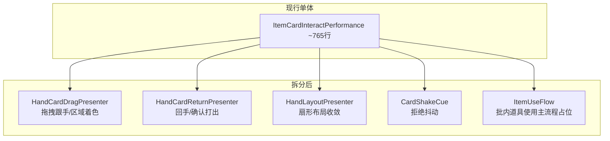
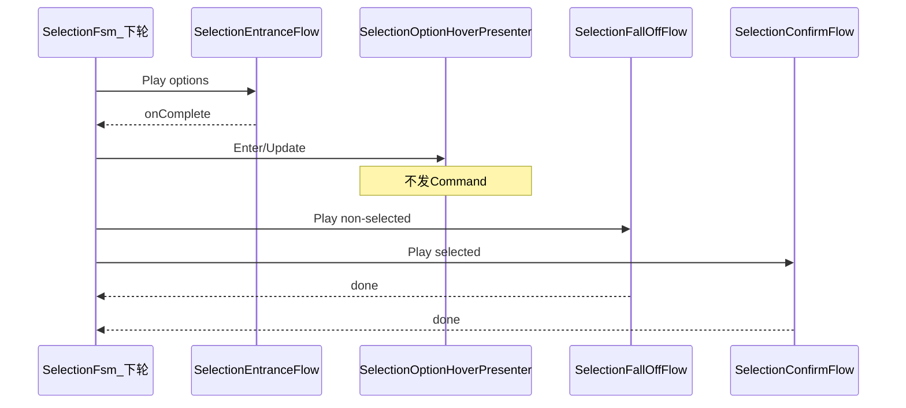
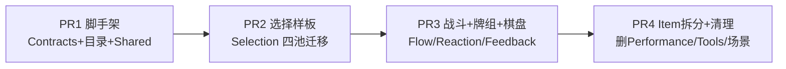

# 表现层表演池拆分改造方案（提前批）

## 1. 现状结论

项目处于 **「Core 契约已闭合 · V1 导演/FSM/Registry 已删 · Unity 表现脊柱未建」** 阶段：


| 区域                                                                                        | 文件量             | 状态                                                                                |
| ----------------------------------------------------------------------------------------- | --------------- | --------------------------------------------------------------------------------- |
| `[NineGrid.Core/Presentation/](Assets/Scripts/NineGrid.Core/Presentation/)`               | 8 类             | **保留不动** — `CoreCommandDispatcher` / `PresentationBatch` / `CoreViewSnapshot` 已测试 |
| `[NineGrid.Presentation/Visuals/](Assets/Scripts/NineGrid.Presentation/Visuals/)`         | 13 类            | **保留不动** — MainScene 已挂 HUD/像素后处理/内容绑定                                            |
| `[NineGrid.Presentation/Performance/](Assets/Scripts/NineGrid.Presentation/Performance/)` | 28 类            | **LEGACY_V1** — Timeline 烘焙 DOTween 黑盒，命名空间/目录与蓝图不符                               |
| `[NineGrid.Presentation/Tools/](Assets/Scripts/NineGrid.Presentation/Tools/)`             | 5 个 PreviewTool | 开发壳，非正式管线；仅选择预览较完整                                                                |


**与第二版蓝图的关键差距**（本轮要解决的）：

- 蓝图用 **五池** 区分职责：`Flow/`*、`Reactions/*`、`Feedback/*`、`Interaction/*`、`Projection/*`
- 现行全部塞进 `Performance/*`，且 `ItemCardInteractPerformance`（~765 行）把 Interaction + Feedback + Layout 揉在一起
- 旧 `[表现层V2清理与落地顺序](Assets/Notes/归档/表现层V2清理与落地顺序-2026-06-25.md)` 仍写 `Effects/`、`PerformanceSO` — **已被你更新的 canvas 取代**（现为 `FlowId`、`PlannedReaction`、`ICueBus`、`IInteractivePresenter`）

**本轮明确不做**（留给后续批次）：

- `ViewRegistry` / `TableNineActorFactory` / `InputLockGate`
- `PerformancePlanBuilder` / `PresentationBatchPlayer`
- 局内 FSM（场地/手牌/选择/牌组）与主流程 `RunSession`
- `CoreCommandDispatcher` 接线、`PresentationFinishedCommand` 握手

---

## 2. 目标目录与命名空间

在 `[NineGrid.Presentation](Assets/Scripts/NineGrid.Presentation/)` 下建立蓝图对齐结构（**仍用单一 asmdef**，避免程序集碎片化）：

```
NineGrid.Presentation/
├── Contracts/          # 本轮最小接口（无实现逻辑）
│   ├── IDirectedFlow.cs
│   ├── ILocalCue.cs
│   ├── IPlannedReaction.cs
│   └── IInteractivePresenter.cs
├── Flow/               # Directed Flow（批内主步骤）
│   ├── Battle/
│   ├── Deck/
│   ├── Board/
│   ├── Selection/
│   └── Item/
├── Reactions/          # Planned Reaction（Flow Marker 或 Builder 编排的副作用）
├── Feedback/         # Local Cue（Flow/FSM 内部手感，Builder 不直调）
├── Interaction/      # Interactive Presenter（输入态，Enter/Update/Exit）
├── Projection/       # 本轮仅迁占位/状态对齐类
├── Shared/           # 跨池工具：CardBattleDirection、SortingLayer、SelectionFanLayout 等
└── Visuals/          # 不动
```

配色契约与蓝图一致：Flow=橙、Reaction=紫、Feedback=青、Interaction=白、Projection=黄、Spine=蓝（下轮）。

---

## 3. 资产迁移对照表（28 → 新池）

### 3.1 Flow（Directed Flow）


| 现行类                                   | 新类名                      | 备注                                  |
| ------------------------------------- | ------------------------ | ----------------------------------- |
| `CardAttackPerformance`               | `CardAttackFlow`         | 内部 `CardHitFlash` 改为调 `HitFlashCue` |
| `CardKillPerformance`                 | `CardKillFlow`           |                                     |
| `CounterattackPerformance`            | `CounterattackFlow`      | 仍委托 `CardAttackFlow`                |
| `CounterattackKillPerformance`        | `CounterattackKillFlow`  | 仍委托 `CardKillFlow`                  |
| `BoardRotatePerformance`              | `BoardRotateFlow`        |                                     |
| `CardDeckEntryPerformance`            | `CardDeckEntryFlow`      |                                     |
| `CardDeckDealCardsPerformance`        | `CardDeckDealFlow`       |                                     |
| `CardDeckSubstitutePerformance`       | `CardDeckSubstituteFlow` |                                     |
| `SelectionOverlayEntrancePerformance` | `SelectionEntranceFlow`  | **选择样板**                            |
| `SelectionOptionConfirmPerformance`   | `SelectionConfirmFlow`   | **选择样板**                            |
| `ItemUsePerformance`                  | `ItemUseFlow`            | 占位保留，接口对齐 `IDirectedFlow`           |


### 3.2 Reactions（Planned Reaction）


| 现行类                                 | 新类名                     | 备注                                       |
| ----------------------------------- | ----------------------- | ---------------------------------------- |
| `DamagePopupPerformance`            | `DamageNumbersReaction` | DNP 逻辑原样                                 |
| `ModifierApplyPerformance`          | `ModifierApplyReaction` | 0s 占位                                    |
| `EffectTriggerPerformance`          | `EffectTriggerReaction` | 0s 占位                                    |
| `CardAcquisitionPerformance`        | `CardAcquisitionFlow`   | 蓝图归 Reactions 池；命名用 `Flow` 后缀与 canvas 一致 |
| `SelectionOptionFallOffPerformance` | `SelectionFallOffFlow`  | 蓝图在 Reactions 组；退场动画                     |


### 3.3 Feedback（Local Cue）


| 现行类                       | 新类名              | 备注                            |
| ------------------------- | ---------------- | ----------------------------- |
| `CardHitFlashPerformance` | `HitFlashCue`    |                               |
| `CardShakePerformance`    | `CardShakeCue`   | 拒绝/受击抖动                       |
| —                         | `AttackTrailCue` | **本轮新建空壳**（蓝图有、代码无；接口就绪，动效后补） |


### 3.4 Interaction（Interactive Presenter）


| 现行类                               | 新类名                             | 备注          |
| --------------------------------- | ------------------------------- | ----------- |
| `CardHoverPerformance`            | `BoardCardHoverPresenter`       |             |
| `SelectionOptionHoverPerformance` | `SelectionOptionHoverPresenter` | **选择样板**    |
| `HandCardLayoutSolver`（删重复份）      | `HandLayoutPresenter`           | 声明式补位，纯布局收敛 |
| `ItemCardInteractPerformance`     | **拆分** → 见 §4                   | 最大改动点       |


### 3.5 Projection（本轮轻迁）


| 现行类                            | 新类名                                                                               | 备注                                                                                                                         |
| ------------------------------ | --------------------------------------------------------------------------------- | -------------------------------------------------------------------------------------------------------------------------- |
| `StatusPanelUpdatePerformance` | `CardStatusProjection` + `BoardStatusProjection`（或暂保留单类 `InGameStatusProjection`） | 动效槽少、偏批末对齐；与 `[TableNineStatusPanelView](Assets/Scripts/NineGrid.Presentation/Visuals/TableNineStatusPanelView.cs)` 分工后续再清 |


### 3.6 Shared（跨池工具，不改行为）

- `CardBattleDirection` / `CardBattleDirectionUtil`
- `CardSortingLayerProfile`
- `SelectionFanLayout` / `SelectionOptionVisual`

---

## 4. 重点拆分：`ItemCardInteractPerformance`

该类混合了蓝图里三个池的职责，本轮按边界拆开（**行为不变，只搬家+薄封装**）：




拆分原则（对齐蓝图注释）：

- **Interaction**：`Enter/Update/Exit/ForceReset`，不发 Command；hover/drag/回手
- **Feedback**：`CardShakeCue.Play` 供拒绝路径调用
- **Flow**：`ItemUseFlow` 仅保留「批内播放壳」占位，供下轮 PlanBuilder 挂接

`CardAcquisitionFlow` 当前复用 Item 的布局/回手参数 — 拆分后改为依赖 `HandLayoutPresenter` + `HandCardReturnPresenter`。

---

## 5. 选择系统：样板拆分（替代 PreviewTool）

`[SelectionOverlayPreviewTool](Assets/Scripts/NineGrid.Presentation/Tools/SelectionOverlayPreviewTool.cs)` 的价值是验证了 **入场 Flow → 悬停 Presenter → 退场 Reaction + 确认 Flow** 串联。本轮：

1. 把四个表演类迁入对应池并改名（§3.1–3.4）
2. **删除整个 PreviewTool 文件**（含热键编排、临时 actor 生成）— 编排逻辑属于下轮 `SelectionFsm`，不属于表演池
3. 用 **EditMode 烟雾测试** 替代 PlayMode 热键：对 `SelectionEntranceFlow` / `SelectionConfirmFlow` 等验证 `Play`/`StopAndRestore` 不抛异常（可选，轻量）

选择簇与蓝图对应关系：




---

## 6. 删除清单


| 删除项                                                                                                                             | 原因                                 |
| ------------------------------------------------------------------------------------------------------------------------------- | ---------------------------------- |
| 整个 `[Performance/](Assets/Scripts/NineGrid.Presentation/Performance/)` 目录                                                       | 迁移完成后空目录                           |
| `[Performance/Layout/HandCardLayoutSolver.cs](Assets/Scripts/NineGrid.Presentation/Performance/Layout/HandCardLayoutSolver.cs)` | 与根下重复，保留一份→`HandLayoutPresenter`   |
| `[Tools/BattlePerformancePreviewTool.cs](Assets/Scripts/NineGrid.Presentation/Tools/BattlePerformancePreviewTool.cs)`           | 用户确认可删                             |
| `[Tools/BoardRotatePreviewTool.cs](Assets/Scripts/NineGrid.Presentation/Tools/BoardRotatePreviewTool.cs)`                       | 同上                                 |
| `[Tools/CardDeckDealPreviewTool.cs](Assets/Scripts/NineGrid.Presentation/Tools/CardDeckDealPreviewTool.cs)`                     | 同上                                 |
| `[Tools/StatusPanelPreviewTool.cs](Assets/Scripts/NineGrid.Presentation/Tools/StatusPanelPreviewTool.cs)`                       | 同上                                 |
| `[Tools/SelectionOverlayPreviewTool.cs](Assets/Scripts/NineGrid.Presentation/Tools/SelectionOverlayPreviewTool.cs)`             | 拆完表演类型后删壳                          |
| `[Visuals/DrumRollDigitDisplay.cs](Assets/Scripts/NineGrid.Presentation/Visuals/DrumRollDigitDisplay.cs)`                       | 已被 `DirectDigitDisplay` 替代；确认无引用后删 |
| `[MovedFrom("AtomicRepresentationTools")]` 属性                                                                                   | 6 个战斗类上的迁移标记，重命名后无用                |
| 整个 `[Tools/](Assets/Scripts/NineGrid.Presentation/Tools/)` 目录                                                                   | 5 个工具删完后为空                         |


**场景清理**（Unity MCP，禁止手改 `.unity`）：

- 从 `MainScene` 移除已挂的 PreviewTool / 旧 Performance 组件（若存在 Missing Script 一并清）
- `PerformancesExamples` 树已在 V1 清理中删除，复核无残留

---

## 7. 最小契约（本轮只定形状，不建注册表）

在 `Contracts/` 引入轻量接口，现有 MonoBehaviour **逐步实现**（不强制一次改完所有 `Play` 签名）：

```csharp
// IDirectedFlow — 批内主步骤
public interface IDirectedFlow {
    bool IsPlaying { get; }
    float ExpectedDuration { get; }
    void StopAndRestore();
}

// IInteractivePresenter — 输入态（蓝图：非 Play 接口）
public interface IInteractivePresenter {
    void Enter();
    void UpdatePresenter();
    void Exit();
    void ForceReset();
}

// ILocalCue — Flow 内部手感
public interface ILocalCue {
    void Play(CueInvocation invocation);
    void StopAndRestore();
}

// IPlannedReaction — Marker 触发
public interface IPlannedReaction {
    bool IsPlaying { get; }
    void StopAndRestore();
}
```

**刻意本轮不建**：`FlowRegistry`、`ReactionRegistry`、`ICueBus` 实现、`PerformancePlanBuilder` — 下轮导演批次再建。

---

## 8. 实施顺序（建议 4 个 PR 粒度）




| 步骤      | 内容                                                                                            | 验收                                             |
| ------- | --------------------------------------------------------------------------------------------- | ---------------------------------------------- |
| **PR1** | 建 `Contracts/`、`Shared/`、空池文件夹；移 `CardBattleDirection` 等                                      | 编译通过                                           |
| **PR2** | 选择簇 5 类迁移 + 删 `SelectionOverlayPreviewTool`                                                   | 编译通过；选择类在新命名空间                                 |
| **PR3** | 战斗/牌组/棋盘 Flow；`HitFlashCue`/`CardShakeCue`/`DamageNumbersReaction`；`BoardCardHoverPresenter`  | `CardAttackFlow` 仍可调 `HitFlashCue`             |
| **PR4** | 拆 `ItemCardInteract`；迁 Projection 占位；删 `Performance/`、`Tools/`、`DrumRollDigitDisplay`；MCP 清场景 | `NineGrid.Core.Tests` 全绿；Unity Console 0 Error |


---

## 9. 文档同步（本轮末尾）

更新/新增（仅必要文档）：

- 新建 `[Assets/Notes/表现层表演池拆分-2026-06-30.md](Assets/Notes/表现层表演池拆分-2026-06-30.md)` — 记录迁移对照与下轮缺口
- 在 `[表现层V2清理与落地顺序](Assets/Notes/归档/表现层V2清理与落地顺序-2026-06-25.md)` 顶部加 **「表演池拆分已完成，导演步骤见新笔记」** 指向
- **不修改** `[Core表现层Command与Event消费清单](Assets/Notes/Core表现层Command与Event消费清单-2026-06-20.md)`（Core 契约未变）

---

## 10. 风险与约束


| 风险                             | 缓解                                                                                           |
| ------------------------------ | -------------------------------------------------------------------------------------------- |
| Unity 序列化断链（`MovedFrom` 仅部分类有） | 重命名时用 `[MovedFrom(true, "NineGrid.Presentation.Performance", null, "OldName")]`；场景组件用 MCP 重挂 |
| `ItemCardInteract` 拆分引入行为回归    | 拆分前记录现有 public API；PR4 单独回归                                                                  |
| 删 PreviewTool 后暂时无法热键看动画       | 下轮 `BatchPlayer` 或 Editor DevScene 补回；本轮以编译+Core 测试为准                                        |
| `AttackTrailCue` 空缺            | 本轮空壳 + TODO，不阻塞迁移                                                                            |


---

## 11. 下轮预告（供审批后排队，不在本轮执行）

1. **脊柱**：`ViewRegistry` + `TableNineActorFactory` + `InputLockGate`
2. **导演**：`PerformancePlanBuilder` → `PresentationPlan`；`PresentationBatchPlayer`
3. **InstructionKind → FlowId 路由表**（39 条 Event 映射的第一版硬编码表）
4. **局内 FSM** + `CoreCommandDispatcher` 接线

---

**本轮交付定义**：`Performance/` 与 `Tools/` 归零；表演资产按蓝图五池就位；`ItemCardInteract` 拆分完成；`Visuals/` 与 `Core/Presentation/` 无行为变更；测试与编译通过。