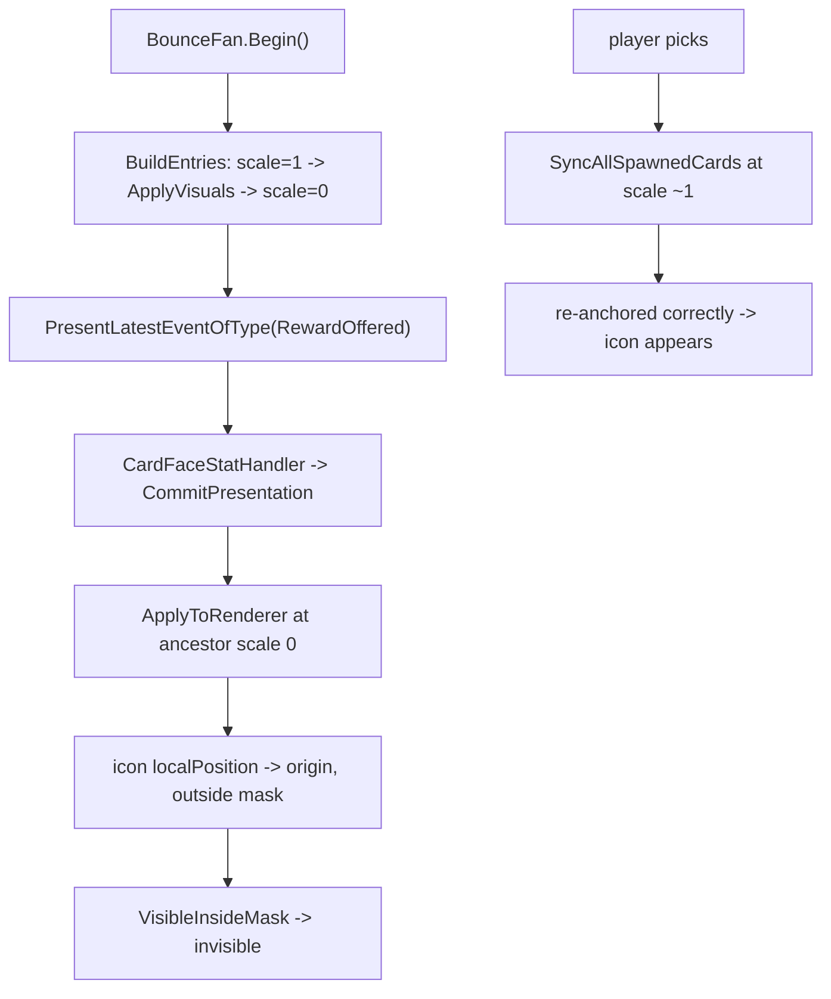

# 遗物选择卡主图案缺失：根因与修复

## 根因（已定位，可解释全部现象）

主视图锚定是**世界空间**算法：

```67:81:Assets/Scripts/NineGrid.Presentation/Cards/Anim/CardMainVisualMaskAnchor.cs
            var maskBounds = GetWorldBounds();
            var targetWorld = ComputeWorldPositionForAnchor(
                visual.transform.position,
                visual.bounds,
                maskBounds,
                mode);

            var parent = visual.transform.parent;
            if (parent == null)
            {
                return targetWorld;
            }

            return parent.InverseTransformPoint(targetWorld);
```

而 `BounceFanChoicePresenter.Begin()` 在把 wrapper 置 0 之后又同步冲刷了一次奖励指令：

```253:294:Assets/Scripts/NineGrid.Presentation/Flow/BounceFanChoicePresenter.cs
                wrapper.transform.localScale = Vector3.one;
                // ... spawn / ApplySorting ...
                CoreCardPresentationMapper.ApplyVisualsByDefId(managed, choiceKind);
                CardMainVisualMaskAnchor.ResyncAllVisibleInsideMasks(managed.View.transform);

                wrapper.transform.localScale = Vector3.zero;
```

```193:198:Assets/Scripts/NineGrid.Presentation/Flow/BounceFanChoicePresenter.cs
            BuildEntries(optionDefIds);
            BattleBeatFlush.PresentLatestEventOfType(
                NineGridArchitecture.Current,
                CoreEventType.RewardOffered);
            PlayEntryAnimation();
```

链路：`PresentLatestEventOfType` → `BattleBeatHook.NotifyPresentStandalone`（同步）→ `CardFaceStatHandler.ApplyOfferReward` → `CommitNumeric` → `ManagedCard.CommitPresentation` → `CardFacePresentationBinder.ApplyPresentation` → `TryPlayIdleOrStatic` → `CardSpriteAnimPlayer.PlayStaticMainIcon` → `CardMainVisualPlacement.ApplyToRenderer`。此时祖先 `localScale = 0`：世界包围盒全塌成一点、`InverseTransformPoint` 退化，主图标 `localPosition` 被写成 ≈ `(offsetX, offsetY, 0)`。

为什么只有遗物坏：

- `Assets/Prefabs/遗物卡标准模版.prefab`：卡面内容整体偏移 `x = -1.21875`；`遗物主图标` 在 `(-1.21875, 0)`、order 35、`m_MaskInteraction: 1`；`主视图Mask` 在 `(-1.2208, 0.4039)`、缩放 `(1.904, 1.524)`。被打回原点 ⇒ 跑出自己的 Mask ⇒ `VisibleInsideMask` 整块消失。
- `Assets/Prefabs/道具卡标准模版.prefab`：所有节点 `x = 0`，`核心图标` 在 `(0, -0.234)`、`主视图Mask` 在 `(0, 0.375)`。同一份损坏落在 Mask 内 ⇒ 帮助卡肉眼正常。
- 名字（order 92）/ 描述（order 96）是 TMP，不吃 SpriteMask ⇒ 照常显示。
- 点选后 `BattleSessionExecutor.PresentRewardChoiceFromCoreAsync` 跑 `CoreCardPresentationMapper.SyncAllSpawnedCards()`（`BattleSessionExecutor.Choice.cs:163`）+ 事件切片重放，那时 scale 已回到 ≈1，定位重算正确 ⇒ 图案「才出现」。

为什么之前几次修没修好：上一次是用 `unity command eval` 直接调 `SelectorManagerSingleton.BeginBounceChoice(...)` 验证的。那条路径事件日志里没有匹配的 `RewardOffered`，**第二次 Commit 不发生**，所以自测必然通过；结构测试 `BounceFan_AppliesVisuals_Before_EntryScaleZero` 只做源码文本比对，也拦不住。



## 修复

### 1. 锚定改为祖先变换无关（真因，主改动）

改 [Assets/Scripts/NineGrid.Presentation/Cards/Anim/CardMainVisualMaskAnchor.cs](Assets/Scripts/NineGrid.Presentation/Cards/Anim/CardMainVisualMaskAnchor.cs)：

- 新增私有 `TryGetLocalToLocalMatrix(Transform node, Transform target, out Matrix4x4 m)`：找 `node` 与 `target` 的最近共同祖先，两侧各自累乘 `Matrix4x4.TRS(localPosition, localRotation, localScale)`，取 `targetSide.inverse * nodeSide`。**全程不碰 `localToWorldMatrix` / `InverseTransformPoint`**，所以 wrapper 的 `scale=0` 与扇形 `localRotation` 都被隔离在共同祖先之上。
- `GetAnchoredLocalPosition` 走新路：把 `spriteMask.sprite.bounds`（Mask 节点局部）经上述矩阵换算到 `visual.transform.parent` 空间；`visual` 内容包围盒用 `Matrix4x4.TRS(visual.localPosition, visual.localRotation, visual.localScale)` 变换 `visual.sprite.bounds`；按 mode 求 delta，返回 `visual.localPosition + delta`。
- `GetSuggestedLocalPosition` 同族一并改（它只有本类内部调用，无外部调用点）。
- `ComputeWorldPositionForAnchor` 保持 `public static` 不动（现有单测在用），只是不再是实例路径的主算法。
- 拿不到共同祖先等退化情况才回退旧世界空间路径。

### 2. 关掉具体窗口 + 拒写坏值（廉价护栏）

- [Assets/Scripts/NineGrid.Presentation/Flow/BounceFanChoicePresenter.cs](Assets/Scripts/NineGrid.Presentation/Flow/BounceFanChoicePresenter.cs)：删掉 `BuildEntries` 末尾多余的 `wrapper.transform.localScale = Vector3.zero;`——`PlayEntryAnimation` 本来就会置 0，删掉后 `RewardOffered` 冲刷落在 scale=1。
- [Assets/Scripts/NineGrid.Presentation/Cards/Anim/CardMainVisualPlacement.cs](Assets/Scripts/NineGrid.Presentation/Cards/Anim/CardMainVisualPlacement.cs)：算出的 `local` 非有限值（NaN / Inf）时直接不写，避免任何未来退化路径把节点甩飞。

### 3. 回归测试（这次要真能复现）

- [Assets/Scripts/NineGrid.Presentation/Tests/Cards/CardMainVisualMaskAnchorTests.cs](Assets/Scripts/NineGrid.Presentation/Tests/Cards/CardMainVisualMaskAnchorTests.cs) 新增：
  - `Anchoring_IsInvariant_UnderZeroScaleAncestor`：按遗物模板的偏移（Mask 在 `x=-1.2208`、缩放 `(1.904,1.524)`；图标在 `x=-1.21875`）搭层级，wrapper `scale=1` 下 `ApplyToRenderer` 记下 localPosition，再把 wrapper 置 `scale=0` 重跑，断言两者相等。**当前必红。**
  - `MainIcon_StaysInsideMask_AfterRecommitAtZeroScale`：断言图标在 `visual.parent` 局部空间的 AABB 落在 Mask AABB 内。
  - 追加一条带 wrapper `localRotation`（扇形旋转）的用例。
- [Assets/Scripts/NineGrid.Presentation/Tests/CardFaceBeatStructuralTests.cs](Assets/Scripts/NineGrid.Presentation/Tests/CardFaceBeatStructuralTests.cs)：`BounceFan_AppliesVisuals_Before_EntryScaleZero` 的源码文本断言会因步骤 2 失效。把它换成不变量表述（`BuildEntries` 内不得出现 `wrapper.transform.localScale = Vector3.zero`），或直接删除、由上面的行为测试接管。

### 4. 顺手清掉上一轮留下的两处内容伤

- `relic.arsenal` → `Assets/Arts/Images/Png/Icons/white_node/rook.png#rook`、`relic.tower_child` → `.../checkerboard.png#checkerboard`：这两条**不在 `/Resources/` 下**。`CardPresentationSpritePath.LoadSprite` 只有 Editor 走 `AssetDatabase`，出包只认 `/Resources/`（ADR-0008），所以这两个遗物在 Player 包里会是空图标。把两张 PNG 复制进 `Assets/Resources/ContentArt/Png/Icons/white_node/`，JSON 改指 Resources 路径，与其余 5 张一致（`Assets/Arts/ContentVisual/cards/` 与 `Assets/StreamingAssets/ContentVisual/cards/` 两处同步）。
- `relic.blood_shockwave` 的 `mainIcon` 仍为空串，上一轮被跳过；需要你指定一张图，或明确接受走模板兜底。
- 可选：上一轮在 `CoreCardPresentationMapper.TryApplyLegacyRelicIcon` / `ContentIconSlotBinder.TryLoadLegacyRelicIcon` 加的 `RelicVisualCatalog` 回退，与 ADR #69「表现只读一卡一文件 JSON、不再咨询 VisualCatalog SO」相冲，且 JSON 补齐后已是死代码。建议撤掉并回滚 `docs/code-map/presentation.md` 里那句回退描述（此项等你点头再动）。

## 验收

1. `.cursor/skills/ai-workspace` claim；`unity command recompile` 后 `unity command console` 无新增 Error / Exception / Assert。
2. EditMode 经 `ai-workspace test`：`CardMainVisualMaskAnchorTests`、`CardPresentationCommitTests`、`CardFaceBeatStructuralTests`、`CardFaceBeatCommitBaselineTests` 全绿（新测试改前必红、改后转绿要留证据）。
3. PlayMode **必须走真实奖励流程**（`BattleSessionExecutor.PresentRewardChoiceFromCoreAsync`，即真打到奖励节点），**不许**再用 `sel.BeginBounceChoice(...)` 自测——那条路径没有 `RewardOffered`，等于绕开缺陷。入场动画期间（点选之前）截图确认三张遗物卡都有主图案。
4. 探针留证：在 `RewardOffered` 二次 Commit 当拍打印 `wrapper.lossyScale`、`遗物主图标.localPosition`、图标与 Mask 的局部 AABB，确认修复前后差异。

## 文档同步（按 code-map 规则）

- [docs/code-map/presentation.md](docs/code-map/presentation.md)：把 BounceFan 那句改成新不变量——「卡面主视图锚定为祖先变换无关的局部空间计算；BounceFan 不得在 scale=0 期间提交卡面」。
- 建议新增一条短 ADR 锁死长期不变量：**卡面槽位定位不得依赖世界变换**（入场/悬停/退场/死亡缩放都会破坏世界空间锚定），并在 code-map 引用编号。