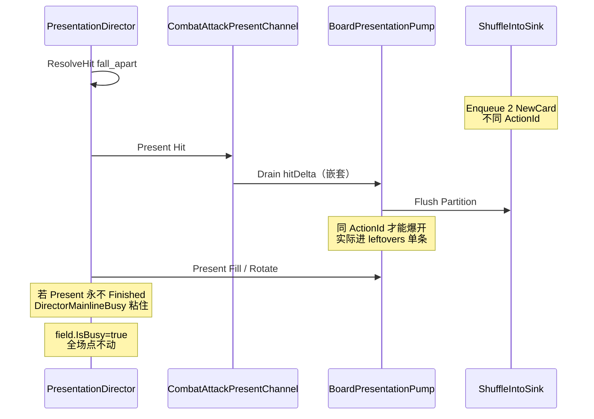

# 骷髅爆开不可见 + 全局卡死：根因与修复

> **状态：暂存。** 先对照 issue 规划后再决定执行范围。

## 与 #2 路线图对照：残留清理在不在预期里？

**在，而且分两层——本票卡死命中的是「切片拆旧」层，不是终态硬切层。**


| 层级     | Issue / 阶段                                                    | 预期清理什么                                                                                       | 当前状态                                  | 与本次 bug 关系                                                     |
| ------ | ------------------------------------------------------------- | -------------------------------------------------------------------------------------------- | ------------------------------------- | -------------------------------------------------------------- |
| Spec   | [#2](https://github.com/tja688/Ninegrid-Gambit/issues/2)      | 逐流程迁入 → **验收后拆该流程旧路径** → 全迁完再硬切；明确风险「新旧共存交叉污染」；US28 收口 `PresentationLocked`/`IsBusy` 到「主线在跑」 | OPEN                                  | 卡死正是交叉污染症状                                                     |
| 承重切片拆旧 | [#5](https://github.com/tja688/Ninegrid-Gambit/issues/5)      | AC：收编战斗 rig **与板面队列**；**该路径旧编排拆除**；Fill/Rotate 只走导演 Batch+ack                                | OPEN · `ready-for-human`（实现评论有，AC 未勾） | **Hit Present 仍嵌套 `DrainPostKillBoard` = #5 拆旧未做完**，不应推到 #11   |
| 洗回     | [#8](https://github.com/tja688/Ninegrid-Gambit/issues/8)      | 洗回只经导演 sink；旧 Forget 旁路不可达；人眼还原门                                                             | CLOSED · 人眼门未勾                        | 爆开分组键错误 = **#8 落地缺陷**，路线图未单列「炸牌」                               |
| 融合     | [#7](https://github.com/tja688/Ninegrid-Gambit/issues/7)      | 融合只经导演；拆旧                                                                                    | CLOSED                                | Purge 全历史 ResultUid 更像 #7/#8 边界瑕疵                              |
| 终态硬切   | [#11](https://github.com/tja688/Ninegrid-Gambit/issues/11)    | 删净旧三套、God Object 瘦身、诊断 sink；blocked by #10                                                   | OPEN                                  | **全量删 `PresentationLocked`/旧泵** 在这里；但 **攻击路径双重 Drain 不应等 #11** |
| 计划文档   | [表演编排统一时间线重构](.cursor/plans/表演编排统一时间线重构_f1ba353d.plan.md) 阶段2 | 「收编 FieldBattleManager rig 与 `_boardPresentationQueue`；拆旧」                                   | 与 #5 对齐                               | 与根因 2 同靶点                                                      |


结论：

1. **残留清理在预期内**：#2 决策 8 + US45 + 阶段5/#11 = 终态删净；**每条垂直切片自己的拆旧**在 #4/#5/#6/#7/#8/#9 各自 AC。
2. **本次卡死对应的残留，预期应在 #5 拆旧完成时清掉**（板面队列仍被 Hit Present 旁路调用 = 未收编干净）。现在 #5 仍 `ready-for-human`，说明人眼/拆旧门未过——与日志吻合。
3. **#11 不能当挡箭牌**：#11 是全流程迁完后的硬切；攻击路径上「导演 + 旧 Drain 双写」属于迁移期 **交叉污染**，#2 Further Notes 已点名为主要风险。
4. **爆开不可见不在「残留清理」规划里**：是 #8 之上新增炸牌分组逻辑与 Core `Sequence`→多 ActionId 语义不匹配，属功能/验收缺口。

### 建议执行边界（暂存后的默认）

- **可立刻修（不抢 #11）**：A 爆开分组 + B Purge 范围 + C 中「导演 Hit 去掉嵌套 Drain / 洗回 Flush 时机」——这是在补完 **#5/#8 未闭合的拆旧与还原门**。
- **留给 #11**：把 `PresentationLocked` 与各 `IsBusy` 彻底收成唯一 `DirectorMainlineBusy`、删掉 `_boardPresentationQueue` 整泵、InBattleManager 瘦身。
- **泵加固 / 诊断 ack 埋点**：可作 #5 人眼门的防护网，或记到 #11 诊断 sink；不必单独开票。

## 日志结论（stem: `QuickTest-20260719-212545-seed1`）


| 现象       | 证据                                                                                                   |
| -------- | ---------------------------------------------------------------------------------------------------- |
| 声称入导演    | `ShuffleIntoDeck/EnqueuedForDirector count=2`（tMs=30848）                                             |
| **从未炸牌** | 全程 **0** 条 `ShuffleBurstScatter`                                                                     |
| 只播了单条洗回  | `PresentBegin/End count=1` + `DeckTween.Move` 单卡飞入组                                                  |
| 卡死       | 旋转结束后仅剩 `InputGateBlocked reason=fieldBusy`（约 24s）；`GroundFieldManager.IsBusy` 在 `PresentationLocked |


同日另一局 `212425` 无洗回事件也出现长时间 `fieldBusy` 挡输入，说明卡死不只绑在爆开，而是**导演攻击盘面 Present / 盘面泵**路径上的锁步问题；散架只是高频触发点。




## 根因 1（爆开不可见）：分组键与 Core 语义不匹配

`[skill.fall_apart.remove](Assets/Scripts/NineGrid.Foundation/NineGrid.Content/Catalog/TableNineContentCatalog.cs)` 是 `Sequence` 两个 `ShuffleInto`。  
`[SequenceEffectAction](Assets/Scripts/NineGrid.Foundation/NineGrid.Core/Effects/EffectAtomLibrary.cs)` 展开为 **两个** `ShuffleIntoDrawPileAction`，`[ActionPipelineSystem.ResolveAction](Assets/Scripts/NineGrid.Foundation/NineGrid.Core/Systems/ActionPipelineSystem.cs)` 各分配独立 `ActionId`。

但 `[ShuffleBurstGrouper](Assets/Scripts/Flow/Presentation/ShuffleBurstGrouper.cs)` 要求 **同 ActionId 且 N≥2** 才进 `[CardBurstScatterIntoDeckPresenter](Assets/Scripts/Cards/CardBurstScatterIntoDeckPresenter.cs)`。  
散架在运行时几乎**永远进 leftovers**，人眼只看到（或看不到）单条飞入，没有圆周爆开。

单测 `[ShuffleBurstGrouperTests](Assets/Scripts/Flow/Tests/Editor/ShuffleBurstGrouperTests.cs)` 用手工相同 ActionId 造绿，**未覆盖 Sequence 真实 ActionId 分裂**。

**次要丢失**：`Enqueued count=2` 却 `PresentBegin count=1`。可疑点：`[BuildFusionDrainState](Assets/Scripts/Flow/InBattleManagerSingleton.cs)` 对 EventLog **从 0 扫全历史** fusion，`PurgeFusionResultsFromShuffleQueue` 可能按旧 `ResultUid` 误删新洗入（uid 复用时）。

顺便检查：爆开的卡检查显示oder层级，看是不是被场地遮盖，检查显示情况

## 根因 2（卡死）：导演 Hit Present 仍嵌套盘面 Drain，主线易挂死

攻击已迁导演（[#5](https://github.com/tja688/Ninegrid-Gambit/issues/5) / `[AttackIntentScriptFactory](Assets/Scripts/Flow/Presentation/AttackIntentScriptFactory.cs)`：Hit → Fill → Rotate），但 `[PlayDirectorAttackHitCoreAsync](Assets/Scripts/Cards/FieldBattleManagerSingleton.cs)` 在击杀/未击杀时仍：

```csharp
await DrainCombatHitBoardDeltaFromProjectionAsync(...); // → DrainPostKillBoardAsync → 盘面泵
```

同时 Fill/Rotate 的 `[QueuedBoardPresentChannel](Assets/Scripts/Flow/Presentation/QueuedBoardPresentChannel.cs)` 再次 `DrainPostKillBoardAsync`。  
Hit 通道不 Flush 洗回；洗回靠盘面 Drain 开头的 `FlushPendingShuffleIntoPresentationAsync`（[#8](https://github.com/tja688/Ninegrid-Gambit/issues/8)）。

卡死症状与 `[PresentStep](Assets/Scripts/Flow/Presentation/BatchLockstepSteps.cs)` 长期 `Continue`（`!IsComplete` 或 `!TryAcknowledge`）一致 → `DirectorMainlineBusy` 粘住 → 全场 `fieldBusy`。

## 修复方案（按优先级）

### A. 修好爆开分组（不改 Core ActionId）

改 `[ShuffleBurstGrouper.Partition](Assets/Scripts/Flow/Presentation/ShuffleBurstGrouper.cs)`：

- 可爆条目优先按 `**TriggerCardUid`（>0）** 分桶；同触发源、同一次 Flush、N≥2 → 炸牌组
- `TriggerCardUid==0` 时再回退 `ActionId`（兼容旧单测/传送等）
- Scanner 已能回退扫描 `EffectTriggered` 填 `TriggerCardUid`，散架两条应同触发 uid

补测：

- `Partition_FallApartStyle_DifferentActionId_SameTrigger_Bursts`
- 保留原同 ActionId 用例

### B. 收紧 fusion Purge 范围

`[BuildFusionDrainState](Assets/Scripts/Flow/InBattleManagerSingleton.cs)` / Purge：只 purge **本批** `removedInBatch` 相交的 fusion `ResultUid`，禁止用全历史 `Collect(entries, 0)` 的 ResultUid 扫 sink。

### C. 解开导演 Hit 与盘面泵双重 Drain（卡死主修）

在 `PlayDirectorAttackHitCoreAsync`（导演路径）：

- **击杀**：只做 lunge / MarkFieldDead / Vacate / 尸体离锚；**删除** `DrainCombatHitBoardDeltaFromProjectionAsync`（注释已写 Fill/Rotate 由导演驱动）
- **未击杀**：盘面 delta 若仍须在命中帧表现，改为只投影进 Hit 批已有摘要，或明确由后续板 Present 播；避免 Hit 内再 `await DrainPostKillBoardAsync`
- 洗回：在 Hit Present 末尾（lunge 后）**增加一次** `FlushPendingShuffleIntoPresentationAsync`，使散架爆开与击杀同拍，不等到 Fill

同步加固盘面泵（防 Completion 永挂）：

- `EnsureBoardPresentationPumpRunning`：若 `pumpRunning` 但队列非空且泵逻辑上已退出，允许重启；或在 `finally` 里 `while (queue.Count>0)` 排空后再清标志
- Present 完成路径打 Perf：`DirectorPresentAck` / `PresentationLock` begin-end，便于下次验门

### D. 回归与验收

- EditMode：`ShuffleBurstGrouperTests` + 可选垂直切片「fall_apart 两条不同 ActionId → 出现 BurstScatter 记录点」
- Play（骷髅牌组 QuickTest）：击杀大骷髅  
  - Perf 必现 `ShuffleBurstScatter PresentBegin/End`  
  - 人眼圆周散开再入组  
  - 结束后可继续点击；BusySnapshot 在 idle 时 `presentationLocked=false` 且 `DirectorMainlineBusy` 不粘

## 关键改动文件

- `[Assets/Scripts/Flow/Presentation/ShuffleBurstGrouper.cs](Assets/Scripts/Flow/Presentation/ShuffleBurstGrouper.cs)`
- `[Assets/Scripts/Flow/Tests/Editor/ShuffleBurstGrouperTests.cs](Assets/Scripts/Flow/Tests/Editor/ShuffleBurstGrouperTests.cs)`
- `[Assets/Scripts/Cards/FieldBattleManagerSingleton.cs](Assets/Scripts/Cards/FieldBattleManagerSingleton.cs)`（导演 Hit 去嵌套 Drain）
- `[Assets/Scripts/Flow/InBattleManagerSingleton.cs](Assets/Scripts/Flow/InBattleManagerSingleton.cs)`（Hit Flush 洗回、Purge 范围、泵加固）

**不改** Core / `.unity`；QFramework 内核逻辑不动，只修 Flow/Cards 表现编排。

## 假设排序（已用日志部分证伪/证实）

1. **已证实**：ActionId 分组导致无爆开
2. **高概率**：Hit 嵌套 Drain + 导演 Fill/Rotate → Present 挂死 → `DirectorMainlineBusy` 卡死
3. **中概率**：全历史 fusion Purge 吃掉第二条洗入（解释 count=2→1）
4. **低概率**：收敛/`deck.IsBusy` 无超时死等（本局 PresentEnd 已打出，非主因）

