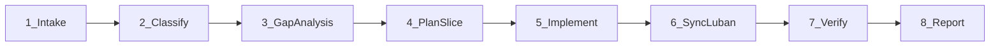
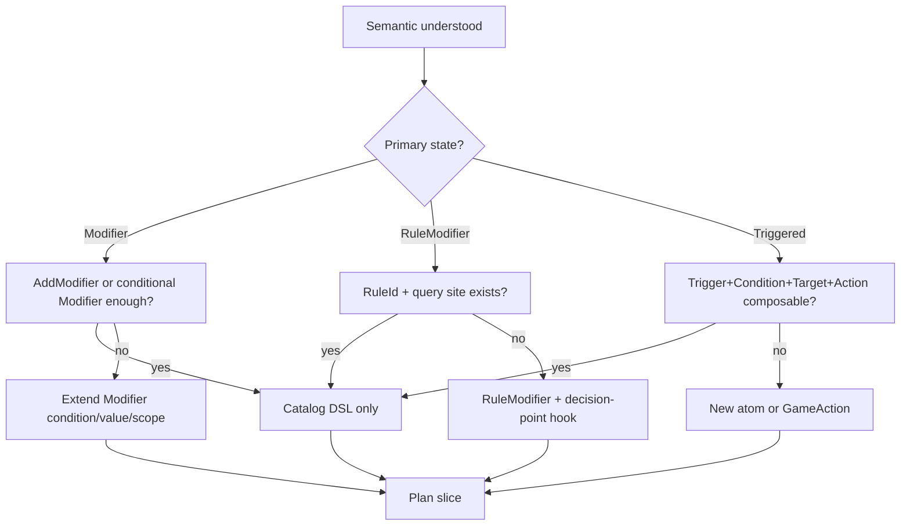

# Landing Workflow — Full Stack

Use for **落地 / 实现** requests. Default mode of `table-nine-effect-landing`.

## Overview



---

## Step 1 — Intake

1. Resolve effect id(s) from user request (`skill.xxx`, `help.xxx.pending`, etc.).
2. Read container rules in `Assets/Docs/九宫牌局/01-机制规则/效果类型隔离规范.md`.
3. Find catalog row:

```powershell
rg -n "skill\.example|help\.example" Assets/Scripts/NineGrid.Content/Catalog/TableNineContentCatalog.cs
```

4. Read design doc line if catalog `design_text` is thin:

```powershell
rg -n "效果【类型" Assets/Docs/九宫牌局 -g "*.md"
```

5. Lookup: `EffectAtomLibrary`, existing similar effects, related `GameAction`, `RuleModifier` consumers.

---

## Step 2 — Classify (output before editing)

Fill `references/effect-taxonomy.md` template. Minimum user-visible summary:

- Container + lifecycle
- Primary state: `Modifier` | `RuleModifier` | `Triggered`
- Trigger / conditions / target / actions
- Compose vs extend decision

---

## Step 3 — Gap Analysis



Cross-check `references/pending-gaps.md` for the capability cluster.

**Compose-first** — see `effect-taxonomy.md` table.

If blocked, state the **smallest reusable capability** missing (not the effect name).

---

## Step 4 — Plan Slice

State in 3–6 bullets:

- Effect ids to convert
- Files to touch (use `file-touch-map.md`)
- New atoms/rules/actions (if any)
- Test method(s) to add or extend
- Whether pending gate count changes (should decrease or stay same)

If >3 new Core files needed, confirm slice with user unless they scoped one effect with full-stack intent.

---

## Step 5 — Implement

### Catalog-only path

1. Add `Impl(...)` effect row(s) in `AddEffects` with `Triggered`/`Modifier`/`RuleModifier` JSON.
2. Replace `Pending(c, ...)` reference on card/skill/relic with implemented effect id(s).
3. Remove or stop referencing pending id on container.

Example pattern (monster skill):

```csharp
c.AddEffect(Impl("skill.example.effect", EffectContainerType.MonsterSkill,
    Triggered("skill.example.effect", "MonsterSkill",
        "{\"atom\":\"OnMoveToSlot\",\"slot\":1,\"target\":\"Self\"}",
        "{\"atom\":\"Player\"}",
        "{\"atom\":\"DealDamage\",\"amount\":2,\"actor\":\"Self\"}"),
    "[场上] ..."));

Skill(c, "skill.example", "名称", EffectContainerType.MonsterSkill, "描述")
    .AddEffect("skill.example.effect");
```

### Extend capability path

Follow `file-touch-map.md`:

| Change | Files |
|:--|:--|
| New trigger/condition/target/action | `EffectAtomLibrary.cs`, `EffectAtomSchemas.cs` |
| New RuleModifier | registry + consumer (`DealDamageAction`, `CanInteractQuery`, …) |
| New GameAction | `Domain/Actions/`, pipeline hook, EventLog event |
| Tests | `P5EffectSystemTests` (atoms), `P2`/`P3` (rules/actions), `P6ContentLandingTests` (catalog) |

**Validate-first bias:** add failing test for missing behavior when adding Core surface.

### Architecture discipline

- All mutations via `GameAction` pipeline
- QFramework: `this.GetModel`, `this.GetSystem` in Systems/Commands
- No Presentation logic in Core
- Deterministic RNG via `IRngUtility`

---

## Step 6 — Sync Luban

After catalog changes:

1. Export: Unity menu `TableNine/Content/Export Hardcoded Catalog To Luban Datas`  
   (or `TableNineLubanDataExporter.Export`)
2. Generate: `.\Assets\Tools\Luban\gen_table_nine.ps1`
3. Expect `P6LubanContentTests.BatchEightGeneratedLubanCatalogMatchesHardcodedDefaultCatalog` to pass

---

## Step 7 — Verify

Run `references/verification-checklist.md` in order.

Minimum for catalog-only landing:

- Unity compile clean
- New/extended P6 test for the effect behavior
- `P6ContentLandingTests` pending gate still satisfied
- Luban parity test green

Minimum for Core changes:

- Above + P5/P2/P3 targeted tests
- `check-core-guards.ps1`
- Full `NineGrid.Core.Tests` EditMode

---

## Step 8 — Report

Use SKILL.md report shape. Include:

- Whether composition or new capability was used
- Exact `AssertImplemented` ids if gate test updated
- Pending count delta

Do not update batch plan notes unless user asks.

## Test Patterns

### Catalog DSL smoke

```csharp
var json = P5CatalogTestSupport.RequireEffectJson("skill.example.effect");
var instance = P5CatalogTestSupport.ActivateCatalogEffect(architecture, "skill.example.effect", owner);
```

### Pipeline behavior (monster skill)

See `P6ContentLandingTests.MonsterComposableBatchNineCatalogDslHandlesMovementAndRemovalSkills` — spawn card, move, run pipeline, assert HP/events.

### Gate assertion

```csharp
AssertImplemented(catalog, report, "skill.example.effect");
Assert.LessOrEqual(report.PendingEffectIds.Count, expectedMax);
```

When converting pending → implemented, decrement `expectedMax` in gate test if user wants a tightening gate.
