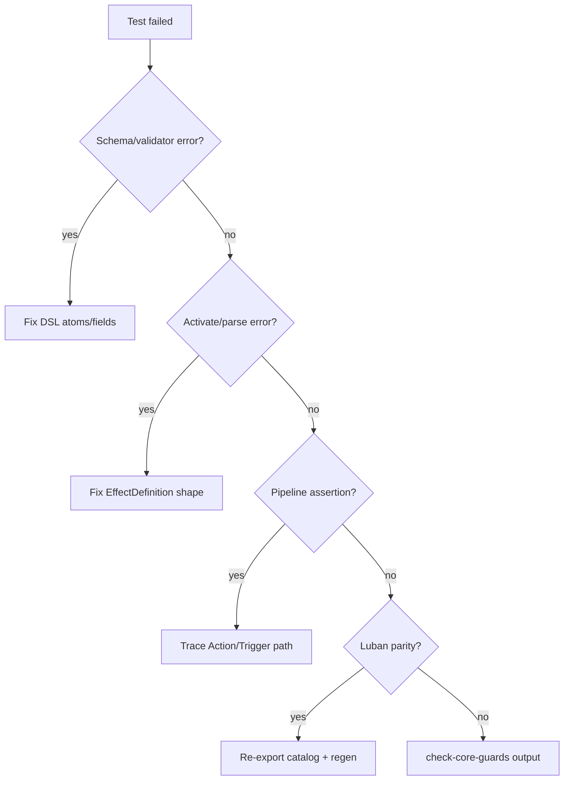

# Verification Checklist

Run after every full-stack landing. Check boxes in order; stop and fix on first failure.

## 1. Compile

- [ ] Unity MCP: refresh / import assets, wait for compile
- [ ] `read_console` — no errors (obsolete warnings OK if pre-existing)

If Unity MCP unavailable: run `NineGrid.Core.Tests` EditMode in Unity Test Runner.

## 2. Schema / Catalog Validity

- [ ] `ContentSystem.ValidateCatalog()` passes (see `ContentCatalogValidationTests.DefaultCatalog_ValidateCatalog_IsValidWithNoPendingEffects`)
- [ ] New effect JSON uses only known atoms (`EffectValidator` via `ValidateCatalog` or narrow regression test)
- [ ] No `PendingAtom` row marked `Implemented` with empty JSON

Quick manual:

```csharp
var report = content.ValidateCatalog();
Assert.IsTrue(report.IsValid, ...);
Assert.AreEqual(0, report.PendingEffectIds.Count);
```

## 3. Narrow Behavior Test

- [ ] New or extended test method for **this effect** (required per landing)
- [ ] Test name recorded in report

| Change type | Preferred test file |
|:--|:--|
| Catalog DSL only | `ContentCatalogValidationTests` + effect-specific regression (e.g. `OnBattleFilterRegressionTests`) |
| Atom / validator | Narrow test in `NineGrid.Core.Tests` targeting the atom |
| Stat / modifier | Stat pipeline regression in `NineGrid.Core.Tests` |
| GameAction / pipeline | Action/pipeline regression in `NineGrid.Core.Tests` |

Patterns:

- `ContentCatalogValidationTests` — full catalog `ValidateCatalog()` gate
- `OnBattleFilterRegressionTests` / `FallingRocksDeckGateRegressionTests` — BattleLog or catalog JSON → EditMode integration
- Seeded RNG when random targets involved

## 4. Content Gates

After catalog change:

- [ ] `ContentCatalogValidationTests` green (`IsValid && PendingEffectIds.Count == 0`)
- [ ] Converted ids appear in catalog as `Implemented` with non-empty JSON

## 5. Luban Parity (catalog changed)

- [ ] Export hardcoded → `Assets/Tools/Luban/Datas`
- [ ] `.\Assets\Tools\Luban\gen_table_nine.ps1` succeeds
- [ ] StreamingAssets `tablenine_tbeffect.json` matches changed rows

## 6. Architecture Guards (Core changed)

- [ ] `.\Assets\Notes\CI\check-core-guards.ps1` passes (if present)

## 7. Full EditMode Suite (Core or pipeline changed)

- [ ] Unity MCP: run `NineGrid.Core.Tests` EditMode — all green
- [ ] Or: Unity Test Runner → NineGrid.Core.Tests

Catalog-only changes: `ContentCatalogValidationTests` + narrow regression + full suite recommended.

---

## Failure Triage Order



1. **Schema** — read `EffectValidationResult` first issue string
2. **Activate** — `EffectSystem.ParseJson` / `Activate` exceptions
3. **Runtime** — EventLog sequence, HP/armor/slot state; compare to similar golden test
4. **Parity** — diff hardcoded vs Luban effect row for changed ids
5. **Guards** — asmdef layering, forbidden references

## Commands Summary

```powershell
.\Assets\Tools\Luban\gen_table_nine.ps1
```

Unity MCP preferred when editor is open: `refresh_unity` → `read_console` → `run_tests` (NineGrid.Core.Tests EditMode).

## Done Criteria

Landing is **not done** until:

- Relevant test names and pass/fail are reported
- Pending movement is explicit (converted id listed, or justified why still pending)
- Luban parity green if catalog touched
- No new compile errors
