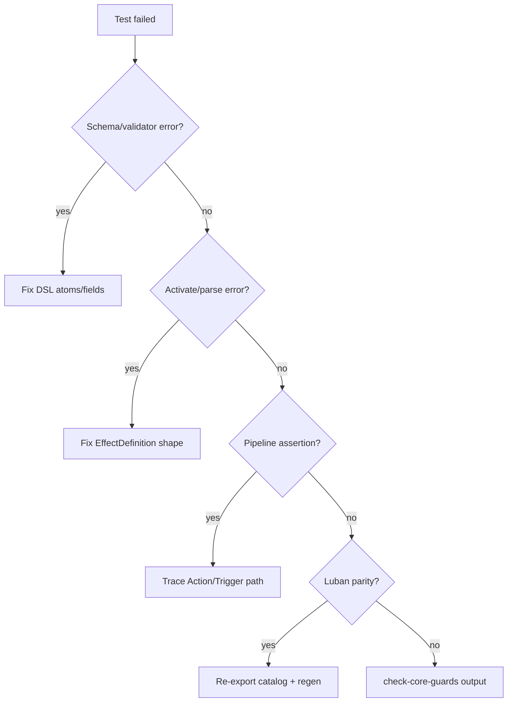

# Verification Checklist

Run after every full-stack landing. Check boxes in order; stop and fix on first failure.

## 1. Compile

- [ ] Unity MCP: refresh / import assets, wait for compile
- [ ] `read_console` — no errors (obsolete warnings OK if pre-existing)

If Unity MCP unavailable: `.\Assets\Notes\CI\run-core-tests.ps1` will surface compile failures.

## 2. Schema / Catalog Validity

- [ ] `ContentSystem.ValidateCatalog()` passes (see `P6ContentLandingTests.DefaultCatalogValidatesImplementedDslAndTracksLongTailAtoms`)
- [ ] New effect JSON uses only known atoms (`EffectValidator` / `P5EffectSystemTests`)
- [ ] No `PendingAtom` row marked `Implemented` with empty JSON

Quick manual:

```csharp
var report = content.ValidateCatalog();
Assert.IsTrue(report.IsValid, ...);
```

## 3. Narrow Behavior Test

- [ ] New or extended test method for **this effect** (required per landing)
- [ ] Test name recorded in report

| Change type | Preferred test file |
|:--|:--|
| Catalog DSL only | `P6ContentLandingTests` |
| Atom / validator | `P5EffectSystemTests` |
| Stat / modifier | `P2StatPipelineTests` |
| GameAction / pipeline | `P3ActionPipelineTests` |

Patterns:

- `P5CatalogTestSupport.RequireEffectJson(id)` — schema + implemented gate
- `ActivateCatalogEffect` + pipeline `RunToCompletion` — runtime behavior
- Seeded RNG when random targets involved

## 4. Content Gates

After catalog change:

- [ ] `P6ContentLandingTests.DefaultCatalogKeepsBatchSevenPendingGateAndConvertedEffectsImplemented`
- [ ] Converted ids appear in `AssertImplemented` list if gate should track them
- [ ] `PendingEffectIds.Count` ≤ gate threshold (32 at batch-8 closeout, lower after conversions)

## 5. Luban Parity (catalog changed)

- [ ] Export hardcoded → `Assets/Tools/Luban/Datas`
- [ ] `.\Assets\Tools\Luban\gen_table_nine.ps1` succeeds
- [ ] `P6LubanContentTests.GeneratedLubanTablesCanFeedContentSystem`
- [ ] `P6LubanContentTests.BatchEightGeneratedLubanCatalogMatchesHardcodedDefaultCatalog`

## 6. Architecture Guards (Core changed)

- [ ] `.\Assets\Notes\CI\check-core-guards.ps1` passes

## 7. Full EditMode Suite (Core or pipeline changed)

- [ ] Unity MCP: run `NineGrid.Core.Tests` EditMode — all green
- [ ] Or: `.\Assets\Notes\CI\run-core-tests.ps1`

Catalog-only changes: narrow P6 + full suite still recommended if time permits.

---

## Failure Triage Order



1. **Schema** — read `EffectValidationResult` first issue string
2. **Activate** — `EffectSystem.ParseJson` / `Activate` exceptions
3. **Runtime** — EventLog sequence, HP/armor/slot state; compare to similar golden test
4. **Parity** — diff hardcoded vs Luban effect row for changed ids
5. **Guards** — asmdef layering, forbidden references

## Commands Summary

```powershell
.\Assets\Notes\CI\check-core-guards.ps1
.\Assets\Tools\Luban\gen_table_nine.ps1
.\Assets\Notes\CI\run-core-tests.ps1
```

Unity MCP preferred when editor is open.

## Done Criteria

Landing is **not done** until:

- Relevant test names and pass/fail are reported
- Pending movement is explicit (converted id listed, or justified why still pending)
- Luban parity green if catalog touched
- No new compile errors
