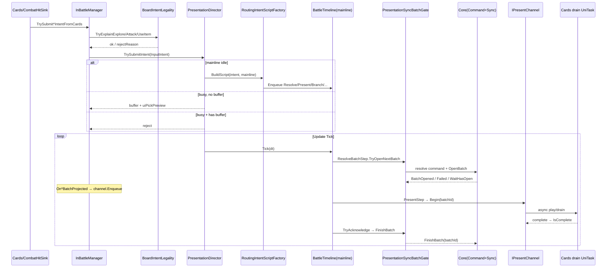

# 表现时间线（Presentation）

> 覆盖 `Assets/Scripts/Flow/Presentation/**`。权威链路以源码为准。

---

## 输入意图 → 时间线 → 通道 → ACK（代码事实）

### 协作要点（Director ↔ Channel）

1. **Director 不直接碰 Cards**。它只拥有主线/旁路 `BattleTimeline`，经 `IIntentScriptFactory` 入队 `ITimelineStep`。
2. **Channel 不直接发 Core 命令**。解算在 `ResolveBatchStep` → `IPresentationBatchGate.TryOpenNextBatch`；工厂在 resolve 回调里投影并 `Enqueue` 到 Channel。
3. **PresentStep 是 ACK 唯一时序点**：`Begin` → 等 `IsComplete` → `TryAcknowledge(batchId)`（映射 `IPresentationSyncSystem.FinishBatch`）。ACK 失败则 Continue 并可能 `DirectorTrace.PresentStall`。
4. **忙真相**：仅 `IsMainlineBusy`（旁路 `StartBypass` 不占输入互斥）。缓冲策略：忙时最多一条；已有缓冲则拒绝。
5. **运行时宿主**：`InBattleManagerSingleton.EnsurePresentationDirector` 装配全部真实 Channel drain 委托；EditMode 可注入瞬时 Channel。

### 三条垂直切片剧本（工厂）

| Kind | 工厂 | 主线骨架 |
|------|------|----------|
| `explore` | `ExploreIntentScriptFactory` | ClickEmpty Present → Fill Present → Rotate Present →（融合）FusionRefill… |
| `attack` | `AttackIntentScriptFactory` | CombatHit Present → `AttackPostHitBranch`：击杀则 Fill/Rotate/Fusion；否则 Counter CombatHit Present |
| `useItem` | `UseItemIntentScriptFactory` | ApplyUseItem Present → Branch：击杀 Fill/Rotate/Fusion；否则可选 DrainRefill |

`RoutingIntentScriptFactory`：按注册顺序调用子工厂；未识别 kind 的子工厂 no-op。

---

## PresentationDirector

| 成员 | 事实 |
|------|------|
| 构造 | `IIntentScriptFactory` 必填；可选 `IUiPickPreviewSink`、`ITimelineDiagnosticSink`（默认 `DirectorTrace.TimelineSink`） |
| 双轨 | `mMainline` / `mBypass` 两个 `BattleTimeline` |
| `TrySubmitIntent` | 空闲则 BuildScript；忙且无缓冲则缓冲+Preview；已有缓冲则 false |
| `HardClearIntents` | 清缓冲+双轨 Clear；原因 PhaseChange/Defeat/LayerChange |
| `EnqueueMainline` / `StartBypass` | 直接入队 |
| `TryBeginExternalHold` / `End` / `ForceEnd` | 外部租约：idle 入队 `ExternalMainlineHoldStep`；忙则嵌套计数 |
| `Tick` | 双轨 Tick；主线空闲且有缓冲则 Flush 再 BuildScript |

---

## BattleTimeline / ITimelineStep / TimelineStepStatus

- **BattleTimeline**：串行队列；`IsBusy` = 当前步或队列非空；`Tick` 推进；`Aborted` 清空剩余；诊断 `StepEnter/Exit`。
- **ITimelineStep**：仅 `Tick(dt) → TimelineStepStatus`。
- **TimelineStepStatus**：`Continue` | `Finished` | `Aborted`。
- **BatchOpenResult**：`Opened` | `WaitHasOpen` | `Failed`。
- **DirectorTimelineLane**：`mainline` / `bypass` 字符串常量。

---

## 批次门与 Present 通道

### IPresentationBatchGate / PresentationSyncBatchGate / ResolveBatchStep / PresentStep

定义于 `BatchLockstepSteps.cs` + `PresentationSyncBatchGate.cs`。

| 类型 | 职责 |
|------|------|
| `IPresentationBatchGate` | `TryOpenNextBatch` / `TryAcknowledge` / `HasOpenBatch` / `ActiveBatchId` |
| `PresentationSyncBatchGate` | 缝接 `IPresentationSyncSystem`：未 Finish 拒绝下一批；`FromSync(sync, resolveAndOpen)` |
| `ResolveBatchStep` | 开门成功 Finished；WaitHasOpen Continue；Failed → Aborted + `ScriptAborted` |
| `PresentStep` | Begin(channel) → Tick channel → Complete 后 FinishBatch；stall 阈值写 DirectorTrace |
| `IPresentChannel` | `Begin(batchId)` / `Tick` / `IsComplete` / `ActiveBatchId` |

### 通道实现对照

| 通道 | Enqueue | Begin 行为 | 运行时 drain |
|------|---------|------------|--------------|
| `QueuedBoardPresentChannel` | `PostKillBoardPresentationResult` | 空/未 Accepted 立即 Complete；否则 async drain | `InBattle.DrainPostKillBoardAsync` |
| `CombatAttackPresentChannel` | slot + resolvedCombatUid + result | async playHit | `PlayDirectorAttackHitPresentAsync` |
| `CombatCounterPresentChannel` | attackerSlot + attackerUid + result | async playCounter | `PlayDirectorCounterPresentAsync` |
| `UseItemPresentChannel` | result | async playUse | `PlayDirectorUseItemPresentAsync` |
| `ShufflePrefixedPresentChannel` | 包装 inner + sink | 先假时钟消耗洗回 sink，再 inner | EditMode/假时钟；运行时用牌路径多直接 Flush sink |

通道完成态由 UniTask `finally { mComplete = true }` 写回；`Tick` 本身多为空。

---

## Intent / 合法性 / 投影

| 类型 | 事实 |
|------|------|
| `InputIntent` | `Kind`, `TargetId`, `SelectedCardUids`, `SelectedOption` |
| `InputIntentKinds` | `explore` / `attack` / `useItem` |
| `IntentClearReason` | PhaseChange / Defeat / LayerChange |
| `IUiPickPreviewSink` / `IIntentScriptFactory` | 预告与编剧本接口 |
| `BoardIntentLegality` | idle 门：读 Phase/`IsInputLocked`/邻接/空格/目标；不改 Core |
| `IntentBatchProjection` | EventLog 切片 → `PostKillBoardPresentationResult`（经 BoardPresentationStepProjector） |

---

## Lockstep / Branch / Fork / Hold / Delay

| 类型 | 事实 |
|------|------|
| `AttackPostHitBranchStep` | Present 后按是否击杀追加杀后/反击剧本 |
| `FusionRefillLockstep` | Rotate Present 后条件追加 `ResolveFusionRefill` + Present |
| `FusionRefillPlanner` | 从 EventLog 收集融合结果 uid；Deck 排除顺序；空位判断 |
| `DrainRefillLockstep` | 非击杀用牌后条件追加 DrainRefill |
| `ShuffleIntoDeckLockstep` | EventLog→sink；Present 前后 Record；旁路 Forget 禁入 |
| `ShuffleIntoDeckPresentSink` | 导演拥有的洗回队列；`Enqueue`/`Clear`/`PurgeUids` |
| `ShuffleBurstGrouper` | 同 TriggerCardUid 或 ActionId 分炸裂组 |
| `ParallelForkStep` | 多子步并行，全 Finished 父 Finished |
| `ExternalMainlineHoldStep` | 等外部释放谓词 |
| `DelayStep` | 累计墙钟 duration |
| `OccupancyForceSyncGuard` | 禁止旁路静默 ForceSync；记录 anomaly |

---

## Trigger Pulse

| 类型 | 事实 |
|------|------|
| `ITriggerPulseSink` / `TriggerStep` | 发即 Finished；异常吞掉不拆主线 |
| `TriggerPulseHub` | 静态 Fx/Audio；`Configure`/`PulseFx`/`PulseAudio`；可关通道降级打点 |
| `NullTriggerPulseSink` | 空实现单例 |
| `GatedTriggerPulseSink` | 开关包裹 |
| `DebouncingTriggerPulseSink` | 同 id 窗口内只首次；默认 realtime |
| `AudioTriggerPulseSink` | 音效占位（clip 映射可后接） |
| `CardEffectTriggerPulseSink` | `fx.card.{uid}` → 场上卡 PlayEffectTriggerPulse |

InBattle 装配：`CardEffectTriggerPulseSink` + `Debouncing(AudioTriggerPulseSink, 0.05s)`。

---

## 诊断接口

`ITimelineDiagnosticSink`：`StepEnter`/`StepExit`；生产实现为 `DirectorTrace.TimelineSink`（写入 Perf 轨）。

---

## 完整文件路由（Presentation/ 全部 .cs）

| 文件 | 角色 |
|------|------|
| `PresentationDirector.cs` | 导演：意图提交、双轨、Hold、Tick |
| `BattleTimeline.cs` | 串行时间线 + `DirectorTimelineLane` |
| `ITimelineStep.cs` | Step 接口 |
| `TimelineStepStatus.cs` | Step/BatchOpen 枚举 |
| `ITimelineDiagnosticSink.cs` | 时间线诊断 |
| `InputIntent.cs` | Intent + ClearReason + Factory/Preview 接口 |
| `InputIntentKinds.cs` | kind 常量 |
| `RoutingIntentScriptFactory.cs` | 多工厂路由 |
| `ExploreIntentScriptFactory.cs` | explore 剧本 |
| `AttackIntentScriptFactory.cs` | attack 剧本 |
| `UseItemIntentScriptFactory.cs` | useItem 剧本 |
| `BatchLockstepSteps.cs` | Gate 接口、ResolveBatchStep、PresentStep、IPresentChannel |
| `PresentationSyncBatchGate.cs` | SyncSystem 批次门 |
| `QueuedBoardPresentChannel.cs` | 盘面 drain 通道 |
| `CombatAttackPresentChannel.cs` | 攻击命中通道 |
| `CombatCounterPresentChannel.cs` | 反击通道 |
| `UseItemPresentChannel.cs` | 用牌通道 |
| `ShufflePrefixedPresentChannel.cs` | 洗回前缀包装通道 |
| `IntentBatchProjection.cs` | EventLog→表演摘要 |
| `BoardIntentLegality.cs` | idle 合法性 |
| `AttackPostHitBranchStep.cs` | 击杀/反击分支 |
| `FusionRefillLockstep.cs` | 融合补牌锁步 |
| `FusionRefillPlanner.cs` | 融合补牌规划 |
| `DrainRefillLockstep.cs` | drain 补牌锁步 |
| `ShuffleIntoDeckLockstep.cs` | 洗回锁步记录 |
| `ShuffleIntoDeckPresentSink.cs` | 洗回队列 |
| `ShuffleBurstGrouper.cs` | 洗回分组 |
| `ParallelForkStep.cs` | 并行 fork |
| `ExternalMainlineHoldStep.cs` | 外部主线 Hold |
| `DelayStep.cs` | 延迟 |
| `OccupancyForceSyncGuard.cs` | 占位强同步禁令 |
| `TriggerStep.cs` | 脉冲 Step + ITriggerPulseSink |
| `TriggerPulseHub.cs` | FX/Audio hub |
| `NullTriggerPulseSink.cs` | 空 sink |
| `GatedTriggerPulseSink.cs` | 门控 sink |
| `DebouncingTriggerPulseSink.cs` | debounce sink |
| `AudioTriggerPulseSink.cs` | 音效 sink |
| `CardEffectTriggerPulseSink.cs` | 卡牌 FX sink |

**合计 38 个 `.cs`。**
