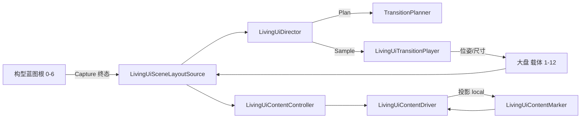

# 05 · UI 层

权威源：`Assets/Scripts/UI/**`（不含 Docs/Notes/规划）。本文档由源码与 asmdef 归纳。

## 一句话

UI 层由两套互不引用的程序集组成：**LivingUI** 负责世界空间「大盘」十二载体的构型转场与随行内容投影；**VisualLook** 负责 URP 像素对齐/扫描线与文字逃逸相机栈；根目录另有一个落在默认程序集的 TMP 像素描边组件。

## LivingUI vs VisualLook

| 维度 | LivingUI | VisualLook |
| --- | --- | --- |
| 程序集 | `NineGrid.LivingUI`（+ Editor / Tests） | `NineGrid.VisualLook` |
| 根命名空间 | `NineGrid.LivingUI` / `.Unity` / `.Demo` / `.Editor` / `.Tests` | `NineGrid.VisualLook` |
| 问题域 | 布局构型、载体运动、内容锚点投影、Hover/Demo 输入 | 渲染 Look（PixelSnap、扫描线）、相机栈、文字跟随 |
| Unity 依赖 | 仅引擎（asmdef `references: []`） | URP Core/Universal Runtime、TextMeshPro |
| 与对方关系 | **无** `using` / asmdef 引用 | **无** `using` / asmdef 引用 |
| 运行时入口 | `LivingUiDirector` + `LivingUiSceneLayoutSource` | `TableNineLookRig` + Renderer Feature `TableNineSelectiveLookFeature` |

二者可同场景共存：LivingUI 搬 `SpriteRenderer` 载体与子内容；VisualLook 改相机剔除/材质参数与（可选）Canvas/TMP 呈现。

## 程序集（asmdef）

### `NineGrid.LivingUI`

- 路径：`Assets/Scripts/UI/LivingUI/NineGrid.LivingUI.asmdef`
- `rootNamespace`: `NineGrid.LivingUI`
- `references`: **空**
- 覆盖：`Core/**`、`Unity/**`、`Demo/**`
- `autoReferenced`: true

### `NineGrid.LivingUI.Editor`

- 路径：`Assets/Scripts/UI/LivingUI/Editor/NineGrid.LivingUI.Editor.asmdef`
- `includePlatforms`: Editor
- `references`: `NineGrid.LivingUI`
- 覆盖：Editor 迁移菜单与手感窗口

### `NineGrid.LivingUI.Tests`

- 路径：`Assets/Scripts/UI/LivingUI/Tests/Editor/NineGrid.LivingUI.Tests.asmdef`
- `includePlatforms`: Editor
- `references`: `NineGrid.LivingUI`、`UnityEngine.TestRunner`、`UnityEditor.TestRunner`
- `overrideReferences` + `nunit.framework.dll`；`autoReferenced`: false
- EditMode 测 Core 策略/规划器

### `NineGrid.VisualLook`

- 路径：`Assets/Scripts/UI/VisualLook/NineGrid.VisualLook.asmdef`
- `rootNamespace`: `NineGrid.VisualLook`
- `references`: `Unity.RenderPipelines.Core.Runtime`、`Unity.RenderPipelines.Universal.Runtime`、`Unity.TextMeshPro`
- 无独立 Editor/Tests asmdef

### 默认程序集（无 asmdef）

- `Assets/Scripts/UI/TmpBitmapPixelOutline.cs` → 命名空间 `NineGrid.UI`，落入 **Assembly-CSharp**（`Assets/Scripts` 下无更上层 asmdef 覆盖该文件）。

### 跨层 asmdef 引用（全仓库扫描）

- **没有任何** 其他 `.asmdef` 引用 `NineGrid.LivingUI` 或 `NineGrid.VisualLook`（除 LivingUI 自身的 Editor/Tests）。
- LivingUI / VisualLook **不**引用 `NineGrid.Flow`、`NineGrid.Cards`、`NineGrid.Core`。

## 目录与职责

```
Assets/Scripts/UI/
├── LivingUI/
│   ├── Core/          纯数据：布局契约、转场规划/播放、内容策略与投影、缓动
│   ├── Unity/         MonoBehaviour：导演、大盘抓取、载体、内容驱动
│   ├── Demo/          键盘/Hover 试玩输入（同 LivingUI 程序集）
│   ├── Editor/        场景迁移菜单 + 手感窗口
│   └── Tests/Editor/  EditMode 单测
├── VisualLook/        Look Rig、URP Feature、文字绑定、扫描线标记
└── TmpBitmapPixelOutline.cs   Bitmap TMP 八向像素描边
```

## 源码路由总表

每条 `.cs` 一行；细则见子文档。

### LivingUI · Core

| 路由 | 主要类型 |
| --- | --- |
| `LivingUI/Core/LivingUiContracts.cs` | `LivingUiLayoutId`、`LivingUiTerminal`、`LivingUiLayout`、`LivingUiCarrierState`、`LivingUiTransitionStyle`、`ILivingUiTransitionPlanner` |
| `LivingUI/Core/LivingUiContentContracts.cs` | `LivingUiContentAnchor`、`LivingUiContentMotionMode`、`LivingUiContentLocalPose`、`LivingUiContentEnvelope`、`LivingUiContentBinding`、`LivingUiContentPhase`、`LivingUiContentPolicy` |
| `LivingUI/Core/LivingUiContentNames.cs` | `LivingUiContentNames` |
| `LivingUI/Core/LivingUiContentProjector.cs` | `LivingUiContentProjection`、`LivingUiContentProjector` |
| `LivingUI/Core/LivingUiTransitionPlanner.cs` | `LivingUiMotionProgram`、`LivingUiTransitionPlan`、`TransitionPlanner` |
| `LivingUI/Core/LivingUiTransitionPlayer.cs` | `LivingUiTransitionPlayer` |
| `LivingUI/Core/LivingUiEasing.cs` | `LivingUiEasingType`、`LivingUiEasing` |
| `LivingUI/Core/QuinticMotion.cs` | `QuinticMotion`、`BoundedScalarMotion` |

### LivingUI · Unity

| 路由 | 主要类型 |
| --- | --- |
| `LivingUI/Unity/LivingUiDirector.cs` | `LivingUiDirector` |
| `LivingUI/Unity/LivingUiSceneLayoutSource.cs` | `LivingUiSceneLayoutSource` |
| `LivingUI/Unity/CarrierView.cs` | `CarrierView` |
| `LivingUI/Unity/CarrierAnchorRegistry.cs` | `CarrierAnchorRegistry` |
| `LivingUI/Unity/LivingUiContentMarker.cs` | `LivingUiContentMarker` |
| `LivingUI/Unity/LivingUiContentController.cs` | `LivingUiContentController` |
| `LivingUI/Unity/LivingUiContentDriver.cs` | `LivingUiContentDriver` |
| `LivingUI/Unity/LivingUiBlueprintPoseSampler.cs` | `LivingUiBlueprintPoseSampler` |
| `LivingUI/Unity/LivingUiStableHitZoneRoot.cs` | `LivingUiStableHitZoneRoot` |

### LivingUI · Demo

| 路由 | 主要类型 |
| --- | --- |
| `LivingUI/Demo/LivingUiDemoInput.cs` | `LivingUiDemoInput` |
| `LivingUI/Demo/LivingUiMainMenuHover.cs` | `LivingUiMainMenuHover` |

### LivingUI · Editor

| 路由 | 主要类型 |
| --- | --- |
| `LivingUI/Editor/LivingUiFeelWindow.cs` | `LivingUiFeelWindow` |
| `LivingUI/Editor/LivingUiPrimordialPoseInit.cs` | `LivingUiPrimordialPoseInit` |
| `LivingUI/Editor/LivingUiLiveContentPoseResync.cs` | `LivingUiLiveContentPoseResync` |
| `LivingUI/Editor/LivingUiMappingFixBatch.cs` | `LivingUiMappingFixBatch` |
| `LivingUI/Editor/LivingUiContentBindMigrator.cs` | `LivingUiContentBindMigrator` |
| `LivingUI/Editor/LivingUiContentAnchorMigrator.cs` | `LivingUiContentAnchorMigrator` |
| `LivingUI/Editor/LivingUiAuthorityStageMigrator.cs` | `LivingUiAuthorityStageMigrator` |

### LivingUI · Tests

| 路由 | 主要类型 |
| --- | --- |
| `LivingUI/Tests/Editor/LivingUiContentPolicyTests.cs` | `LivingUiContentPolicyTests` |
| `LivingUI/Tests/Editor/LivingUiTransitionPlannerTests.cs` | `LivingUiTransitionPlannerTests` |

### VisualLook

| 路由 | 主要类型 |
| --- | --- |
| `VisualLook/TableNineLookRig.cs` | `TableNineLookRig` |
| `VisualLook/TableNineSelectiveLookFeature.cs` | `TableNineSelectiveLookFeature` |
| `VisualLook/TableNineFinalScanlineMarker.cs` | `TableNineFinalScanlineMarker` |
| `VisualLook/LivingTextWorldBinder.cs` | `LivingTextWorldBinder` |

### UI 根

| 路由 | 主要类型 |
| --- | --- |
| `TmpBitmapPixelOutline.cs` | `TmpBitmapPixelOutline`（`NineGrid.UI`） |

## LivingUI 运行时数据流（源码推断）



1. `LivingUiSceneLayoutSource`（order −300）从七组蓝图抓 `LivingUiTerminal` 快照，绑定「大盘」上 12 个 `SpriteRenderer`/`CarrierView`，关闭蓝图、激活大盘。
2. `LivingUiDirector`（−200）`Commit`/`Preview` → `TransitionPlanner.Plan` → `LivingUiTransitionPlayer` 按帧写载体 `transform.position` 与 `SpriteRenderer.size`。
3. `LivingUiContentController`（−190）按基础名在蓝图中的出现构建「构型→内容」映射。
4. `LivingUiContentDriver`（−180）`LateUpdate` 按策略投影 Marker 局部位姿与显隐。

## 与 Flow / Cards 的耦合（从引用推断）

| 耦合形式 | 结论 |
| --- | --- |
| `using` / 类型引用 | **无**。UI 源码不出现 `NineGrid.Flow` / `NineGrid.Cards`。 |
| asmdef | **无** 双向引用。 |
| 语义/场景名 | LivingUI 的 `LivingUiLayoutId` 枚举名（MainMenu…Route）与场景根名「大盘构型N-…」对应游戏阶段概念，但**无代码回调 Flow**。 |
| 场景锚点名（间接） | Editor 迁移表与战斗蓝图内容名含 `CardHandAnchors`、`CardDeckAnchors`、`GroundAnchors`、`RelicPanelAnchors` 等；Cards 侧（如 `CardHandManagerSingleton`、`GroundFieldManagerSingleton`）按**同名 Transform** 查找。LivingUI 只把这些物体挂在载体 `ContentAttach` 下并随面板运动，**不调用** Cards API。 |
| B 类锚点 | `CarrierAnchorRegistry` 注释写明：LivingUI 不拥有/不搬游戏对象，游戏系统自取世界位姿——预留给 Cards/玩法层，当前 UI 程序集内无消费者。 |

## 子文档

- [LivingUI/活字与世界UI.md](./LivingUI/活字与世界UI.md) — LivingUI 全类型清单与耦合细则
- [VisualLook/视觉Look.md](./VisualLook/视觉Look.md) — VisualLook 全类型清单（含 TableNineLookRig）
