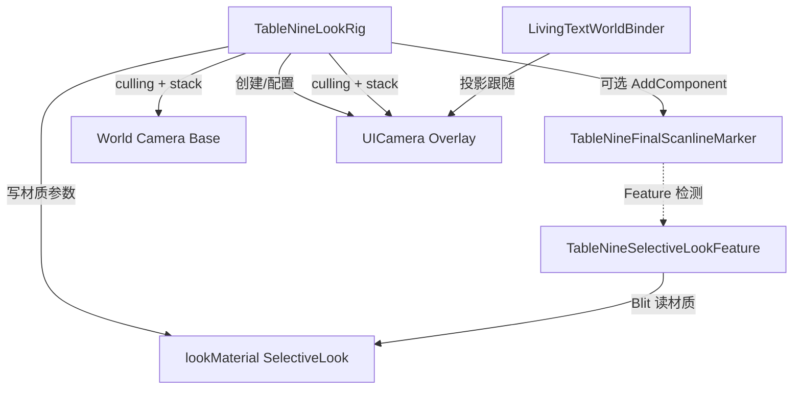

# VisualLook · 视觉 Look

程序集：`NineGrid.VisualLook`（`Assets/Scripts/UI/VisualLook/NineGrid.VisualLook.asmdef`）。

命名空间：`NineGrid.VisualLook`。

依赖（asmdef）：`Unity.RenderPipelines.Core.Runtime`、`Unity.RenderPipelines.Universal.Runtime`、`Unity.TextMeshPro`。

与 LivingUI：**无**程序集引用、**无**类型 `using`。与 Flow/Cards：**无**引用。

同目录旁的 `Assets/Scripts/UI/TmpBitmapPixelOutline.cs` 不在本程序集（见文末「相关但非本程序集」）。

---

## 问题域

收敛「全屏 PixelSnap + Overlay 文字逃逸」：

1. 世界默认走 PixelSnap + 扫描线（Base 相机 + Renderer Feature）。
2. `NoPixelSnap` 层由 Overlay `UICamera` 渲染，避免 snap 扭曲文字。
3. 文字扫描线默认由 TMP Scanline 材质参数同步（与 Rig 一致）；可选实验路径：Overlay 末相机统一 blit 扫描线。

---

## 类型清单

### `TableNineLookRig.cs` → `TableNineLookRig`

- `[ExecuteAlways]`、`[DisallowMultipleComponent]`。
- 职责：场景侧 Look 装配中枢。
  - 驱动 Look 材质 / 兼容旧 `legacyPixelSnapMaterial`：`_PixelResolution`、`_PixelSnap`、`_ScanlineEnabled/Intensity/Spacing`。
  - 解析/创建子物体 `UICamera`（URP Overlay），挂 `UniversalAdditionalCameraData`；可选挂 `TableNineFinalScanlineMarker`。
  - `applyCameraStack`：世界相机剔除 `NoPixelSnap`，UI 相机只渲该层并入 `cameraStack`。
  - `rebindLivingTextCanvases`：把指定 Canvas 改为 `ScreenSpaceCamera`、落到 NoPixelSnap、对齐 referenceResolution。
  - `syncTmpScanlineMaterials`：同步 Canvas 下 TMP 与世界空间 `TextMeshPro`（且位于 NoPixelSnap）的扫描线参数；`useUnifiedScanline` 时关闭 TMP 自带扫描线以免双重。
- 缺层名 `NoPixelSnap` 时 Warning 并中止 Rig。
- ContextMenu：`Apply Look Rig Now`。
- `using`：`TMPro`、`UnityEngine`、`UnityEngine.Rendering.Universal`、`UnityEngine.UI`。

### `TableNineSelectiveLookFeature.cs` → `TableNineSelectiveLookFeature`

- `ScriptableRendererFeature`（URP RenderGraph）。
- 嵌套：
  - `Settings`：`passEvent`、`overlayScanlineEvent`、`lookMaterial`、`maskMaterial`（保留）、`noSnapLayers`、`buildNoSnapMask`（同相机 mask，注释标明 Canvas 无效）、`overlayOwnsScanline`（实验，默认应关）。
  - `SelectiveLookPass`：Blit pass index——0 Copy、1 Snap、2 Scanlines。
  - `PassMode`：`SnapThenScanline`（默认 Base）、`SnapOnly`、`ScanlineOnly`（仅带 `TableNineFinalScanlineMarker` 的 Overlay）。
- 非 Game 相机 early-out；backbuffer active target 时不 blit。
- 稳定路径：Base = snap + scanline，Overlay early-out。
- 实验路径：`overlayOwnsScanline` → Base 仅 snap，带 Marker 的 Overlay 做 scanline-only（注释称当前 URP 栈不稳定）。

### `TableNineFinalScanlineMarker.cs` → `TableNineFinalScanlineMarker`

- 空标记组件：标识「应在栈末跑最终全帧扫描线 blit」的 Overlay 相机。
- 由 `TableNineLookRig.ApplyStackAndCulling` 在 UICamera 上按需添加；由 Feature 检测。

### `LivingTextWorldBinder.cs` → `LivingTextWorldBinder`

- 职责：Screen Space Camera 下的 `RectTransform` 跟随世界目标的屏幕投影点。
- 嵌套 `Binding`：`text`、`worldTarget`、`worldOffset`、`enabled`；运行时捕获 `runtimeLocalOffset`。
- Play 时可选 `captureAuthoredOffsetOnPlay`：用编辑器已摆好的相对偏移，避免绑完飞位。
- `LateUpdate` 应用；ContextMenu `Recapture Authored Offsets Now`。
- 相机解析：显式 → `Canvas.worldCamera` → `Camera.main`。
- **不**引用 LivingUI；与「大盘」面板的关联靠 Inspector 拖 `worldTarget`（通常为面板 Transform）。

---

## 协作关系（源码）

---

## 完整 `.cs` 路由清单（VisualLook）

| # | 路由 | 主要类型 |
| --- | --- | --- |
| 1 | `Assets/Scripts/UI/VisualLook/TableNineLookRig.cs` | `TableNineLookRig` |
| 2 | `Assets/Scripts/UI/VisualLook/TableNineSelectiveLookFeature.cs` | `TableNineSelectiveLookFeature`（含 `Settings`、`SelectiveLookPass`） |
| 3 | `Assets/Scripts/UI/VisualLook/TableNineFinalScanlineMarker.cs` | `TableNineFinalScanlineMarker` |
| 4 | `Assets/Scripts/UI/VisualLook/LivingTextWorldBinder.cs` | `LivingTextWorldBinder`（含 `Binding`） |

asmdef：

| 路由 |
| --- |
| `Assets/Scripts/UI/VisualLook/NineGrid.VisualLook.asmdef` |

---

## 相关但非本程序集

### `Assets/Scripts/UI/TmpBitmapPixelOutline.cs` → `NineGrid.UI.TmpBitmapPixelOutline`

- 无 asmdef 覆盖 → **Assembly-CSharp**。
- 依赖：`TMPro`、`UnityEngine`。
- 职责：Bitmap TMP 在 `OnPreRenderText` 八向平移复制顶点上色做像素黑边；关闭材质 `_OutlineWidth`/extraPadding，避免 atlas 邻字串色。
- 与 VisualLook 的关系：常挂在逃逸到 NoPixelSnap / Overlay 的文字上，形成「无 snap + 扫描线材质 + 像素描边」呈现链；**编译上互不引用**。
