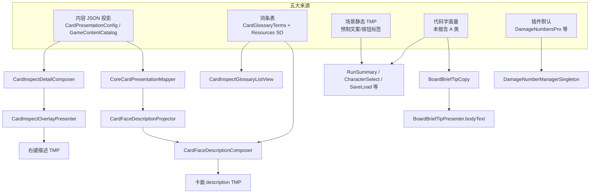

# 代码硬编码中文与文本上屏路径盘点

> 只读盘点 · 范围 `Assets/Scripts/**`（排除 Plugins/QFramework）· 生成于 2026-08-12

## 扫描摘要

| 类别 | 命中行数（含注释/元数据） | 本报告条目 |
|------|--------------------------|-----------|
| A 玩家可见运行时文案 | — | **87** |
| B 场景查找串（禁止翻译） | 90 | 13 文件 |
| C 开发/编辑器/诊断 | 6523 | 文件级汇总 |
| 原始 CJK 命中总计 | 7153 | — |

## A 类：玩家可见运行时文案（必须翻译）

| 文件:行号 | 字符串内容 | 上屏途径 |
|-----------|-----------|----------|
| `Assets/Resources/Flow/BattleInfoPreviewCopy.asset:18` | 房间类型：{room}\n楼层：{floor}\n进度：{progress} | 战斗信息预览/房间信息 TMP |
| `Assets/Scripts/NineGrid.Foundation/NineGrid.Content/Catalog/ContentVisualResolver.cs:232` | 玩家 | （运行时文案，上屏途径待接） |
| `Assets/Scripts/NineGrid.Foundation/NineGrid.Content/Catalog/ContentVisualResolver.cs:245` | 攻击+1 | （运行时文案，上屏途径待接） |
| `Assets/Scripts/NineGrid.Foundation/NineGrid.Content/Catalog/ContentVisualResolver.cs:247` | 护甲+1 | （运行时文案，上屏途径待接） |
| `Assets/Scripts/NineGrid.Foundation/NineGrid.Content/Catalog/ContentVisualResolver.cs:249` | 血量+2 | （运行时文案，上屏途径待接） |
| `Assets/Scripts/NineGrid.Foundation/NineGrid.Core/Setup/RunSaveGame.cs:492` | 战士 | （运行时文案，上屏途径待接） |
| `Assets/Scripts/NineGrid.Foundation/NineGrid.Core/Systems/PhaseSystem.cs:644` | 道具卡格已满 | 简要解释文字框 Notice（Core Reason） |
| `Assets/Scripts/NineGrid.Foundation/NineGrid.Core/Systems/PhaseSystem.cs:876` | 遗物格子已满 | 简要解释文字框 Notice（Core Reason） |
| `Assets/Scripts/NineGrid.Foundation/NineGrid.Core/Systems/PhaseSystem.cs:936` | 遗物格子已满 | 简要解释文字框 Notice（Core Reason） |
| `Assets/Scripts/NineGrid.Foundation/NineGrid.Core/Systems/PhaseSystem.cs:955` | 道具卡格已满 | 简要解释文字框 Notice（Core Reason） |
| `Assets/Scripts/NineGrid.Presentation/Cards/CardHandManagerSingleton.cs:652` | [CardHandManager] PickupFlush ExternalHold 失败，跳过表现 slot= | CardRecycleNotice 标准世界文字 TMP |
| `Assets/Scripts/NineGrid.Presentation/Cards/CardHandManagerSingleton.cs:814` | [CardHandManager] Pickup 后占格冲突残留（已禁止 force-sync）uid= | CardRecycleNotice 标准世界文字 TMP |
| `Assets/Scripts/NineGrid.Presentation/Flow/AttributeBoard/AttributeBoardPresenter.cs:330` | 属性房输入未接线 | 简要解释文字框 Notice |
| `Assets/Scripts/NineGrid.Presentation/Flow/BattleInfoPreview/BattleInfoPreviewCopySO.cs:30` | 房间类型：{room}\n楼层：{floor}\n进度：{progress} | 战斗信息预览/房间信息 TMP |
| `Assets/Scripts/NineGrid.Presentation/Flow/BattleInfoPreview/BattleInfoPreviewPresenter.cs:385` | 房间类型：{room}\n楼层：{floor}\n进度：{progress} | 战斗信息预览/房间信息 TMP |
| `Assets/Scripts/NineGrid.Presentation/Flow/BoardBriefTip/BoardBriefTipCopy.cs:12` | 离开本房 | BoardBriefTipPresenter → Panels/简要解释文字框 TMP |
| `Assets/Scripts/NineGrid.Presentation/Flow/BoardBriefTip/BoardBriefTipCopy.cs:13` | 前往下一层 | BoardBriefTipPresenter → Panels/简要解释文字框 TMP |
| `Assets/Scripts/NineGrid.Presentation/Flow/BoardBriefTip/BoardBriefTipCopy.cs:14` | 返回上一层 | BoardBriefTipPresenter → Panels/简要解释文字框 TMP |
| `Assets/Scripts/NineGrid.Presentation/Flow/BoardBriefTip/BoardBriefTipCopy.cs:17` | 已选择 2 张属性卡 | BoardBriefTipPresenter → Panels/简要解释文字框 TMP |
| `Assets/Scripts/NineGrid.Presentation/Flow/BoardBriefTip/BoardBriefTipCopy.cs:28` | ：开局注入  /  项 | BoardBriefTipPresenter → Panels/简要解释文字框 TMP |
| `Assets/Scripts/NineGrid.Presentation/Flow/BoardBriefTip/BoardBriefTipCopy.cs:100` |  金币 | BoardBriefTipPresenter → Panels/简要解释文字框 TMP |
| `Assets/Scripts/NineGrid.Presentation/Flow/BoardBriefTip/BoardBriefTipCopy.cs:103` |  金币 | BoardBriefTipPresenter → Panels/简要解释文字框 TMP |
| `Assets/Scripts/NineGrid.Presentation/Flow/BoardBriefTip/BoardBriefTipCopy.cs:117` | 楼层· | BoardBriefTipPresenter → Panels/简要解释文字框 TMP |
| `Assets/Scripts/NineGrid.Presentation/Flow/BoardBriefTip/BoardBriefTipCopy.cs:126` | 精英战斗房间 | BoardBriefTipPresenter → Panels/简要解释文字框 TMP |
| `Assets/Scripts/NineGrid.Presentation/Flow/BoardBriefTip/BoardBriefTipCopy.cs:128` | Boss房间 | BoardBriefTipPresenter → Panels/简要解释文字框 TMP |
| `Assets/Scripts/NineGrid.Presentation/Flow/BoardBriefTip/BoardBriefTipCopy.cs:130` | 商店房间 | BoardBriefTipPresenter → Panels/简要解释文字框 TMP |
| `Assets/Scripts/NineGrid.Presentation/Flow/BoardBriefTip/BoardBriefTipCopy.cs:132` | 卡店房间 | BoardBriefTipPresenter → Panels/简要解释文字框 TMP |
| `Assets/Scripts/NineGrid.Presentation/Flow/BoardBriefTip/BoardBriefTipCopy.cs:137` | 战斗房间 | BoardBriefTipPresenter → Panels/简要解释文字框 TMP |
| `Assets/Scripts/NineGrid.Presentation/Flow/BoardBriefTip/BoardBriefTipCopy.cs:139` | 宝箱奖励房间 | BoardBriefTipPresenter → Panels/简要解释文字框 TMP |
| `Assets/Scripts/NineGrid.Presentation/Flow/BoardBriefTip/BoardBriefTipCopy.cs:141` | 道具奖励房间 | BoardBriefTipPresenter → Panels/简要解释文字框 TMP |
| `Assets/Scripts/NineGrid.Presentation/Flow/GameFlow/GameFlowOrchestrator.cs:133` | ，首关牌组 {mShell.PinnedFirstBattleDeckId} | 简要解释文字框 Notice / 结算面板 |
| `Assets/Scripts/NineGrid.Presentation/Flow/GameFlow/GameFlowOrchestrator.cs:234` | 教学完成！准备开始冒险… / 教学完成！ | 简要解释文字框 Notice / 结算面板 |
| `Assets/Scripts/NineGrid.Presentation/Flow/GameFlow/GameFlowOrchestrator.cs:457` |  固定牌组 {monsterDeckId} | 简要解释文字框 Notice / 结算面板 |
| `Assets/Scripts/NineGrid.Presentation/Flow/GameFlow/GameFlowOrchestrator.cs:458` |  真实局内入场 | 简要解释文字框 Notice / 结算面板 |
| `Assets/Scripts/NineGrid.Presentation/Flow/GameFlow/GameFlowOrchestrator.cs:1157` | 胜利 | 简要解释文字框 Notice / 结算面板 |
| `Assets/Scripts/NineGrid.Presentation/Flow/GameFlow/GameFlowOrchestrator.cs:1158` | 失败 | 简要解释文字框 Notice / 结算面板 |
| `Assets/Scripts/NineGrid.Presentation/Flow/GameFlow/GameFlowOrchestrator.cs:1178` | [GameFlow] 整局胜利，展示结算面板后回主菜单。 | 简要解释文字框 Notice / 结算面板 |
| `Assets/Scripts/NineGrid.Presentation/Flow/GameFlow/GameFlowOrchestrator.cs:1179` | [GameFlow] 战斗失败，展示结算面板后回主菜单。 | 简要解释文字框 Notice / 结算面板 |
| `Assets/Scripts/NineGrid.Presentation/Flow/GameFlow/GameFlowOrchestrator.cs:1301` | [GameFlow] 快速测试改血失败：目标 {GameFlowShellSystem.QuickTestAvatarHp}，请确认 Avatar 已入场。 | 简要解释文字框 Notice / 结算面板 |
| `Assets/Scripts/NineGrid.Presentation/Flow/GameFlow/GameFlowOrchestrator.cs:1307` | [GameFlow] 快速测试改攻失败：目标 {GameFlowShellSystem.QuickTestAvatarAttack}，请确认 Avatar 已入场。 | 简要解释文字框 Notice / 结算面板 |
| `Assets/Scripts/NineGrid.Presentation/Flow/GameFlow/GameFlowOrchestrator.cs:1340` | 正式 / 乱序 | 简要解释文字框 Notice / 结算面板 |
| `Assets/Scripts/NineGrid.Presentation/Flow/GameFlow/GameFlowOrchestrator.cs:1343` | ，首关固定牌组= | 简要解释文字框 Notice / 结算面板 |
| `Assets/Scripts/NineGrid.Presentation/Flow/GameFlow/GameFlowOrchestrator.cs:1348` | ，技能= | 简要解释文字框 Notice / 结算面板 |
| `Assets/Scripts/NineGrid.Presentation/Flow/GameFlow/GameFlowOrchestrator.cs:1361` | ，技能  | 简要解释文字框 Notice / 结算面板 |
| `Assets/Scripts/NineGrid.Presentation/Flow/GameFlowController.cs:53` | 胜利 | 简要解释文字框 Notice |
| `Assets/Scripts/NineGrid.Presentation/Flow/GameFlowController.cs:56` | 失败 | 简要解释文字框 Notice |
| `Assets/Scripts/NineGrid.Presentation/Flow/GameFlowController.cs:239` | 主菜单开始游戏确认 | 简要解释文字框 Notice |
| `Assets/Scripts/NineGrid.Presentation/Flow/HelpCardBoardSelectResolver.cs:395` | 请 | （运行时文案，上屏途径待接） |
| `Assets/Scripts/NineGrid.Presentation/Flow/RewardBoard/RewardBoardPresenter.cs:478` | 奖励房输入未接线 | 简要解释文字框 Notice |
| `Assets/Scripts/NineGrid.Presentation/Flow/ShopBoard/ShopBoardPresenter.cs:323` | 刷新货架 | 简要解释文字框 Notice |
| `Assets/Scripts/NineGrid.Presentation/Flow/ShopBoard/ShopBoardPresenter.cs:604` | 刷新货架 | 简要解释文字框 Notice |
| `Assets/Scripts/NineGrid.Presentation/Flow/ShopBoard/ShopBoardPresenter.cs:764` | 商店输入未接线 | 简要解释文字框 Notice |
| `Assets/Scripts/NineGrid.Presentation/Flow/ShopBoard/ShopBoardPresenter.cs:791` | 金币不足 | 简要解释文字框 Notice |
| `Assets/Scripts/NineGrid.Presentation/Flow/ShopBoard/ShopBoardPresenter.cs:880` | 金币不足 | 简要解释文字框 Notice |
| `Assets/Scripts/NineGrid.Presentation/Flow/TavernBoard/TavernBoardPresenter.cs:29` | 取消选择 | 简要解释文字框 Notice |
| `Assets/Scripts/NineGrid.Presentation/Flow/TavernBoard/TavernBoardPresenter.cs:405` | 刷新货架 | 简要解释文字框 Notice |
| `Assets/Scripts/NineGrid.Presentation/Flow/TavernBoard/TavernBoardPresenter.cs:729` | 刷新货架 | 简要解释文字框 Notice |
| `Assets/Scripts/NineGrid.Presentation/Flow/TavernBoard/TavernBoardPresenter.cs:906` | 卡店输入未接线 | 简要解释文字框 Notice |
| `Assets/Scripts/NineGrid.Presentation/Flow/TavernBoard/TavernBoardPresenter.cs:931` | 金币不足 | 简要解释文字框 Notice |
| `Assets/Scripts/NineGrid.Presentation/Flow/TavernBoard/TavernBoardPresenter.cs:935` | 暂无可固定的道具卡 | 简要解释文字框 Notice |
| `Assets/Scripts/NineGrid.Presentation/Flow/TavernBoard/TavernBoardPresenter.cs:939` | 塞卡预算已满 | 简要解释文字框 Notice |
| `Assets/Scripts/NineGrid.Presentation/Flow/TavernBoard/TavernBoardPresenter.cs:1153` | 金币不足 | 简要解释文字框 Notice |
| `Assets/Scripts/NineGrid.Presentation/Systems/GameFlowShellSystem.cs:333` | [GameFlow] 快速测试节点队列已耗尽，回退顺序节点 {mNodeIndex}。 | （运行时文案，上屏途径待接） |
| `Assets/Scripts/NineGrid.Presentation/Ui/CharacterSelectPanel.cs:246` | 该角色尚未解锁 | 人物选择BG/提示文字、属性文字 TMP |
| `Assets/Scripts/NineGrid.Presentation/Ui/CharacterSelectPanel.cs:271` | 生命 {profession.MaxHp} · 攻击 {profession.Attack} | 人物选择BG/提示文字、属性文字 TMP |
| `Assets/Scripts/NineGrid.Presentation/Ui/CharacterSelectPanel.cs:274` | 名字文字 | 人物选择BG/提示文字、属性文字 TMP |
| `Assets/Scripts/NineGrid.Presentation/Ui/RunSaveLoadPanel.cs:110` | [RunSave] 存档/读档模块结构不完整（UI槽位/条目模板缺失），面板不可用。 | 局内功能菜单/存档读档模块 条目 TMP |
| `Assets/Scripts/NineGrid.Presentation/Ui/RunSaveLoadPanel.cs:161` | 空存档位  | 局内功能菜单/存档读档模块 条目 TMP |
| `Assets/Scripts/NineGrid.Presentation/Ui/RunSaveLoadPanel.cs:180` | 自动  / 自动存档（暂无） | 局内功能菜单/存档读档模块 条目 TMP |
| `Assets/Scripts/NineGrid.Presentation/Ui/RunSaveLoadPanel.cs:192` | 空存档位  | 局内功能菜单/存档读档模块 条目 TMP |
| `Assets/Scripts/NineGrid.Presentation/Ui/RunSaveLoadPanel.cs:236` | _行 | 局内功能菜单/存档读档模块 条目 TMP |
| `Assets/Scripts/NineGrid.Presentation/Ui/RunSaveLoadPanel.cs:328` | _行 | 局内功能菜单/存档读档模块 条目 TMP |
| `Assets/Scripts/NineGrid.Presentation/Ui/RunSaveLoadPanel.cs:405` | M月d日 HH:mm | 局内功能菜单/存档读档模块 条目 TMP |
| `Assets/Scripts/NineGrid.Presentation/Ui/RunSaveLoadPanel.cs:409` | 冒险者 | 局内功能菜单/存档读档模块 条目 TMP |
| `Assets/Scripts/NineGrid.Presentation/Ui/RunSaveLoadPanel.cs:411` | {when} {name} 层{snapshot.floor}·{snapshot.DisplayNode} | 局内功能菜单/存档读档模块 条目 TMP |
| `Assets/Scripts/NineGrid.Presentation/Ui/RunSummaryPanel.cs:224` | 凯旋而归 / 壮志未酬 | UI面板/结算面板BG 各 TMP |
| `Assets/Scripts/NineGrid.Presentation/Ui/RunSummaryPanel.cs:235` | 你征服了全部三层地城，九宫的传说将铭记你的名字！ | UI面板/结算面板BG 各 TMP |
| `Assets/Scripts/NineGrid.Presentation/Ui/RunSummaryPanel.cs:236` | 地城的阴影暂时吞没了冒险者，重整旗鼓再来一局。 | UI面板/结算面板BG 各 TMP |
| `Assets/Scripts/NineGrid.Presentation/Ui/RunSummaryPanel.cs:241` | 战士 | UI面板/结算面板BG 各 TMP |
| `Assets/Scripts/NineGrid.Presentation/Ui/RunSummaryPanel.cs:259` | 通关进度　全 {RunModel.FinalFloor} 层制霸 | UI面板/结算面板BG 各 TMP |
| `Assets/Scripts/NineGrid.Presentation/Ui/RunSummaryPanel.cs:260` | 通关进度　第 {floor} 层 · 第 {displayNode} 关 | UI面板/结算面板BG 各 TMP |
| `Assets/Scripts/NineGrid.Presentation/Ui/RunSummaryPanel.cs:261` | 本局种子 {run.Seed?.Value ?? 0} | UI面板/结算面板BG 各 TMP |
| `Assets/Scripts/NineGrid.Presentation/Ui/RunSummaryPanel.cs:272` | 持有金币　{Mathf.Max(0, player.Coins.Value)} | UI面板/结算面板BG 各 TMP |
| `Assets/Scripts/NineGrid.Presentation/Ui/RunSummaryPanel.cs:277` | 九宫互动　{Mathf.Max(0, player.InteractionCount.Value)} 次 | UI面板/结算面板BG 各 TMP |
| `Assets/Scripts/NineGrid.Presentation/Ui/RunSummaryPanel.cs:308` | 最终属性　生命 {hp}/{maxHp} · 攻击 {attack} · 护甲 {armor} | UI面板/结算面板BG 各 TMP |
| `Assets/Scripts/NineGrid.Presentation/Ui/RunSummaryPanel.cs:316` | 持有遗物　{count} 件 | UI面板/结算面板BG 各 TMP |
| `Assets/Scripts/NineGrid.Presentation/Ui/RunSummaryPanel.cs:333` | 遗物图标_ | UI面板/结算面板BG 各 TMP |

### A 类集中度（Top 10 文件）

- `Assets/Scripts/NineGrid.Presentation/Flow/BoardBriefTip/BoardBriefTipCopy.cs`：15 处
- `Assets/Scripts/NineGrid.Presentation/Flow/GameFlow/GameFlowOrchestrator.cs`：14 处
- `Assets/Scripts/NineGrid.Presentation/Ui/RunSummaryPanel.cs`：12 处
- `Assets/Scripts/NineGrid.Presentation/Ui/RunSaveLoadPanel.cs`：9 处
- `Assets/Scripts/NineGrid.Presentation/Flow/TavernBoard/TavernBoardPresenter.cs`：8 处
- `Assets/Scripts/NineGrid.Presentation/Flow/ShopBoard/ShopBoardPresenter.cs`：5 处
- `Assets/Scripts/NineGrid.Foundation/NineGrid.Content/Catalog/ContentVisualResolver.cs`：4 处
- `Assets/Scripts/NineGrid.Foundation/NineGrid.Core/Systems/PhaseSystem.cs`：4 处
- `Assets/Scripts/NineGrid.Presentation/Flow/GameFlowController.cs`：3 处
- `Assets/Scripts/NineGrid.Presentation/Ui/CharacterSelectPanel.cs`：3 处

## B 类：场景对象名 / 节点查找串（⚠️ 禁止翻译）

> **警告**：下列字符串用于 `transform.Find` / `FindDeep` / `GameObject.Find` / `FindSceneNamed` / `const *Name` 等场景绑定。翻译后会断查找、断按钮接线。

| 文件 | 命中行数 | 典型用途 |
|------|---------|----------|
| `Assets/Scripts/NineGrid.Presentation/Ui/RunSummaryPanel.cs` | 16 | 结算面板 TMP 子节点名 |
| `Assets/Scripts/NineGrid.Presentation/Ui/PlayerAudioSettingsPanel.cs` | 15 | 面板根/关闭钮/音量滑条节点名 |
| `Assets/Scripts/NineGrid.Presentation/Flow/PlayerInfoHudPresenter.cs` | 12 | 玩家信息 HUD 子节点名 |
| `Assets/Scripts/NineGrid.Presentation/Ui/CharacterSelectPanel.cs` | 11 | 人物选择槽位/按钮节点名 |
| `Assets/Scripts/NineGrid.Presentation/Flow/BattleInfoPreview/BattleInfoPreviewPresenter.cs` | 9 | 玩家/怪物/环境 分组节点 |
| `Assets/Scripts/NineGrid.Presentation/Flow/CardInspectOverlayPresenter.cs` | 9 | 右键描述/半黑屏BG |
| `Assets/Scripts/NineGrid.Presentation/Ui/RunSaveLoadPanel.cs` | 6 | 场景节点 Find/绑定 |
| `Assets/Scripts/NineGrid.Presentation/Flow/BoardBriefTip/FloorHintPresenter.cs` | 3 | 楼层提示根对象名 |
| `Assets/Scripts/NineGrid.Presentation/Flow/RelicIconSlotView.cs` | 3 | 场景节点 Find/绑定 |
| `Assets/Scripts/NineGrid.Presentation/Cards/Anim/CardMainVisualMaskAnchor.cs` | 2 | 场景节点 Find/绑定 |
| `Assets/Scripts/NineGrid.Presentation/Flow/BattleUiDimmerOverlay.cs` | 2 | 场景节点 Find/绑定 |
| `Assets/Scripts/NineGrid.Presentation/Cards/CardHandManagerSingleton.cs` | 1 | 标准世界文字 (2) 回收提示子节点 |
| `Assets/Scripts/NineGrid.Presentation/Flow/BoardBriefTip/BoardBriefTipPresenter.cs` | 1 | 简要解释文字框 |

**合计**：90 行 / 13 文件

## C 类：开发 / 编辑器 / 诊断（不翻或后翻）

| 分区 | 代表路径 | 约行数 | 说明 |
|------|---------|--------|------|
| Content.Editor 工具窗 | `NineGrid.Content.Editor/*` | 691+ | 宏隔离或仅 Editor/DEVELOPMENT_BUILD |
| Presentation.Editor | `NineGrid.Presentation/Editor/*` | 45+ | 宏隔离或仅 Editor/DEVELOPMENT_BUILD |
| Cheat 作弊面板 | `Presentation/Cheat/*` | 83+ | 宏隔离或仅 Editor/DEVELOPMENT_BUILD |
| QuickTest 通道 | `QuickTest*` | 75+ | 宏隔离或仅 Editor/DEVELOPMENT_BUILD |
| Tests 自动化 | `/Tests/*` | 70+ | 宏隔离或仅 Editor/DEVELOPMENT_BUILD |
| PerfTrace / DiagTrace | `Diagnostics/*` | 87+ | 宏隔离或仅 Editor/DEVELOPMENT_BUILD |
| DevTest | `NineGrid.DevTest/*` | 37+ | 宏隔离或仅 Editor/DEVELOPMENT_BUILD |

- `Cheat/`：`#if UNITY_EDITOR || DEVELOPMENT_BUILD` 编译隔离（`CheatToolPanelController` 等）
- `QuickTest`：`GameFlowShellSystem.BuildQuickTestPickerMenuText` 等主菜单 `\` 通道文案
- 日志 / Assert / Trace：玩家不可见
- `AudioCue` 第二参数中文 note：音频工作台元数据，非 UI

## 文本上屏路径图

玩家最终看到的文字，按来源分为五类：

### 1. 内容 JSON 投影

| 类 / 文件 | 作用 | 改文案 |
|----------|------|--------|
| `CoreCardPresentationMapper` (`Flow/CoreCardPresentationMapper.cs`) | 从 `CardPresentationConfigCatalog` 拉 displayName/faceIntro/basicDescription，组装 `CardPresentationSnapshot` | `Assets/Content/**` JSON + CardPresentation 配置 |
| `CardFaceDescriptionProjector` (`Cards/Presentation/CardFaceDescriptionProjector.cs`) | 描述模板 + 运行时参数填充 → 交给 Composer | JSON `basicDescription` + 装配参数 |
| `CardInspectDetailComposer` (`Cards/Presentation/CardInspectDetailComposer.cs`) | 右键背景/牌组介绍 | JSON `faceIntro` / deck `displayName`+`description` |
| `ContentDefinitions` / `GameContentCatalog` | 房间 DisplayName、怪物牌组名等 | Core 内容 JSON |

### 2. 词条表

| 类 / 文件 | 作用 | 改文案 |
|----------|------|--------|
| `CardGlossaryTerms` | 解析 `[[展示名]]` / `[code]` 内联图标与词条 | `Resources` 下 Glossary SO / JSON |
| `CardFaceDescriptionComposer` | `[[名]]` 展开、sprite 内联 | 词条表 + 描述字符串 |
| `CardInspectGlossaryListView` | 右键详述效果词条行列表 | 同上 |

### 3. 场景静态 TMP

- 主菜单 / 功能菜单 / 结算 / 人物选择等 **按钮标签、标题** 多在场景 `UI面板/*` 子物体 TMP 上直接填写（非代码 SetText）
- 字体：`ChangBanDianSong-12 SDF`、`SmileySans-Oblique-3 SDF`、`Fantasypixelfont SDF`（见 TMP 节）

### 4. 代码字面量（本报告 A 类）

| 管线 | 关键类 | TMP / 面板 |
|------|--------|------------|
| 悬停一句话 + Notice | `BoardBriefTipCopy` → `BoardBriefTipPresenter` | `Panels/简要解释文字框` |
| 楼层/房间类型 | `BoardBriefTipCopy` + `FloorHintPresenter` | `楼层提示/大楼层提示`、`小房间提示` |
| 胜负 / 教学 / 商店拒因 | `GameFlowController` / `GameFlowOrchestrator` / 各 BoardPresenter `ShowNotice` | 同上简要解释框 |
| 局终结算 | `RunSummaryPanel.Populate` | `结算面板BG` 各 TMP |
| 人物选择拒选 | `CharacterSelectPanel.ShowHint` | `提示文字` TMP |
| 存档列表 | `RunSaveLoadPanel.FormatEntry` | 存档模块条目 TMP |
| 战斗信息预览 | `BattleInfoPreviewCopySO` + `BattleInfoPreviewPresenter` | 预览面板 `房间信息` TMP |
| Core 拒因 | `PhaseSystem.Reject` → `result.Reason` → `ShowNotice` | 简要解释框 |
| 回收预览 | `CardHandManagerSingleton` `+N` | `CardRecycleNotice` TMP |

### 5. 插件默认文案

- `DamageNumberManagerSingleton`（DamageNumbersPro）：飘字多为数字；前缀/后缀若配置则在插件 SO 中
- TextMesh Pro 默认 `LiberationSans SDF` 不含 CJK，生产 UI 使用项目自有像素/点宋字体

### 关键链路速查

| 功能 | 入口 | 文件 |
|------|------|------|
| 卡面描述 | `CardFacePresentationBinder` → `CardFaceDescriptionComposer.Compose` | `Cards/Presentation/` |
| 右键详述 | `CardInspectOverlayPresenter.ShowForCard` | `Flow/CardInspectOverlayPresenter.cs` |
| 简要解释 | `BoardBriefTipPresenter.SetHover` / `ShowNotice` | `Flow/BoardBriefTip/` |
| 战斗预览 | `BattleInfoPreviewPresenter.ShowAsync` | `Flow/BattleInfoPreview/` |
| 结算 | `RunSummaryPanel.TryShowAndWaitAsync` | `Ui/RunSummaryPanel.cs` |
| HUD 数值 | `PlayerInfoHudPresenter` | 仅数字，无中文标签（标签在场景 TMP） |

## 主菜单加按钮（语言切换）调研

### 既有惯例（`GameFlowController`）

1. **场景摆放**：主菜单 `MainPanel` 下每个可点项 = 带 `SpriteRenderer`（按钮图）+ `BoxCollider2D`（命中）的子物体；按钮文字若需要则为子节点 **世界空间 `TMP_Text`**（多数主菜单按钮文案 baked 在精灵上）
2. **序列化 + 回退**：`[SerializeField] Collider2D settingsHit` 等；`EnsureViewBindings()` 里若为空则 `FindDeep("SettingsScreen")` 等按 **英文名** 深搜取 `Collider2D`
3. **轮询命中**：`Update()` 仅在 `GameFlowShellState.MainMenu` 且功能菜单/半黑屏未打开时；`WorldPointerUtility.TryOverlapColliderOnPlane(worldCamera, hit)` + `WasPrimaryPressedThisFrame()`
4. **悬停反馈**：`UpdateMenuHover()` 对当前 hover 的 collider 的 transform `localScale *= 1.08`；配合 `InteractionAudioCues` 脉冲
5. **叠层面板按钮**：`WorldUiHitButton`（`Ui/WorldUiHitButton.cs`）= `BoxCollider2D` + `PointerHitRegistry` + 悬停缩放；用于人物选择/结算/功能菜单，**非主菜单 StartRun 路径**
6. **功能菜单入口**：主菜单 `菜单按钮` 走 `PlayerAudioSettingsPanel.FunctionMenuHitProxy`（非 GameFlowController 四按钮）

### 候选接法（二选一，不做最终决策）

**候选 A — 对齐主菜单四按钮范式**
- 场景：在 `MainPanel` 增加 `LanguageToggle`（SpriteRenderer + BoxCollider2D），可选子 TMP 显示「中/EN」
- 代码：`GameFlowController` 增加 `[SerializeField] Collider2D languageHit` + `FindDeep` 回退；`Update()` 增加命中分支调用 `ILanguageSettingsSystem.Toggle()`
- 优点：与 Start/Settings/Tutorial/Quit 一致；缺点：需改 `GameFlowController` 与场景

**候选 B — 放进局内功能菜单**
- 场景：在 `局内功能菜单BG/功能模块` 下加按钮，用 `WorldUiHitButton` + `PlayerAudioSettingsPanel` 式 `WireButton`
- 代码：扩展 `PlayerAudioSettingsPanel.EnsureBound` 接线；主菜单通过现有 `菜单按钮` 打开后切换语言
- 优点：复用现成面板范式与 `WorldUiHitButton`；缺点：主菜单不能直接切语言，多一步

## 设置持久化惯例（语言偏好可照此落）

| 要素 | 音频现状 (`PlayerAudioSettingsSystem`) | 语言建议 |
|------|----------------------------------------|----------|
| 接口 | `IPlayerAudioSettingsSystem : ISystem` | `ILanguageSettingsSystem : ISystem` |
| PlayerPrefs 键 | `NineGrid.PlayerAudioSettings.v1`（JSON） | `NineGrid.LanguagePreference.v1` |
| 默认值 | `Resources/MMSoundManagerSettings` 作者默认 | 可用 `PlatformInfo.LanguageCode`（Steam `schinese`/`english`）作首次默认 |
| 变更通知 | `event Action<Snapshot> Changed` | 同模式，UI/TMP 刷新订阅 |
| 存储抽象 | `IPlayerAudioSettingsStore` → `PlayerPrefsAudioSettingsStore` | 可复用同一 Store 接口 |
| 装配 | `PresentationSceneRoot.WireHosts()` → `PlayerAudioSettingsSystem.EnsureRegistered()` | 同位置注册 |
| 面板 | `PlayerAudioSettingsPanel` 读写 `Current` | 语言按钮调 `SetLocale(code)` |

## 现有 i18n 痕迹

- `Packages/manifest.json`：**无** `com.unity.localization` 包
- `Assets/Scripts/` 内无 Localization/Locale/i18n 框架；仅：
  - `IPlatformInfo.LanguageCode` / `PlatformInfo.LanguageCode`（`Flow/Platform/PlatformInfo.cs`）
  - `SteamPlatformInfo.LanguageCode` → `SteamApps.GetCurrentGameLanguage()`（`NineGrid.SteamBridge`）
  - Editor Web Workbench `localeCompare(..., "zh-CN")`（排序，非运行时 UI）
- **结论**：尚无运行时本地化基础设施；Steam 语言仅可作默认检测参考

## TMP 全局设置与项目字体

| 项 | 值 |
|----|-----|
| TMP Settings 路径 | `Assets/TextMesh Pro/Resources/TMP Settings.asset` |
| 默认字体 | `LiberationSans SDF`（guid `8f586378…`，TMP 自带） |
| 全局 fallback 链 | **空** `m_fallbackFontAssets: []` |
| LiberationSans Fallback 资产 | `LiberationSans SDF - Fallback.asset`（TMP 自带） |

### 项目自有 TMP FontAsset（排除 Plugins demo）

| 资产 | 路径 | Fallback 链 | 备注 |
|------|------|------------|------|
| ChangBanDianSong-12 SDF | `Assets/Arts/Fronts/长坂点宋12_1.4.2/` | 空 | 点宋，生产中文 UI 主力候选 |
| SmileySans-Oblique-3 SDF | `Assets/Arts/Fronts/DeYiHei/` | （资产内查） | 得意黑斜体 |
| Fantasypixelfont SDF | `Assets/Arts/Images/Png/2D Pixel Quest Vol3…/Font/` | （资产内查） | 像素 UI 包字体 |

- 场景 TMP 具体引用由场景盘点另补；代码侧 `TMP Settings` 默认 **不会**自动 fallback 到点宋，各 TMP 组件需单独指定 Font Asset
