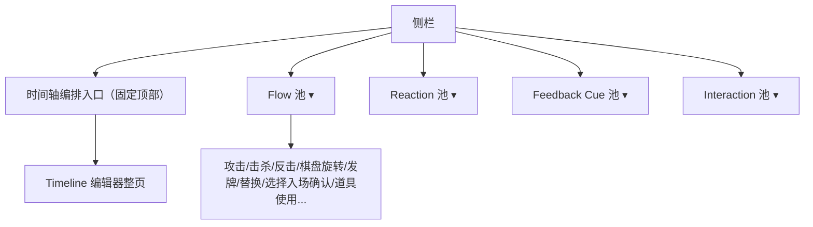
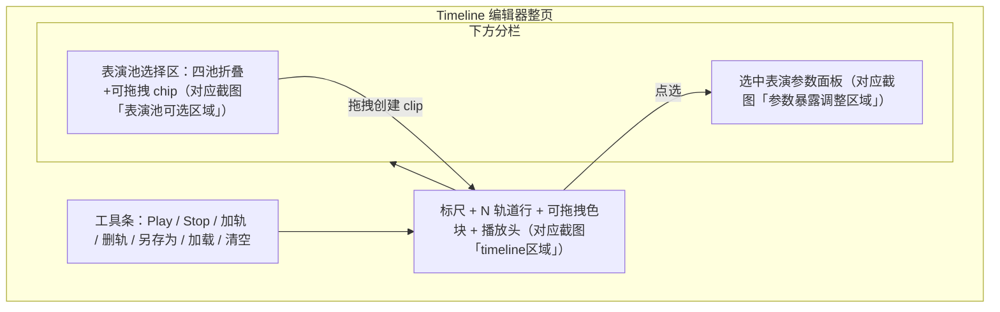

# 表演调试控制台四池化 + Timeline 动态编排器

## 背景对齐

- 二版蓝图 canvas（`九宫牌局表现层（第二版）.canvas`）定义四池：`Flow`（`p_attack`/`p_kill`/`p_rotate`...）、`Reactions`、`Feedback(Cue)`、`Interaction`，各自已在代码里对应 `PerformanceDebugCategory.Flow/Reaction/Cue/Interaction`，模块分别在 `[Modules/FlowDebugModules.cs](Assets/Scripts/NineGrid.Presentation/Debugging/Modules/FlowDebugModules.cs)`、`[ReactionDebugModules.cs](Assets/Scripts/NineGrid.Presentation/Debugging/Modules/ReactionDebugModules.cs)`、`[CueDebugModules.cs](Assets/Scripts/NineGrid.Presentation/Debugging/Modules/CueDebugModules.cs)`、`[InteractionDebugModules.cs](Assets/Scripts/NineGrid.Presentation/Debugging/Modules/InteractionDebugModules.cs)`。
- `[表现测试层开发计划.md](Assets/Notes/表现测试层开发计划.md)` 把"可视化 timeline"明确列为 P3（"明确不做（留 P3/P4）"），本次即落地该 P3。
- 现状：`PerformanceDebugEditorWindow` 左侧 `BuildSidebar()` 把全部模块（含额外的 `PerformanceDebugCategory.Batch` 硬编码预设夹具）排成一条扁平列表，正是截图里"击杀/反击/反击击杀/补牌/替换/复位..."混杂在一起的问题根源。`Batch` 类由 `[PresentationBatchFixtureLibrary.cs](Assets/Scripts/NineGrid.Presentation/Debugging/PresentationBatchFixtureLibrary.cs)` + `[Modules/BatchDebugModules.cs](Assets/Scripts/NineGrid.Presentation/Debugging/Modules/BatchDebugModules.cs)` + `[PerformanceDebugBatchRunner.cs](Assets/Scripts/NineGrid.Presentation/Debugging/PerformanceDebugBatchRunner.cs)` 构成，是"强制预设手搓静态批次"，本次退休。
- `PresentationBatchPlayer` / `PerformancePlanBuilder` / `FlowRegistry` / `ReactionRegistry` / `PerformanceDebugBatchHijack` 属于 Phase 1 生产共享脊柱，被 `[OrchestrationPipelineTests.cs](Assets/Scripts/NineGrid.Presentation.Tests/OrchestrationPipelineTests.cs)` 直接单测覆盖，**不动**；只退休控制台里"写死夹具→喂给 BatchPlayer"这一层。
- DOTweenTimeline 插件（`[DottView.cs](Assets/Plugins/DOTweenTimeline/Editor/DottView.cs)` / `[DottGUI.cs](Assets/Plugins/DOTweenTimeline/Editor/DottGUI.cs)`）参考的是"标尺+多行轨道+可拖拽色块+选中态+播放头"交互形态；本项目控制台是 UI Toolkit（非 IMGUI），照搬其**交互模型**、不照搬 IMGUI 实现，用 `VisualElement` + 指针事件复刻。

## Part A — 四池化侧栏，退休混杂 Batch 预设

### A1. 退休 Batch 静态批次体系

删除（不影响 `OrchestrationPipelineTests`，该测试直接 `new PresentationBatchPlayer(...)` / `PerformancePlanBuilder`，不依赖这些控制台专用类）：

- `[PresentationBatchFixtureLibrary.cs](Assets/Scripts/NineGrid.Presentation/Debugging/PresentationBatchFixtureLibrary.cs)`
- `[Modules/BatchDebugModules.cs](Assets/Scripts/NineGrid.Presentation/Debugging/Modules/BatchDebugModules.cs)`
- `[PerformanceDebugBatchRunner.cs](Assets/Scripts/NineGrid.Presentation/Debugging/PerformanceDebugBatchRunner.cs)`

保留不动：`PresentationBatchPlayer`、`PerformancePlanBuilder`、`FlowRegistry`/`ReactionRegistry`、`PerformanceDebugBatchHijack`、`PerformanceDebugOrchestrationSetup`（生产共享脊柱 + 其单测）。

联动清理：

- `[PerformanceDebugCategory.cs](Assets/Scripts/NineGrid.Presentation/Debugging/PerformanceDebugCategory.cs)`：移除 `Batch` 枚举值。
- `[PerformanceDebugCatalog.cs](Assets/Scripts/NineGrid.Presentation/Debugging/PerformanceDebugCatalog.cs)`：删 `RegisterBatchFixtures()` 及其调用。
- `[PerformanceDebugHarness.cs](Assets/Scripts/NineGrid.Presentation/Debugging/PerformanceDebugHarness.cs)`：删 `BatchRunner` 属性/构造（`BatchPlayer`/`FlowRegistry`/`ReactionRegistry` 保留，点对点 Flow 模块仍要用 `GetFlowBinding`）。
- `[PerformanceDebugBootstrap.cs](Assets/Scripts/NineGrid.Presentation/Debugging/PerformanceDebugBootstrap.cs)`：删 `BatchRunner` 属性、`playSmokeBatchOnStart` 字段与相关分支。
- `[PerformanceDebugEditorWindow.cs](Assets/Scripts/NineGrid.Presentation.Editor/PerformanceDebugEditorWindow.cs)`：删"Plan 步骤"卡片、`planDumpLabel`、`RefreshPlanDump()`。

### A2. 侧栏改为四池折叠导航

改造 `[BuildSidebar()](Assets/Scripts/NineGrid.Presentation.Editor/PerformanceDebugEditorWindow.cs)`：

- 顶部固定一个高亮入口"时间轴编排"（非折叠，见 Part B），点击后主内容区切换为 Timeline 编辑器整页。
- 下方四个可折叠分组（复用 `Foldout` + `PerformanceDebugWarmConsoleUi.CreateNavButton`）：`Flow 池` / `Reaction 池` / `Feedback(Cue) 池` / `Interaction 池`，每组标题带模块计数；展开态按分类持久化到 `EditorPrefs`（`NineGrid.PerfDebug.PoolExpanded.{category}`）。
- 顶部工具栏的"分类"下拉过滤器删除（四池已在侧栏可视化分组，二者语义重复）；搜索框保留，过滤时若某池筛完为空则整组隐藏。
- 新增视图模式状态 `viewMode`（`Module` / `Timeline`），持久化到 `EditorPrefs`；`RebuildDetailPage()` 按模式分派到"单模块详情页"或"Timeline 编辑器页"。

## Part B — Timeline 动态编排器（新增，P3 落地）

### B1. 数据与调度模型（新目录 `Debugging/Timeline/`，运行时可用，非 Editor-only）

- `PerformanceDebugTimelineClip.cs`：`ClipId`(guid)、`ModuleId`、`StartTime`(float,秒)、`Track`(int)、`Payload`(`PerformanceDebugPayload`)。
- `PerformanceDebugTimelineArrangement.cs`：`Clips` 列表 + `TrackCount`；`AddClip/RemoveClip/Duplicate`；`ToJson()/FromJson()`（`[Serializable]` DTO + `JsonUtility`，payload 用 key/value 对列表落盘）。
- `PerformanceDebugTimelineRunner.cs`：接 `PerformanceDebugCatalog` + `PerformanceDebugHarness` + `MonoBehaviour` 协程宿主；`Play(arrangement)` 按 `StartTime` 排序后协程逐个等待相邻 clip 的时间差、调用 `catalog.FindById(clip.ModuleId).Play(context, clip.Payload)`（沿用现有点对点 `IFlowBinding` 调用路径，天然与生产共享同一表演入口，不经过 `PresentationBatch`/`PlanBuilder`）；`Stop()` 复用 `harness.StopAllModules()`；暴露 `PlayheadTime`/`IsPlaying` 供 UI 轮询播放头。
- 接入：`PerformanceDebugBootstrap` 新增 `TimelineRunner` 属性（构造方式对齐现有 `Runner`），替代被删除的 `BatchRunner`。

### B2. Timeline 编辑器 UI（新目录 `NineGrid.Presentation.Editor/Ui/Timeline/`，Editor-only，沿用 `PerformanceDebugWarmConsoleUi` 主题）

布局对齐用户截图三区：

- **Canvas 渲染**：单一 `position:relative` 容器，内部标尺行（绝对定位，时间刻度按 `pixelsPerSecond` 缩放，支持缩放滑杆）+ 轨道背景行（交替底色，`top = ruler.height + track*rowHeight`）+ clip 覆盖层（每个 clip 一个绝对定位 `VisualElement`：`left = StartTime*px`，`top = Track*rowHeight`，`width = max(minPx, duration*px)`，`duration` 取 `module.TryGetExpectedDuration(context)` 的最佳估计，Edit Mode 无 context 时用占位最小宽度）；按池配色给 clip 左侧色带（复用四池强调色）。
- **拖拽移动**：clip 元素 `PointerDownEvent` 时 `CapturePointer`，记录起始鼠标 X/Y 与 `StartTime`/`Track`；`PointerMoveEvent` 中按像素差换算秒差（可选吸附到 0.1s 或其它 clip 边缘，按住 Ctrl 临时关闭吸附）与轨道行（按 Y 差整除 `rowHeight`），实时更新 `style.left/top`；`PointerUpEvent` 落定并写回 `arrangement`，自动保存到 `EditorPrefs`。
- **从表演池拖入新 clip**：池内每个模块渲染成小 chip；`PointerDownEvent` 在 `rootVisualElement` 上创建跟随鼠标的浮动幽灵元素，`PointerUpEvent` 判断落点是否落在 canvas 的 `worldBound` 内，若是则用 `canvas.WorldToLocal(evt.position)` 反算 `time`/`track` 并 `AddClip`。
- **选中与参数面板**：点击 clip 设置 `selectedClipId`，右侧面板复用/抽取现有 `CreateParamRow`/`DescribeField` 逻辑（从 `PerformanceDebugEditorWindow` 抽成共享静态方法，避免重复 switch-case），按 `catalog.FindById(clip.ModuleId).Schema.Fields` 渲染并写回 `clip.Payload`；同时展示 clip 级字段（起始时间数值框、轨道 stepper、删除/复制按钮）。
- **播放**：复用现有 `GetRunnerOrWarn()` 式连接校验；Play 调 `bootstrap.TimelineRunner.Play(arrangement)`，已有的 `OnEditorUpdate` 轮询里新增刷新播放头位置与"正在播放"色块高亮。
- **持久化**：每次增删拖拽自动写 `EditorPrefs`（JSON）；工具条"另存为/加载"按钮读写 `Assets/Editor/PerformanceDebugTimelines/*.json` 命名预设，用于沉淀常用编排（取代原来写 C# 夹具类的方式）。

### B3. 拆分复用

把 `PerformanceDebugEditorWindow.CreateParamRow`/`DescribeField` 提炼为共享工具（新增到 `PerformanceDebugWarmConsoleUi.cs` 或新文件 `PerformanceDebugFieldRowFactory.cs`），供模块详情页与 Timeline 参数面板共用，避免重复实现字段类型分支（Bool/Enum/ContextPreset/Derived/默认文本）。

## 涉及文件汇总

- 删除：`PresentationBatchFixtureLibrary.cs`、`Modules/BatchDebugModules.cs`、`PerformanceDebugBatchRunner.cs`
- 修改：`PerformanceDebugCategory.cs`、`PerformanceDebugCatalog.cs`、`PerformanceDebugHarness.cs`、`PerformanceDebugBootstrap.cs`、`PerformanceDebugEditorWindow.cs`、`PerformanceDebugWarmConsoleUi.cs`
- 新增：`Debugging/Timeline/PerformanceDebugTimelineClip.cs`、`PerformanceDebugTimelineArrangement.cs`、`PerformanceDebugTimelineRunner.cs`；`NineGrid.Presentation.Editor/Ui/Timeline/` 下 2-3 个 UI 文件（页面装配、画布拖拽、池选择器，具体拆分可在实现时按体量微调）；`Assets/Editor/PerformanceDebugTimelines/`（预设存放目录）

## 已知取舍（不额外询问，实现时按此默认）

- Timeline clip 只能拖拽调整**位置**（起止时间/轨道），不支持拖拽**改变时长**——时长由所选表演自身决定，符合用户描述（只提到"控制它在timeline中的位置"）。
- 播放调度直接对每个 clip 调用其模块既有的点对点 `Play()`（同一条 `IFlowBinding` 路径），不经过 `PresentationBatch`/`PlanBuilder`；轨道仅作可视化编组，调度顺序始终按全局 `StartTime` 排序。

