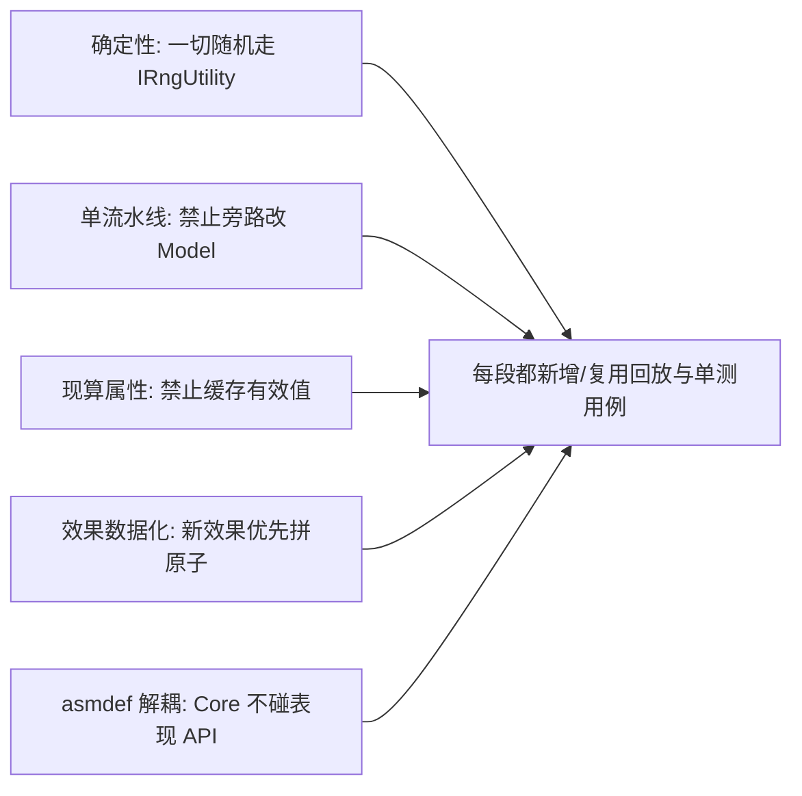

---
tags:
  - 规划
  - Core
  - 落地路线
created: 2026-06-17
---

# 九宫牌局 Core 分段落地规划

> 本规划是 [[九宫牌局权威顶层架构设计]] 的实施路线。**只定边界、目标、交付物与验收标准，不展开实现细节**（细节交给执行 AI 按架构文档细化）。
>
> **分段原则**：① 每段任务量尽量均匀；② 每段结束都能**独立验证**（有可运行/可测试的产物）；③ 依赖自底向上，前一段是后一段的地基；④ "效果系统"作为最难的硬骨头单独成段，且其上下游（属性/流水线/内容）各自成段，避免一次性吞太多。
>
> 共 **8 段（P0–P7）**。建议按顺序推进；P5（效果系统）是全局重心，前面 4 段都是为它铺地基。

---

## 总览

| 段      | 主题      | 一句话目标                                  | 可验证产物                         |
| :----- | :------ | :------------------------------------- | :---------------------------- |
| **P0** | 工程基建    | 三层 asmdef + IOC + 确定性 RNG + 配置管线骨架     | 空 Architecture 能启动，RNG 同种子可复现 |
| **P1** | 数据模型    | 把所有运行时状态建模为 Models + CardInstance      | 控制台能 new 出一局初始数据并打印           |
| **P2** | 属性管线    | 四层 Modifier + 现算有效值 + RuleModifier 注册表 | 单测：加/移除修正、条件/临时层、换敌复原全绿       |
| **P3** | 动作流水线   | GameAction 队列+反应栈+EventLog+触发点         | 单测：连锁结算顺序正确、事件流可断言            |
| **P4** | 棋盘与流程   | 网格/旋转/补牌/发牌 + 内核状态机，**无技能**完整对局        | 能用纯逻辑跑完一个节点（战斗→旋转→通关）         |
| **P5** | 效果系统    | 触发/条件/动作/目标原子库 + DSL 解析 + 五防线校验        | 用 DSL 实现 ~10 个代表技能并单测通过       |
| **P6** | 全内容落地   | 把全部技能/遗物/帮助卡/套装/经济/奖励/房间数据化            | 全内容配表跑回放测试，覆盖率达标              |
| **P7** | 表现契约+工具 | 事件→表现适配器规范 + 调试工具 + 本地回放测试网 + 热重载        | 表现端订阅事件可演；ActionLog 可视化；本地回放全绿 |

---

## P0 · 工程基建

**目标**：搭好"骨架与地基"，确保后续每段都在干净、确定、可测的环境里写。

**范围**
- 建立 `NineGrid.Core` / `NineGrid.Content` / `NineGrid.Presentation` 三个 asmdef，配置**依赖方向**（Core 禁止引用任何 UnityEngine 表现 API；用 asmdef 约束 + 可加编译期检查）。
- 接入 QFramework，建立 `NineGridArchitecture`（IOC 根，空注册）。
- 实现 `IRngUtility`（带种子、可序列化状态）、`ILogUtility`（结构化日志）、`IConfigUtility`（先做内存桩，Luban 接入留到 P6 前）。
- 建立 **Unity EditMode 测试程序集**（`NineGrid.Core.Tests`，无 Unity 表现 API 依赖即可跑 Core 单测；本地 Test Runner 或 batchmode 脚本验收，**不维护独立 `dotnet test` 工程，不接入 CI**）。

**交付物**：可启动的 Architecture；RNG 同种子复现性单测；日志门面。

**验收**：① 在 Core 里写一行 `using UnityEngine.UIElements` 会编译失败；② RNG 同种子产出同序列；③ Unity EditMode 跑 `NineGrid.Core.Tests` 全绿（编辑器 Test Runner 或 `Assets/Notes/CI/run-core-tests.ps1` 本地 batchmode）。

**风险/提示**：asmdef 与 QFramework 程序集的引用关系先理顺，避免后期循环依赖返工。

---

## P1 · 数据模型层

**目标**：把架构第 4 节的所有 Models 落地，确立"唯一真身 CardInstance + 区域迁移"模型。

**范围**
- `CardInstance`（uid/defId/kind/StatBlock/CounterBag/zone/slot/effects）+ `CardRegistry`（uid 自增、按 uid 取卡）。
- `BoardModel`（9 槽 + 化身槽 + 福地标记）、`DeckModel`（抽牌堆/玩家卡池/敌方卡池/道具牌格）、`PlayerModel`（StatBlock/金币/遗物列表/技能列表/互动计数）、`RunModel`（层/节点/种子/房间）。
- 关键字段用 `BindableProperty` 暴露（为表现读做准备，但此段不接表现）。
- 定义 `CardKind / ZoneId / SlotId` 等枚举与值类型。

**交付物**：一套纯数据 Models；一个"构造初始对局数据"的工厂（先写死/桩数据）。

**验收**：控制台能构造一局初始状态（化身在槽5、空网格、空卡池）并完整打印；区域迁移（把一张卡从抽牌堆移到网格槽）能正确改变其 zone/slot。

**风险/提示**：此段**不写任何规则逻辑**，只建数据结构。抵制"顺手把发牌也写了"的冲动。

---

## P2 · 属性管线（StatSystem）

**目标**：实现架构第 6 节，做到"有效值永不缓存、消失/残留自动正确"。

**范围**
- `Modifier`（Stat/Op/Layer/Source/Condition?/Scope?）与 `StatBlock`（修正源集合）。
- `StatPipeline`：基础→持久→条件→临时 四层现算；`EffectiveStatQuery`。
- 修正增删：`AddModifier / RemoveModifier`（按 Source 批量清理，支撑"换敌复原只清历战来源"）。
- `RuleModifierRegistry`（恢复倍率、互动距离、敌方攻击 delta、金币抵消等规则改写位）。
- 条件层求值接口（先支持 AtSlot / HpBelowPct / Adjacent 等少量，便于单测；完整条件原子在 P5）。

**交付物**：可独立单测的属性管线 + 规则改写注册表。

**验收**（全单测）：① 持久加成正确累加；② 条件不满足时不计入、满足时计入；③ 临时层"本次战斗""单次""换敌复原"按 Scope 正确失效；④ 移除某 Source 只清该来源；⑤ RuleModifier（如恢复×2）能被查询到。

**风险/提示**：把"何时消失"全部建模为**条件求值 / 来源清理**，杜绝任何"命令式记得减回去"。这是根治残留 bug 的关键，验收要专门覆盖。

---

## P3 · 动作流水线 + 触发总线骨架

**目标**：实现架构第 5 节脊柱——单流水线串行结算 + 反应入栈 + EventLog + 触发点。

**范围**
- `GameAction` 基类（`Apply()` 写 Model、`EmitEvents()` 产出事件）。
- `ActionPipelineSystem`：队列 + 反应栈、`RunToCompletion`、PRE/POST 触发点钩子、深度优先连锁。
- `EventLog`（有序事件流，结构化、可序列化）。
- `TriggerSystem` **骨架**：触发点枚举（OnBattle/OnKill/OnRemove/…）、效果注册/注销接口、按触发点分发（具体效果原子在 P5，这里先用桩反应器验证机制）。
- 最小 Action 集：`DealDamage / Heal / GainArmor / ModifyGold / RemoveCard / Kill`（接 P2 的伤害公式与属性）。

**交付物**：可单测的流水线 + 事件日志 + 触发分发骨架。

**验收**（全单测）：① 用桩反应器模拟"击杀→触发→再伤害→再击杀"连锁，断言**事件顺序**与 [[RUL_战斗]] 事件链一致；② 伤害公式（减伤→护甲→血量、最低0）正确；③ EventLog 内容可逐条断言；④ 无直接改 Model 的旁路（代码审查/约束）。

**风险/提示**：反应入栈（深度优先）vs 入队（广度优先）的语义要在此段定死并写进注释，后续效果全依赖它。

---

## P4 · 棋盘·发牌·内核状态机（无技能跑通对局）

**目标**：让一局战斗在**没有任何技能/遗物**的情况下，用纯逻辑完整跑通。这是第一个"看得见的里程碑"。

**范围**
- `BoardSystem`：相邻判定、顺时针旋转路径、交换、`FillEmptySlots`（含防抖合并），全部以 Action 形式进流水线。
- `DeckSystem`：开局发牌流程（化身侧抽3 + 敌方侧抽3含精英保底 + 洗混 + 补满）、抽牌堆顶序补牌、抽牌堆耗尽处理（对应 [[RUL_发牌]]）。
- `PhaseSystem`（FSMKit）：节点状态机（构建敌方池→重置→发牌→互动循环→通关检查→道具三选一→房间二选一→房间事件→下一节点），每状态声明合法 Command 集合，非法 Command 广播 `Evt_ActionRejected`。
- 基础 Command：`AttackCommand / PickupItemCommand / ClickEmptyCommand / UseItemCommand`（先只做"无效果"的纯位移与战斗）。
- 互动→旋转/补牌的触发条件（击杀/拾取/点空格旋转；战斗未击杀不旋转；道具使用不旋转不计数）。

**交付物**：纯 C# 可跑完一个节点的对局（无技能）。

**验收**：脚本化输入一串操作（攻击/拾取/点空格），断言：网格旋转正确、补牌正确、金币结算正确、通关条件（抽牌堆空且无敌方）正确触发、非法操作被拒。

**风险/提示**：这是第一个集成里程碑，务必用**确定性种子**跑，把它沉淀成第一个回放测试用例（P7 复用）。

---

## P5 · 效果系统（核心硬骨头）

**目标**：实现架构第 7 节——把"触发+条件+动作"做成可组合 DSL + 原子库 + 五防线校验。**这是全项目重心。**

**范围**
- 原子接口与注册表：`ITrigger / ICondition / ITarget / IAction` + `[EffectAtom]` 特性 + 反射收集。
- **组合子**：`Sequence / WeightedRandom / Repeat / Conditional`（让"随机9选1""触发N次""满足才做"都数据化）。
- DSL 解析：JSON → `EffectInstance`（Triggered / Modifier / RuleModifier 三种 kind）。
- `EffectSystem`：容器激活/失活时注册/注销效果（生命周期兜底，对应 [[效果类型隔离规范]] 生命周期表）。
- 首批原子库（覆盖架构第 7.2 节清单的主干）：触发器（OnBattle/OnKill/OnRemove/OnUseHelpCard/OnSelfMove(every)/OnMoveToSlot/OnEnter/OnArmorBreak/OnDamageTaken/OnFatalDamage/OnNodeStart/OnNodeEnd/OnRotate/OnInteract/OnCumulative）；条件（AtSlot/Adjacent/HpBelow/HasCard/OwnsRelicSet/LevelParity）；目标（Self/Player/RandomMonster/AllMonsters/OrthoAdjacent/SlotCard/Column）；动作（在 P3 基础上补 Move/Swap/Rotate/ShuffleInto/Spawn/AddModifier/GrantSkill）。
- **配表校验器**：五防线（类型标签/必填字段/互斥红线/动词一致/黄金样例快照）。

**交付物**：可用 DSL 描述效果并被内核执行的完整效果引擎 + 校验器。

**验收**：用 DSL 实现 ~10 个**代表性硬技能**并单测通过，必须覆盖各类机制：
- 计数触发（重新组合头 = OnSelfMove+相邻条件+三动作）
- 累计触发（落石 = OnCumulative(armorLost,10)）
- 反应链（凤凰羽毛 = OnFatalDamage 免死并移除自身）
- 复合随机（废物老虎机 = OnUseHelpCard + WeightedRandom）
- 条件光环（流浪幼崽 = 格6 条件 Modifier）
- 规则改写（龙鳞甲 = RuleModifier 敌方攻击-1；渴望 = 恢复×2）
- 套装（木盾木剑木甲 = OwnsRelicSet 条件加成）

**风险/提示**：原子要做成**纯函数式小对象、单一职责**。任何"原子里写死某个具体技能"都是设计腐化，评审重点盯防。组合子是承载"未来任意效果"的关键，优先打磨。

---

## P6 · 全内容落地

**目标**：把游戏**全部效果数据化**——所有怪物技能、玩家技能、遗物、帮助卡、套装、经济、奖励、房间，用 P5 的 DSL + 配表表达。接入 Luban。

**范围**
- 接入 Luban：把卡牌/怪物/遗物/帮助卡定义与效果 DSL 全部配表化，生成 C# 配置类（落 Content 层）。
- 按 `九宫牌局-元设计/06-数据` 与 `九宫牌局/07-数据`、`04-技能`、`03-遗物` 录入全部内容数据。
- 补齐少量 P5 未覆盖的"长尾原子"（遇到无法用现有原子拼出的效果，新增原子而非写死技能）。
- `EconomySystem`（金币各来源/消耗，对应 RES_001）、`RewardSystem`（精英/Boss 击杀奖励、宝箱三选一概率、导师三选一、房间二选一）、房间事件（商店/酒馆/泉水/金币/宝箱）。

**交付物**：内容完整、可配表调整的完整游戏逻辑（仍无表现）。

**验收**：① 全部技能/遗物/帮助卡都有对应 DSL 且通过五防线校验；② 跑一组覆盖各内容的回放用例全绿；③ 策划改一个数值/概率只动配表、无需改代码即可生效；④ 统计"为新内容新增的原子数"应很低（验证 P5 词汇表足够厚）。

**风险/提示**：此段是体力活但能检验 P5 设计成色。**长尾原子激增 = P5 抽象不足的预警**，应回看而非硬堆。

---

## P7 · 表现契约 + 工具 + 测试网

**目标**：打通内核↔表现契约，建立调试/测试/热重载工具，让整套系统**好用、可信、可调**。

**范围**
- **表现契约**：定义 `Evt_*` → 表现适配器规范；表现状态机（UI_Idle/拖拽/选目标/播放）；事件→时间线序列器（ActionKit 串/并行）；输入锁；`Cmd_PresentationFinished` 整批握手（及可选 Checkpoint 细粒度握手）。给一个**最小可玩表现**验证契约（不求美术，求联通）。
- **调试工具**：ActionLog 可视化面板（逐条看 Action/触发点/产出事件/修正快照）——直接服务于"技能为什么没生效"的排查。
- **本地回放测试网**：录制操作序列 + 种子 → **本地** EditMode 回放断言关键状态，作为效果系统回归网（复用 P4/P5/P6 用例；不接入 CI）。
- **配置热重载**：运行时重载效果 DSL/数值，策划即改即见。

**交付物**：可联调的表现层契约 + 调试面板 + 本地回放用例集 + 热重载。

**验收**：① 表现端仅靠订阅 EventLog 就能把一局战斗演出来；② 制造一个"技能失效"故障，能在 ActionLog 面板 30 秒内定位；③ 本地 EditMode 跑全部回放用例绿灯；④ 改配表后热重载即时生效。

**风险/提示**：表现层是"盲目乐观的演员"，验收时要刻意验证"内核拒绝非法意图"与"表现不判断合法性"两条边界。

---

## 跨段贯穿的工程纪律（每段都要守）

| 纪律 | 落地检查点 |
|:--|:--|
| 确定性 | 任何 `new Random()` / `UnityEngine.Random` 出现在 Core = 评审打回 |
| 单流水线 | 任何"非 Action 直接改 Model 字段" = 评审打回 |
| 现算属性 | 任何缓存的"有效攻击/有效护甲"字段 = 评审打回 |
| 效果数据化 | 任何"原子里 if (技能==某某)" = 评审打回 |
| 解耦 | Core asmdef 引用了表现程序集 = 编译失败 |
| 本地验收 | 单测走 Unity EditMode（Test Runner / 本地 batchmode）；**不做 `dotnet test`、不接入 CI** |

---

## 里程碑回看

- **P4 结束**：第一次"无技能但能玩"——验证脊柱（流水线+棋盘+状态机）。
- **P5 结束**：第一次"硬技能用数据跑起来"——验证全局重心（效果引擎）。
- **P6 结束**：内容齐全、纯逻辑完整——可做平衡性验证。
- **P7 结束**：表现联通 + 工具齐备——进入正式内容生产与打磨。

---

## 相关文档

- [[九宫牌局Core架构设计]] — 本规划对应的架构总设计
- [[个人Unity开发范式顶层框架设计]] — 顶层心智模型
- `九宫牌局-元设计/` — 机制权威定义（各段录入数据的来源）
