# 九宫牌局架构设计
>
> **设计目标**：用一套精巧、可组合、确定性的内核，承载当前所有效果（怪物技能 / 玩家技能 / 遗物 / 帮助卡），并且对「后续随便加效果」保持开放。
>
> **针对的历史痛点**：复杂技能落地困难、技能频繁失效/出错、策划难以调整。本架构通过 **数据驱动的效果原子库 + 确定性动作流水线 + 实时属性管线** 三件套从根上解决这三个问题。
>
> **配套文档**：
> 游戏机制见：Assets/Docs/九宫牌局-元设计 各层文档；
> 游戏内容设计见：Assets/Docs/九宫牌局 各层文档。

---

## 0. 一页纸速览（先看这张图）

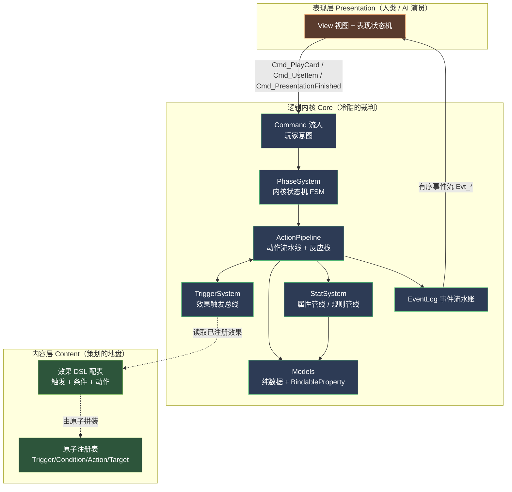

**三句话理解全局**：

1. 表现层只发**粗粒度意图**（`Command`），内核只回**细粒度事实**（`Event` 流水账）。
2. 内核里一切「改变状态的事」都是一个 **GameAction**，全部进**同一条流水线**串行结算，反应（连锁）以**入栈**方式插队，顺序绝对确定。
3. 一切效果 = **触发 + 条件 + 动作**，由**原子库拼装**、用**配表描述**。程序只维护原子，策划只填数据，新效果不动内核代码。

---

## 1. 设计哲学：四条铁律

| # | 铁律 | 解决的历史痛点 |
|:--|:--|:--|
| **铁律一** | **逻辑与表现绝对解耦**：Core 程序集禁止 `using UnityEngine.UI / 动画 / 粒子`。Core 是可在纯 C# 控制台跑完整对局的库。 | 表现 bug 不再污染逻辑；逻辑可被单元测试 100% 覆盖 |
| **铁律二** | **一切状态变更皆为 GameAction，单一流水线串行结算**。没有任何系统能"直接"改 Model，必须投递 Action。 | 技能失效/顺序错乱：因为所有改动走同一条有序管线，可回放、可断点、可日志 |
| **铁律三** | **效果三态分离**：改数值（Modifier）/ 改规则（RuleModifier）/ 触发动作（Trigger）三类用**三套机制**承载，绝不混用。 | 复杂技能落地难：每类效果有唯一正确的落点，拼装即可 |
| **铁律四** | **确定性优先**：所有随机走**带种子的 RNG 工具**，所有结算在单帧内完成产出事件流。表现只是"播放录像"。 | 难复现的 bug、无法做存档/回放/自动测试 |

> 铁律二是整套架构的脊柱。下文反复出现的「投递 Action」就是指：任何代码想改游戏状态，都必须 `Pipeline.Enqueue(someAction)`，而不能 `model.hp -= 5`。

---

## 2. 分层与程序集划分

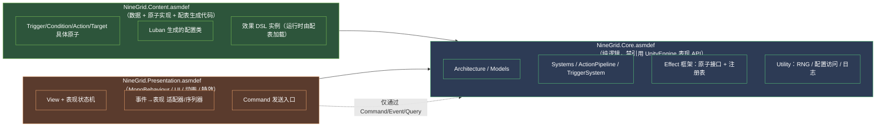

**依赖方向铁律**：`Presentation → Core ← Content`。Core 不知道另外两层存在。Content 实现 Core 定义的原子接口。Presentation 只能通过 `Command / Event / Query` 三个窗口与 Core 通信。

> **为什么用 asmdef 硬隔离而不是"自觉"**：编译期就让"在 Core 里写 `Image.color = ...`"直接报错。这比口头约定可靠一万倍，是铁律一的物理保障。

---

## 3. 与 QFramework 的映射

QFramework 提供 IOC 容器与 CQRS 风格的骨架，我们把内核构件一一落位：

| QFramework 构件 | 本项目用途 | 代表类 |
|:--|:--|:--|
| `Architecture` | IOC 根，注册所有 System/Model/Utility | `NineGridArchitecture` |
| `IModel` | 纯运行时数据，字段用 `BindableProperty` 暴露给表现读 | `BoardModel` `PlayerModel` `DeckModel` `RunModel` `CardRegistry` |
| `ISystem` | 规则逻辑、调度 | `PhaseSystem` `ActionPipelineSystem` `TriggerSystem` `StatSystem` `BoardSystem` `DeckSystem` `EconomySystem` `RewardSystem` `EffectSystem` |
| `ICommand` | 表现层流入的玩家意图 | `PlayCardCommand` `UseItemCommand` `PresentationFinishedCommand` |
| `IQuery` | 无副作用的读 | `EffectiveStatQuery` `CanInteractQuery` `AdjacencyQuery` |
| `TypeEventSystem` | Core → 表现 的事件广播（EventLog 条目） | `Evt_DamageDealt` `Evt_CardMoved` … |
| `Utility` | 确定性 RNG、配置访问、日志 | `IRngUtility` `IConfigUtility` |
| `FSMKit` | 内核状态机（PhaseSystem 内部） | `PhaseFsm` |
| `GridKit` | 3×3 网格数据结构基座 | `BoardModel` 内部 |
| `ActionKit` | **仅表现层**用：动画时序编排 | 表现序列器 |
| `PoolKit` | GameAction / Event 对象池，减少 GC | 流水线内部 |

> **关键纪律**：`ActionKit`（时序动画）只在表现层出现。内核的"时序"由 ActionPipeline 自己管，不依赖协程/帧。这避免了"逻辑等动画"造成的时序漂移——历史上技能失效的常见元凶。

---

## 4. 内核数据模型（Models）

Models 只存数据，不写逻辑。所有"会被表现监听"的字段用 `BindableProperty<T>`。

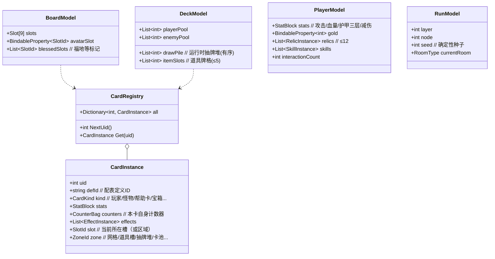

**设计要点**：

- **CardInstance 是唯一真身**：网格上的怪物、道具槽的帮助卡、抽牌堆里的卡，全是 `CardInstance`，只是 `zone/slot` 不同。"移动""洗入""拾取"本质都是改 `zone/slot`。这把帮助卡的复杂生命周期（网格→拾取→道具槽→使用→移除）统一成区域迁移，对应 [[效果类型隔离规范]] 的生命周期表。
- **uid 全局自增**：帮助卡按 uid 逐张追踪（金币结算、使用/未使用），怪物计数器绑 uid（"每移动N次"以本卡为准），完全满足元设计要求。
- **StatBlock 不存"有效值"，只存"修正源"**：见第 6 节，有效值永远现算。这是"技能加成消失/残留"类 bug 的根治方案。
- **CounterBag**：`Dictionary<CounterKey, int>`，按 `(触发类型)` 分桶，如 `moveCount`、`battleCount`、`armorLostCum`（累计损失护甲，给"落石/锻造器具"用）。计数器**只属于本卡实例**，永不跨卡共享。

---

## 5. 内核脊柱：GameAction 流水线

> 这是整个架构最重要的一节。**所有改变游戏状态的事，都是 GameAction，都进同一条流水线串行结算。**

### 5.1 为什么需要流水线（而不是直接改数据）

历史痛点："击杀怪物 → 遗物触发再造成伤害 → 又击杀了另一只 → 又触发……" 这种**连锁反应**如果用"函数直接调函数"的方式写，会出现：栈爆、顺序错乱、漏触发、重复触发。卡牌游戏（炉石 / 杀戮尖塔）的工业级解法都是 **动作队列 + 反应栈**。

### 5.2 模型：队列 + 反应栈

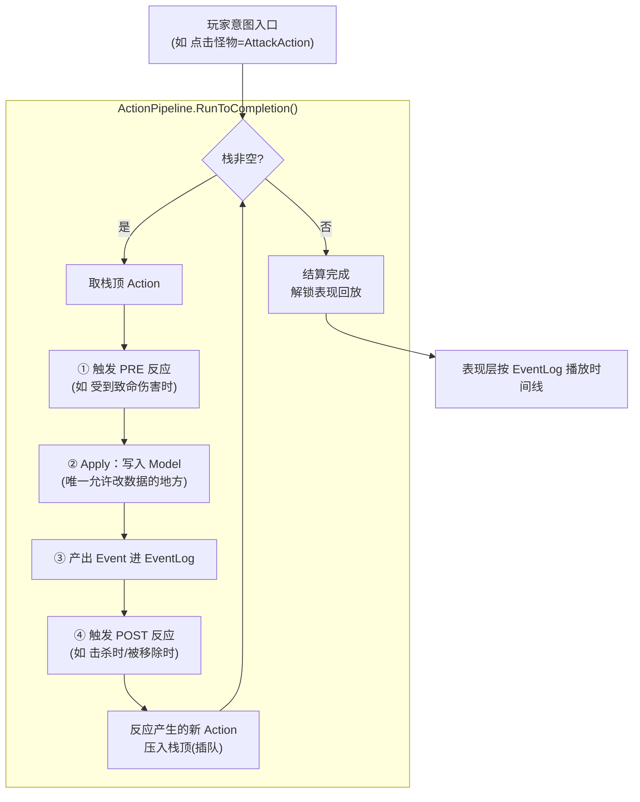

**关键设计：反应入栈（深度优先）**。当 A 动作触发了反应 B、C，B/C 被压到栈顶，会在"A 之后、原队列剩余动作之前"先结算。这天然表达了"A **导致**了 B"的因果顺序，符合 [[RUL_战斗]] 定义的事件链。

### 5.3 元设计的事件链如何落地

[[RUL_战斗]] 规定的顺序：
```
[受到致命伤害时] → killMonster → [击杀敌方时] → removeCard → [被移除时]
```
在流水线里这样实现：

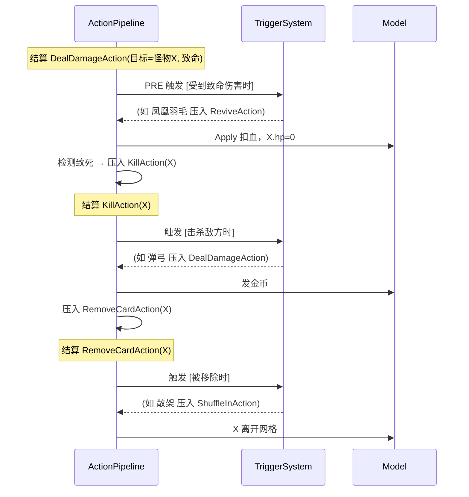

每个 `[前缀]` 都对应流水线里某个 Action 结算时的一个**触发点**。新增"某时机触发的效果"= 在配表里把效果挂到该触发点，**零内核改动**。

### 5.4 GameAction 原子清单（初版）

| 类别 | Action | 说明 |
|:--|:--|:--|
| 伤害/资源 | `DealDamageAction` | 走 [[RUL_战斗]] 伤害公式（减伤→金币抵消→护甲→血量） |
| | `HealAction` | 受"恢复翻倍"等 RuleModifier 影响 |
| | `GainArmorAction` / `LoseArmorAction` | 当前护甲增减，累计进 `armorLostCum` |
| | `ModifyGoldAction` | 金币增减 |
| 属性 | `AddModifierAction` / `RemoveModifierAction` | 增删一个带来源标签的 StatModifier（见第6节） |
| 卡牌 | `SpawnCardAction` | 从定义生成 CardInstance 到某 zone |
| | `MoveCardAction` | 改 slot/zone（含旋转、交换、拾取、洗入） |
| | `RemoveCardAction` | 卡离开区域，触发 removeCard |
| | `KillAction` | 怪物血量≤0 的击杀（必触发 removeCard） |
| | `ShuffleIntoDeckAction` | 洗入抽牌堆/加入卡池 |
| 棋盘 | `RotateBoardAction` | 顺时针旋转（受"多旋转一次"影响） |
| | `SwapSlotAction` | 交换两槽（不稳定/竖向拉杆/交换卡） |
| | `FillEmptySlotsAction` | 批量补牌（带防抖合并） |
| | `MarkSlotAction` | 标记福地等 |
| 流程 | `StartNodeAction` / `EndNodeAction` | 节点开始/结束阶段效果 |
| | `GrantRewardAction` | 三选一/宝箱/导师等 |

> **扩展性**：90% 的新效果用现有 Action 即可拼出。确实需要新动作时，新增一个 `GameAction` 子类（实现 `Apply()` + `EmitEvents()`），不碰流水线本身。

### 5.5 确定性与可调试

- 流水线把每个 Action 的"输入快照 + 产出事件"写入 **结构化日志**。出现"技能没生效"时，直接看日志这一条 Action 在哪个触发点、被哪个效果、改了什么。**告别瞎猜**。
- 配合带种子 RNG，任意对局可**完整回放**，做自动化回归测试。

---

## 6. 属性管线（StatSystem）：根治"加成消失/残留"

历史痛点："换敌人时历战加成没复原""怪物移除了攻击光环还在"。根因是**有人缓存了"有效值"**。本架构**永不缓存有效值**。

### 6.1 修正源模型（Modifier）

`StatBlock` 只存一串 **Modifier**，每个 Modifier 带：

```
Modifier {
  Stat       // 攻击/血量上限/基础护甲/减伤...
  Op         // 加/乘/覆盖
  Value
  Layer      // 持久 / 条件 / 临时  （对应 RES_属性管线 四层）
  Source     // 来源标签：哪个遗物/技能/卡实例/战斗
  Condition? // 条件层才有：何时算数（处于格X、血量<50%...）
  Scope?     // 临时层才有：本次战斗 / 单次 / 换敌复原
}
```

**有效值永远现算**（`EffectiveStatQuery`）：

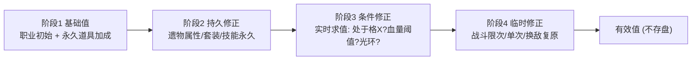

### 6.2 三类"消失/残留"问题如何自动正确

| 场景 | 机制 | 为什么不会错 |
|:--|:--|:--|
| 怪物移除→其攻击光环消失 | 光环是该怪物 `CardInstance` 上的 **条件 Modifier**，挂在它身上 | 卡实例销毁，Modifier 随之消失，下次现算自然没有 |
| 历战换敌复原 | "仅对当前敌人"= 临时层 Modifier，`Scope=换敌复原`，`Source=历战` | 换敌时只清 `Source=历战 且 Scope=换敌` 的 Modifier，**不动遗物/属性卡来源** |
| 处于格6攻击+2，离开消失 | 条件 Modifier，`Condition=AtSlot(6)` | 现算时条件不满足直接不计入，无需"手动移除" |

> **核心洞见**：把"会消失的加成"建模成**条件/临时 Modifier**，把"何时消失"变成**条件求值或来源清理**，而不是命令式地"记得在某处减回去"。命令式的"记得减回去"正是历史 bug 之源。

### 6.3 "改规则"类效果：RuleModifier

像 `操盘手(互动距离不限)`、`龙鳞甲(所有怪物攻击-1)`、`渴望(恢复翻倍)`、`范围扩大(视为相邻)`、`金币盔甲(金币抵消伤害)` —— 这些不改某个数值面板，而是**改写规则**。用 **RuleModifier 注册表**承载：

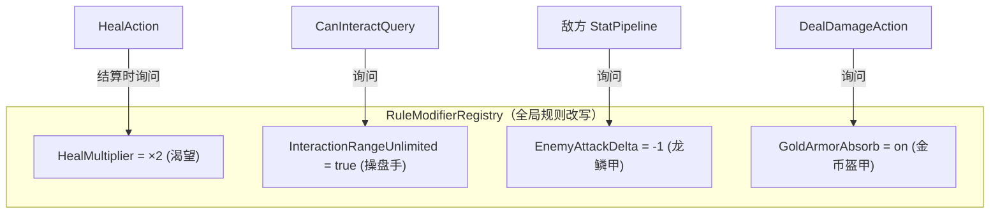

各系统在关键决策点**主动询问** RuleModifierRegistry，而不是被规则"硬编码"。新增一条规则改写 = 注册一个 RuleModifier + 在相关决策点加一次询问。

### 6.4 效果三态总表（铁律三落地）

| 元设计里的形态 | 本架构承载机制 | 例子 |
|:--|:--|:--|
| 属性（改数值面板） | **持久层 Modifier** | 木剑 攻击+1 |
| 常驻效果·改数值（条件光环） | **条件层 Modifier** | 处于格6攻击+2、相邻攻击+1 |
| 常驻效果·改规则 | **RuleModifier** | 恢复翻倍、互动无限制、所有怪物攻击-1 |
| 事件触发效果 | **TriggeredEffect → 投递 Action** | 每移动5次洗入乞丐、击杀时造成伤害 |

> 策划/AI 拿到一条效果，先判定它属于哪一态，落点唯一、不二义。这就是"复杂技能落地难"的解药。

---

## 7. 效果系统（核心中的核心）：触发 + 条件 + 动作

### 7.1 效果即数据

完全贴合 [[九宫牌局/00-核心概念/效果]] 的三段式定义。一条效果就是一份数据：

```jsonc
// 怪物技能「重新组合头」的 DSL 表达
{
  "id": "SKILL_recombine_head",
  "type": "怪物技能",          // 元标签，对应五防线第一道
  "kind": "Triggered",        // Triggered | Modifier | RuleModifier
  "trigger": { "type": "OnSelfMove", "every": 1 },
  "conditions": [
    { "type": "OrthoAdjacentHasCard", "defId": "skull_head" }
  ],
  "actions": [
    { "type": "RemoveCard", "target": { "type": "Self" } },
    { "type": "RemoveCard", "target": { "type": "OrthoAdjacentCard", "defId": "skull_head" } },
    { "type": "ShuffleInto", "defId": "big_skeleton", "into": "BattleDeck" }
  ]
}
```

```jsonc
// 遗物「废物发射器」
{
  "id": "RELIC_junk_launcher",
  "type": "遗物",
  "kind": "Triggered",
  "trigger": { "type": "OnUseHelpCard" },
  "actions": [
    { "type": "DealDamage", "amount": 2, "target": { "type": "RandomMonster" } }
  ]
}
```

```jsonc
// 遗物「龙鳞甲」的常驻规则改写 + 属性
{
  "id": "RELIC_dragon_scale",
  "type": "遗物",
  "stats": [ {"stat":"BaseArmor","value":1}, {"stat":"MaxHp","value":6} ],
  "kind": "RuleModifier",
  "rule": { "type": "EnemyAttackDelta", "value": -1 }
}
```

### 7.2 四类原子（程序维护的"词汇表"）

效果由四种正交原子拼装。程序只需把词汇表做厚做稳，策划就能组合出近乎无限的效果。

```mermaid
flowchart LR
    subgraph TRIGGER["Trigger 触发器 (何时)"]
        T1["OnBattle 战斗时"]
        T2["OnKill / OnRemove"]
        T3["OnUseHelpCard 用帮助卡时"]
        T4["OnSelfMove(every:N) 每移动N次"]
        T5["OnMoveToSlot(X) 移动到格X"]
        T6["OnEnter 登场"]
        T7["OnArmorBreak 护甲归零"]
        T8["OnDamageTaken / OnFatalDamage"]
        T9["OnNodeStart / OnNodeEnd"]
        T10["OnRotate / OnInteract"]
        T11["OnCumulative(资源,阈值) 累计满N"]
    end
    subgraph COND["Condition 条件 (是否)"]
        C1["AtSlot / AtSlotGroup"]
        C2["AdjacentTo(化身/卡)"]
        C3["HpBelowPct / ArmorExists"]
        C4["HasCardOnBoard(defId)"]
        C5["OwnsRelicSet 套装"]
        C6["LevelParity 等级奇偶"]
    end
    subgraph TARGET["Target 目标选择器 (对谁)"]
        G1["Self / Player"]
        G2["RandomMonster / AllMonsters"]
        G3["OrthoAdjacentCards"]
        G4["SlotCard(X) / ColumnCards"]
    end
    subgraph ACTION["Action 动作 (做什么)"]
        A1["DealDamage / Heal"]
        A2["GainArmor / ModifyStat"]
        A3["MoveCard / Swap / Rotate"]
        A4["ShuffleInto / Spawn / Remove"]
        A5["AddModifier / GrantSkill"]
    end
    TRIGGER --> EFF["EffectInstance"]
    COND --> EFF
    TARGET --> ACTION
    ACTION --> EFF
```

**复杂技能 = 原子组合验证**（用游戏里真实技能举例）：

| 真实效果 | Trigger | Condition | Target → Action |
|:--|:--|:--|:--|
| 流浪幼崽（处于格6攻+2且先攻） | — (常驻) | `AtSlot(6)` | Self → 条件Modifier(攻+2) + Modifier(先攻标记) |
| 不休追击（移到玩家相邻则战斗） | `OnMoveToSlot(任一玩家相邻)` | `AdjacentTo(Player)` | Self → `BattleWithPlayer` |
| 落石（累计损失满10护甲洗入） | `OnCumulative(armorLost,10)` | — | — → `ShuffleInto(随机石人, BattleDeck)` |
| 凤凰羽毛（致命伤恢复50%并移除自身） | `OnFatalDamage` | — | Player → Heal(50%上限) + Self遗物→Remove |
| 废物老虎机（用帮助卡随机9选1） | `OnUseHelpCard` | — | → `WeightedRandom([子动作...])` |

> 注意最后一行：`WeightedRandom` 是一个**复合 Action**（动作里套动作）。原子库支持 `Sequence / WeightedRandom / Repeat / Conditional` 这类**组合子**，于是"随机触发一个效果""触发N次""满足才做"全是数据，不写代码。这是把效果系统升级成一门**小型可组合 DSL** 的关键，也是承载"后续任意效果"的底气。

### 7.3 原子注册表（程序如何加原子）

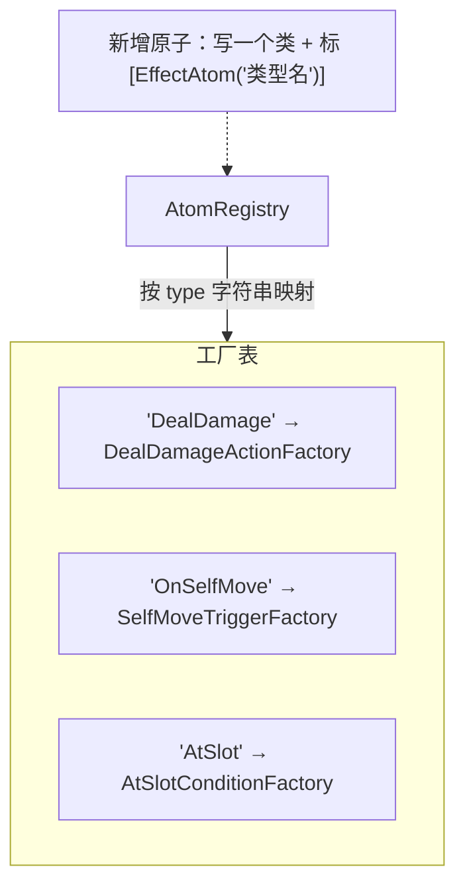

- 用**特性标注 + 反射**自动收集，加一个原子=加一个类，零散注册代码。
- 每个原子是**纯函数式小对象**：`DealDamageAction` 只懂"把伤害公式跑一遍"，不知道自己被谁触发。**单一职责 → 易测、不互相污染**。

### 7.4 效果生命周期（注册/注销）

效果何时"在场"决定它何时被触发。严格对应 [[效果类型隔离规范]] 的生命周期表：

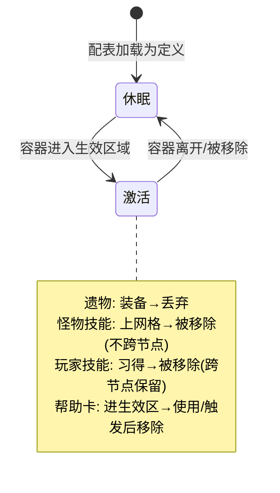

`EffectSystem` 负责：容器（遗物/卡/技能）激活时把其 `TriggeredEffect` 注册进 `TriggerSystem`、把 `Modifier/RuleModifier` 注入对应注册表；失活时全部撤销。**"怪物移除后技能必须全消失"由这套注册/注销机制兜底，不靠各效果自觉清理。**

### 7.5 五道防线 = 编译期 + 加载期校验

[[效果类型隔离规范]] 的五道防线直接落成**配表校验器**（加载期跑一遍，AI/策划填错立刻报错）：

| 防线 | 落地 |
|:--|:--|
| ① 类型元标签 | `type` 字段必填且枚举校验 |
| ② 专属必填字段 | 各 `type` 有独立 schema，缺字段报错（如遗物禁止出现"费用"字段） |
| ③ 互斥红线 | 校验规则：怪物技能 Action 不可作用玩家技能容器、帮助卡不可被洗入遗物池等 |
| ④ 统一动词 | 由 `kind` + `trigger` 推导行为模式（使用/触发/生效），与文本一致性检查 |
| ⑤ 同属性对比 | 用例库：黄金样例做快照测试，回归时比对 |

---

## 8. 棋盘与流程系统

### 8.1 BoardSystem（网格 / 旋转 / 相邻 / 补牌）

- 槽位、相邻判定、旋转路径（`1→2→3→6→9→8→7→4→1`）严格按 [[RUL_战场]] [[RUL_移动]]。
- 旋转/交换/补牌**都是 Action**，进流水线，因此"旋转倒刺（每移动受伤）""转速引擎（多旋转一次）"等通过在旋转 Action 的触发点挂效果即可。
- **补牌防抖**：`FillEmptySlotsAction` 内部合并短时多次请求，单次批量结算，杜绝并发吞卡（对应 [[RUL_发牌]]）。

### 8.2 PhaseSystem（内核状态机，用 FSMKit）

对应 [[FLOW_关卡循环]] 的节点状态机，是**内核状态机**（与表现状态机弱同步，见第 9 节）：

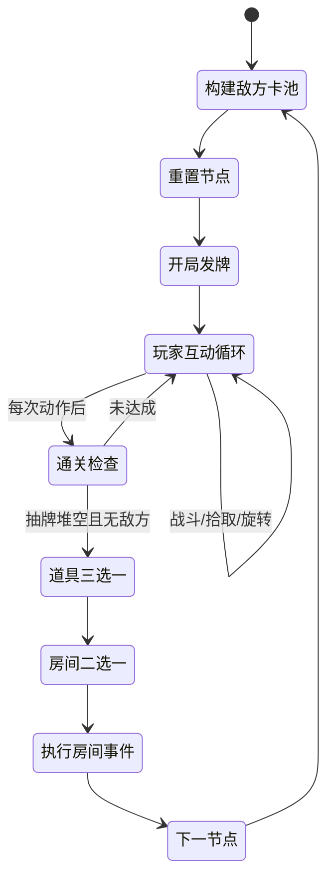

**状态即"合法指令集合"**：每个状态声明它接受哪些 Command。收到非法 Command（如互动循环外点怪物）直接丢弃 + 广播 `Evt_ActionRejected`。**表现层无需判断能不能操作（盲目乐观原则），由内核裁决**——对应你的顶层框架。

---

## 9. 内核 ↔ 表现：通信契约与异步握手

### 9.1 双状态机弱同步

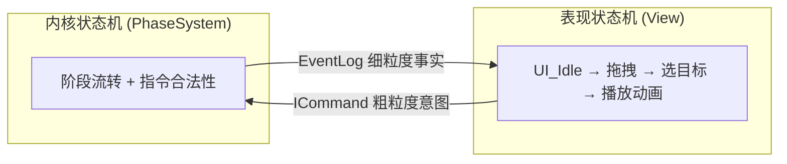

- **流入（表现→内核）**：粗粒度，只表达意图。`Cmd_PlayCard(uid,target)`、`Cmd_UseItem`、`Cmd_EndTurn`。悬停/拖拽等纯 UI 行为**绝不产生 Command**。
- **流出（内核→表现）**：细粒度客观事实。`Evt_DamageDealt(uid,amount)`、`Evt_CardMoved(uid,from,to)`、`Evt_StatChanged`…只陈述"发生了什么"，不说"怎么演"。

### 9.2 异步握手：事件流水账 + 表现时间线（推荐方案）

你的顶层框架提出"内核挂起等表现回执"。本架构采用**更鲁棒的等价变体**——**结算与表现解耦的"录像回放"模型**：

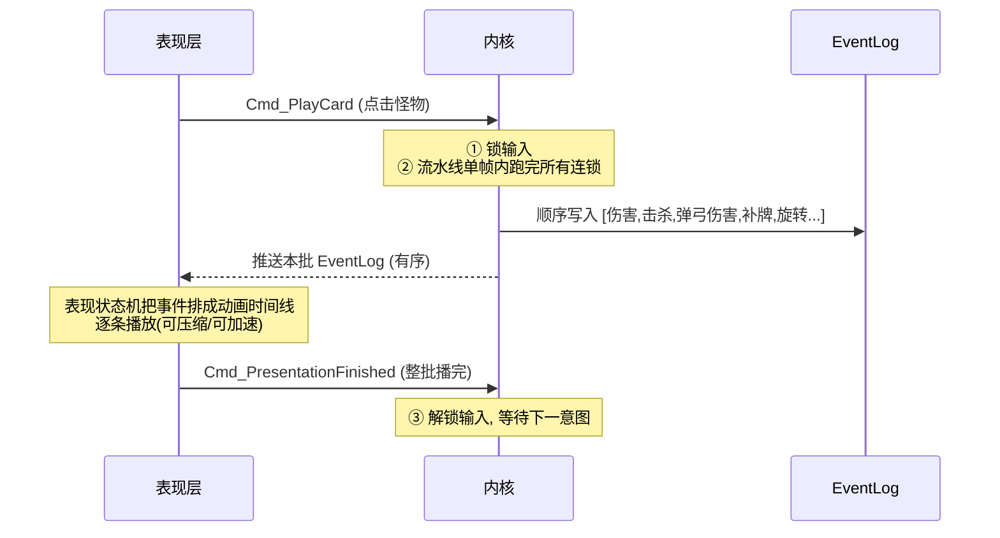

**为什么比"逐事件挂起"更稳**：

- 内核逻辑**单帧跑完**，绝不"等动画"，从根上消灭"动画卡住→逻辑死锁/时序漂移"这类历史顽疾。
- 表现是**纯消费者**，播放快慢、跳过、合并随意，不影响逻辑正确性。
- 整批结束才解锁输入 = 天然的输入锁（对应 [[FLOW_交互流程]] 输入锁定条件）。
- EventLog 本身就是**回放数据**，自动化测试、断线重连、存档都能复用。

> 若个别效果需要"演完中途再决策"（极少见，如玩家在动画中选目标），可在 EventLog 里插 `Checkpoint` 事件，表现播到 checkpoint 时回 `Cmd_CheckpointAck` 再续——保留了细粒度握手能力，但默认走粗粒度整批，简单可靠。

### 9.3 适配器/序列器模式

表现层为每种 `Evt_*` 写一个**适配器**（事件→动画），多个适配器由**序列器**按 EventLog 顺序编排（用 `ActionKit` 串/并行）。新增表现 = 加适配器，不动逻辑。

---

## 10. 数据驱动与配置管线

遵循你顶层框架的数据规范：**不用 ScriptableObject 配复杂逻辑/大表，统一 JSON/CSV（推荐 Luban）**。

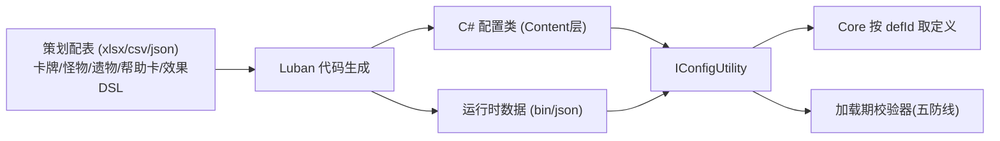

- **静态配置**（卡定义、效果 DSL、数值、概率）→ Luban。
- **运行时动态数据**（当前血量、网格状态、抽牌堆）→ Core 的 Model，表现只读。
- 效果 DSL 用 JSON 子表，AI 协助批量生成 + 校验器把关。

---

## 11. 确定性随机与可测试性

- `IRngUtility`：唯一随机源，**带种子**，`RunModel.seed` 决定整局随机序列。所有"随机怪物/随机奖励/老虎机"必须走它。
- 收益：① 同种子同操作 = 同结果，bug 必复现；② 可做**录像回放测试**：录一局操作序列，回放断言关键状态，作为效果系统的回归测试网。
- 内核可在**纯 C# 测试工程**里无 Unity 运行，效果原子逐个单测。

---

## 12. 一个完整实例：点击怪物的全链路

把上面所有系统串起来，看"玩家点击格6怪物"发生了什么：

```mermaid
sequenceDiagram
    autonumber
    participant V as 表现
    participant Cmd as PlayCardCommand
    participant Ph as PhaseSystem
    participant Pi as ActionPipeline
    participant St as StatSystem
    participant Tr as TriggerSystem
    participant M as Models
    participant L as EventLog

    V->>Cmd: Cmd_Attack(格6怪物uid)
    Cmd->>Ph: 当前状态=玩家互动? 是否正交相邻?
    Ph-->>Cmd: 合法 → 锁输入
    Cmd->>Pi: Enqueue(BattleAction(化身,怪物))
    Pi->>St: 询问双方有效属性(现算四层修正)
    St-->>Pi: 化身攻击=7, 怪物护甲=3...
    Pi->>Tr: 触发[战斗时] (除甲刀/历战怪物...)
    Tr-->>Pi: 压入相关 AddModifier/DealDamage
    Pi->>M: 走伤害公式 Apply
    Pi->>L: Evt_DamageDealt
    Pi->>Pi: 怪物hp≤0 → 压入 KillAction
    Pi->>Tr: 触发[击杀敌方时] (弹弓→压DealDamage; 打金刀→金币)
    Pi->>M: 发金币 +5
    Pi->>L: Evt_MonsterKilled, Evt_GoldChanged
    Pi->>Pi: 压入 RemoveCard → FillEmptySlots → RotateBoard
    Pi->>Tr: 旋转触发[旋转时]/移动计数++/位置触发
    Pi->>L: Evt_CardMoved×N, Evt_BoardRotated
    Pi->>Ph: 通关检查
    Pi-->>V: 推送整批 EventLog
    V->>V: 排成时间线播放动画
    V->>Ph: Cmd_PresentationFinished → 解锁输入
```

> 全程：表现只发了 1 个意图、收了 1 批事实；内核内部所有连锁在单帧确定性结算完毕。**这就是"强壮 Core"的体感。**

---

## 13. 这套架构如何根除三大历史痛点（回扣需求）

| 历史痛点 | 架构对策 | 关键机制 |
|:--|:--|:--|
| **复杂技能落地困难** | 效果=原子组合，含组合子 DSL（序列/随机/重复/条件） | 第 7 节 原子库 + 组合子 |
| **技能频繁失效/出错** | 单流水线串行 + 确定性 + 结构化日志 + 注册/注销兜底 + 现算属性 | 第 5、6、7.4 节 |
| **策划难以调整** | 全效果数据化（Luban 配表）+ 加载期五防线校验 + 热重载 | 第 7、10 节 |

---

## 14. 命名空间与目录建议

```
NineGrid.Core/            # asmdef: 纯逻辑
  Architecture/
  Models/                 # BoardModel, DeckModel, PlayerModel, RunModel, CardRegistry
  Systems/                # Phase, ActionPipeline, Trigger, Stat, Board, Deck, Economy, Reward, Effect
  Actions/                # GameAction 基类 + 各原子 Action
  Effects/                # IEffect, ITrigger, ICondition, ITarget, IAction, AtomRegistry
  Stats/                  # StatBlock, Modifier, StatPipeline, RuleModifierRegistry
  Events/                 # Evt_* 定义
  Utility/                # IRngUtility, IConfigUtility, ILogUtility

NineGrid.Content/         # asmdef: 数据 + 原子实现
  Atoms/                  # 各 Trigger/Condition/Action/Target 具体类 (标 [EffectAtom])
  Config/                 # Luban 生成的配置类
  Tables/                 # 配表源文件(xlsx/json) + 效果 DSL

NineGrid.Presentation/    # asmdef: 表现
  Views/
  Adapters/               # Evt_* → 动画
  Sequencer/              # 时间线编排(ActionKit)
  Input/                  # Command 发送
```

---