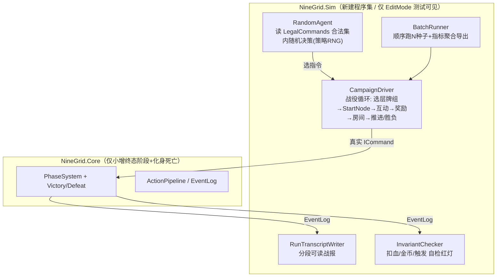

# 全流程自动模拟（Headless 真局回放）与压测 - 计划案

> 目标：在**不落地表现层**的前提下，让内核**通过真实玩家 command 通道**自动跑出一局**完整真局**（开局→27 关战斗/选择→通关胜利或中途暴毙），输出**人类可读战报**用于核对"流程是否符合设计、交战/扣血是否对得上"。本版本以**单进程完整跑通**为准；大批量并行与最优解 AI 仅做评估与后置规划。

---

## 0. 结论速览

- **地基够稳，且方向天选**：纯逻辑 Core（`noEngineReferences`）、确定性可回放 RNG、单帧 `RunToCompletion` 流水线、结构化 `EventLog`+`ActionLogProjector`、配置驱动建池 `BuildNodeDeckOptions`、已证明的全节点回放测试——这些正是"自动模拟"的全部前置。
- **但要跑"完整真局"，缺三类东西**：① 顶层**战役 driver**（楼层推进 / 真局结束）+ **胜负判定**（通关 / 暴毙）——Core 当前 `Floor` 恒为 1、化身永不死；② **随机但合法的自动玩家**（现在测试是手挑指令）；③ **可读战报输出 + 不变量自检**（扣血/金币对不对）。
- **不需要破坏现有基础**：以上都是"在 Core 边缘新增 + 新建一个独立模拟程序集"，不改流水线脊柱。唯一要小动 Core 的是加 `Defeat/Victory` 两个终态阶段与化身死亡检测，这与现有 `PhaseSystem` FSM 完全同构。
- **最优解 AI**：架构对搜索极友好（确定性+命令式+可回放），值得做，但**先做 greedy 启发式性价比最高**；完整 MCTS 的唯一硬前置是"状态克隆/回滚"，恰好与后续"多实例并行"共用同一底层改造，建议合并。

---

## 1. 现有地基盘点（已具备，直接复用）

| 能力 | 落点 | 说明 |
|:--|:--|:--|
| 纯逻辑内核可脱 Unity | `NineGrid.Core.asmdef` `noEngineReferences:true` | 仅依赖 QFramework；模拟可在 EditMode 测试运行器里跑 |
| 确定性可回放随机 | `Utilities/RngUtility.cs` `IRngUtility`（含 `CaptureState/RestoreState`） | 同种子同序列；为搜索/复现打底 |
| 单帧串行结算 | `Systems/ActionPipelineSystem.cs` `RunToCompletion()` | 与帧无关，纯 CPU；"一帧一 command"是**表现层节奏**，与逻辑吞吐无关 |
| 真实指令面 | `Systems/PhaseSystem.cs`：`StartNode/Attack/PickupItem/ClickEmpty/UseItem/SelectReward/SkipHelpChoice/SelectRoom/EnterRoom` + `LegalCommands`/`CanExecute` | 自动玩家只走这套，天然"还原真实玩家 command" |
| 配置驱动建池 | `Systems/RewardSystem.cs` `BuildNodeDeckOptions(nodeIndex, monsterDeckId)` | 按 `NodeDeckRule` 的 Level1/2/3(=阶段) min/max 随机抽怪 |
| 结构化事件流 | `Domain/Events/CoreGameEvent.cs` + `Presentation/ActionLogProjector.cs`（`ActionLogRow.Summary`） | 已有可读 summary，差一个"整局战报"聚合器 |
| 全流程可跑证明 | `Tests/P4NodeFlowTests.cs::FullNodeReplayScriptAssertsAllInteractionPaths` | 已手动跑完单节点全链；回放骨架 `P7ReplayFixtureRunner.cs` |
| 设计基准 | `Docs/.../层级系统.md` | 3 层 × 9 节点 = 27 关；杀三层层主=通关；每层随机选一套牌组 |

---

## 2. 缺口分析（要补什么）

### A. 顶层战役 driver + 胜负判定（需小动 Core）
- 现状：`AdvanceNodeAction` 只 `NodeIndex++`；`RunModel.Floor` 恒为 1；无"打完 9 节点进下一层"、无"杀三层层主=通关"、无"化身血量≤0=暴毙"（`CoreActions.cs:123` 只对**非化身**判定击杀，化身扣到负血也无事发生）。
- 需补：
  - Core：`GamePhase.Victory` / `GamePhase.Defeat` 两个终态；化身受伤后 `Hp<=0` → 推 `GameOverAction` 切 `Defeat` 并锁指令；节点推进时若 `Floor==3 && NodeIndex` 到顶且层主已清 → 切 `Victory`。楼层推进：每层 9 节点跑完 `Floor++` 并重置 `NodeIndex`（对齐 `层级系统.md`）。
  - 每层开局**随机选一套牌组**（弱精英/强精英/层主 三档按层），把 `BuildNodeDeckOptions` 接进 `StartNode` 的常规路径（现在常规路径只用 `CreateDefaultBattle()`）。

### B. 随机但合法的自动玩家（新建，不动 Core）
- 一个 `RandomAgent`：每步读 `LegalCommands` + 棋盘/待决态，**只在合法集合内随机选**：
  - 互动循环：在"相邻怪/相邻帮助卡/相邻空格(=旋转)/可用道具"里随机挑一个合法动作并随机挑目标。
  - 奖励：随机 `SelectReward` 或 `SkipHelpChoice`；房间：随机 `SelectRoom`/`EnterRoom`；商店/酒馆选项随机。
  - 用**独立的策略 RNG**（与内核 RNG 分离），保证"内容随机"与"决策随机"可分别控种子。
- **死循环防护**：每节点设互动步数上限 + 无进展(连续 N 步无击杀/无清场推进)检测，命中即判该局"卡死"并落档，不无限转。

### C. 可读战报 + 不变量自检（新建，不动 Core）
- `RunTranscriptWriter`：把 `EventLog`/`ActionLogRow` 聚合为分段战报——按 `层/节点/互动序号` 加小标题，逐行打印"谁打谁、伤害公式各级削减、剩余血/甲、金币增减、补牌/旋转、奖励/房间结果、通关/暴毙"，写到 `Logs/sim/` 或测试输出。
- `InvariantChecker`：边跑边断言"扣血=有效攻击经减伤/护甲/金币抵消后的值""金币结算符合 `EconomyConfig`""被移除怪触发奖励洗入"等——把你要肉眼核对的点变成自动红灯。

### D. 单进程批量收数（本版本范围内的"压测"雏形，不动 Core）
- `BatchRunner`：单进程**顺序**跑 N 个种子，每局收集指标（胜负、用了几步、化身受到总伤害、金币、各阶段出现了哪些卡、通到第几关暴毙等），聚合导出 `CSV/JSON`。
- **数值调参钩子**：跑批前对内存中的 `GameContentCatalog` 做**覆盖补丁**（如把 `飞刀` 攻击 6→8），无需改发行配置——`ContentSystem.Load(catalog)` 已支持注入自定义 catalog。
- **强制出现控制**（"让飞刀必现于 1/2/3 阶段"）：两条路线，先做便宜的——
  - 便宜：**种子搜索**，多跑种子、过滤出满足"该卡在某阶段出现"的局；
  - 精确：在建池处加一个**可注入的强制项**（`NodeDeckOptions` 预置该卡到指定 level 段），用于受控实验。

### E. 性能与吞吐（认知校正 + 低风险优化）
- "一次 command 尽量一帧算完"是**表现层节奏**约束；headless 下 `RunToCompletion` 同步执行、与帧无关，上千上万局的瓶颈只是**纯 CPU + GC**。
- 已发现的低垂果实：`ContentSystem` 多处在 `CreateDraft/Activate*` 里反复 `TryReloadFromConfig()`（每次重载 catalog）——批量场景下应缓存，**单点优化即可大幅提速**，不碰流水线。
- 真要"上万局并行"才需去单例（见 §5 后置）。本版本先把"单局完整真局"打穿。

---

## 3. 目标形态（模拟器结构）

---

## 4. 实施步骤（建议顺序）

1. **Core 终态与战役**：加 `GamePhase.Victory/Defeat`、化身 `Hp<=0`→`Defeat`、楼层推进与通关判定；常规 `StartNode` 走 `BuildNodeDeckOptions` + 每层随机牌组。（小动 Core，配套 EditMode 测试）
2. **RandomAgent**：合法集内随机决策 + 双 RNG（内容/策略分离）+ 死循环防护。
3. **CampaignDriver**：把 agent 与 27 关循环串起来，跑到 Victory/Defeat 收尾。
4. **RunTranscriptWriter + InvariantChecker**：产出可读战报、把肉眼核对点变自动断言；先用一个 `[Test]` 入口一键跑一局并落档到 `Logs/sim/`。
5. **BatchRunner + 调参/强制出现钩子**：顺序跑 N 种子、catalog 覆盖补丁、指标 CSV 导出。
6. **性能微调**：缓存 `ContentSystem` 的 catalog 重载等低垂果实。

> 落地时遵循 AGENTS.md：改完触发 Unity MCP 刷新读 Console、跑 EditMode 测试、全量提交。

---

## 5. 最优解 AI 玩家评估（按你最后的问题）

**问题**：能不能做"正统最优解自选——根据已有资源动态建模再做最佳选择"？投入大不大？对平衡开发有没有必要？

- **架构适配度：极高（天选）**。确定性内核 + 一切走命令 + RNG 可 `Capture/Restore` + 单帧结算 = 前向搜索三要素齐全（可试走、可比较、可复现）。分支因子也不大：每步主要在"≤4 相邻格 + ≤5 道具 + 2~6 选择项"里挑，旋转是确定的。这是一个**带随机的单人博弈**，对应 expectimax / MCTS 标准解法。
- **唯一硬前置**：廉价的**状态克隆/回滚**。当前是全局单例 + 可变 Model，没有 snapshot。搜索需要"克隆整局试走再回滚"，要么做 deep-clone，要么做"命令重放式回滚"。**这与后续多实例并行是同一个底层改造（去单例 + 可快照）**，建议合并立项。
- **投入梯度（强烈建议分级）**：
  - **Random baseline**（本计划已含）：投入最小，足以验证"流程能否跑通、数值是否离谱"。但随机乱选会**严重低估卡牌强度上限**。
  - **Greedy / 浅层启发式 AI**（性价比最高）：用简单评估函数（化身血量、金币、清场进度、场面威胁、相邻可达性）做 1~2 层贪心。**投入小、立刻把强度估计拉到合理区间**，足够支撑"飞刀 6→8 到底强了多少"这类平衡问题。
  - **完整 MCTS / expectimax**（仅在需要精确强度上限/最优打法时）：投入中等偏上，依赖上面的状态克隆改造。
- **对平衡开发的必要性结论**：要回答"这张卡在**会玩**的人手里强不强、能不能通关"，random 不够，但**不必一步到位上 MCTS**。**Greedy 启发式是当前阶段的最优投入点**；MCTS 留给"需要逼近理论上限"的专项。

---

## 6. 后置（本版本不做，仅登记）

- **多实例 / 多线程并行**：`QFramework.Architecture<T>` 是全局静态单例（`protected static T mArchitecture` + `NineGridArchitecture.Current`），同进程并行会互相踩。短期可用**多进程分片 seed**绕过（零 Core 改动）；长期与"AI 状态克隆"合并为一次"去单例 + 可快照"改造。
- 化身死亡/通关的**表现层**呈现：本版本只产出 EventLog 与战报，表现适配后续接入。

---

## 7. 待你确认的开放点

- 战报粒度：默认输出"每次互动一行 + 关键削减明细"。要不要更细（每个 Action 一行）或更粗（每节点摘要）？默认即可
- 暴毙后是否继续"复活续跑"以观察后段流程，还是如实终止该局（默认：如实终止，符合"真实真局"）？先做：随机无限血量，以“验流程为主”，再做：greedy 真实暴毙+自动从头开。配置可换。
