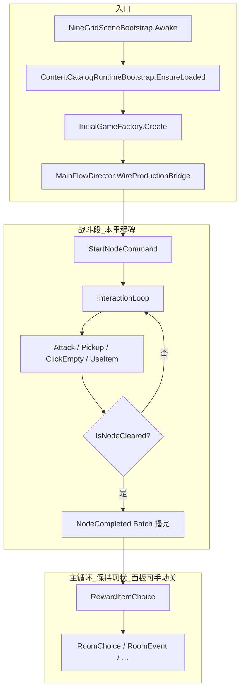

---
tags:
  - 落地
  - 表现层
  - 内核
  - 单局战斗
created: 2026-07-03
aliases:
  - 战斗闭环
---

# 单局战斗闭环落地指导

> **里程碑目标**：在真实 MainScene 生产管线上，把**单局战斗段**（开战 → 互动环 → 通关判定 → 战斗批次播完）跑通、跑对。Core / Shell **保持现有完整链路**，关后奖励屏、房间屏等**该弹就弹**；调试阶段在场景里**手动关掉对应 panel 根节点**即可，**不做 Core 硬截断、不改 Phase 机分叉**。
>
> **工作重心**：战斗内的数据、Command、Batch、Flow、Reconcile；不是 Shell 屏态裁剪。
>
> **非目标**（本阶段不做）：27 节点战役编排、职业选择、完整商店/酒馆交互打磨、存档。
>
> **依据**：《层级系统》节点内阶段 1–5；表现层蓝图第二版局内 FSM + Batch 脊柱；[`Core表现层Command与Event消费清单-2026-06-20.md`](Core表现层Command与Event消费清单-2026-06-20.md)。

---

## 1. 范围边界

### 1.1 本里程碑包含（战斗段）

| 阶段 | 《层级系统》 | Core `GamePhase` |
|------|-------------|------------------|
| 生成怪物侧卡组并入池 | `buildMonsterDeck` | `BuildEnemyPool`（含于 `StartNode`） |
| 重置节点、玩家回格 5 | `resetNodeState` | `ResetNode` |
| 开局发牌 + 补格 | `openingDeal` | `DealOpeningCards` |
| 互动循环 | `actionLoop` | `InteractionLoop` |
| 通关判定 | `clearCheck` | `ClearCheck` → `NodeCompleted` →（现有）`RewardItemChoice` … |

互动循环内每次 Command 后的子链路（Core 已串好）：

```
互动 Command → 战斗/拾取/旋转结算 → FillEmptySlots →（若击杀）旋转组 → 再次补牌 → IsNodeCleared?
```

**战斗段结束**的判定标准（本里程碑）：

1. `IDeckSystem.IsNodeCleared()` 为真；
2. 清关触发的 `NodeCompleted` 及相关 Batch **播放完毕**，`PresentationFinished` 已回执；
3. 棋盘 / HUD 批末 Reconcile 与 `CoreViewSnapshot` 一致。

此后 Core 会**照常**进入 `RewardItemChoice` 等主循环阶段——**预期行为**，不在本阶段改代码挡掉。

### 1.2 本里程碑不做的代码改造

- ❌ 不改 `PhaseSystem.CompleteNodeIfCleared` 截断关后奖励
- ❌ 不改 `GamePhaseFlowShellProjection` / `GamePhaseScreenMapper` 抑制 Shell 切屏
- ❌ 不新增 `BattleOnlyMode` 等 Core 旗标分叉

### 1.3 调试时手动处理 Shell 面板

关后/房间屏弹出时，在 **Inspector 或 Hierarchy** 里关掉对应根节点即可，与现有 `VerticalSliceSceneController` 思路一致：

| Panel 根节点（MainScene 常见命名） | 对应阶段 | 调试建议 |
|-----------------------------------|----------|----------|
| `MainPanel` | 主菜单 | 开战前关掉或切片模式跳 `NodePlaying` |
| `RewardPanel` | `RewardItemChoice` | **默认关掉**；需测三选一时再打开 |
| `RoomChoisePanel` / `RoomChoicePanel` | `RoomChoice` | 默认关掉 |
| `RoomEventPanel` | `RoomEvent` | 默认关掉 |
| `InfoPanel` | Victory / Defeat | 默认关掉 |

也可直接挂 [`VerticalSliceSceneController`](../../Scripts/NineGrid.Presentation/Debugging/Slices/VerticalSliceSceneController.cs)：`disconnectShellFlowOnStart` + `PresetInGame()`，用切片 Driver 发 `StartNodeCommand`，面板用 Inspector 按钮切换。

**原则**：面板是表现壳，不挡战斗链路验证；缺交互时用 `SelectRewardCommand` / `SkipHelpChoiceCommand` 等在 Console 或临时 Odin 按钮推进，或短暂打开 RewardPanel 点完再继续。

### 1.4 刻意延后（不挡战斗闭环）

- 战役层每层三选一牌组：首版固定 `nodeIndex=1` + `monsterDeckId`
- 职业开局 / 完整商店酒馆 UI
- Flow 时序抛光（反击并行、旋转双动画）——战斗能打完后再修

---

## 2. 目标终态

### 2.1 战斗段成功（本里程碑验收点）

1. 从 `StartNodeCommand` 到 `IsNodeCleared`，全程走 **Gateway → Core → Batch → Flow → Reconcile**。
2. 末怪击杀后的旋转、补牌、击杀 Batch **顺序播完**，输入锁正确升降。
3. `NodeCompleted` 事件进 EventLog；快照中场上无怪、抽牌堆空。
4. **允许**随后进入 `RewardItemChoice` 并弹出 RewardPanel——你若关了 panel，Core 状态仍是对的，可用 Command 推进或忽略。

### 2.2 战斗段失败

1. 化身阵亡 → `GamePhase.Defeat`（现有逻辑）。
2. Defeat 信息屏可手动关 `InfoPanel`；重点验证战斗中死亡 Batch 与锁输入。

### 2.3 现有 Core 关后链路（保持不动）

```csharp
// PhaseSystem.CompleteNodeIfCleared — 不修改
pipeline.Enqueue(new ChangePhaseAction(GamePhase.ClearCheck));
pipeline.Enqueue(new ChangePhaseAction(GamePhase.NodeCompleted));
pipeline.Enqueue(new NodeCompletedAction());
pipeline.Enqueue(new ChangePhaseAction(GamePhase.RewardItemChoice));
pipeline.Enqueue(new OfferRewardChoiceAction("help.choice", 3));
```

`GamePhaseFlowShellProjection` 映射到 `RewardScreen` 是**正确生产行为**；调试时用 §1.3 关 panel。

---

## 3. 真实链路全景（MainScene 生产路径）



---

## 4. 分阶段现状与缺口

### 4.1 开战（StartNode）

| 项 | 现状 | 缺口 |
|----|------|------|
| Command 管线 | ✅ 真实 Batch（入场 + 发牌 Flow） | — |
| 数据加载 | ✅ Luban / 硬编码 catalog | — |
| 怪物池 | ⚠️ `ShellCommandRouter` 用 `NodeIndex` **未 +1**，首关常 fallback 占位怪 | **P0**：显式 `BuildNodeDeckOptions(1, deckId)` 或修 router |
| 层牌组 | ⚠️ `monsterDeckId` 传空 | P0 写死 `deck.wandering_legion` |
| 玩家初始牌 / 化身 | ⚠️ 与职业设计不一致 | P1 对齐 catalog |
| 入口 | 主菜单点开始 或 切片 Driver | P0 二选一即可 |

```csharp
var options = rewardSystem.BuildNodeDeckOptions(nodeIndex: 1, monsterDeckId: "deck.wandering_legion");
gateway.Send(new StartNodeCommand(options));
```

### 4.2 互动环（InteractionLoop）

| 子能力 | Command | 缺口 |
|--------|---------|------|
| 攻击 | `AttackCommand` | ⚠️ 反击并行；占位怪无技能 |
| 拾取 / 空格 / 道具 | 已有 | 道具需真实 defId |
| 精英击杀洗牌 | Core ✅ | 表现跟发牌 Flow |
| 输入锁 | ✅ | — |

### 4.3 通关判定（clearCheck）

| 项 | 现状 |
|----|------|
| `IsNodeCleared()` | ✅ |
| `NodeCompleted` Batch | ✅（`SnapshotAlign`，无专属结算 Flow，可后补 Cue） |

### 4.4 关后主循环（不改造，仅知悉）

| 阶段 | Shell 屏 | 调试 |
|------|----------|------|
| `RewardItemChoice` | RewardPanel | 手动关 panel 或点选 / `SkipHelpChoiceCommand` |
| `RoomChoice` | RoomChoicePanel | 手动关 |
| `RoomEvent` | RoomEventPanel | 手动关 |
| `Defeat` / `Victory` | InfoPanel | 手动关 |

---

## 5. 已就绪清单

- `NineGridSceneBootstrap` 全套生产桥
- `InGameInteractionCoordinator` + Board/Hand FSM + `UseItemCommand`（含选项/目标）
- `PhaseSystem` 战斗阶段机
- `ContentCatalogRuntimeBootstrap` + StreamingAssets Luban
- `RewardSystem.BuildNodeDeckOptions`
- `ProductionBridgePlayModeTests`、`ScenarioDriverBase` / `DeckEntryDealSliceDriver`
- `VerticalSliceSceneController` 面板手动开关

---

## 6. 推荐实施顺序

### P0 — 战斗段跑通（1–2 天）

1. **开战数据**：`BuildNodeDeckOptions(1, "deck.wandering_legion")` + `StartNodeCommand`（切片 Driver 或修 `ShellCommandRouter` 的 `nodeIndex + 1`）。
2. **场景调试配置**：关 `RewardPanel` / `RoomChoicePanel` / `RoomEventPanel` / `InfoPanel`（或挂 `VerticalSliceSceneController`）。
3. **手打一局**：清光所有怪，确认 NodeCompleted 前后 Batch、Reconcile、HUD 正确。

**P0 验收**：战斗段结束条件满足（§2.1）；不要求关后无 panel 弹出。

### P1 — 战斗质量（2–4 天）

4. 真实 Luban 怪物 defId + 节点 1 配额。
5. Flow 时序：反击串行、旋转组去重。
6. PlayMode：小牌组自动 `StartNode` + 清关 Batch 断言（可参考 `DeckEntryDealSliceDriver`）。

### P2 — 内容与战中交互

7. 怪物技能 / 帮助卡效果回归。
8. 职业初始牌组 + 技能。
9. 关后 Shell 交互正式打磨（另开任务，本里程碑不挡）。

---

## 7. 验收标准（Checklist）

### 7.1 战斗段（必过）

- [ ] `StartNode` 后入场 + 开局发牌 Flow 完成，棋盘布局正确
- [ ] 攻击、拾取、旋转、至少一种道具可用
- [ ] 清关前：`IsNodeCleared() == false`；末怪死后经旋转/补牌链变为 `true`
- [ ] `NodeCompleted` 前进 EventLog / 对应 Batch 播完，`PresentationFinished` 解锁
- [ ] 批末 Reconcile 无幽灵卡/双位
- [ ] 怪物来自 catalog（非 `CreateDefaultBattle` 占位）

### 7.2 主循环（本阶段不验收 UI）

- [ ] （知悉即可）清关后 Core 进入 `RewardItemChoice` — **不要求**隐藏 panel
- [ ] 面板关闭时不影响已完成的战斗快照正确性

### 7.3 回归

- [ ] Core：`P4NodeFlowTests` 清关 + `NodeCompleted` 相关用例保持绿
- [ ] PlayMode：扩展 `ProductionBridgePlayModeTests` 或新增小牌组清关测试

---

## 8. 建议新增/复用（实现时参考）

| 用途 | 路径 |
|------|------|
| 开战 Driver | 复用 `Debugging/Slices/_Throwaway/*SliceDriver` 或薄 `BattleSessionDriver` |
| 面板开关 | 复用 `VerticalSliceSceneController` Inspector 预设 |
| PlayMode 测试 | `Presentation.Tests/PlayMode/BattleSessionPlayModeTests.cs` |

场景改动走 **Unity MCP**；**禁止手改 `.unity`**。

---

## 9. 与完整战役的关系

本里程碑只保证**战斗段子链路**与生产管线一致。战役编排（层牌组、27 节点、Shell 全屏交互）在战斗段稳定后叠加，**无需回滚任何「截断」代码**——因为从一开始就不截断。

后续叠加项：`ShellCommandRouter` 层牌组选择、`nodeIndex + 1`、职业 `InitialGameFactory`、商店/酒馆 UI。

---

## 10. 相关文档

- [`层级系统.md`](../Docs/九宫牌局/05-职业与层级/层级系统.md)
- [`九宫牌局权威顶层架构设计.md`](九宫牌局权威顶层架构设计.md)
- [`Core表现层Command与Event消费清单-2026-06-20.md`](Core表现层Command与Event消费清单-2026-06-20.md)
- [`归档/垂直切片开发方案.md`](归档/垂直切片开发方案.md)

---

*最后更新：2026-07-03 — 修订：不硬截断主循环；Shell panel 调试期手动关闭；重心在战斗段链路。*
