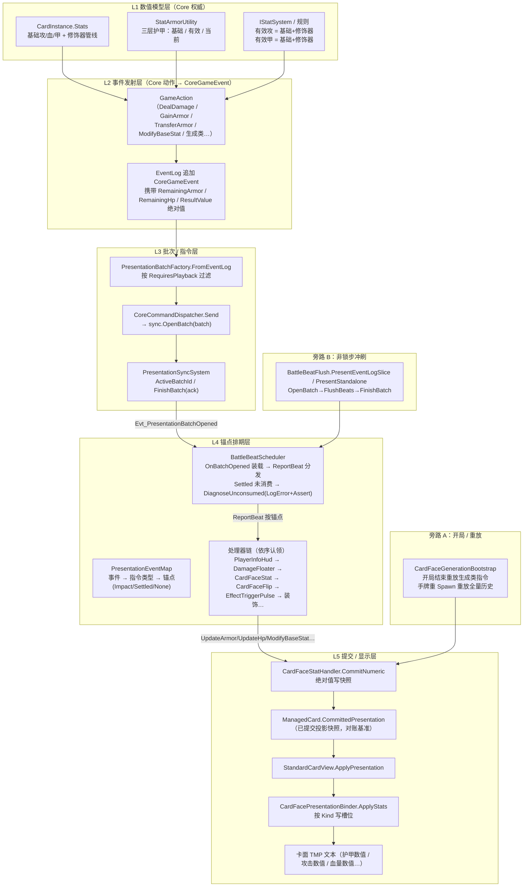
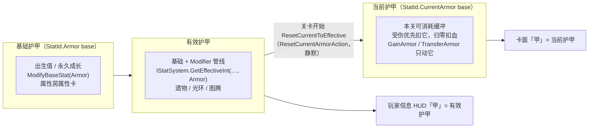
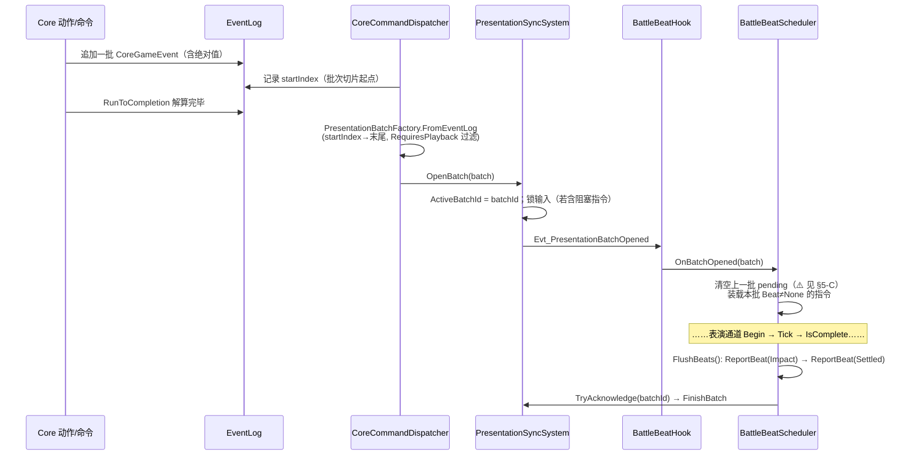
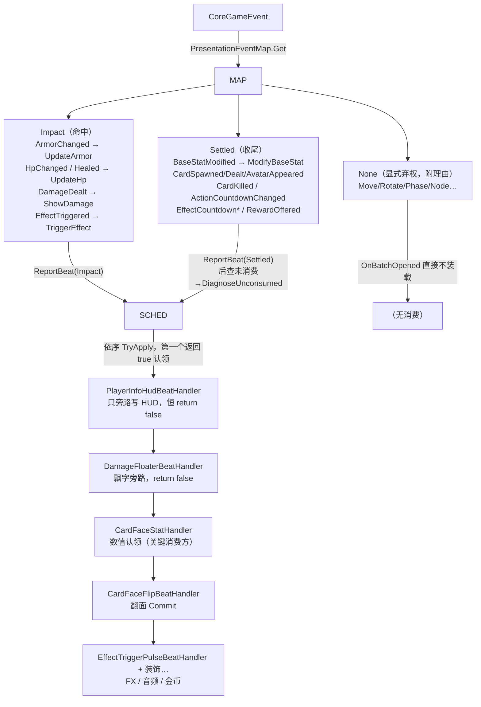
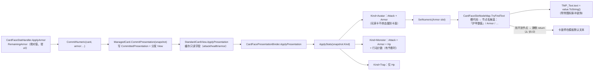
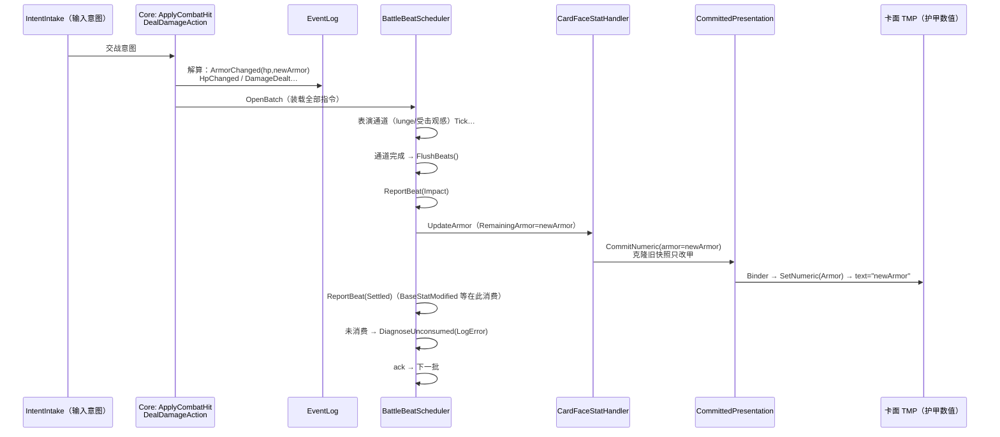
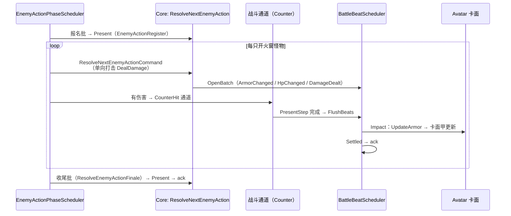
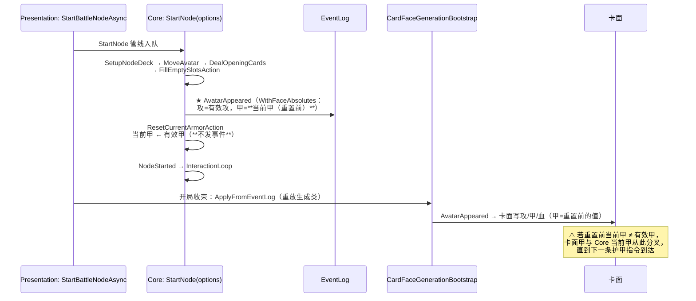

# 卡面数值显示链路 · 完整认知模型

> 目的：拉通「内核数值 → 卡面数字」的整条通道，建立可复用的认知模型。
> 本笔记**不做修复、不做诊断定论**；只陈述链路事实、设计不变量、以及链路中每一处「可能让显示与内核对不上」的缝隙（缝隙标为候选断点，待验证）。
> 性质：过程笔记（非权威）。权威行为不变量见 `docs/adr/0005-card-face-beat-commit.md`、`docs/adr/0028-damage-formula-armor-and-reduction.md`、`docs/code-map/presentation.md`。
> 日期：2026-08-10。全部结论来自源码通读（Core + Presentation 双侧）。

---

## 0. 一句话模型

**卡面上显示出来的每一个数字，都是「规则内核解算批次 → 事件日志 → 表现指令 → 表演锚点 → 卡面数值处理器 → 已提交投影快照 → 卡面 Binder → TMP 文本」这条单向、只出不进的命令链的产物。**

- 数字**永远来自结算指令**（携带结算后绝对值），卡面**永不回头读内核**。
- 这条链的任何一环**静默失效**，卡面就**停在旧值**——这是设计内行为（ADR-0005 第 2 条「不做兜底、不做强制对账」），不是巧合。
- 因此「卡面数字与内核不符」从模型上看只有两类原因：
  1. **该发的事件没发**（内核改了值但没产出指令）；
  2. **指令发出后没到卡面**（链路中某环吞掉了指令或没写入）。

---

## 1. 四条设计支柱（先立模型骨架）

| # | 支柱 | 出处 | 对认知模型的意义 |
|---|------|------|------------------|
| 1 | **权威值在 Core，卡面显示值有意滞后** | ADR-0005 决策 1 | 卡面数字 ≠ 内核此刻的值是**正常态**；「滞后」由指令批次驱动，不是错误 |
| 2 | **显示值只来自结算指令，指令携带结算后绝对值，赋值不累加** | ADR-0005 决策 1 | 全链路只有一种「值」：指令里的绝对值；表现层禁止自行推算增量 |
| 3 | **无兜底、无强制对账**：漏接指令 → 卡面停在旧值；`Settled` 后未消费只报诊断与断言 | ADR-0005 决策 2 | 「卡面停在旧值」是**可预期的失效模式**，诊断靠穷尽性映射 + 日志，不靠运行时补救 |
| 4 | **唯一提交出口**：战斗锚点排期器 → 处理器 → `CommitPresentation`；禁止队列外直读 Core 刷数值 | ADR-0005 决策 3–5、ADR-0002 | 所有合法写入都汇入同一条链；发现「旁路直写」即视为违反模型 |

---

## 2. 总览：五层结构 + 两条旁路

**三条合法入口**：锁步批次（L3→L4→L5，战斗主通道）、开局重放（旁路 A）、非锁步冲刷（旁路 B）。三者最终都汇入**同一个处理器与同一提交出口**。

---

## 3. 分层详解

### 3.1 L1 数值模型层：数字从哪里来

**护甲是三层语义（ADR-0028 / CONTEXT）：**

- `StatArmorUtility.GetCurrentArmor(card)`：有 `CurrentArmor` 键取它；**没有键时回退基础护甲**（`StatArmorUtility.cs:23-36`）。
- **显示约定**：卡面甲 = 当前护甲（本关可消耗）；HUD 甲 = 有效护甲（成长上限）。**这两个数字本来就允许不一样**——「卡面对不上」要先分辨是语义分叉还是真断层（见 §6）。
- 攻/血：卡面与结算都用 `GetEffectiveInt`（有效攻/有效血）。`ModifyBaseStat(Attack)` 事件特意携带**有效攻**而非基础值（ADR-0005 旁路约定），保证加攻卡显示与伤害结算一致。

---

### 3.2 L2 事件发射层：哪些动作产出哪些指令

**凡是能改卡面可见数值的动作，都必须产出结算事件**；事件按「动作 → 事件类型 → 携带的绝对值字段」组织：

| 动作（Action） | 事件类型 | 携带绝对值 | 锚点 | 备注 |
|---|---|---|---|---|
| `DealDamageAction` | `ArmorChanged` | `RemainingArmor`（`WithRemaining(hp, newArmor)`） | Impact | **仅 `armorLoss > 0` 时发**（CoreActions.cs:147-156） |
| `DealDamageAction` | `HpChanged` | `RemainingHp` | Impact | **仅 `hpLoss > 0` 时发** |
| `DealDamageAction` | `DamageDealt` | 伤害拆分 | Impact | 恒发；飘字/结算摘要消费 |
| `GainArmorAction` | `ArmorChanged` | `RemainingArmor` | Impact | |
| `TransferArmorAction` | `ArmorChanged` ×2（源/收） | 各自 `RemainingArmor` | Impact | 源方也发 |
| `HealAction` | `Healed` + `HpChanged` | `RemainingHp` | Impact | 双事件 |
| `ModifyBaseStatAction` | `BaseStatModified` | `ResultValue`（Attack 携带有效攻；MaxHp 另带 `RemainingHp`） | **Settled** | |
| 效果光环/图腾（EffectActions `EmitArmorChanged`） | `ArmorChanged` | `RemainingArmor` | Impact | 借甲光环等 |
| 怪物借甲光环旁路（`AppendCurrentArmorFaceCommit`） | `BaseStatModified`（StatId.CurrentArmor） | `ResultValue` | Settled | **仅 `CardKind.Monster`**（CardFaceEventValues.cs:125） |
| 加攻旁路（`AppendPermanentAttackFaceCommit`） | `BaseStatModified`（StatId.Attack） | `ResultValue`=有效攻 | Settled | 常驻/条件修饰器触发 |
| 生成类：`CardSpawned` / `CardDealt` / `AvatarAppeared` | 各自 | 攻=`ResultValue`，血/甲=`Remaining*`（`WithFaceAbsolutes`） | Settled | 造卡/发牌/亮相时写出生绝对值 |
| `CardKilled` | `KillCard` | `RemainingHp` | Settled | 可见血量归零走它，**禁止本地硬编码置零** |
| `ActionCountdownChanged` | `UpdateActionCount` | `ResultValue`=剩余 | Settled | 卡级共享倒计时（ADR-0038） |
| `EffectCountdownChanged` / `EffectCountdownCleared` | 倒计时投影 | `ResultValue`+`Message`=令牌键 | Settled | ADR-0035；`relic.*` 路由遗物栏 |
| `ResetCurrentArmorAction` | **无事件**（`GameActionResult.Empty`） | — | — | ⚠️ 见 §5-A |

**关键事实：条件发射。** `DealDamageAction` 只在「确实掉了甲」时发 `ArmorChanged`（`armorLoss > 0`）。护甲恰好为 0 时被打、或金甲全额吸收时，不发 `ArmorChanged`——此时甲没变，不发是对的。但**任何「改了当前甲却不发任何事件」的路径**都会让卡面失去同步源（§5-A）。

---

### 3.3 L3 批次 / 指令层：事件怎么变成可表演的指令

- **过滤规则**（`PresentationBatchFactory.FromEventLog`）：只装入 `MapEntry.RequiresPlayback == true` 的事件；`None` 锚点在 `OnBatchOpened` 再被滤一次（带「为何不上卡面」的理由，如 `CardMoved`、`BoardRotated`）。
- **批次是「解算切片」**：一次 `CoreCommandDispatcher.Send` = 一次解算 = 一个批次 = 一次开/关。
- **锁步**：`FinishBatch`（ack）前不得解算下一批（ADR-0001 / ADR-0034）。

---

### 3.4 L4 锚点排期层：指令在哪个时刻、被谁消费

**锚点只有三个（v1）：Impact（命中）、Settled（收尾）、None（不上卡面）。**

处理器认领链关键点（`PresentationCompositionRoot.InstallBattleBeatScheduler`）：

- `PlayerInfoHudBeatHandler` 对 `UpdateHp` 写 HUD 后**返回 false**（不认领），`UpdateArmor` 直接返回 false（战斗中当前甲只走卡面，HUD 不动），`ModifyBaseStat` 只写**基础甲** HUD 后返回 false——卡面认领权始终留给 `CardFaceStatHandler`。
- `CardFaceStatHandler.TryApply` 对 `UpdateArmor` 等数值指令**恒返回 true（认领）**——即使内部没有找到卡面/没有写入（见 §5-B 的缝隙语义）。
- `Settled` 报点后若还有已装载未消费指令 → `DiagnoseUnconsumed`：`LogError` + `Debug.Assert(false)`。**这是链路给出的第一条线上诊断。**

---

### 3.5 L5 提交 / 显示层：绝对值怎么变成屏幕上的字

- `CardFaceSlotCodes.Armor` 的文本候选名：`"护甲数值"`、`"Armor"`（`CardFaceSlotNodeMap.cs:50`）。玩家卡模板与怪物卡模板里都存在名为「护甲」「护甲数值」的节点。
- `SetNumeric` 只做 `clamped.ToString()` 直写；「数字跳动/脉冲」是旁路装饰（不影响值）。
- `StandardCardView` 里有一套遗留的 PixelDigit 数字/方块护甲显示（≤7 用方块、>7 用数字），**新流程 Binder 存在时不走**；仅在无 Binder 的完整 Prefab 特例回退路径使用（§5-G）。

---

### 3.6 旁路：开局重放与非锁步冲刷

| 旁路 | 触发点 | 行为 | 代码 |
|---|---|---|---|
| **开局生成重放** | `StartBattleNodeInternalAsync` 收束处 | 从本节点 EventLog 起点重放**生成类指令**（Spawn/Dealt/AvatarAppeared/倒计时）到 `CardFaceStatHandler`，与 Settled 同一出口 | `CardFaceGenerationBootstrap.ApplyFromEventLog`（Opening.cs:922） |
| **手牌重 Spawn 历史重放** | 棋盘选择模式重挂视图 | 按 EventLog 顺序重放该 uid 的**全部**卡面数值指令 | `ApplyFaceHistoryForUid`（BoardSelect.cs:356） |
| **非锁步冲刷** | 道具非战斗使用等 | `OpenBatch → FlushBeats(Impact→Settled) → FinishBatch`；当批已开时走 `PresentStandalone` 旁路 | `BattleBeatFlush.PresentEventLogSlice` |

这三条旁路与锁步共用 `CardFaceStatHandler` 与 `CommitPresentation` 出口——**模型上不存在第二套卡面数值写入器**（源码扫描确认：无 View 直读 Core 写卡面的旁路残留）。

---

## 4. 关键时序场景

### 4.1 交战命中批（玩家打怪 / 怪反击）——护甲指令的标准旅程

**要点**：命中帧（Impact）上，护甲指令带着**结算后绝对值**到达；卡面一次赋值到位，不累加。卡面数字「有意滞后」= 表演播完才上屏，不是读内核拉齐。

### 4.2 敌方齐射（单向打击）

齐射每拍独立批次、独立 FlushBeats——**玩家卡甲的每次被扣都走这条 Impact 通道**。

### 4.3 开局 StartNode 管线（含一个模型疑点，见 §5-A）

---

## 5. 断点全景：这条链每一处「可能对不上」的缝隙

**模型铁律回顾**：漏接指令 → 卡面停在旧值（ADR-0005 无兜底）。所以下面的每一条缝隙，失效表现基本都是「卡面停在旧值/模板值」。

| 编号 | 缝隙位置 | 缝隙性质 | 失效表现 | 现状 |
|---|---|---|---|---|
| **A** | **发射缺口：改值路径不发事件** | 结构事实 + 疑点 | 卡面停在旧值 | **事实**：`ResetCurrentArmorAction` 静默重置当前甲（PhaseActions.cs:68-86）；**疑点**：开局管线中 `AvatarAppeared` 在重置**之前**发射（PhaseSystem.cs:167-169），开局卡面甲可能拿到「重置前值」→ 与 Core 分叉直至下一条甲指令。若你观察到的「护甲 11 卡住」出现在进战瞬间就错，本条是首要候选 |
| **B** | **认领即丢：Handler 认领了但没写入** | 结构事实 | 卡面停在旧值，且**无任何报错** | `CardFaceStatHandler` 对 `UpdateArmor` 恒返回 true（CardFaceStatHandler.cs:28-30,75-83）；`TryResolveCard` 失败（uid 查不到 ManagedCard）或 `card.View == null` 时静默 return，指令被认领并从 pending 移除。诊断只在 `ModifyBaseStat` 分支有 LogWarning；`UpdateArmor`/`UpdateHp` 分支**无日志** |
| **C** | **批次吞没：打开的批从未被 Present 消费** | 结构事实 | 指令静默消失，且**不触发** Unconsumed 诊断 | `OnBatchOpened` 会**先清空上一批 pending**（BattleBeatScheduler.cs:31）——若某次 `CoreCommandDispatcher.Send` 打开的批没有配套 PresentStep/FlushBeats（非锁步路径漏调、命令被拒后恢复、异常分支），该批指令在下一批开批时被无痕丢弃。`DiagnoseUnconsumed` 只能抓住「已装载未消费」，抓不住「从未装载」 |
| **D** | **槽位节点解析失败：Binder 找不到 TMP 节点** | 结构事实 | 卡面永远显示**模板默认文本** | `CardFaceSlotNodeMap.TryFindText` 找不到时静默 return（CardFacePresentationBinder.cs:564-569）。玩家卡模板若 TMP 节点名不是「护甲数值」/「Armor」候选集之一，或节点挂在 Binder 找不到的作用域，护甲槽**永远不写**——此时你看到的就是预制体里烘焙的默认数字（比如「11」） |
| **E** | **模板默认文本冒充实时值** | 结构事实 | 卡面显示恒等于预制体里写的初值 | 与 D 组合：预制体 TMP 的初始 text 会一直显示直到第一次 Commit。若「11」就是模板默认值，而指令又一直没到（A/B/C 任一），表现就是「始终 11」 |
| **F** | **快照残留：对账/重放以已提交快照为准** | 设计内 | 对账无法纠错 | `ReapplyCommittedPresentation` / `SyncAllSpawnedCards` / `ApplyVisualsPreservingCommittedStats` 重放的是**已提交快照**（不是 Core 最新值）。快照本身若已错，任何对账都忠实重放错误——这是 ADR-0005「无强制对账」的必然结果 |
| **G** | **双显示路径：底盘遗留 PixelDigit 数字/方块甲** | 遗留 | 出现第二显示源 | `StandardCardView` 的 `ArmorValue/ArmorBlocks` 数字与方块显示仅在被 Binder 存在的正式路径之外（无 Binder 回退）赋值；`Awake` 默认 `armor=0` 隐藏。若某模板未挂 Binder 却保留了旧锚点，会显示遗留数字/方块（与 TMP 并存） |
| **H** | **处理器顺序依赖** | 结构事实 | 认领错位 | 认领链顺序（HUD→Floater→CardFace…）是装配顺序敏感的；`PlayerInfoHud` 对 `UpdateHp` 先旁路写 HUD 再 return false 是显式设计（PlayerInfoHudBeatHandler.cs:35-40）。顺序被改动会导致数值被提前认领 |
| **I** | **HUD/卡面语义分叉（不是断层）** | 设计内 | 两边数字「对不上」 | 卡面甲=当前甲、HUD 甲=有效甲（ADR-0028）。玩家信息 HUD 与玩家卡并排看时数字可以不同——先确认你比较的是同一语义 |
| **J** | **护甲 0 时事件不发** | 设计内 | 无影响 | `armorLoss == 0`（甲为 0 被打、金甲全抵）不发 `ArmorChanged`——甲不变所以不发是对的；但「甲被打到 0」的那次是 `armorLoss>0`，**会发**，不在此列 |

**把「护甲 11 卡住」的症状对号入座**（候选，待验证）：症状=「初始正确（11），被打掉后不更新」→ 指令曾到达过（说明 D/E 单独不成立或部分成立），此后断了 → 优先查 **C**（该次扣甲的批被吞）、**B**（该次指令被认领但没写——注意 `ApplyArmor` 无任何日志）、其次查 **A**（该次扣甲走的是静默路径而非 DealDamage）。验证手段见 §7。

---

## 6. 护甲专项：三层护甲的全读写路径

| 路径 | 改哪层 | 发什么事件 | 卡面结果 |
|---|---|---|---|
| 受伤（`DealDamageAction`，含金甲） | 当前甲 | `ArmorChanged`（甲损>0 时）+ `HpChanged`（血损>0 时）+ `DamageDealt` | Impact 写卡面甲 |
| `GainArmorAction`（叠甲） | 当前甲 | `ArmorChanged` | Impact 写卡面甲 |
| `TransferArmorAction`（转甲） | 当前甲×2 | `ArmorChanged`×2 | Impact 写双方卡面甲 |
| 效果/光环直改当前甲（图腾借甲等，EffectActions） | 当前甲 | `ArmorChanged`（`EmitArmorChanged`） | Impact 写卡面甲 |
| 怪物借甲旁路（`AppendCurrentArmorFaceCommit`） | 当前甲（**仅怪物**） | `BaseStatModified(CurrentArmor)` | Settled 写怪物卡面甲 |
| `ModifyBaseStatAction(Armor)`（永久加基础甲） | 基础甲 | `BaseStatModified(Armor)` | Settled：`CardFaceStatHandler.ApplyBaseStat` 把 `ResultValue` 写卡面甲；HUD 同步刷基础甲 |
| `ModifyBaseStatAction(CurrentArmor)`（若有路径） | 当前甲 | `BaseStatModified(CurrentArmor)` | Settled 写卡面甲（处理器同分支） |
| 关卡开始 `ResetCurrentArmorAction` | 当前甲←有效甲 | **无** | ⚠️ 见 §5-A |
| 开局/生成 `AvatarAppeared` / `CardSpawned` | 读当前甲 | 携带 `RemainingArmor` | Settled/开局重放写卡面 |

**不对称点（值得记住的模型细节）**：

1. **玩家（Avatar）当前甲的变更只走 `ArmorChanged`（Impact）；怪物当前甲的变更额外有 `BaseStatModified`（Settled）旁路**——`AppendCurrentArmorFaceCommit` 显式 `card.Kind != CardKind.Monster → return`。两者提交出口相同，但锚点与事件类型不同。
2. `AvatarAppeared` 携带的是**当时**的当前甲，不是有效甲——与紧随其后的静默重置构成顺序疑点（§5-A）。
3. `MaxHp` 变更事件用 `RemainingHp` 携带耦合后的当前血；卡面 `ModifyBaseStat` 分支对 `MaxHp` 特意取 `RemainingHp` 而非 `ResultValue`（CardFaceStatHandler.cs:223-231）。

---

## 7. 验证与观测手段（给后续排查用的工具箱）

| 手段 | 位置 / 触发 | 能回答什么 |
|---|---|---|
| `BattleBeatScheduler.DiagnoseUnconsumed` | Settled 后自动 `LogError` + `Assert(false)` | 该批有指令**装载了但没人消费**（排除 §5-B 的「已认领」情形；**抓不住 §5-C 的「从未装载」**） |
| 战斗日志（BattleTrace/FlowTrace） | `BattleTraceRecorder`（Op 级事件切片）；`FlowTraceRecorder.CardFaceBaseStatCommit`（每次 BaseStat Commit 落 trace） | 某次扣甲拍：Core 事件里有没有 `ArmorChanged`（验 §5-A）、有没有 OpenBatch/FlushBeats 记录（验 §5-C） |
| `ApplyArmor` 无日志 | 源码事实 | 若怀疑 §5-B：需要临时加日志或断点确认 `TryResolveCard`/`View` 状态 |
| 手动对照检查 | 进战瞬间先看卡面甲 vs HUD 甲 | 分辨 §5-A（开局即错）与战斗中断链（中局才错） |
| Editor 检查模板 | 玩家卡标准模板.prefab 的「护甲数值」TMP 节点名 + 默认 text | 验 §5-D/E：节点名是否在候选集；默认文本是否恰好是「11」 |
| 日志分析技能 | `.cursor/skills/table-nine-battlelog-analysis/` | 战斗/流程/表现日志的既有分析流程 |

**分诊顺序建议**（供后续排查，非本期任务）：先确认「开局瞬间甲对不对」→ 对：查战斗中断链（C→B→A 路径级）；不对：查 A（重置顺序）与 D/E（模板）。

---

## 8. 词汇对照（这套链路的语言体系）

| 词 | 含义 | 权威出处 |
|---|---|---|
| 权威值 | 规则内核此刻的真相（含跨战斗持久修正）；表演开始时一批解算往往已是终值 | CONTEXT.md |
| 卡面显示值 | 玩家看到的攻/甲/血，由结算指令在表演锚点驱动，**有意滞后于权威值** | CONTEXT.md / ADR-0005 |
| 结算指令（PresentationInstruction） | 一次解算批次产出的事实条目，数值类携带结算后**绝对值** | CONTEXT.md / ADR-0005 |
| 表演锚点（PresentationBeat） | Impact / Settled / None 三档语义时刻 | ADR-0005 |
| 投影提交（Commit） | 把表现投影某字段推到卡面消费端的动作；唯一出口是排期器→卡面数值处理器 | CONTEXT.md / ADR-0007 |
| 基础/有效/当前护甲 | 三层护甲语义（静态层/管线层/消耗层） | ADR-0028 |
| 卡面消费 | 卡面模板只消费表现投影里需要的字段，不回写 Core | CONTEXT.md |
| 解算批次（Batch） | 一拍被表演就位回执驱动的 Core 解算，配 OpenBatch/FinishBatch | CONTEXT.md / ADR-0001 |
| 就位回执（ack） | 一个批次表演播完、通知时间线可前进的信号 | CONTEXT.md / ADR-0001 |

---

## 9. 从模型出发：修复/改善策略的候选方向（仅方向，不落地）

拿到模型后，根治「数值对不上」的策略面大致有四类，按侵入度从低到高：

1. **发射完备性**（治 §5-A）：任何改变卡面可见值的路径必须产出结算指令；`ResetCurrentArmorAction` 等静默路径改为发事件（或把事件发射挪到重置之后）。
2. **认领审计**（治 §5-B）：`CardFaceStatHandler` 的「认领」与「写入成功」解耦——认领但没写时至少 LogWarning（对齐 `ApplyBaseStat` 的既有模式），避免静默丢指令。
3. **批次生命周期护栏**（治 §5-C）：开批必有消费——给「打开后从未 FlushBeats/从未 Present」的批在下一批开批清空时补一次诊断。
4. **装配/模板校验**（治 §5-D/E）：编辑器校验卡面模板的数值槽 TMP 节点名必须命中 `CardFaceSlotNodeMap` 候选集；数值槽 TMP 默认文本强制为空（而非烘焙数字）。

> 注意：任何「强制对账/表演结束拉回内核」的方向都与 ADR-0005 决策 2 冲突（历史教训：衍生 bug 多于挡掉的缺陷）——若未来要引入，应先以「诊断型对账」而非「静默拉齐」为形态，且需单独 ADR 决策。

---

## 附：本文涉及的源码文件清单（定位用）

| 层 | 文件 |
|---|---|
| Core 数值 | `NineGrid.Core/Domain/Stats/StatArmorUtility.cs` |
| Core 动作 | `NineGrid.Core/Domain/Actions/CoreActions.cs`（DealDamage/Heal/GainArmor/TransferArmor）、`ContentActions.cs`（ModifyBaseStat）、`EffectActions.cs`（EmitArmorChanged 等）、`PhaseActions.cs`（ResetCurrentArmorAction/RevealAvatarAction）、`BoardDeckActions.cs`（FillEmptySlots → AvatarAppeared） |
| Core 事件值 | `NineGrid.Core/Domain/Events/CardFaceEventValues.cs` |
| 批次/同步 | `NineGrid.Core/Presentation/PresentationBatch.cs`、`PresentationSyncSystem.cs`、`CoreCommandDispatcher.cs` |
| 事件映射 | `NineGrid.Core/Presentation/PresentationEventMap.cs` |
| 排期/处理器 | `NineGrid.Presentation/Flow/Presentation/BattleBeatScheduler.cs`、`IBattleBeatHandler.cs`、`CardFaceStatHandler.cs`、`PlayerInfoHudBeatHandler.cs`、`BattleBeatFlush.cs`、`BattleBeatHook.cs`、`BatchLockstepSteps.cs`（PresentStep）、`EnemyActionPhaseScheduler.cs`、`CombatCounterPresentChannel.cs` |
| 开局/重放 | `NineGrid.Presentation/Flow/Presentation/CardFaceGenerationBootstrap.cs`、`Flow/BattleSession/BattleSessionExecutor.Opening.cs` |
| 提交/显示 | `NineGrid.Presentation/Flow/CoreCardPresentationMapper.cs`、`Cards/CardManagerSingleton.cs`（ManagedCard）、`Cards/StandardCardView.cs`、`Cards/Presentation/CardFacePresentationBinder.cs`、`Cards/Slots/CardFaceSlotNodeMap.cs`、`Cards/Slots/CardFaceSlotCodes.cs` |
| 装配 | `NineGrid.Presentation/Setup/PresentationCompositionRoot.cs` |
| 模板 | `Assets/Resources/Prefabs/玩家卡标准模板.prefab`、`怪物卡标准模板.prefab`（含「护甲」「护甲数值」节点） |
