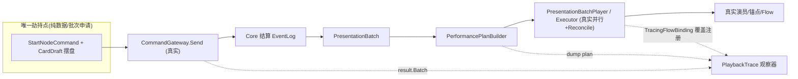

# 垂直切片表演测试：轻量真实管线调试方案

## 1. 可行性结论

可行，且大部分地基已就绪。真实生产管线已全线打通并有 PlayMode 闭环验证（[`ProductionBridgePlayModeTests.cs`](Assets/Scripts/NineGrid.Presentation.Tests/PlayMode/ProductionBridgePlayModeTests.cs)）：`CommandGateway.Send` → Core 结算 `EventLog` → `PresentationBatch` → `PerformancePlanBuilder`（按 `ActionId` 分组）→ `PresentationBatchPlayer` 并行播 Flow → 批末 `Reconcile` → `PresentationFinishedCommand` 解锁。

你要的"劫持"极小且与数据管线解耦：`CardRegistry.Create` 不查 catalog、`CardDraft` 直接写 stats，所以用 `StartNodeCommand(NodeDeckOptions.AddEnemyCard(new CardDraft{...}))` 就能在真实管线里精确摆盘，**完全不依赖 Luban**。缺数据只影响卡面 sprite（占位显示），不影响我们要测的运动/时序，因此可以放心先放一放数据对接。

## 2. 为什么必须走真实 MainScene（WYSIWYG 的命门）

现有 `PerformanceDebug` 面板很完整，但它是直接调单个 `IFlowBinding.Play`，**绕过** `PerformancePlanBuilder` 的 `ActionId` 并行分组和批末 `Reconcile`——它的"所见"≠正式游戏的"所得"。垂直切片要抓的恰恰是"分组/并行/对齐"层的联动暗病，所以必须挂在真实 [`NineGridSceneBootstrap`](Assets/Scripts/NineGrid.Presentation/Bridge/NineGridSceneBootstrap.cs) 的 `CommandGateway` 上跑。

## 3. 要建的基础设施：薄适配器（keeper，跨切片复用）

放在 `Assets/Scripts/NineGrid.Presentation/Debugging/Slices/`：

- `ScenarioDriverBase.cs`（MonoBehaviour，薄骨架）
  - 通用编排：`abstract NodeDeckOptions BuildDeck()`；`IEnumerator SendAndWait(ICommand)`（`gateway.Send` 后等 `!gateway.IsInputLocked`）；Odin `[Button] Seed()` / `[Button] Reset()`。
  - 从 `NineGridSceneBootstrap.Current` 取 `Gateway`/`Architecture`；子类只填盘面与步骤。
- `PlaybackTrace.cs`（纯工具，Tier1 观察器，零侵入）
  - `Dump(PresentationBatch)`：就地跑 `PerformancePlanBuilder.Build(batch)`，按 `ActionId` 组打印每个 `PlanStep`（`FlowId` + `FlowPayload` 关键字段），并在一组里出现多个"运动型 Flow"时打**并行告警**（这一步就能直接暴露"攻击+反击同组""旋转+8×MoveCard 同组"）。
- `FlowTraceRecorder.cs` + `TracingFlowBinding.cs`（Tier2 观察器，可选，仍零侵入）
  - 遍历 `FlowId` 枚举，对每个 `registry.TryGet(id, out inner)` 用 `registry.Register(new TracingFlowBinding(inner, recorder))` 覆盖（`Id => inner.Id`，字典按 Id 覆盖），记录每个 Flow 的 `Play`/`IsPlaying`结束/`Impact` marker 的墙钟时间，输出真实时序表。

一处 1 行的生产小改（属于"本就该有"的通用能力）：
- [`NineGridSceneBootstrap.cs`](Assets/Scripts/NineGrid.Presentation/Bridge/NineGridSceneBootstrap.cs) 暴露 `FlowRegistry` 只读属性（Tier2 需要）。`Gateway`/`BatchPlayer`/`Architecture` 已暴露。

## 4. 每个切片自己写的：厚脚本（throwaway，即测即删）

放在 `Debugging/Slices/_Throwaway/`（清理=删目录）：
- `XxxSliceDriver : ScenarioDriverBase`：本切片的 Odin 参数（`[LabelText]`/`[Button]`）、盘面 `BuildDeck()`、命令序列、期望值。
- 可选一次性 EditMode/PlayMode 测试，断言该切片的 batch/plan 形状。

每个切片一个 3 行 `[CustomEditor] OdinEditor`（沿用现有 [`MainFlowHarnessDriverEditor.cs`](Assets/Scripts/NineGrid.Presentation.Editor/MainFlowHarnessDriverEditor.cs) 写法）或依赖 Odin 全局绘制。

## 5. 首个切片：交战环（attack -> counter -> rotate -> fill）

`CombatSliceDriver`（厚脚本）：
- Odin 参数：敌人 `MaxHp`/`Attack`/所在槽（2/4/6/8，需与化身 slot5 正交相邻）、是否 `FirstStrike`、外圈其余卡（道具/敌人）、抽牌堆补位数量。
- Odin 按钮：`Seed 摆盘`（`StartNodeCommand`）、`Attack 选中怪`（真实 `AttackCommand(slot)`）、`Reset`。
- 全程真实：`AttackCommand` 之后 Core 自动产出 反击 `DamageDealt` → 击杀 `CardKilled` → `ResolveInteractiveRotation`（`RotateBoardClockwiseAction` + `FillEmptySlotsAction`），管线原样播放，`PlaybackTrace` 打印分组时序。

## 6. 首轮要抓的暗病（切片的价值兑现）

已从静态分析嗅到、待切片跑通后确认并修复（均为**生产层真实问题**）：
- 攻击与反击落在**同一 `ActionId`** → Plan 同组**并行**，视觉上"我打它/它打我"同时发生，而非"先攻击再反击"。（`PhaseSystem.Attack` 入队 + `PerformancePlanBuilder` 分组语义）
- `BoardRotated`（1×`BoardRotate`）与外圈 8×`CardMoved`（`MoveCard`）同组并行 → 同一圈牌可能被两套动画各推一次。
- `SlotsFilled` 常降级为 0 时长 instant，真正补位靠 `CardDealt`→`CardDeal`。
- `BoardRotate` binding 用**批末终态 snapshot** 解析外圈演员，但回放起点演员在旧位 → 索引/起点可能错位。
- `CounterattackFlow`/`CounterattackKillFlow` 已注册但 router 从不路由，反击实际复用 `CardAttackFlow`（对调 Actor/Target）。

修法留到跑通后按现象定夺（例如把反击拆到独立 `ActionId` 实现串行、或旋转组内让 `MoveCard` 与 `BoardRotate` 二选一）。

## 7. 通用 vs 本批专属（直接回答分类问题）

本就该有的通用地基（keeper）：
- `ScenarioDriverBase`（摆盘+发令+等解锁编排）
- `PlaybackTrace` / `FlowTraceRecorder`（批次/计划/时序观察器）
- `NineGridSceneBootstrap` 暴露 `FlowRegistry`
- 第 6 节各项暗病的**生产修复**（与测试无关，正式游戏必须对）

仅为本批切片额外造、用完即删（throwaway）：
- `CombatSliceDriver` 及其 Odin 参数/按钮
- 该切片的一次性测试脚本

## 8. 后续扩展

薄适配器就位后，新方向（发牌补位、用道具连锁、房间切换…）只需新增一个厚 `XxxSliceDriver` 填 `BuildDeck()`+按钮，复用同一观察器，即可低成本铺开到"所有交互场景"。附一份简短《垂直切片开发指南》固化套路。