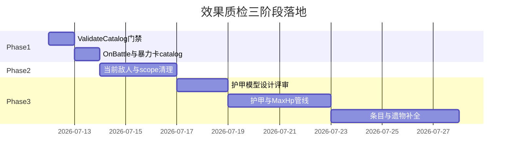

# 内核效果实现质检报告

> **初版**：2026-07-08 · 对照 `Assets/Docs` 设计案与 `NineGrid.Core` 实现，推演 DSL 体系能否达成设计语义。  
> **修订**：2026-07-11 · 对照 7/8–7/11 开发进展复盘，重排待落地项并规划三阶段实施。  
> **方法**：通读效果内核（`EffectSystem` / `EffectAtomLibrary` / `TriggerSystem` / `ActionPipelineSystem` / `CoreActions` / `StatSystem`），从 `TableNineContentCatalog` 抽样帮助卡 / 遗物 / 玩家技能 / 怪物技能推演运行时行为；7/11 起叠加 BattleLog 回归与 git 变更核对。

---

## 一、总体结论

### 1.1 体系可行性（不变）

原子 + DSL 拼接 + 触发点路由 + 栈式反应链（LIFO、深度上限 64）的表达力足以覆盖设计中绝大多数效果语义。抽样中瞭望塔、治疗泉、滚石、绑架卡、惹我试试、灼热观察、嘲讽、金币盔甲等复杂拼接均正确。

### 1.2 质量现状（2026-07-11）

| 维度 | 7/8 基线 | 7/11 现状 |
|------|----------|-----------|
| 效果目录 | 141 条 Implemented（计数口径见 §五） | **100** 条 `AddEffect`（Luban JSON 同步） |
| 遗物注册 | 19 / 设计 58 ≈ 1/3 | 19，未变 |
| EditMode 测试 | 1 文件 4 用例（仅 Command 壳） | **11 文件 ~30 用例** |
| 系统级缺陷 | 5 项（§二） | **5 项仍未修复** |
| BattleLog 实战 bug | 未列 | **6 类已修**（§三） |

**结论**：DSL 框架 intact，但 7/8 识别的生命周期与数值管线缺口几乎原封未动；7/8–7/11 开发重心在 BattleLog 驱动的实战 bug，而非报告 P0 系统修复。**「测试全绿」仍不能代表效果语义正确**——`ValidateCatalog()` 门禁尚未接入 CI。

---

## 二、系统级缺陷（开放项，按根因归类）

以下 5 项在 7/11 代码审查中**均未修复**，是「字面上已实现」效果偏离设计的共同根因。

### 2.1 临时修正作用域从不清理

`StatSystem.ClearModifiersByScope`、`StatBlock.ClearModifiersByScope`、`RuleModifierRegistry.ClearByScope` 均已定义，**全代码库仍无调用方**；`PhaseSystem` 战斗结束 / 换敌 / 节点切换路径无清理逻辑。

| 影响条目 | 设计语义 | 实际行为 |
|----------|----------|----------|
| `skill.battle_hardened` 历战 | 仅对当前敌人 +2 攻，换敌复原 | `UntilEnemyChanges` 叠加永不清理，指数成长 |
| `skill.monster_battle_hardened` 历战怪物 | 本卡战斗 +2 攻 | scope 机制坏；怪物短生命周期下结果侥幸正确 |
| 未来任何 `UntilBattleEnds` 玩家修正 | 战斗结束复原 | 必踩坑 |

**落地要点**：`PhaseSystem` 战斗结算收尾 → `ClearModifiersByScope(UntilBattleEnds)`；当前交战敌人变更 → `ClearModifiersByScope(UntilEnemyChanges)` + `RuleModifiers.ClearByScope` 同步；需先引入「当前敌人」追踪（设计案历战词条已隐含）。

### 2.2 裸 OnBattle 触发语义过宽

`DealDamageAction` post 固定含 `OnBattle`；裸 `{"atom":"OnBattle"}` 不要求 owner 参战、不区分出手/反击、任意伤害均触发。

一次玩家战斗 = 出手 + 反击两个伤害行动；飞刀 / 爆弹 / 效果反伤同样走 `DealDamageAction`。

| 效果 ID | 设计原文 | 实际行为 |
|---------|----------|----------|
| `skill.battle_hardened.battle` | 战斗时攻击+2 | 任意伤害各 +2，与 2.1 复合 |
| `skill.monster_battle_hardened.battle` | 本卡战斗 +2 攻 | 全场任意伤害均给本卡 +2 |
| `skill.survival_wisdom.battle` | 战斗时回血+1 攻 | 同上，一场吃两次 |
| `skill.space_mastery.battle` | 玩家与本卡战斗后旋转 | 任意伤害均转，飞刀也转 |

**对照组**（正确写法）：瞭望塔 / 治疗泉 / 刺皮 / 惹我试试 使用 `"sourceAction":"DealDamage","targetKind":"Monster","maxActionDepth":0` 全套过滤（catalog L228 / L267 / L284 / L850）。本卡相关还需 `EventFilter targetIs/actorIs Self`。

**落地要点**：纯 catalog 改动；catalog L432 / L508 / L514 / L908。

### 2.3 护甲三层模型未落地

设计（`01-机制规则/属性.md`）区分**基础护甲 / 有效护甲 / 当前护甲**；实现仅一个 `StatId.Armor` base：

- `DealDamageAction` 用 `GetBase(Armor)` 吸收并 `SetBase` 扣减（`CoreActions.cs` L62–76）；
- 木盾 / 重盔甲 / 木套装等 `StatModifier` 护甲只进快照 effective，**不参与伤害吸收**；
- 无节点开始「当前护甲 = 有效护甲」重置，跨节点 base 护甲不恢复；
- `relic.heavy_armor.node_start` 按 effective×0.5 灌回 base，语义与设计「补当前护甲」不符。

**落地要点**：需设计决策——落地 `CurrentArmor` 三层模型，或明确降级并让吸收读 effective（需定义「已消耗护甲」表示）。**阻塞所有护甲类遗物正确落地**。

### 2.4 MaxHp 修正与治疗封顶读 base

`HealAction` 封顶用 `GetBase(MaxHp)`；`AddModifier(MaxHp)` 只抬高快照，不增可用血量与治疗上限。

| 条目 | 现状 |
|------|------|
| `relic.vitality_amulet.max_hp` | Permanent StatModifier +6，无效 |
| `skill.hard_skin.max_hp` | Permanent StatModifier +10，无效 |

正确路径已存在：`ModifyBaseStatAction` 改 base MaxHp 时同步补 Hp。

### 2.5 目录校验门禁空转

- `ContentSystem.ValidateCatalog()`（DSL parse + schema + 引用完整性）**仍无运行时 / 测试调用方**；
- skill 文档仍引用已删除的 `P5EffectSystemTests` / `P6ContentLandingTests`；
- 100 条效果 JSON 笔误仅能在游戏跑到该效果时暴露。

---

## 三、7/8–7/11 已修复（BattleLog 驱动，报告初版未列）

| 问题 | 根因 | 修复 | 回归测试 |
|------|------|------|----------|
| 落石提前狂补石人 | `OnCumulative armorLost` 缺 `targetIs:Self` | catalog L659–665 + `CardZone Board` | `FallingRocksDeckGateRegressionTests` ×3 |
| 失败重开坚硬反伤叠乘 | Bootstrap 清卡不清 Effect/Trigger | `InitialGameFactory` Clear + Rebind | `HardReflectBootstrapRegressionTests` ×1 |
| 杀怪金币失效 | Clear Trigger 后 Economy 未重绑 | `IEconomySystem.RebindSystemTriggers()` | `EconomyKillGoldRegressionTests` ×1 |
| 石庇护 -2 双算 | DamageFlatDelta 叠层 | 行为由测试锁定 | `StoneShelterDamageFlatRegressionTests` ×3 |
| 尖石 OnArmorBreak 误触 | 他卡掉甲触发本卡 | owner 范围由测试锁定 | `SharpStoneArmorBreakRegressionTests` ×2 |
| 测试护栏恢复 | 仅 Command 壳 | +7 测试文件（流程/经济/CombatHit 契约） | 共 ~30 `[Test]` |

**表现层**（非本报告范围，见 `.cursor/plans/三问题日志排查方案_007e2c26.plan.md`）：击杀闪消失、金币房双飞币。

**落石次要偏差**（已修主 bug，设计偏差仍开放）：设计「随机石人军团（除巨石人）」vs 实现写死 `monster.stone_man` → 归入阶段三内容补全。

---

## 四、条目级偏差清单（待落地）

### 4.1 由系统缺陷导致（修 §二 后自动改善或需同步改 catalog）

| 条目 | 依赖缺陷 | 备注 |
|------|----------|------|
| 历战 / 历战怪物 / 生存智慧 / 空间掌握 | §2.1 + §2.2 | 阶段一补 OnBattle 过滤；阶段二接通 scope 清理 |
| 重盔甲 | §2.3 | 阶段三随护甲模型一并修正 node_start |
| 活力护符 / 硬皮 MaxHp | §2.4 | 阶段三改 `ModifyBaseStat` |
| 木盾 / 木套装等 modifier 护甲 | §2.3 | 阶段三护甲模型落地后生效 |

### 4.2 纯内容 / catalog 缺口（与系统缺陷独立）

| 条目 | 偏差 | 阶段 |
|------|------|------|
| 凤凰羽毛 | 缺 +8 MaxHp；fatal 治疗写死 15 非 50%；与「渴望」翻倍交互待设计确认 | 三 |
| 龙鳞甲 | 缺基础护甲+1、MaxHp+6；现仅 EnemyAttackDelta -1 | 三 |
| 暴力卡 | `scope:Once` DamageMultiplier 被任意玩家伤害消耗；需 sourceAction 约束 | **一** |
| 遗物覆盖率 | 19 / 58；蓝金品质缺口大 | 三（分批） |
| 落石随机池 | 写死 `stone_man` | 三 |

### 4.3 推演成立样本（无需改动，存档备查）

瞭望塔、治疗泉、滚石、绑架卡、偶数仇恨、嘲讽、金币盔甲、惹我试试、灼热观察、强硬（格1/4/7）、军械库 / 塔之子 / 轻松之路、献身 / 散架——拼接与触发路由均正确。详见初版 §3.1。

---

## 五、基线数字说明

| 指标 | 7/8 报告 | 7/11 现状 | 说明 |
|------|----------|-----------|------|
| 效果条目 | 141 | 100 | 7/8 后 catalog 无大规模删除；差异可能来自计数口径或分支快照，**不影响开放缺陷判断** |
| 遗物 | 19 | 19 | |
| Pending 效果 | 0 | 0 | |

---

## 六、三阶段落地规划

原则：**先护栏、再生命周期、最后数值管线与内容扩容**；每阶段结束应有可运行的 EditMode 回归，模板参照 `FallingRocksDeckGateRegressionTests`。

---

### 阶段一：质量门禁 + DSL 快修

**目标**：把「100 条 DSL 可解析可引用」和「4 条裸 OnBattle + 暴力卡」挡在编辑期 / 单测期，零内核结构性改动。

**范围**

| # | 任务 | 改动面 | 验收 |
|---|------|--------|------|
| 1.1 | `ValidateCatalog()` EditMode 门禁 | `NineGrid.Core.Tests` 新增 `ContentCatalogValidationTests` | `IsValid && PendingEffectIds.Count == 0` |
| 1.2 | 4 条裸 OnBattle 补过滤 | `TableNineContentCatalog.cs` L432/508/514/908 | 参照瞭望塔：`sourceAction+targetKind+maxActionDepth`；本卡加 Self 条件 |
| 1.3 | 暴力卡 `sourceAction` 约束 | catalog `help.brutality_card.use` L184–188 | 飞刀直伤不消耗 Once 翻倍 |
| 1.4 | 同步 Luban / StreamingAssets | `TableNineLubanDataExporter` + JSON | 与 catalog 一致 |
| 1.5 | 回归测试 | 新增 `OnBattleFilterRegressionTests`（或按条目拆分） | 出手一次触发、反击不重复、飞刀不触发 space_mastery |
| 1.6 | 更新 skill 验证清单 | `.cursor/skills/table-nine-effect-landing/references/verification-checklist.md` | 移除对已删 P5/P6 的引用，指向新测试类 |

**预估**：0.5–1 天。**不依赖**护甲模型或 PhaseSystem 大改。

**阶段完成标准**：EditMode 全绿；历战 / 空间掌握等不再被飞刀或反击误触发（scope 叠加问题仍在，但触发次数与来源已正确）。

---

### 阶段二：效果生命周期

**目标**：接通 `UntilBattleEnds` / `UntilEnemyChanges` 清理，使历战等临时修正语义与设计一致。

**范围**

| # | 任务 | 改动面 | 验收 |
|---|------|--------|------|
| 2.1 | 引入「当前交战敌人」追踪 | `RunModel` 或 `PhaseSystem` 战斗上下文 | 换目标怪时可检测 enemy uid 变化 |
| 2.2 | 战斗结束清理 | `PhaseSystem` 战斗结算收尾 | `ClearModifiersByScope(UntilBattleEnds)` + RuleModifiers 同步 |
| 2.3 | 换敌清理 | 敌人变更钩子 | `ClearModifiersByScope(UntilEnemyChanges)` |
| 2.4 | 回归测试 | `BattleHardenedScopeRegressionTests` | 连打同敌叠层有界；换敌后攻击复原 |
| 2.5 | 与阶段一 OnBattle 过滤联调 | — | 历战：每敌一次 +2，换敌清零 |

**预估**：2–3 天。**前置**：阶段一 1.2 已完成（否则清理前触发源仍过宽，联调难判）。

**阶段完成标准**：历战 / 生存智慧 / 空间掌握在 BattleLog 抽样对局中与设计文案一致；无无限叠攻。

---

### 阶段三：数值管线 + 内容补全

**目标**：落地护甲 / MaxHp 正确语义，补齐条目级 catalog 缺口，分批扩展遗物。

**前置决策**（阶段三启动前必须定案）

- 护甲：三层模型（推荐：`CurrentArmor` + 节点初始化）vs 降级方案；
- 凤凰羽毛：50% 治疗是否允许「渴望」翻倍；
- 遗物扩容批次与优先级（建议护甲类遗物等 2.3 定案后再落）。

**范围**

| # | 任务 | 改动面 | 验收 |
|---|------|--------|------|
| 3.1 | 护甲三层模型落地 | `CoreActions` / `PhaseSystem` OnNodeStart / 快照 | modifier 护甲参与吸收；节点重置当前护甲 |
| 3.2 | 重盔甲 node_start 语义修正 | catalog + 可能新 atom | 「补当前护甲」而非灌 base |
| 3.3 | MaxHp 词条修正 | `vitality_amulet` / `hard_skin` → `ModifyBaseStat` | 获得遗物后可用血量实际上限 |
| 3.4 | 凤凰羽毛 / 龙鳞甲补全 | catalog 新增 modifier / fatal 改百分比 | 对照 `Assets/Docs` 设计案 |
| 3.5 | 落石随机池 | `WeightedRandom` 或等价 | 除巨石人外的石人军团 |
| 3.6 | 遗物覆盖率分批落地 | catalog + 设计案 | 每批附带 ValidateCatalog + 最小集成测试 |
| 3.7 | 回归测试 | `ArmorModelRegressionTests` / `MaxHpRegressionTests` | 木盾吸收、跨节点护甲恢复、MaxHp 治疗封顶 |

**预估**：5–10 天（含设计评审）；遗物扩容可拆多 PR。

**阶段完成标准**：§二 2.3–2.4 与 §4 内容缺口关闭；护甲类新遗物可安全批量落地。

---

## 七、阶段依赖与建议排期

| 阶段 | 阻塞关系 | 可并行 |
|------|----------|--------|
| 一 → 二 | 二联调依赖一之 OnBattle 过滤 | 一之 ValidateCatalog 可与 1.2 并行 |
| 二 → 三 | 三之护甲/重盔甲依赖二完成（无硬依赖，但建议顺序） | 三之凤凰/龙鳞 catalog 可与 3.1 设计评审并行 |
| BattleLog 新 bug | 任意阶段均可插入小回归 | 沿用 7/11 模板，不阻塞主线 |

---

## 八、测试策略（跨阶段）

1. **门禁层**：`ValidateCatalog()` — 100 条 DSL 解析 / schema / 引用，阶段一必做。
2. **缺陷回归层**：每个 §二 开放项至少 1 条最小集成测试（7/11 已示范：BattleLog → JSON 片段 → EditMode）。
3. **Command 壳层**：保留现有 `CoreCommandShellTests` 等，不替代效果集成。
4. **落地流程**：改 catalog → 同步 Luban → `refresh_unity` → EditMode → 可选 BattleLog 复测（见 `table-nine-effect-landing` skill）。

---

## 九、文档与引用

| 文档 | 用途 |
|------|------|
| `Assets/Docs/` | 设计案原文 |
| `Assets/Notes/归档/战斗系统现状梳理-2026-07-09.md` | P0 效果 bug 在 AttackCommand 接线后放大 |
| `.cursor/plans/三问题日志排查方案_007e2c26.plan.md` | 7/11 落石 / 表现层排查 |
| `.cursor/skills/table-nine-effect-landing/` | 效果落地工作流 |
| `NineGrid.Core.Tests/FallingRocksDeckGateRegressionTests.cs` | BattleLog → EditMode 回归范本 |

---

## 十、一句话结论

**体系仍可行；7/8 五类系统缺陷待三阶段消化——阶段一（门禁 + catalog 快修）可立即开工，阶段二（作用域生命周期）解历战类硬伤，阶段三（护甲 / MaxHp / 内容）需设计定案后批量落地。** 7/8–7/11 已证明 BattleLog 驱动回归有效，应作为各阶段验收的固定动作，而非替代 `ValidateCatalog` 门禁。
