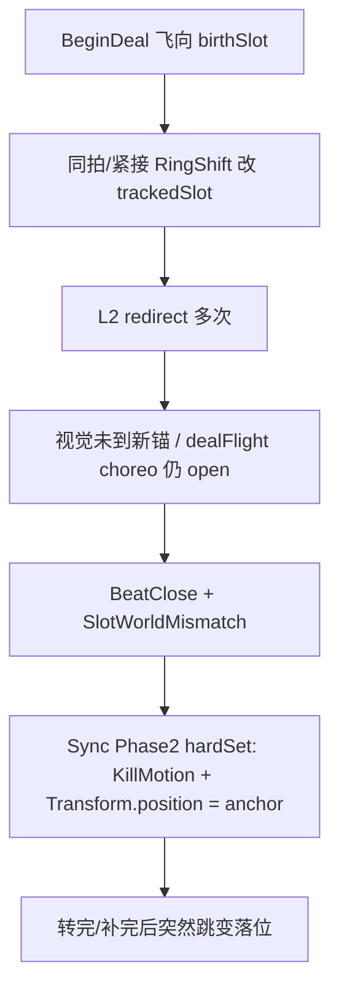

# 收敛静默失败收口 · 日志探查

> 日期：2026-07-16  
> 状态：**只探查、未改代码**  
> 依据：`.cursor/plans/收敛静默失败收口_e74fea09.plan.md`（阶段 A 诊断先行）  
> 对照：`Assets/Notes/多层级代理约束收敛驱动控制-范式设计.md`  
> 方法：table-nine-battlelog-analysis · 模式 C/D（Perf + Core + Registry）

---

## 一句话结论

本局（骷髅快速测试）里，**计划假设的「无塔/无 driver 静默 return」几乎没有发生**；玩家感知的跳变/强行落牌，主要由三条已点亮的硬路径造成：

1. **补牌飞行中被环移 redirect** → 视觉未到新格 → `SlotWorldMismatch` → `Sync.Occupancy.Phase2` **`hardSet` 直接写 `Transform.position`**  
2. **PostKillDrain / Sync 重锚** → `forceSnap` **`placeAtAnchor` + `killedTween=1`** 批量瞬移落格  
3. **就位栅栏仍偏时间语义** → 多起 `BarrierUnsatisfied`（多数差 1–4ms）；另有 `regs=0` 的空注册失败

阶段 A 诊断插桩有效：已能用日志锁定真凶入口。下一轮修应转向 **dealFlight↔ring 编排竞态** 与 **Sync Phase2 硬写世界坐标**，而不是优先做「EnsureTower 补塔」。

---

## 日志四件套

| 项 | 值 |
|----|----|
| stem | `QuickTest-20260716-095007-seed1` |
| sessionId | `20260716-095007` |
| seed | 1 |
| runTag | **QuickTest**（首关固定 `deck.skeleton_legion`；节点乱序；HP/ATK cheat） |
| Perf | `Assets/Notes/Logs/PerfLog/perflog-QuickTest-20260716-095007-seed1.json`（3178 events） |
| Core | `Assets/Notes/Logs/CoreLog/corelog-QuickTest-20260716-095007-seed1.json`（1318 events） |
| Registry | `Assets/Notes/Logs/OtherLog/RegistryLog/registrylog-QuickTest-20260716-095007-seed1.json` |
| Battle | `Assets/Notes/Logs/OtherLog/BattleLog/battlelog-QuickTest-20260716-095007-seed1.json` |
| 时长 | ≈ 92s |

同日另有 `20260716-095000-seed1` 四件套各仅 1 条事件，视为空会话，**不以该局为准**。

> QuickTest 不宜做数值回归，但足以做表现/时序接线复现。

---

## 阶段 A 假设 vs 实测

计划根因链：

```
无塔/无 driver → 静默 return → 卡留原地 → Sync forceSnap → 硬跳
```

| 计划预期信号 | 本局实测 |
|--------------|----------|
| `Anomaly` / payload 含 `noTower` / `noDriver` | **0** |
| `SlotFrame.SnapHome` 无塔 `forceSnap` | **0**（`SnapHome` 的 noTower 分支未命中） |
| `RegistryMiss` 因 AnimateSkip / driver 缺失 | **1**（仅 `Hand.VanishAfterApply` 陈旧句柄，无关落位） |
| `DrainLegacy` / `stepCount==0` 回退 | **0**（42 次 Drain 均有 step；无 Legacy 事件名） |
| `EnsureRepaired`（补塔成功） | 本局未作为主矛盾出现 |

**结论：本局跳变不是「塔没装上所以没走曲线」，而是「曲线/飞行被打断或未等到位后，Sync 用硬 snap 兜底」。**  
计划阶段 B（入口 Ensure 补塔）对本局症状的边际收益可能偏低；更该先修竞态与 Phase2 硬写。

---

## 异常总表（Perf）

| code / 类别 | 次数 | 含义（本局解读） |
|-------------|------|------------------|
| `MissingMotionEnd` | 67 | BeatClose 时仍有未收尾 motion（大量 DeckTween 结算 + 少数 SlotFrame 飞中关拍） |
| **`forceSnap`** | **21** | **Sync Phase2 硬落位诊断（跳变主指纹）** |
| `BarrierUnsatisfied` | 8 | 环移栅栏判定失败 |
| `SlotWorldMismatch` | 7 | 登记格锚 ≠ 世界坐标 |
| `ViewWithoutFieldOccupancy` | 6 | 视图在场模式但无占格 |
| `ChoreoIncompleteAtBeatClose` | 4 | 全部为 **`openChoreo=*:dealFlight`** |
| `OrphanAtWrongAnchor` | 3 | 空锚上贴了无格卡 |
| `FieldOccupancyWithoutView` | 1 | 占格有 uid 无视图 |

### SnapSet

| site | 次数 | reason | killedTween |
|------|------|--------|-------------|
| `FinalStateGuard.TowerSnap` | 56 | `restoreTower` | 0 |
| **`Ground.Place.Snap`** | **17** | **`placeAtAnchor`** | **全部 = 1** |

`SessionChoreoSummary`：`choreoPartialAnimateCount=0`，近期 rotate 记为 ok —— **「旋转完全没播」不是主诉**；问题在补牌/Sync 硬贴与个别卡掉队后硬纠偏。

---

## 真凶链路 A：dealFlight × 环移 redirect → hardSet

### 统计

本局 `dealFlightBegin` **22** 次；**全部** `budgetConsumed=0.000`（预算 consum 记账本身可疑，见文末诊断缺口）。

带 `ringDuringFlight`：**12** 次。其中升级为肉眼跳变指纹：

| uid | choreo | 标志 |
|-----|--------|------|
| **18** | 13 | ringDuringFlight + **SlotWorldMismatch** + **forceSnap:hardSet** |
| **14** | 15 | 同上 |
| 20 / 27 | 19 / 39 | ring + mismatch（未立刻 hardSet，或后续被别路径收） |

### 典型时间线 · uid=18（beat 6→7，t≈7449–7802）

```
t=7449  dealFlightBegin birthSlot=4
        SlotFrame.BeginDeal  from 牌库(4.78,3) → 格4(-2.06,0)  expectMs=505  choreo=13
t=7450  BeatClose(PostKillDrain) → MotionEnd endHow=beatClose + MissingMotionEnd
t=7450  同拍 BoardChoreo 环移 choreo=14：Explore ringShift trackedSlot 4→1
        连续 redirected ×3，新目标格1 (-2.06, 2.5)
t=7799  环上其它卡 Converge complete；uid=18 仍停在 (-2.06, 0)
t=7801  SlotWorldMismatch slot=1 xy=-2.06,0 anchor=-2.06,2.5
        ChoreoIncompleteAtBeatClose openChoreo=13:dealFlight
        forceSnap site=Sync.Occupancy.Phase2 verdict=hardSet
t=7802  dealFlightEnd budgetConsumed=0.000 outcome=ok  ← 飞行被宣称结束，预算未消耗
```

与计划 mermaid **同构**，但中间环不是「无塔静默」，而是：



`hardSet` 实现要点（`InBattleManagerSingleton` Sync Phase2）：在占格已正确、仅世界坐标偏离时：

- 打 `forceSnap` / `verdict=hardSet`
- `CardDeckTween.KillMotion`
- **`existing.Transform.position = anchor.position`**（未走 `SlotFrameConvergence.SnapHome`）

这是对铁律 2（禁止强制对齐）的显式违背，也是本局「强行落牌」最干净的代码级指纹。

uid=14（beat 11）同构：dealFlight 中环移 → mismatch → hardSet。

---

## 真凶链路 B：Sync Phase2 批量 `placeAtAnchor`

`forceSnap` 21 次按 verdict：

| verdict | 次数 | detail 模式 |
|---------|------|-------------|
| **placeAtAnchor** | 17 | 16× `reanchor`，1× `spawn` |
| **hardSet** | 4 | 坐标偏离纠偏（含链路 A） |

### 典型 · beat 20（t≈30150）一次清空重铺

Core `SyncDiff`：`vacated=8; placed=7; spawned=1`。  
Perf：连续 7 张 `Ground.Place.Snap` + `killedTween=1`，例如 uid=23 从牌库坐标 `(4.88,3)` 瞬移到格1 `(-2.06,2.5)`。

这对应「瞬间发牌到位 / 整盘被 Sync 拽齐」类体感，**不是**五次曲线收敛完成，而是 `RequestPlaceCardAtAnchor(snapToAnchor: true)` 杀 tween 硬贴。

后续 beat 22/26/28/30/32/56/72/80/82 仍有零星 `reanchor` placeAtAnchor，多与补位、占格重绑有关。

---

## 链路 C：BarrierUnsatisfied（次要 / 部分假阳）

8 次，全部 `site=Ground.RingShift.Barrier`。

| presBeatId | barrierWall − nowWall | regs | 解读 |
|------------|----------------------|------|------|
| 10,12,13,14,17,21 | **−1～−4 ms** | ≥1 | 时间栅栏在墙钟边界抢跑；环上 MotionEnd 已 complete |
| 25 | 0 ms | 1 | 贴边 |
| **26** | **−149 ms** | **0** | 真失败：`regCount=0`，无人注册却等栅栏 |

多数 `BarrierUnsatisfied` **不是「卡没动」的主因**（BoardSnap 显示环移后格位已变），而是阶段 C 所述「栅栏仍偏 sourceTime 预算、未绑死 driver.Completed」的边沿噪声。  
`regs=0` 那次需要单独查：空环 / 未 Register / 提前清空。

---

## 次要信号（勿过度解读）

### MissingMotionEnd ×67

大量为 **DeckTween** 在 BeatClose 时仍 open，随后几十到几百 ms 内 `complete` —— 诊断拍门过紧，不等于卡死。  
与跳变强相关的是 **SlotFrame.BeginDeal 被 beatClose** 且紧接环移的子集。

### FinalStateGuard.TowerSnap ×56

战斗 lunge 后 `restoreTower`，`killedTween=0`。可能造成轻微「弹回」，但本局主诉更贴合 forceSnap / Place.Snap。暂降优先级。

### MotionEnd(SlotFrame) 坐标探针不可靠

对 SlotFrame Sync：`MotionEnd complete` 的 xy **经常等于 Begin 的 from**，而随后 BoardSnap / 下一拍 MotionBegin.from 又能对上上一拍的 to。  
推测与「位移写在 L2、探针读 CardRoot / 完成瞬间尚未 SnapHome」有关。  
**排跳变请信：`BoardSnap`、`SlotWorldMismatch`、`SnapSet`、`forceSnap`，不要单信 MotionEnd.xy。**

### 开局 Opening deal 全 `budgetConsumed=0`

8 张开场补牌亦为 0 —— 更像 **预算 consum 埋点未接真飞行时长**，不能据此说「开场都没飞」。需对照画面；若开场确有瞬移，再查 `BeginDealFromLaunch`（L0 先落锚、L2 收敛）是否被过早 `SnapHome`。

---

## 与范式铁律对照

| 铁律 | 本局 |
|------|------|
| 铁律1 必达就位 | 环移多数最终格位正确；**掉队卡靠 Sync hardSet 补就位** → 就位靠兜底，不靠收敛承诺 |
| 铁律2 丝滑无跳变 | **明确违反**：Phase2 `hardSet` / `placeAtAnchor`；dealFlight 未完成即关 choreo |

编排层仍在用「拍结束 + Sync 对齐」修补执行层未兑现的承诺 —— 正是设计文档要消灭的旧范式残留。

---

## 判定（探查）

- [x] **表现接线 / Sync 硬兜底**（主）  
- [x] **dealFlight 与 RingShift 同拍竞态**（主）  
- [ ] 无塔静默失败（本局 **未证实**）  
- [ ] Legacy stepCount=0 回退（本局 **无**）  
- [x] 栅栏时间语义边沿 + 一次 regs=0（次）  
- [x] 诊断探针缺口（MotionEnd.xy / deal budget=0）

---

## 建议改层（仅方向，本笔记不落地代码）

按性价比排序（供下一轮动手）：

1. **P0 · 编排**：补牌 `dealFlight` 未 `flightEnd` 前，禁止同 uid 进入环移 animate；或环移必须等 deal 的 L2 收敛/`CommitmentArrive` 后再 redirect，且 **不得**在 divert 失败时靠 Sync hardSet 掩饰。  
2. **P0 · Sync Phase2**：`hardSet` / 坐标纠偏改为 `SlotFrameConvergence.SnapHome` 或 **短预算 L2 收敛**，禁止裸写 `Transform.position`；`placeAtAnchor` 在「视图已在复杂域」时默认 `snapToAnchor:false` 走曲线。  
3. **P1 · 栅栏**：落实计划阶段 C —— `AreAllComplete` 绑 `LayerConvergenceDriver.Completed`；容忍 1–4ms 墙钟误差；`regs=0` 直接报警并跳过空等。  
4. **P2 · 诊断**：MotionEnd 记录 **视觉世界坐标**（或 L0+L2）；`budgetConsumed` 接真实飞行/收敛时长；`forceSnap` 已够用，可区分 `hardSet` vs `placeAtAnchor` 告警级别。  
5. **P3 · 计划原阶段 B（Ensure 补塔）**：保留为防御，但 **不要当成本局主修复**；等再出现 `noTower/noDriver` 日志再抬优先级。

---

## 附录：forceSnap 全清单

| # | beat | tMs | uid | verdict | detail |
|---|------|-----|-----|---------|--------|
| 832 | 7 | 7801 | 18 | hardSet | slot=1 |
| 978 | 11 | 12209 | 14 | hardSet | slot=9 |
| 1417 | 20 | 30150 | 23 | placeAtAnchor | slot=1;reanchor |
| 1420 | 20 | 30150 | 16 | placeAtAnchor | slot=2;reanchor |
| 1425 | 20 | 30151 | 22 | placeAtAnchor | slot=3;spawn |
| 1427–1433 | 20 | 30151 | 13/10/17/18 | placeAtAnchor | reanchor |
| 1497/1500 | 22 | 31831 | 21/17 | placeAtAnchor | reanchor |
| 1557/1625 | 26/28 | … | 15 | placeAtAnchor | reanchor |
| 1649/1717 | 30/32 | … | 8 | placeAtAnchor | reanchor |
| 2214/2217 | 56 | 56354 | 25 / **21** | placeAtAnchor / **hardSet** | |
| 2576/2579 | 72 | 69656 | 28 / **21** | placeAtAnchor / **hardSet** | |
| 2783/2840 | 80/82 | … | 31 | placeAtAnchor | reanchor |

---

*探查完成。未改脚本/场景。*
