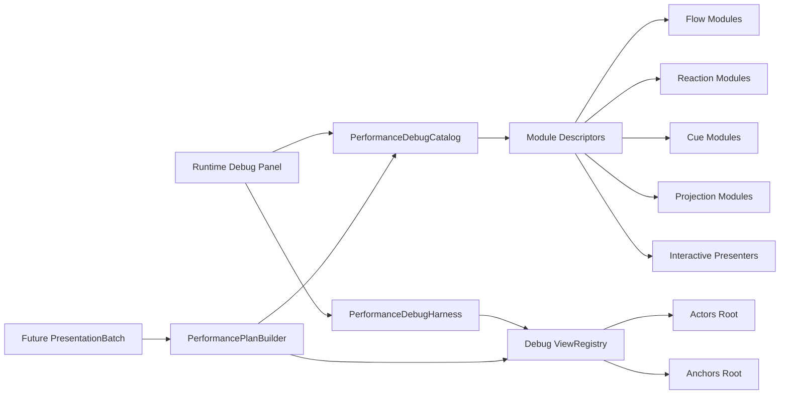

# 局内表演调试面板开发计划

## 现状判断

- 蓝图核心契约来自 [九宫牌局表现层（第二版）.canvas](C:/Users/jinji/Desktop/文档/MyNote/游戏开发项目/引擎工作区/九宫牌局架构/九宫牌局表现层（第二版）.canvas)：`Flow/Reaction/Cue/Projection/InteractivePresenter` 五池、`ViewRegistry`、`ActorFactory`、`PresentationBatchPlayer`、`PerformancePlanBuilder` 是后续主干。
- 当前代码已经有 V2 原子模块：接口在 [Assets/Scripts/NineGrid.Presentation/Contracts](Assets/Scripts/NineGrid.Presentation/Contracts)，模块分布在 `Flow`、`Reactions`、`Feedback`、`Interaction`、`Projection`。
- V1 脊柱已主动清理，记录在 [Assets/Notes/归档/表现层V2清理与落地顺序-2026-06-25.md](Assets/Notes/归档/表现层V2清理与落地顺序-2026-06-25.md)：`Adaptors`、`FSM`、`Registry`、`Diagnostics`、`PresentationTraceWindow` 都已删除。
- [Assets/Scenes/PerformanceTestScene.unity](Assets/Scenes/PerformanceTestScene.unity) 当前是 MainScene 镜像沙盒：有 `Actors`、`Anchors`、`Panels`、`TableNine Overlay UI`，但 ` Directors` 根节点为空且名字带前导空格；Build Settings 目前只注册了 `TestScene`。
- 旧测试入口分散在 [Assets/Scripts/NineGrid.Presentation/Tools](Assets/Scripts/NineGrid.Presentation/Tools) 的 5 个 PreviewTool，以及各表演模块的 `ContextMenu("Preview...")`。这些会和“统一面板负责测试相关”的目标冲突。

## 核心方案

先做一套 `NineGrid.Presentation.Debugging` 运行时调试基础设施，不提前实现完整生产导演，但为未来导演预留同一套模块 ID、schema、演员/锚点解析。

新增目录建议：

- [Assets/Scripts/NineGrid.Presentation/Debugging](Assets/Scripts/NineGrid.Presentation/Debugging)：Runtime 面板、目录、schema、harness、日志。
- [Assets/Scripts/NineGrid.Presentation/Debugging/Modules](Assets/Scripts/NineGrid.Presentation/Debugging/Modules)：每个原子表演的调试适配器。
- [Assets/Scripts/NineGrid.Presentation/Debugging/Scene](Assets/Scripts/NineGrid.Presentation/Debugging/Scene)：`PerformanceTestScene` 专用 bootstrap 和场景引用解析。

## 第一版功能边界

- 面板是 `PerformanceTestScene` 专用 Runtime overlay，Play Mode 中可点选表演并修改参数；不依赖旧热键工具。
- 第一版覆盖当前已经落地的原子模块：
  - Flow：攻击、反击、击杀、反击击杀、棋盘旋转、牌堆入场、发牌、替换、选择入场、选择确认、道具使用。
  - Reaction：伤害数字、效果触发、修饰器应用、卡牌获得、选择落下。
  - Cue：受击闪白、抖动、攻击拖尾。
  - Interaction：场地 hover、手牌布局、拖拽、回手、选择项 hover。
  - Projection：局内状态面板数值投影。
- 暂不做可视化 timeline、动态拼接图、完整 `PresentationBatchPlayer`；只做一个轻量 `DebugSequenceRunner`，支持“单模块播放”“预设组合播放”“Stop/Reset/Replay”。
- 调试面板先不直接发真实 Core Command。需要看事件日志时，只读接入 [Assets/Scripts/NineGrid.Core/Presentation/ActionLogProjector.cs](Assets/Scripts/NineGrid.Core/Presentation/ActionLogProjector.cs) 的结果，符合 [Assets/Notes/Core表现层Command与Event消费清单-2026-06-20.md](Assets/Notes/Core表现层Command与Event消费清单-2026-06-20.md) 对调试面板的建议。

## 实施步骤

1. 建立调试模块契约。
   - 新增 `IPerformanceDebugModule`、`PerformanceDebugSchema`、`PerformanceDebugParam`、`PerformanceDebugContext`、`PerformanceDebugPayload`。
   - 每个模块显式声明 `Id`、分类、显示名、所需组件类型、可调参数、默认 payload、`Play/Stop/Reset`。
   - 参数 schema 分两类：播放 payload 参数，如 `direction`、`amount`、`actorCount`、`selectedIndex`；实例调参字段，如 duration、offset、scale、delay、bool、enum，只改场景实例不写回资产。

2. 建立自动发现目录。
   - 新增 `PerformanceDebugCatalog`，启动时扫描当前程序集内实现 `IPerformanceDebugModule` 的类并按分类排序。
   - 后续新增表演时，只要补一个 descriptor 或在模块旁实现 provider，即可自动出现在面板。
   - 对没有统一 `Play` 签名的现状，不用反射硬猜调用；第一版用显式 adapter 保证参数语义准确。

3. 建立镜像场景上下文。
   - 新增 `PerformanceDebugHarness`，负责从 `PerformanceTestScene` 查找 `Actors`、`Anchors`、`Panels`、`TableNine Overlay UI`。
   - 新增轻量 `PerformanceDebugViewRegistry`，维护 `DebugActorId/CardUid/SlotId/AnchorId` 到 `Transform` 的映射。
   - 新增 `DebugActorFactory`，用真实卡牌视觉 prefab/visual binder 生成测试演员，全部挂在 `Actors` 根下，不重父到锚点。
   - 提供上下文预设：`BattlePair`、`Board9`、`Deck20`、`Hand7`、`Selection3`、`StatusPanel`。

4. 实现 Runtime 面板。
   - 推荐用代码动态生成 uGUI overlay，复用场景已有 EventSystem/Canvas 生态，避免额外 UI 资产依赖。
   - 面板结构：左侧分类与搜索，中间模块列表，右侧参数表单，下方日志与状态。
   - 通用操作：`Play`、`Replay`、`Stop Current`、`Stop All`、`Reset Scene Actors`、`Rebuild Context`、`Copy Payload Json`。
   - 状态显示：模块 `IsPlaying`、预计时长、实际耗时、最后一次错误、当前 actor/anchor 数量。

5. 覆盖第一批模块适配器。
   - 为每个 Flow/Reaction/Cue/Presenter/Projection 编写调试 adapter，统一从 `PerformanceDebugContext` 解析 actor、anchor、panel、参数。
   - 对旧 `Performance/LEGACY_V1` 不做新增入口；仅在某个 V2 模块还缺真实依赖时临时标记为 `LegacyFallback`，并在面板中显式显示。
   - 对 `IPlannedReaction` 当前接口没有 `Play` 的问题，用 adapter 调具体类的公开 `Play(...)`，不改生产接口。

6. 接线 `PerformanceTestScene`。
   - 通过 Unity MCP 修改场景，不手改 `.unity`。
   - 在 `Directors` 根下挂 `PerformanceDebugBootstrap`；若用户同意，可顺手把当前 ` Directors` 前导空格修正为 `Directors`。
   - Bootstrap 只在 `PerformanceTestScene` 启用，不污染 `MainScene`。
   - 如要一键运行调试场景，再用 MCP 将 `PerformanceTestScene` 加入 Build Settings；否则保持 Editor PlayMode 专用。

7. 收拢旧测试入口。
   - 面板覆盖同等能力后，删除或停用 [Assets/Scripts/NineGrid.Presentation/Tools](Assets/Scripts/NineGrid.Presentation/Tools) 下旧 PreviewTool 热键入口。
   - 移除各模块 `ContextMenu("Preview...")` 的播放测试入口，只保留 `Stop And Restore` 这类维护操作。
   - 保留自动化单测，但测试重点放在目录/schema/adapter 不缺项，而不是在业务模块里散落 runtime 测试入口。

8. 验证。
   - Unity 编译后读取 Console，要求 0 error。
   - Play Mode 打开 `PerformanceTestScene`，逐项跑通第一批模块，确认 Stop/Reset 不留下脏 actor、tween 或错误日志。
   - 增加轻量 EditMode 测试：Catalog 自动发现、每个模块 schema 非空、默认 payload 可构造、模块 ID 不重复。

## 验收标准

- `PerformanceTestScene` 中可打开一个独立调试面板，点击即可演示当前已落地的原子表演。
- 每个可演示模块都有明确分类、参数表单、默认预设、Stop/Reset 行为。
- 新增表演只需提供 descriptor/provider，就能自动进入面板，不需要改面板 UI 代码。
- 演员、锚点、面板引用来自镜像场景的真实根节点，演示结果与后续局内效果对齐。
- 旧 PreviewTool 热键与分散 Preview ContextMenu 不再作为测试入口。
- 不手动编辑 `.unity`；场景改动全部通过 Unity MCP 完成。