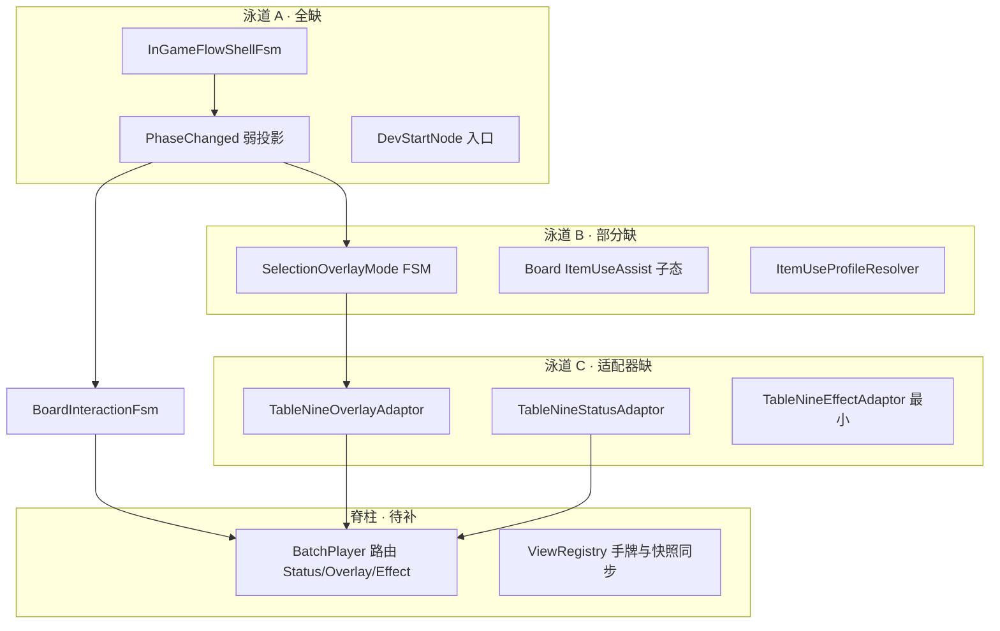
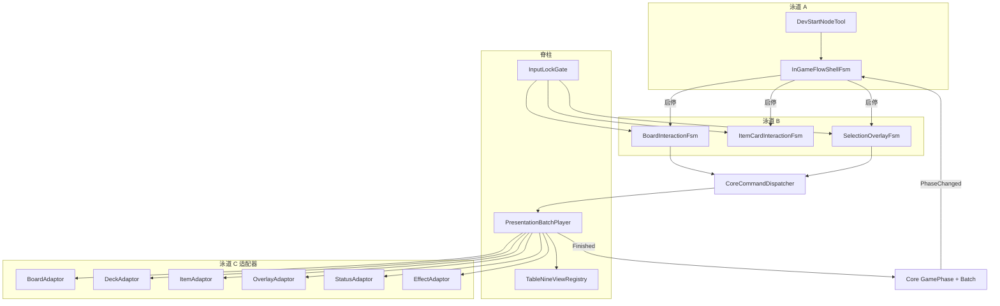

# 表现层 MVP 冲刺开发方案

> **版本**：V0.8 规划稿 · 2026-06-23  
> **权威蓝图**：`九宫牌局表现层.canvas`（泳道 A/B/C + 脊柱）  
> **对照表**：[`表现层蓝图落地对照表.md`](表现层蓝图落地对照表.md)  
> **契约清单**：[`Core表现层Command与Event消费清单-2026-06-20.md`](Core表现层Command与Event消费清单-2026-06-20.md)

---

## 1. 总目标

在**不做 App 壳 UI 层级**（Boot / 主菜单 / 设置）的前提下，跑通 **InGame 完整节点循环**：

```text
DevStartNode
  → NodePlaying（建池/发牌/互动/清场 · 折叠回放）
  → RewardScreen（三选一）
  → RoomChoiceScreen
  → RoomEventScreen
  → NodeAdvance → 下一节点 NodePlaying
  → … 直至 Victory / Defeat
```

玩家全程通过 **Command 改状态 + Batch 回放 + 快照对齐** 与内核交互；交互 FSM 只在流程壳允许的 Phase 下工作。

### 1.1 MVP 验收标准（全局）

| # | 验收项 | 说明 |
|:--|:--|:--|
| G1 | 一键开局 | PlayMode 无需 PreviewTool 即可 `StartNode` 进入首节点 |
| G2 | 单节点战斗闭环 | 发牌 batch → 点击攻击/拾取 → 旋转/击杀回放 → `PresentationFinished` 解锁 |
| G3 | 节点间流转 | 清场后自动进入奖励/房间选择；选完可进下一节点 |
| G4 | 流程壳管辖交互 | 非 `InteractionLoop` 时 Board/Item FSM 不响应；覆盖层阶段由 Overlay FSM 接管 |
| G5 | 输入锁契约 | 升锁 → Watching 全吞（含 Hover）；批末 Finished → 解锁 |
| G6 | 快照兜底 | 每批播完 `ViewRegistry` 对齐 `CoreViewSnapshot`；画面与内核一致 |
| G7 | 战役终态 | `Victory` / `Defeat` phase 进入终态壳，停止战斗/覆盖层交互 |

### 1.2 明确不在 MVP 范围

| 项 | 说明 |
|:--|:--|
| Boot / MainMenu / Settings / Quit | 蓝图已标注「默认直接进」 |
| 完整 HUD 美术 / 遮罩模糊 `InGameUIEntrance/Exit` | 可用极简占位或跳过并行 UI 表演 |
| `ItemUseProfileResolver` 全 Profile | MVP 仅落地 **ApplyZone** 单参路径；其余 Profile Phase 3 或更后 |
| `TableNineEffectAdaptor` 全量编排 | Phase 3 做最小 `EffectTriggered` 反馈即可 |
| Core 快照 `DrawPile` 字段 | 继续用 `DeckModel` 反推过渡方案 |
| EditMode 自动化回归全集 | 以 PlayMode 手测 + 既有 `P7PresentationContractTests` 为主 |

---

## 2. 现状诊断（开工基线）

### 2.1 已就绪（可复用）

| 域 | 组件 | 路径 |
|:--|:--|:--|
| 脊柱 | `InputLockGate` / `PresentationBatchPlayer` / `TableNineViewRegistry` | `FSM/` · `Adaptors/` · `Registry/` |
| 泳道 B | `BoardInteractionFsm` / `ItemCardInteractionFsm` / `BoardItemInteractionCoordinator` | `FSM/` |
| 泳道 C 适配器 | `TableNineBoardAdaptor` / `TableNineCardDeckAdaptor` / `TableNineItemAdaptor` | `Adaptors/` |
| 表演黑盒 | 战斗/牌堆/获取/选择层原子表演 + 各 PreviewTool | `Performance/` · `Tools/` |
| Core 契约 | `GamePhase` / `PresentationBatch` / `CoreCommandDispatcher` / `PresentationEventMap` | `NineGrid.Core/Presentation/` |

### 2.2 关键缺口（本次冲刺要补）



| 缺口 | 泳道 | 阻断级别 | 备注 |
|:--|:--|:--|:--|
| 流程壳 FSM | A | **P0** | 表现层零引用 `GamePhase` |
| `DevStartNode` 运行时入口 | A | **P0** | 现仅 Headless / 测试可 `StartNode` |
| 子 FSM 启停编排 | A | **P0** | Board/Item 当前常开，不受 Phase 管辖 |
| `SelectionOverlayMode` FSM | B | **P0**（节点流转） | 原子表演已有，无 FSM + Command 出口 |
| `TableNineOverlayAdaptor` | C | **P0**（节点流转） | `OfferReward` / `Select*` 无人播 |
| `TableNineStatusAdaptor` | C | P1 | HP/金币/互动次数面板更新 |
| `TableNineEffectAdaptor` | C | P2 | 效果触发表演；战斗主路径不阻断 |
| `ItemUseProfileResolver` + UseItem 路径 | B/C | P2 | 道具使用 Command；MVP 可后置 |
| `ViewRegistry` 手牌列表同步 | 脊柱 | P1 | 批末/阶段切换时与快照对齐 |
| `PresentationBatchPlayer` 域路由扩展 | 脊柱 | P0/P1 | 现仅 Board + Deck + Item |
| PlayMode 闭环验证 | QA | P0 | 泳道 B MVP 文档 `verify-playmode` 仍 pending |

---

## 3. 三阶段拆分

> **原则**：每阶段结束都有可演示的垂直切片；后阶段不推翻前阶段接口。

---

## 阶段一 · 局内战斗闭环（单节点可玩）

**目标**：不依赖 PreviewTool，从 Dev 入口进一局，打完当前节点战斗部分（至 `RewardItemChoice` 前或进入该 Phase）。

### 3.1.1 交付物

| ID | 任务 | 产出路径 | 依赖 |
|:--|:--|:--|:--|
| P1-A1 | **`InGameFlowShellFsm`**：订阅 `RunModel.Phase`，维护表现态枚举 | `FSM/InGameFlowShellFsm.cs` | — |
| P1-A2 | **Phase → Screen 投影表**（弱同步） | 同上静态映射 | 蓝图 `a_ann` 折叠规则 |
| P1-A3 | **子系统启停**：`NodePlaying` 启用 Board+Item；其余禁用 | FlowShell 引用各 FSM | P1-A1 |
| P1-A4 | **`DevStartNodeTool`**：PlayMode 按钮/快捷键发 `StartNodeCommand` | `Tools/DevStartNodeTool.cs` | Core `StartNodeCommand` |
| P1-A5 | **场景接线**：FlowShell 挂 MainScene，串起现有脊柱 + 泳道 B | `MainScene.unity` | Unity MCP |
| P1-S1 | **`PresentationBatchPlayer` 巩固**：确认 StartNode batch（发牌/入场）全流程播完 | 修改 `PresentationBatchPlayer.cs` | 已有 Deck/Board 适配器 |
| P1-S2 | **`ViewRegistry` 手牌同步**：批末或 `PickItem` 后 `SyncHandCards` | `TableNineViewRegistry.cs` + Player 调用点 | 快照尚无手牌字段时需从 Item 域事件推断 |
| P1-B1 | **泳道 B 验收补完**：PlayMode 手测清单（见 §3.1.3） | — | 泳道 B MVP 已落地代码 |
| P1-QA | **阶段验收记录**：对照 G1/G2/G5/G6 | 本笔记 §7 勾选 | — |

### 3.1.2 Phase 投影表（阶段一最小集）

| Core `GamePhase` | 表现态 | 启用 FSM | 玩家感知 |
|:--|:--|:--|:--|
| `None` | `Idle` | 无 | 等待 DevStart |
| `BuildEnemyPool` / `ResetNode` / `DealOpeningCards` / `InteractionLoop` / `ClearCheck` | **`NodePlaying`** | Board + Item | 只看回放；`InteractionLoop` 才可点击 |
| `RewardItemChoice` 及以后 | `Transitioning`（占位） | 全禁 | 阶段二接入覆盖层 |

> `InteractionLoop` 是阶段一唯一允许发 Board Command 的内核 Phase；FlowShell 应向 BoardFsm 暴露 `bool CanSendBoardCommand`（读 `IPhaseSystem.CurrentPhase`）。

### 3.1.3 阶段一 PlayMode 手测清单

- [ ] 按 Dev 快捷键 → `StartNode` → 发牌/入场 batch 播放完毕
- [ ] `InteractionLoop` 下：邻格攻击、拾取、点空格 Command 合法
- [ ] Command 后升锁 → 两 FSM 进 Watching → 批末 Finished 解锁
- [ ] 道具 Drag 期间场地点击冻结
- [ ] `Evt_ActionRejected` 有抖动反馈
- [ ] 清场前非 `InteractionLoop` 点击全部被拒（或 FSM 未启用）
- [ ] 批末场地演员与快照一致

### 3.1.4 阶段一完成定义（DoD）

- `InGameFlowShellFsm` + `DevStartNodeTool` 入库可编译
- MainScene 一条路径跑通 **StartNode → 互动 → 清场 batch**
- 蓝图 + 对照表泳道 A 行更新为「部分」并挂黄色注释

---

## 阶段二 · 节点间流转（奖励 / 房间 / 推进）

**目标**：单节点战斗结束后，能走完 **Reward → RoomChoice → RoomEvent → 下一节点 StartNode**，形成 `RunSession` 内环。

### 3.2.1 交付物

| ID | 任务 | 产出路径 | 依赖 |
|:--|:--|:--|:--|
| P2-A1 | FlowShell 扩展表现态：`RewardScreen` / `RoomChoiceScreen` / `RoomEventScreen` / `NodeAdvance` | `InGameFlowShellFsm.cs` | P1 完成 |
| P2-A2 | `NodeCompleted` → 自动或半自动 `StartNode`（读 `RunModel` 楼层/节点） | FlowShell 或 `NodeAdvanceService` | `IPhaseSystem` |
| P2-A3 | `Victory` / `Defeat` 终态壳（极简 UI 或 Log 占位） | `FSM/` 或 FlowShell 子态 | — |
| P2-B1 | **`SelectionOverlayMode` FSM** | `FSM/SelectionOverlayFsm.cs` | 蓝图覆盖层组 |
| P2-B2 | Command 出口：`SelectReward` / `SkipHelpChoice` / `SelectRoom` / `EnterRoom` | Overlay FSM → `CoreCommandDispatcher` | V0.6 契约 |
| P2-B3 | 本地反馈：`SelectionOptionHoverPerformance` 接线 | Overlay FSM | 已有表演 |
| P2-B4 | FlowShell：`RewardScreen`/`RoomChoiceScreen` 挂起 Board+Item，启用 Overlay | P2-A1 + P2-B1 | — |
| P2-C1 | **`TableNineOverlayAdaptor`** | `Adaptors/TableNineOverlayAdaptor.cs` | 表演黑盒已有 |
| P2-C2 | 映射：`OfferReward`→入场 · `SelectReward`/`Skip*`→确认+落屏 · `OfferRooms`/`SelectRoom`/`ResolveRoom` | OverlayAdaptor | Event 清单 §Phase/Node/Reward/Room |
| P2-C3 | `PresentationBatchPlayer` 注册 Overlay 域路由 | `PresentationBatchPlayer.cs` | P2-C1 |
| P2-S1 | 覆盖层选项演员：从 `CoreViewSnapshot.RewardOptions` / `RoomOptions` 生成 | Overlay FSM + Registry 扩展 | 快照字段已有 |
| P2-QA | 多节点手测：连续打 2～3 个节点 | §3.2.3 | — |

### 3.2.2 Phase 投影表（阶段二完整 InGame 集）

| Core `GamePhase` | 表现态 | 启用 FSM |
|:--|:--|:--|
| （阶段一已覆盖） | `NodePlaying` | Board + Item |
| `RewardItemChoice` | `RewardScreen` | Overlay |
| `RoomChoice` | `RoomChoiceScreen` | Overlay |
| `RoomEvent` | `RoomEventScreen` | Overlay（或「仅回放」若房间无选项） |
| `NodeCompleted` | `NodeAdvance`（瞬态） | 全禁 → 触发下一 `StartNode` |
| `Victory` / `Defeat` | `RunTerminal` | 全禁 |

### 3.2.3 阶段二 PlayMode 手测清单

- [ ] 清场后进入 `RewardItemChoice`：棋盘/手牌不可点；覆盖层可 Hover/Confirm
- [ ] 选奖励 batch：`OfferReward` 入场 → 选中确认 → 落屏 → Finished
- [ ] `RoomChoice`：三选一房间 → `SelectRoom` Command 合法
- [ ] `RoomEvent` batch 播完（若该房间有事件）
- [ ] `NodeCompleted` 后自动开下一节点：再次发牌/互动
- [ ] 楼层内连续多节点无死锁（输入锁正确升降）
- [ ] `Victory`/`Defeat` 进入终态，不再接受战斗 Command

### 3.2.4 阶段二完成定义（DoD）

- 对照 **G3 / G4 / G7** 通过
- `TableNineOverlayAdaptor` + `SelectionOverlayFsm` 入库
- 蓝图泳道 A/B/C 对应节点黄色注释 + 对照表更新
- PreviewTool（选择层按 3）可被主流程替代，非必须依赖

### 3.2.5 已知风险

| 风险 | 缓解 |
|:--|:--|
| 战斗中开宝箱未切 `RewardItemChoice` | 见 [`道具指向交互与场地卡FSM落地指南-2026-06-22.md`](道具指向交互与场地卡FSM落地指南-2026-06-22.md)；MVP 先走标准清场路径 |
| `InGameUIEntrance/Exit` 未烘焙 | OverlayAdaptor 先只编排选择层原子表演，UI 遮罩并行位留空 |
| 覆盖层演员生命周期 | 每批 `Offer*` 生成、`Select*` 后销毁；批末快照对齐 `PendingChoiceKind` |

---

## 阶段三 · 体验补全与道具使用（战役可玩度）

**目标**：HUD 跟得上内核；道具可基本使用；效果有最小反馈；去掉对 PreviewTool 的隐性依赖。

### 3.3.1 交付物

| ID | 任务 | 产出路径 | 优先级 |
|:--|:--|:--|:--|
| P3-C1 | **`TableNineStatusAdaptor`**：`UpdateHp` / `UpdateArmor` / `UpdateGold` / `UpdateInteractionCount` | `Adaptors/TableNineStatusAdaptor.cs` | P1 |
| P3-C2 | 极简 HUD 绑定（TMP/Sprite 数字即可） | Scene UI 或 `Visuals/` | P1 |
| P3-C3 | **`TableNineEffectAdaptor`** 最小集：`TriggerEffect` / `ApplyModifier` 占位或轻量表演 | `Adaptors/TableNineEffectAdaptor.cs` | P2 |
| P3-B1 | **`ItemUseProfileResolver`**：从 catalog 推导 Profile | `FSM/ItemUseProfileResolver.cs` 或 `Registry/` | P1 |
| P3-B2 | **`BoardInteractionFsm.ItemUseAssist` 子态**：Drag 申请 → 高亮/点选 → `UseItemCommand` | `BoardInteractionFsm.cs` | P1 |
| P3-B3 | `ItemCardInteractionFsm`：释放区 Confirm 走 Coordinator 申请（不再仅回手） | `ItemCardInteractionFsm.cs` | P1 |
| P3-C4 | `ItemUsePerformance` 真实动效（或暂保留 0s 但 Command 路径打通） | `Performance/ItemUsePerformance.cs` | P2 |
| P3-C5 | `CardTargetEligiblePerformance` / `CardSelectedPerformance`（道具指向高亮） | `Performance/` | P2 |
| P3-S1 | `PresentationBatchPlayer` 路由 Status + Effect 域 | `PresentationBatchPlayer.cs` | P1 |
| P3-S2 | **战役烟雾测试**：Headless 或 PlayMode 连续打完一层 9 节点 | 测试笔记 / 可选 EditMode | P1 |
| P3-POL | 收敛 PreviewTool：保留开发用，主流程不依赖 | `Tools/` 文档注释 | P3 |

### 3.3.2 道具使用 MVP 子集（阶段三）

| Profile | 阶段三目标 |
|:--|:--|
| `ApplyZone` | **必须**：单区生效，无额外选目标 |
| `SingleTarget` | 可选：点选单卡为目标 |
| `MultiPick` | defer |
| `OptionOverlay` | 走覆盖层双入口；与 `SelectionOverlayFsm` 共用 |

### 3.3.3 阶段三 PlayMode 手测清单

- [ ] 受伤/加甲/金币变化后 HUD 与快照一致
- [ ] 使用 ApplyZone 道具：Drag → 释放 → UseItem batch → Finished
- [ ] 道具使用期间 Board 常态冻结（`ItemUseAssist` 子态）
- [ ] 效果触发有可见反馈（哪怕占位闪动）
- [ ] 一层 9 节点战役无输入锁泄漏、无 Phase 卡死

### 3.3.4 阶段三完成定义（DoD）

- 对照 **G1–G7** 全部通过
- 对照表脊柱/泳道 B/C 主要行达「★已落地」或「部分」且缺口诚实标注
- 蓝图 `updatelog` 记 V0.8 MVP 冲刺完成摘要

---

## 4. 建议文件清单（汇总）

| 操作 | 路径 |
|:--|:--|
| **新增** | `FSM/InGameFlowShellFsm.cs` |
| **新增** | `FSM/SelectionOverlayFsm.cs` |
| **新增** | `FSM/ItemUseProfileResolver.cs`（阶段三） |
| **新增** | `Adaptors/TableNineOverlayAdaptor.cs` |
| **新增** | `Adaptors/TableNineStatusAdaptor.cs` |
| **新增** | `Adaptors/TableNineEffectAdaptor.cs`（最小） |
| **新增** | `Tools/DevStartNodeTool.cs` |
| **修改** | `Adaptors/PresentationBatchPlayer.cs`（域路由） |
| **修改** | `FSM/BoardInteractionFsm.cs`（ItemUseAssist · 阶段三） |
| **修改** | `FSM/ItemCardInteractionFsm.cs`（UseItem 申请 · 阶段三） |
| **修改** | `Registry/TableNineViewRegistry.cs`（手牌同步） |
| **修改** | `Scenes/MainScene.unity`（接线） |
| **修改** | `Assets/Notes/表现层蓝图落地对照表.md`（每阶段完工） |
| **修改** | `九宫牌局表现层.canvas`（黄色注释 + updatelog） |

---

## 5. 架构关系（冲刺后目标态）



---

## 6. 阶段排期建议（人力估算）

| 阶段 | 核心工作量 | 建议顺序 |
|:--|:--|:--|
| **一** | FlowShell + DevStart + 手牌同步 + B 验收 | 先堵「能玩一局」 |
| **二** | Overlay FSM + OverlayAdaptor + 节点推进 | 堵「能循环」 |
| **三** | Status + ItemUse + Effect 最小 + 战役烟雾 | 堵「像游戏」 |

阶段二对 MVP **跑通**最关键；阶段一可并行补 Swimlane B 验收；阶段三不阻断「节点循环」但影响可玩度。

---

## 7. 全局验收勾选（冲刺收官）

| 标准 | 阶段一 | 阶段二 | 阶段三 |
|:--|:--|:--|:--|
| G1 一键开局 | ☐ | ☐ | ☐ |
| G2 单节点战斗闭环 | ☐ | — | ☐ |
| G3 节点间流转 | — | ☐ | ☐ |
| G4 流程壳管辖交互 | ☐ | ☐ | ☐ |
| G5 输入锁契约 | ☐ | ☐ | ☐ |
| G6 快照兜底 | ☐ | ☐ | ☐ |
| G7 战役终态 | — | ☐ | ☐ |
| 道具 UseItem（ApplyZone） | — | — | ☐ |
| HUD 状态同步 | — | — | ☐ |

---

## 8. 每阶段完工同步（强制）

1. 蓝图对应节点新增/更新 **黄色「★已落地」** 注释 + 连线  
2. 更新 [`表现层蓝图落地对照表.md`](表现层蓝图落地对照表.md)  
3. `updatelog` 追加版本摘要（如 `V0.8.1 阶段一 FlowShell`）  
4. Unity MCP 刷新 + Console 零错误  

---

## 9. 参考文档

- [`泳道B MVP落地.md`](泳道B MVP落地.md) — 场地/道具交互已落地部分  
- [`表现层方法论.md`](表现层方法论.md) — 四盒子 + 声明式补位  
- [`.cursor/skills/table-nine-interaction-crafting/references/fsm-templates.md`](../.cursor/skills/table-nine-interaction-crafting/references/fsm-templates.md) — Flow Shell 与 Overlay 衔接  
- [`九宫牌局权威顶层架构设计.md`](九宫牌局权威顶层架构设计.md) — 全局架构  

---

## 变更记录

| 日期 | 摘要 |
|:--|:--|
| 2026-06-23 | V0.8 初稿：三阶段 MVP 冲刺方案（泳道 A/B/C + 脊柱缺口与验收标准） |
