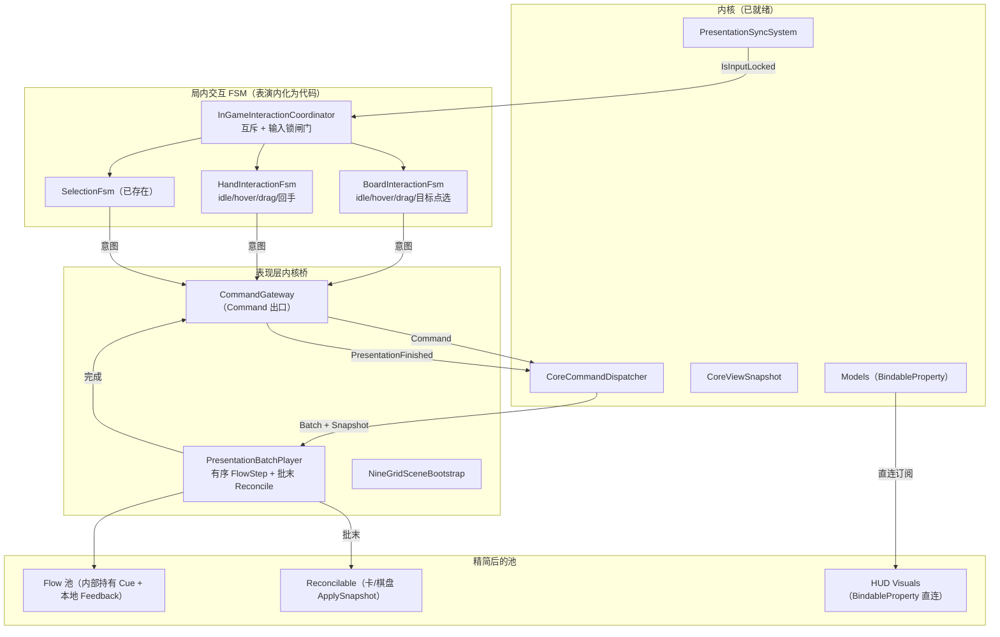

# 局内系统 + 表现层内核桥 落地计划

## 目标终态架构（简化后的"内聚表演效果体"）

要点：
- Interaction 池（`IInteractivePresenter` 的 Hover/Drag/Return/Layout）**拆散成代码内化进 FSM**，不再是独立 Presenter 池。
- Feedback/Cue 池**内化进各自 Flow**（如 `CardAttackFlow` 已内置 `HitFlashCue`）；`ICueBus` 本就不存在，无需新建。
- Reactions 池：`DamageNumbers/StatusTick` 这类**内化进战斗 Flow**（在 Impact marker 处吐字/跳血）；占位 Reaction 直接删除。
- HUD 资源条（金币/互动数/遗物/技能）走 **QF BindableProperty 直连**，接受结算瞬间即时更新。
- 阶段驱动 Shell 显隐：`RunModel.Phase` → `GamePhaseFlowShellProjection` / `InGameUiFlow`（不经 HUD Binder 订阅 Phase）。
- 卡面 HP/护甲**留在 Batch 时间线**（战斗 Flow Impact 内化 + 批末 `StatusPanelReconcilable` 兜底对齐）。

## 现状基线（已探明）
- 内核桥/局内系统在 `NineGrid.Presentation` **零接线**：对 `NineGridArchitecture`/`CoreCommandDispatcher` 无引用，生产走 Core 内 [RecordingPresentationAdapter](Assets/Scripts/NineGrid.Core/Presentation/RecordingPresentationAdapter.cs) 文本桩。
- FSM 只有 [SelectionFsm](Assets/Scripts/NineGrid.Presentation/Shell/SelectionFsm.cs) 与 [MainFlowFsm](Assets/Scripts/NineGrid.Presentation/Shell/MainFlowFsm.cs)；**BoardFsm/HandFsm 缺失**，场地/手牌只有纯视觉 `IInteractivePresenter`。
- 脊柱骨架在但覆盖窄：[PerformancePlanBuilder](Assets/Scripts/NineGrid.Presentation/Orchestration/PerformancePlanBuilder.cs) / [PresentationPlanExecutor](Assets/Scripts/NineGrid.Presentation/Orchestration/PresentationPlanExecutor.cs) / [PresentationBatchPlayer](Assets/Scripts/NineGrid.Presentation/Orchestration/PresentationBatchPlayer.cs) 仅 Debug/单测用；生产 `ActorFactory/ViewRegistry` 缺失。
- Core 侧已就绪：[CoreCommandDispatcher](Assets/Scripts/NineGrid.Core/Presentation/CoreCommandDispatcher.cs) `Send` 返回已开启的 `Batch`+`Snapshot`；[PresentationSyncSystem](Assets/Scripts/NineGrid.Core/Presentation/PresentationSyncSystem.cs) 管输入锁；7 个 Model 带 `BindableProperty`。

---

## 阶段 0 — 脊柱瘦身 + Feedback 内化
把编排收敛到"有序 Flow 步骤 + 批末 Reconcile"，为后续接线打好精简底座。
- 瘦身 [PresentationPlanExecutor](Assets/Scripts/NineGrid.Presentation/Orchestration/PresentationPlanExecutor.cs)：移除 `FireAnchoredReactions/FireImmediateReactionsForAction/MatchesAnchor` 整套 Anchor 机制，`PlayCoroutine` 只保留"按 ActionId 分组并行播 Flow → 等 `IsPlaying` → 批末 `Reconcile(snapshot)`"。
- 瘦身 [PerformancePlanBuilder](Assets/Scripts/NineGrid.Presentation/Orchestration/PerformancePlanBuilder.cs) 与 `PlanContracts.cs`：删除 `PlannedReaction/ReactionAnchor/ReactionAnchorKind`；Plan 只含 `Groups(FlowStep[]) + Snapshot`。删除 `ReactionRegistry/IReactionBinding/ReactionId` 及 `Bindings/ModuleReactionBindings.cs` 中的 reaction 绑定。
- Feedback 内化：把 `DamageNumbersReaction`（吐伤害字）与 `TableNineCardStatusView.ApplyEvent`（HP/护甲跳变）内化进战斗 Flow（[CardAttackFlow](Assets/Scripts/NineGrid.Presentation/Flow/Battle/CardAttackFlow.cs) 在 `FlowMarkers.Impact` 处吐字/跳血）；删除占位 `EffectTriggerReaction/ModifierApplyReaction/StatusTickReaction` 或降级为 Reconcile。
- 扩展 `InstructionKindFlowRouter`：为所有 `RequiresPlayback` 事件补 Flow 路由（`PickItem/SpawnCard/RemoveCard/SwapCards/OfferRooms/SelectRoom/OfferReward` 等目前缺失），暂无专属动效者路由到"快照对齐型 Flow"占位。
- 更新 [OrchestrationPipelineTests](Assets/Scripts/NineGrid.Presentation.Tests/OrchestrationPipelineTests.cs) 到精简模型。

## 阶段 1 — 运行时内核桥 Bootstrap（生产接线）
让真实 Command 驱动真实 Batch 在 MainScene 回放。
- 新增 `NineGridSceneBootstrap`（MonoBehaviour）：`Awake` 触发 `NineGridArchitecture.Current` + `InitialGameFactory.Create(...)`，装配 `CommandGateway`/`PresentationBatchPlayer`/`FlowRegistry`/生产 Registry。
- 新增生产 `TableNineViewRegistry`（`CardUid→演员`、`SlotId→锚点`）与 `TableNineActorFactory`（对象池、`defId→视觉`、生命周期），替换 Debug 版 [PerformanceDebugViewRegistry](Assets/Scripts/NineGrid.Presentation/Debugging/PerformanceDebugViewRegistry.cs)/DebugActorFactory。
- 新增 `CommandGateway`（Command 出口唯一入口）：`Send(command)` → `CoreCommandDispatcher.Send` → 若 `BatchOpened` 则 `StartCoroutine(BatchPlayer.PlayCoroutine(batch))` → 完成后 `Send(PresentationFinishedCommand)`；桥接 Core `IsInputLocked` ↔ 表现输入闸门。
- 用 Unity MCP 在 MainScene 落场景骨架：9 格棋盘锚点、抽牌堆锚点、道具槽锚点、ActorLayer、HUD 根；复用现有卡演员视觉/预制。
- 生产路径切到 BatchPlayer；`RecordingPresentationAdapter` 仅保留给测试。

## 阶段 2 — 局内交互 FSM（Board/Hand + 协调器）
把 Interaction 池表演内化为 FSM 代码，产出真实 Command。
- 新增 `BoardInteractionFsm`（idle/hover/drag/目标点选）：内化 [BoardCardHoverPresenter](Assets/Scripts/NineGrid.Presentation/Interaction/BoardCardHoverPresenter.cs) 代码；经 Gateway 发 `AttackCommand/PickupItemCommand/ClickEmptyCommand`；升锁时清理旧输入态。
- 新增 `HandInteractionFsm`（idle/hover/drag/回手）：内化 [HandCardDragPresenter](Assets/Scripts/NineGrid.Presentation/Interaction/HandCardDragPresenter.cs)/Return/Layout；发 `UseItemCommand`；与 Board "常规/道具申请模式"互斥。
- 新增 `InGameInteractionCoordinator`：管理激活 FSM、互斥（蓝图"手牌申请模式与常规模式互斥"、"道具 idle≠父 idle"）、订阅 `IsInputLocked` 做闸门。
- 新增 Board/Hand `InputRelay`（Collider→FSM），替代 Debug 手动 `Play(actor)`。

## 阶段 3 — Selection/Shell 接内核
闭合"通关三选一 / 房间二选一 / 节点推进"的真实流程。
- 把 [SelectionFsm](Assets/Scripts/NineGrid.Presentation/Shell/SelectionFsm.cs) 的确认经 Gateway 路由到真实 Core Command（`SelectRewardCommand/SkipHelpChoiceCommand/SelectRoomCommand/EnterRoomCommand/StartNodeCommand`），替换现在只走 `MainFlowTransition` 的 Shell 桩。
- 实现 [GamePhaseFlowShellProjection](Assets/Scripts/NineGrid.Presentation/Shell/GamePhaseFlowShellProjection.cs)：订阅 `PhaseChanged` 驱动 [MainFlowFsm](Assets/Scripts/NineGrid.Presentation/Shell/MainFlowFsm.cs)，生产环境取代 [MainFlowHarnessDriver](Assets/Scripts/NineGrid.Presentation/Shell/MainFlowHarnessDriver.cs)。
- 各 ScreenPresenter 从 `snapshot.Choice` 取真实奖励/房间选项，替换 Harness 假标签。
- 接 `ActionRejected` 轻提示。

## 阶段 4 — HUD BindableProperty 直连（被动视图）
- HUD 视图直接订阅 `PlayerModel.Coins/InteractionCount/RelicDefIds/SkillDefIds`、`RunModel.Phase`；从 Batch 反应路径移除 HUD（[TableNineStatusPanelView](Assets/Scripts/NineGrid.Presentation/Visuals) 保留为 Reconcile 兜底或改直连）。
- 卡面 HP/护甲维持时间线（战斗 Flow 内化 + 批末 Reconcile 兜底），不走直连。

## 阶段 5 — Flow 覆盖补全 + 测试 + 清理
- 补齐 Flow：`ItemUseFlow` 真实化、`CardDeckEntry/Deal/Move` 去 `PlayPreview` 走真实 actor、房间入离场做成 Flow、补 `InGameUIEntrance/Exit`。
- 删除死代码：Reaction 池残留、Debug-only Registry（若已被生产版取代）。
- EditMode/PlayMode 测试：完整闭环（点击怪物→Batch→回放→PresentationFinished→解锁→阶段推进）。

---

## 已锁定决策
- HUD-only BindableProperty 直连；战斗/棋盘动画留 Batch 时间线。
- 本轮做完整生产接线（bootstrap + 真实 ActorFactory/ViewRegistry + 替换 RecordingAdapter 路径）。
- 脊柱瘦身为"有序 Flow 步骤 + 批末 Reconcile"，去掉 PlannedReaction/ReactionAnchor。

## 已知缺口 / 后续跟进（非阻断）
- ~~`UseItemCommand` 仅传 `itemUid`~~（批次 2 已接通选项/目标参数路由；复杂多步目标 UI 仍可继续打磨）。
- 道具选项覆盖层（`stat_boost` 三选一）已走 `SelectionFsm` 本地驱动；其他选项型帮助卡若新增可复用同路径。
- MainScene 为 `.unity` 文件，所有场景改动经 Unity MCP，禁止手改。

---

## 质检续写（2026-07-02）

### 总结结论
此次五阶段落地不是“未完成”，而是“生产主链路已搭通，但清理与闭环验证未达到计划措辞”。已落地的硬证据包括：`MainScene` 的 `Directors` 对象已挂 `NineGridSceneBootstrap`；场景存在 `Anchors/NineGridAnchors` 9 格、`CardDeckAnchors`、`IteamCardHandAnchors`、`Actors/HandCardActors`；`NineGridSceneBootstrap` 会初始化 `NineGridArchitecture`、`InitialGameFactory`、`TableNineViewRegistry`、`TableNineActorFactory`、`PresentationBatchPlayer`、`CommandGateway`、`InGameInteractionCoordinator` 与 HUD Binder。`NineGrid.Presentation.Tests` EditMode 共 44 项通过，Unity Console 未见 error/warning。

但当前计划 frontmatter 中所有阶段标为 `completed` 过于乐观。阶段 0/5 的“删除 Reaction 池残留与 Debug-only 代码”、阶段 4 的“HUD 完全直连”、阶段 5 的“PlayMode 完整闭环测试”均未完全兑现。

### 分阶段验收

- 阶段 0：部分通过。`PlanContracts` 已收敛为 `PresentationPlan -> ActionPlanGroup -> PlanStep + Snapshot`，未再看到 `PlannedReaction/ReactionAnchor` 进入生产 `PresentationPlanExecutor`；`InstructionKindFlowRouter` 覆盖 `PresentationEventMap` 的 `RequiresPlayback`，并有 `PlanBuilder_RequiresPlaybackEvents_AllHaveFlowRoutes` 测试。但 `IPlannedReaction`、`DamageNumbersReaction`、Reaction 调试模块仍存在，且生产 `CardAttackFlowBinding` 仍注入 `DamageNumbersReaction`，只是通过 `CombatImpactFeedback` 在 `Impact` marker 处播放，尚未真正从命名/模块边界上完成“Reaction 池删除”。
- 阶段 1：基本通过。生产 `NineGridSceneBootstrap`、`ProductionOrchestrationSetup`、`ProductionModuleHostSetup`、`TableNineViewRegistry`、`TableNineActorFactory`、`CoreSyncInputLockGate` 已接入，`MainScene` 上存在 Bootstrap 组件。需要注意：生产装配仍复用了 `PerformanceDebugSerializationUtil` 和 `DamageNumbersReaction`，属于可运行但边界不干净。
- 阶段 2：基本通过。`BoardInteractionFsm`、`HandInteractionFsm`、`InGameInteractionCoordinator` 已存在；输入锁变化会 `ForceReset` 旧状态；棋盘/手牌 relay 通过 `BoardCardsReconcilable`、`HandItemsReconcilable` 和 `InGameInteractionSetup` 运行时动态补齐。当前测试只覆盖锁与模式切换，尚未覆盖真实鼠标 relay -> Gateway -> Core Command 的场景闭环。
- 阶段 3：基本通过。`ShellCommandRouter` 已把奖励/房间/节点推进路由到真实 Core Command；`GamePhaseFlowShellProjection` 订阅 `RunModel.Phase` 驱动 `MainFlowFsm`；`RewardScreenPresenter`、`RoomChoiceScreenPresenter` 会从 `CoreViewSnapshot` 取选项。`MainFlowHarnessDriver` 仍保留在主导演字段和编辑器工具中，可作为调试遗留，但不能称为“替换/删除完成”。
- 阶段 4：部分通过。金币、互动数、遗物、技能经 `TableNineHudModelBinder` 直连 `PlayerModel`；局内 HUD 显隐由 `InGameUiFlow` 和 `InGameHudPhasePolicy` 配合阶段变化处理。差距是 `TableNineHudModelBinder` 没有直接订阅 `RunModel.Phase`，`TableNineStatusPanelView` 的玩家 HP/护甲仍通过 `StatusPanelReconcilable` 批末对齐；若把 HP/护甲视为战斗时间线兜底可以接受，但与“HUD 从 Batch 反应路径移除”的字面目标不完全一致。
- 阶段 5：部分通过。`ItemUse`、Deck Entry/Deal/Move、房间选择入离场、InGame UI 入离场等 Flow 路由已存在，`Phase5FlowRouterTests` 覆盖了房间入离场路由。但 `PlayPreview()` 仍保留在多个 Flow 中，Reaction Debug 模块与 Debug Registry 仍在，`NineGrid.Presentation.Tests.asmdef` 仅 Editor 平台；Unity PlayMode 测试运行结果为 0 个测试，未形成“点击怪物 -> Batch -> 回放 -> PresentationFinished -> 解锁 -> 阶段推进”的 PlayMode 闭环证明。

### 主要问题点

1. **Reaction 命名与边界仍污染生产路径。** `ProductionModuleHostSetup` 添加 `DamageNumbersReaction`，`ProductionOrchestrationSetup` 将其传给 `CardAttackFlowBinding`，`CombatImpactFeedback` 依赖该类型播放伤害数字。这和终态“Feedback/Cue 内化进 Flow、删除 Reaction 池”相冲突。建议把伤害数字迁到 `Feedback` 命名空间并改名为 `DamageNumberFeedback` 或同类组件，保留调试模块时也改为 Cue/Feedback 类别。
2. **目标/选项型道具仍未接通表现层交互。** Core 侧 `UseItemCommand` 已支持 `selectedCardUids/selectedOption`，但 `HandInteractionFsm` 释放成功时仍只发送 `new UseItemCommand(itemUid)`。`stat_boost` 这类选项型帮助卡仍缺表现层选择覆盖层到 Core 参数的闭环。
3. **HUD 阶段直连描述与实现不一致。** `RunModel.Phase` 的生产订阅在 `GamePhaseFlowShellProjection`，不是 `TableNineHudModelBinder`；状态面板 HP/护甲仍作为 `StatusPanelReconcilable` 进入批末 Reconcile。**已与蓝图统一表述**：「资源条直连 + 阶段驱动 Shell + 战斗数值 Flow/Reconcile」。
- PlayMode 端到端测试缺失。**已补** `NineGrid.Presentation.PlayModeTests`：加载 `MainScene` → Bootstrap → StartNode → Attack → Batch 回放 → 输入解锁（1 passed）。
5. **Debug-only 清理未完成。** `MainFlowHarnessDriver`、`PerformanceDebugViewRegistry`、`ReactionDebugModules`、`IPlannedReaction`、若干 `PlayPreview()` 仍在。若这些仍要作为编辑器调试工具保留，应把计划措辞改为“生产路径脱钩”，不要写“删除”。

### 已执行验证

- Unity Console：error/warning 0 条。
- Unity EditMode：`NineGrid.Presentation.Tests` 44 passed / 0 failed / 0 skipped。
- Unity PlayMode：运行成功但发现 0 个测试，不能作为闭环验证。
- CodeGraph 索引：可用，约 2826 个文件、69023 个节点；本次以 CodeGraph + 关键文件读取 + Unity MCP 场景/测试检查交叉确认。

---

## 收尾整改（分三批）

### 批次划分

| 批次 | 范围 | 状态 |
|------|------|------|
| **1** | Reaction→Feedback 命名收束、删 `IPlannedReaction`、生产 SerializationUtil、场景摘掉 Harness | ✅ 已完成 |
| **2** | `UseItem` 选项/目标型道具 → SelectionFsm 闭环 | ✅ 已完成 |
| **3** | PlayMode 端到端测试、蓝图 canvas 清理、文档终稿 | ✅ 已完成 |

### 批次 1 已落地（2026-07-02）

**代码**
- `DamageNumbersReaction` → `Feedback/DamageNumberFeedback`（`[MovedFrom]` 保留场景组件迁移）；删除 `Reactions/DamageNumbersReaction.cs`。
- 删除 `IPlannedReaction`；`PerformanceDebugModuleBase` / `PerformanceDebugHarness` 不再引用。
- 新增 `Shared/PresentationSerializationUtil`，生产装配改用它；`PerformanceDebugSerializationUtil` 仅作 Debug 薄包装。
- `ReactionDebugModules` → `FeedbackDebugModules`；`PerformanceDebugCategory.Reaction` → `Feedback`。
- `CardAttackFlowBinding` / `CombatImpactFeedback` / 生产+调试 Orchestration 全部改用 `DamageNumberFeedback`。

**场景**
- `MainScene`：`MainFlowDirector` 上移除 `MainFlowHarnessDriver` 组件；`MainFlowDirector` 仅在 `harnessDriver != null` 时绑定（Harness 改编辑器手动挂载，生产路径脱钩）。

**验证**
- Unity Console：0 error。
- EditMode `NineGrid.Presentation.Tests`：44 passed / 0 failed。

**批次 2 预告**
- `ItemUseRequirementResolver` + `HandInteractionFsm` 释放后路由：无参数直发 / `stat_boost` 三选一覆盖层 / 需棋盘目标的点选模式。
- `InGameInteractionCoordinator` 与 `SelectionFsm` 接线，选项确认后 `UseItemCommand(itemUid, selectedCardUids, selectedOption)`。

### 批次 3 已落地（2026-07-02）

**代码**
- 新增 `ProductionBridgePlayModeTests` + `PlayModeTestSupport`：加载 `MainScene` → 等待 `NineGridSceneBootstrap` → `StartNodeCommand` → 等待解锁 → `AttackCommand` → 断言 Batch 开启与 `PresentationFinished` 后输入解锁。

**蓝图**
- `九宫牌局表现层（第二版）.canvas`：删除 `Reaction 残留/调试区` 分组、`PlannedReaction`/`ReactionAnchor` 历史节点及相关边；新增 `DamageNumberFeedback` 至 Cue/Feedback 区；HUD/调用链表述与落地笔记对齐。

**验证**
- Unity Console：0 error。
- EditMode `NineGrid.Presentation.Tests`：50 passed / 0 failed。
- PlayMode `NineGrid.Presentation.PlayModeTests`：1 passed / 0 failed（`BootstrapReady_Attack_CompletesBatchAndUnlocksInput`）。

### 批次 2 已落地（2026-07-02）

**代码**
- 新增 `ItemUseRequirement` / `ItemUseRequirementResolver`：按 defId 解析直发 / 选项（stat_boost）/ 棋盘目标（swap、teleport、kidnapping、投掷类等）。
- 新增 `ItemUseTargetValidator`：棋盘目标合法性校验（区域、种类、精英/Boss 排除）。
- 新增 `ItemUseOptionPresenter`：局内 stat_boost 三选一覆盖层，复用 `SelectionFsm` General 通道 + `SelectionPresentation`。
- `HandInteractionFsm` 释放后改发 `ItemUseRequested`，由协调器路由。
- `BoardInteractionFsm` 新增 `ItemTargetSelect` 状态与点选收集逻辑。
- `InGameInteractionCoordinator` 新增 `ItemBoardTarget` / `ItemOption` 互斥模式，确认后发送 `UseItemCommand(itemUid, selectedCardUids, selectedOption)`。
- `BoardCardInputRelay` 在目标点选模式下走专用输入路径。
- `InGameInteractionSetup` / `NineGridSceneBootstrap` 接线 `SelectionFsm` 与选项根节点。

**验证**
- Unity Console：0 error。
- EditMode `NineGrid.Presentation.Tests`：50 passed / 0 failed（含 6 项 `ItemUseRequirementResolverTests`）。