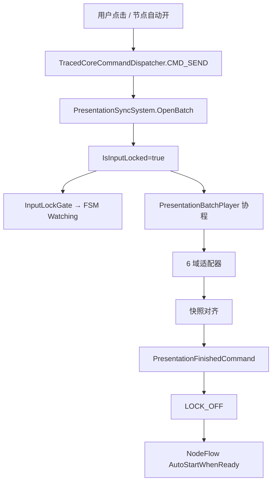

# 表现层流程卡点排查手册

> **用途**：P2 深耕期快速定位「流程卡住 / 点不了 / 节点不推进」类问题。  
> **优先级**：流程阻断 > 表现不对。表现问题可后修，输入锁/批次握手/FSM 门控错位必须先查。  
> **代码根目录**：`Assets/Scripts/NineGrid.Presentation/Diagnostics/`

---

## 一、30 秒上手

1. **F5 进 Play**，复现问题。
2. **Console 过滤**：输入 `PRES`（全量）或 `PRES][Watchdog` / `PRES][Lock`（只看卡点）。
3. **Editor 窗口**：菜单 `NineGrid → Presentation Trace` —— 实时 tail、按通道/级别/batchId 过滤、复制缓冲 JSON / 上次 Stall dump 路径。
4. **卡死自动 dump**：Watchdog 触发 `STALL` 后，查看 Console 里 `dump=` 路径，或项目根 `Logs/presentation-trace-{时间戳}.json`。
5. **可选 HUD**：`Assets/Settings/PresentationTraceConfig.asset` 勾选 `ShowRuntimeHud`，左上角显示 `Phase | Screen | Lock | B# | BoardFsm`。

**场景挂载**（`MainScene` → `NineGrid Battle`）：

| 组件 | 作用 |
|------|------|
| `PresentationDiagnosticsBootstrap` | 初始化 Trace + 加载 Config |
| `PresentationSyncTraceBridge` | 订阅内核 `LOCK_ON/OFF` |
| `PresentationFlowWatchdog` | W01–W06 不变量 + Stall dump |

引用可留空，Watchdog 运行时 `FindFirstObjectByType` 兜底。

---

## 二、流程脊柱（先建立心智）



**契约要点**（内核已测，见 `P7PresentationContractTests`）：

- 有 `LocksInput` 指令的批次 → `IsInputLocked=true`，直到 `PresentationFinishedCommand(batchId)` 成功。
- 锁定期内新 Command 会被拒（`CMD_SEND accepted=false`），交互 FSM 进入 `Watching`。
- 批末必须对齐 `CoreViewSnapshot`，再发 Ack。

---

## 三、Watchdog 规则速查

配置阈值见 `Assets/Settings/PresentationTraceConfig.asset`。

| 规则 | 事件名 | 典型症状 | 优先查什么 |
|------|--------|----------|------------|
| **W01** | `STALL rule=W01` | 一直 Watching、点哪都没反应 | 同 batch 是否有 `BATCH_PLAY_END` / `BATCH_ACK_SENT`；最后一条 `INSTR_*` 卡在哪；`PERF_TIMEOUT` |
| **W02** | `ORPHAN_BATCH rule=W02` | 锁开了但画面停住 / 批次有 id 却不播 | `PlayDispatchResult` 是否调用；`BATCH_PLAY_FALLBACK`；`lastPlayed` vs `activeBatchId` |
| **W03** | `STALL rule=W03` | 选完奖励/房间后覆盖层不退、不能再点 | `AWAITING_KERNEL_DISMISS` 是否一直 true；Overlay 适配器 `SelectReward`/`ResolveRoom` 是否播完 |
| **W04** | `STALL rule=W04` | 通关后下一节点永远不来 | `NODE_AUTO_WAIT`（每 2s）；`NODE_START_BLOCKED` 的 reason；phase 是否 `NodeCompleted` |
| **W05** | `PHASE_FSM_MISMATCH` | Phase 允许攻击但点怪物无 Command | `SCREEN_CHANGE`、`INTERACTION_GATE`；`boardEnabled`；`CanSendBoardCommand` |
| **W06** | `OVERLAY_BUSY` | 选择层转圈/卡死但不锁输入 | `SelectionOverlayController.IsBusy`；入场/确认协程是否 `PERF_TIMEOUT` |

**Stall dump 快照字段**：`phase, screen, batchId, lockHeldSeconds, playbackActive, lastPlayedBatchId, currentInstrIndex/Kind, boardFsmState, awaitingKernelDismiss, autoStartActive` 等。

---

## 四、Console 过滤与日志格式

**前缀规范**：`[PRES][Channel][B=batchId] EVENT key=value ...`

| 过滤串 | 看到什么 |
|--------|----------|
| `PRES` | 全部表现层 trace |
| `PRES][Watchdog` | 看门狗 / Stall |
| `PRES][Lock` | 输入锁开合、Watching |
| `PRES][Batch` | 批次播放、指令、Ack |
| `PRES][Command` | 所有 `CMD_SEND` |
| `PRES][Flow` | 屏幕态、节点流 |
| `PRES][Fsm` | 交互 FSM 状态 |
| `PRES][Overlay` | 覆盖层 dismiss 等待 |
| `B=12` | 仅 batchId=12（Unity Console 子串匹配） |

**示例**：

```
[PRES][Lock][B=12] LOCK_ON requiresAck=True instr=8 phase=InteractionLoop
[PRES][Batch][B=12] INSTR_BEGIN idx=3 total=8 kind=DealCards adaptor=Deck
[PRES][Watchdog] STALL rule=W01 lockHeld=12.3 batch=12 dump=.../Logs/presentation-trace-....json
```

---

## 五、通道与关键事件清单

### Lock / Batch（脊柱）

| 事件 | 级别 | 含义 |
|------|------|------|
| `LOCK_ON` / `LOCK_OFF` | Info | 内核批次锁开合 |
| `LOCK_REJECT_MISMATCH` | Error | Ack 的 batchId 与活跃批次不一致 |
| `WATCHING_ON` / `WATCHING_OFF` | Info | `InputLockGate` 广播给 FSM |
| `BATCH_PLAY_BEGIN` / `BATCH_PLAY_END` | Info | 协程批次起止 |
| `BATCH_PLAY_FALLBACK` | Info | `Update` 兜底拉起未播放的活跃批次 |
| `BATCH_PLAY_ABORT` | **Error** | `OnDisable` 杀协程未 Ack — **已知死锁风险** |
| `BATCH_INSTR_UNHANDLED` | Warn | 无适配器认领的指令（可能缺动画但不卡流程） |
| `BATCH_ACK_SENT` / `BATCH_ACK_SKIPPED` | Info | 是否发 `PresentationFinishedCommand` |
| `INSTR_BEGIN` / `INSTR_END` | Trace | 单条指令耗时（默认通道可能关 Trace） |
| `PERF_TIMEOUT` | Warn | 适配器等待表演超时（流程继续、表现可能断） |

### Flow / Command / Fsm / Overlay

| 事件 | 来源 | 含义 |
|------|------|------|
| `APP_STATE` / `SCREEN_CHANGE` / `INTERACTION_GATE` | `InGameFlowShellFsm` | 泳道 A 屏幕与门控 |
| `NODE_AUTO_WAIT` | `TableNineNodeFlowCoordinator` | 自动开节点在等锁（2s 节流） |
| `NODE_START_ATTEMPT` / `NODE_START_OK` / `NODE_START_BLOCKED` | 同上 | 开节点成败与原因 |
| `CMD_SEND` | `TracedCoreCommandDispatcher` | 每次 Command：source、accepted、batch |
| `FSM_STATE` | Board / Item FSM | 交互子状态变迁 |
| `CMD_BLOCKED` | `BoardInteractionFsm` | rules 解析失败 |
| `AWAITING_KERNEL_DISMISS` | `SelectionOverlayFsm` | 覆盖层等内核批结束 |
| `USE_ITEM_REJECT` | `ItemCardInteractionFsm` | 道具 Command 被拒 |

---

## 六、症状 → 排查剧本

### 1. 全场点不了，一直 Watching

```
过滤: PRES][Lock  →  是否有 LOCK_ON 无 LOCK_OFF？
过滤: PRES][Batch + 当前 B=#  →  BATCH_PLAY_BEGIN 后卡在哪条 INSTR？
过滤: PERF_TIMEOUT  →  是否某表演超时但协程已退出？
看 W01 dump  →  currentInstrKind / playbackActive
```

**常见根因**：

- 协程未跑完（适配器 `yield` 挂死或表演 `IsPlaying` 永不 false）。
- `PresentationBatchPlayer.OnDisable` 中途杀协程 → `BATCH_PLAY_ABORT`，锁永不释放。
- Ack 未发：批内有 `LocksInput` 但 `RequiresAcknowledgement` 路径未走到 `BATCH_ACK_SENT`。

### 2. 能 Hover 但点击攻击没反应

```
过滤: PRES][Fsm  →  FSM_STATE 是否 Watching？
过滤: PRES][Command  →  有没有 CMD_SEND？accepted？
若无 CMD_SEND  →  PHASE_FSM_MISMATCH / CMD_BLOCKED / pointerInputEnabled=false
若有 CMD_SEND accepted=false  →  看 reject 字段（内核 phase 不合法等）
```

**对照**：`flowShell.CanSendBoardCommand` = `Screen==NodePlaying` 且 `phase==InteractionLoop`。

### 3. 打完节点 / 选完奖励后下一节点不来

```
过滤: NODE_  →  AUTO_WAIT / START_BLOCKED / START_OK
Watchdog W04  →  autoStartActive 是否一直 true
过滤: PRES][Lock  →  是否上一批 LOCK_OFF 未发生
```

**常见根因**：`NodeCompleted` 后 `IsInputLocked` 仍为 true；`StartNode` phase 不合法；`autoStartNodes` 关闭。

### 4. 三选一 / 选房间 / 进房后卡住

```
过滤: PRES][Overlay  →  AWAITING_KERNEL_DISMISS
Watchdog W03 / W06
过滤: PRES][Batch  →  Offer* / Select* / Resolve* 指令链是否完整
```

**常见根因**：`awaitingKernelDismiss` 未在 `NotifyKernelDismissFinished` 复位；覆盖层 `IsBusy` 协程超时。

### 5. 流程能走但表现不对（不优先）

```
开启 Config 通道 Performance / Adaptor
查 PERF_TIMEOUT、BATCH_INSTR 耗时异常
演员问题（后续 Tier3）：化身无冲刺等多为 TryGetActor 失败，非流程卡死
```

---

## 七、代码与配置索引

| 类型 | 路径 |
|------|------|
| Trace 门面 | `Diagnostics/PresentationTrace.cs` |
| 配置 SO | `Assets/Settings/PresentationTraceConfig.asset` |
| Watchdog | `Diagnostics/PresentationFlowWatchdog.cs` |
| 批次播放器 | `Adaptors/PresentationBatchPlayer.cs` |
| 内核锁 + 事件 | `NineGrid.Core/Presentation/PresentationSyncSystem.cs` |
| 内核事件定义 | `NineGrid.Core/Presentation/PresentationSyncEvents.cs` |
| Command 包装 | `Diagnostics/TracedCoreCommandDispatcher.cs` |
| 适配器超时 | `Diagnostics/AdaptorPlaybackTrace.cs` |
| Editor 窗口 | `NineGrid.Presentation.Editor/PresentationTraceWindow.cs` |
| 内核契约测试 | `NineGrid.Core.Tests/P7PresentationContractTests.cs` |
| 无头 Stall 参考 | `NineGrid.Core.Tests/Simulation/HeadlessCampaignDriver.cs` |

**埋点覆盖的 FSM / 协调器**：`InGameFlowShellFsm`、`TableNineNodeFlowCoordinator`、`InputLockGate`、`BoardInteractionFsm`、`SelectionOverlayFsm`、`ItemCardInteractionFsm`。

**六域适配器**（含 `PERF_TIMEOUT`）：Board、Deck、Item、Effect、Status；Overlay 走选择层控制器。

---

## 八、调参建议

| 场景 | 建议 |
|------|------|
| 日常 P2 开发 | 保持 `EnabledChannels=Default`；需要查动画时临时开 `Performance` |
| 追单次批次 | Console `B=12` + Trace 窗口 Batch# 过滤 |
| 演示/录屏 | 关 `EnableTrace` 减噪；保留 Info 以上 |
| 怀疑卡死 | 保持 `WriteDumpOnStall=true`；阈值可先不改（W01=12s） |
| 已知长演出 | 若误报 W01，可适当增大 `InputLockStallSeconds`（治标不治本） |

---

## 九、已知隐患（维护时注意）

1. **`PresentationBatchPlayer.OnDisable`**：停止协程但不发 `PresentationFinishedCommand` → 永久锁输入。现已有 `BATCH_PLAY_ABORT` Error 日志；场景重载/禁用时需警惕。
2. **`BATCH_INSTR_UNHANDLED`**：指令被跳过，批末仍可能 Ack — 流程不卡但画面与内核不一致。
3. **`PERF_TIMEOUT`**：适配器超时后**继续流程**，属于「能玩但表现断了」类问题。

---

## 十、与冲刺计划 / 其它文档的关系

| 文档 | 关系 |
|------|------|
| `Assets/Notes/Demo落地冲刺开发计划.md` | P2 任务清单；本手册是 P2 排障配套 |
| `Assets/Notes/表现层方法论.md` | 四盒子/导演心智；排障时区分「流程」与「表演」 |
| `Assets/Notes/九宫牌局权威顶层架构设计.md` | 三窗口契约（Command / Batch / Snapshot / Ack） |
| `Assets/Notes/Core表现层Command与Event消费清单-2026-06-20.md` | 事件与指令对照 |
| [`Assets/Notes/归档/表现层蓝图落地对照表.md`](Assets/Notes/归档/表现层蓝图落地对照表.md) | 蓝图 ↔ 代码落地 |

---

## 十一、新增埋点规范（后续开发）

1. **流程相关** → `PresentationTrace.Log`，选合适 `Channel`；批次内事件带 `batch` 字段。
2. **Command** → 经 `TracedCoreCommandDispatcher`，勿裸 `new CoreCommandDispatcher`。
3. **适配器等待** → 用 `AdaptorPlaybackTrace.WaitWhilePlaying/WaitUntilOrTimeout`，勿复制无日志的 while。
4. **卡死级** → `PresentationTraceLevel.Stall` 或 `Error`；表现差异 → `Warn`。
5. **新 FSM 门控** → 暴露 Watchdog 可读状态（参考 `AwaitingKernelDismiss`、`IsAutoStartActive`）。
