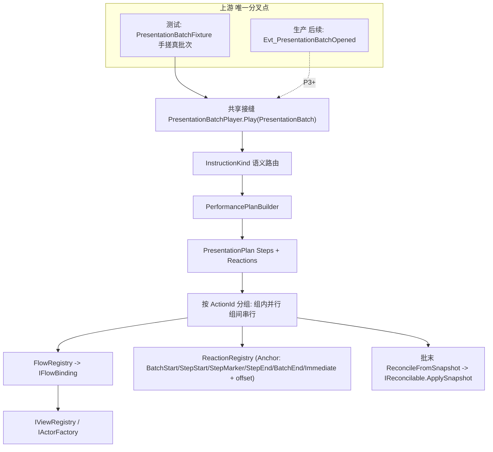

# 表演编排层落地 + 测试内循环改造（P1 + P2）

## 目标与验收
- **P1**：在真实 `PresentationBatch` 契约上建成编排脊柱，`PresentationBatchPlayer.Play(batch)` 成为唯一共享接缝，下游（PlanBuilder → Plan → 四池 + Reconcile）全部一份代码。EditMode 测试跑通参考批次。
- **P2**：调试控制台的 `DebugActorFactory` / `ViewRegistry` 接口化、按真实 `CardUid`/`SlotId` 注册演员；点对点模块与编排走**同一套 FlowBinding**；新增"批次编排"测试面，注入手搓的真批次经共享管线播放，输出 Plan 步骤文本（timeline UI 留 P3）。
- **WYSIWYG 保证**：测试层与真实项目的唯一分叉点被限定在 `PresentationBatch` 之上游（来源不同：手搓 vs Core 广播）；接缝下游完全共享。

## 关键现状（已验证，直接复用）
- Core 侧完备：`[PresentationBatch.cs](Assets/Scripts/NineGrid.Core/Presentation/PresentationBatch.cs)`（`PresentationInstruction[]` = `CoreGameEvent`+`PresentationEventMapEntry`，+ `CoreViewSnapshot`，+ `RequiresAcknowledgement`）；`[PresentationEventMap.cs](Assets/Scripts/NineGrid.Core/Presentation/PresentationEventMap.cs)` 39 条映射；`[PresentationSyncSystem.cs](Assets/Scripts/NineGrid.Core/Presentation/PresentationSyncSystem.cs)` 已是内核侧输入锁。
- `[CoreGameEvent.cs](Assets/Scripts/NineGrid.Core/Domain/Events/CoreGameEvent.cs)` 公开构造 + `With*` 链，可手工构造；仅 `AssignSequence` 是 internal（→ 需 Core 侧 fixture 构造器）。
- 四池末端表演已就位；`[PerformanceDebugModuleHostSetup.cs](Assets/Scripts/NineGrid.Presentation/Debugging/PerformanceDebugModuleHostSetup.cs)` 已把全部 Flow/Reaction/Cue/Presenter 挂在模块宿主上。
- 控制台：`[PerformanceDebugEditorWindow.cs](Assets/Scripts/NineGrid.Presentation.Editor/PerformanceDebugEditorWindow.cs)` + `[PerformanceDebugBootstrap.cs](Assets/Scripts/NineGrid.Presentation/Debugging/PerformanceDebugBootstrap.cs)` + `[DebugActorFactory.cs](Assets/Scripts/NineGrid.Presentation/Debugging/DebugActorFactory.cs)` + `[PerformanceDebugViewRegistry.cs](Assets/Scripts/NineGrid.Presentation/Debugging/PerformanceDebugViewRegistry.cs)`。

## 共享接缝架构

---

## Phase 0 — 前置基础设施（小改，解锁一切）
- **Core**：在 `Assets/Scripts/NineGrid.Core/Presentation/` 新增 `PresentationBatchFixture`（公开构造器：接受手写 `CoreGameEvent` 列表 + `CoreViewSnapshot`，内部调用 `AssignSequence` 赋序，产出合法 `PresentationBatch`）。这是"假的真批次"的**诚实**授权 API，用真类型、真赋序，仅数据是手填。不改动任何既有行为。

## Phase 1 — 编排脊柱（真实、共享、可测）
新建目录 `Assets/Scripts/NineGrid.Presentation/Orchestration/`，命名空间 `NineGrid.Presentation.Orchestration`（仍单一 asmdef）。

- **1.1 Plan 契约**（对齐 canvas）：`FlowId`、`PlanStepId`、`FlowPayload`（承载 `cardUid`/`fromSlot`/`toSlot`/`direction`/`amount`/`index`/`total` 等）、`SourceRef`、`PlanStep`、`PlannedReaction`、`ReactionAnchor`（kind 枚举 + stepId + marker + offsetSeconds）、`PresentationPlan`（Steps[] + Reactions[]）。
- **1.2 抽象接口**（WYSIWYG 命门）：
  - `IViewRegistry`：`ResolveActor(int cardUid)` / `ResolveAnchor(SlotId)` / 注册。
  - `IActorFactory`：`Spawn(defId, ...)` / 生命周期。
  - `IFlowBinding`：`FlowId Id`；`FlowHandle Play(IViewRegistry, FlowPayload)`（返回 `IsPlaying`/`ExpectedDuration`/marker 回调）——**把异构 `Play(player,enemy,dir)` / `PlayPreview()` 等封装成统一入口**。
  - `IReactionBinding`、`IReconcilable`（`ApplySnapshot(CoreViewSnapshot)`）、`IInputLockGate`（测试用本地实现；生产后续映射到 `PresentationSyncSystem`）。
- **1.3 `InstructionKindFlowRouter`**（**智力核心**）：把 `PresentationInstructionKind` → `FlowId`/`ReactionId` + 从 `CoreGameEvent` 抽取 payload。首版覆盖参考场景（攻击击杀旋转补位 / 开局发牌 / 帮助卡使用），明确 Event↔Flow 非 1:1（一次结算多指令映射到多步骤 + 多反应），后续迭代加宽。
- **1.4 `PerformancePlanBuilder`**：`PresentationBatch → PresentationPlan`。按 `CoreGameEvent.ActionId` 分组（方法论"按 ActionId 分组并行"），逐指令经 router 归类为 FlowStep 或 PlannedReaction，reaction 按 anchor 落到对应 step。
- **1.5 `FlowRegistry` + `ReactionRegistry`**：`FlowId→IFlowBinding` / `ReactionId→IReactionBinding`，由外部显式注册（P2 用模块宿主实例填充）。
- **1.6 `PresentationBatchPlayer`（共享接缝）**：`Play(PresentationBatch)` → 建 Plan → 升输入锁 → 组间串行/组内并行播 FlowStep（协程/ActionKit 调度，注意方法论首帧 deltaTime 尖峰兜底）→ 在 anchor 触发 PlannedReaction → 批末 `ReconcileFromSnapshot`（遍历 `IReconcilable`）→ 降锁。
- **1.7 最小 Marker 机制**：`IFlowBinding`/`IDirectedFlow` 增可选 marker 回调；以 `[CardAttackFlow.cs](Assets/Scripts/NineGrid.Presentation/Flow/Battle/CardAttackFlow.cs)` 的 Impact 为样板暴露（现为内部 `InsertCallback`），供 `StepMarker` 锚定与后续 timeline。
- **1.8 EditMode 测试**：`NineGrid.Core.Tests` 或表现层测试建 fixture 批次 → 断言 PlanBuilder 步骤/反应结构 → BatchPlayer 无异常 + Reconcile 被调用。

## Phase 2 — 控制台改造为测试层（注入真批次跑共享管线）
- **2.1 Registry/Factory 接口化**：`DebugActorFactory` 实现 `IActorFactory`；`PerformanceDebugViewRegistry` 实现 `IViewRegistry`（在现 string 键旁增 `int cardUid` / `SlotId` 键）。改 `[PerformanceDebugHarness.cs](Assets/Scripts/NineGrid.Presentation/Debugging/PerformanceDebugHarness.cs)` 的 Context 预设：演员按**真实 `CardUid`/`SlotId`** 注册（如 player uid=1@slot5，enemy uid=2@slot3），与批次内 uid/slot 对齐。
- **2.2 填充注册表 + Reconcile 目标**：把模块宿主上已有的 Flow/Reaction 实例注册进 `FlowRegistry/ReactionRegistry`；把 `TableNineStatusPanelView`（已有 `ApplySnapshot`）等 Visuals 登记为 `IReconcilable`。
- **2.3 点对点复用同一 Binding**：现有 `[FlowDebugModules.cs](Assets/Scripts/NineGrid.Presentation/Debugging/Modules/FlowDebugModules.cs)` 等点对点模块改为**经同一 `IFlowBinding`** 调用（点对点 = 编排单步），保留现有参数 UI。这是"点对点与编排一致"的 WYSIWYG 落点。
- **2.4 批次夹具库**：`PresentationBatchFixtureLibrary` —— 用 Phase 0 的 Core `PresentationBatchFixture` 手搓若干真批次（"攻击→致命→击杀→旋转→补位"、"帮助卡使用→遗物连锁"、"开局发牌 N 张"）。
- **2.5 Bootstrap 装配 Player**：`PerformanceDebugBootstrap` 创建 `PresentationBatchPlayer`（接 harness 的 `IViewRegistry`/`IActorFactory` + 模块宿主 bindings + 本地 `IInputLockGate`）。
- **2.6 控制台"批次编排"面**：`PerformanceDebugEditorWindow` 增"批次"分类/区块——列出夹具、Play/Stop、把生成的 `PresentationPlan` 步骤与反应**以文本 dump 呈现**（timeline 可视化的种子）。
- **2.7 端到端冒烟**：在 `PerformanceTestScene` Play 中播一个夹具批次 → 无异常、演员按步骤运动、批末对齐快照。

## 明确不做（留 P3/P4）
- 可视化 timeline（甘特图：步骤 + 反应 + marker）——P1 契约已预留 timing/marker，P2 先出文本 dump。
- 生产接线：订阅 `Evt_PresentationBatchOpened`、`PresentationFinishedCommand` 握手、局内 FSM/RunSession。
- 编辑器细节优化。

## 风险 / 卡点
- **Event↔Flow 非 1:1**（最大）：路由表是核心智力工作，首版限定参考场景，避免过早追求全覆盖。
- **Registry 键分叉**：若预设仍按 string 注册，测试↔生产解析就分叉——2.1 必须按真实 uid/slot 注册。
- **DOTween 首帧尖峰**：BatchPlayer 组内并行启动需沿用方法论的延迟一帧/smoothDeltaTime 兜底。
- **Marker 保真**：首版仅 CardAttackFlow Impact 作样板，其余 Flow 后补。
- **Reconcile 覆盖**：仅接现存 Visuals，快照→视图映射逐步补齐。