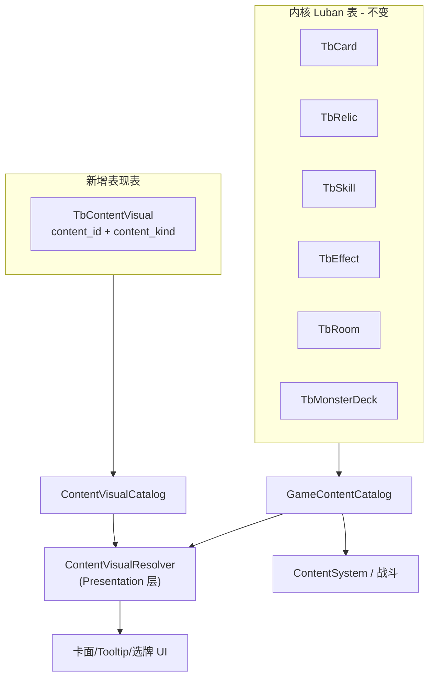
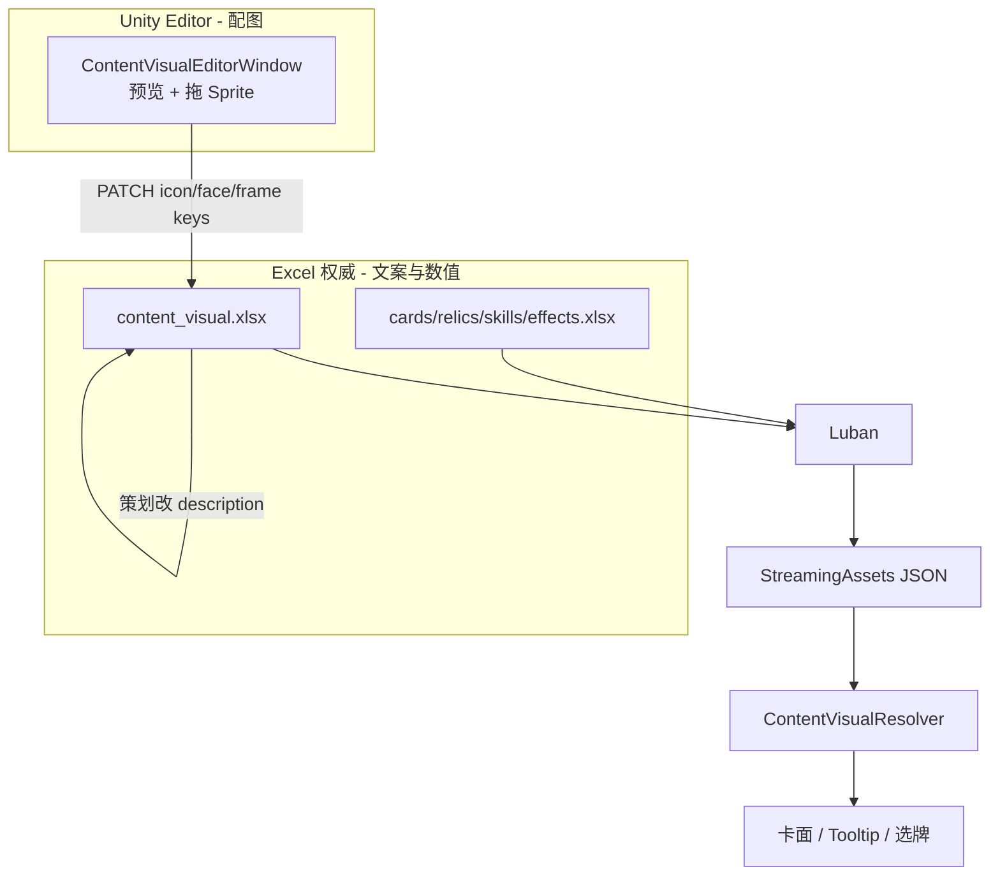

# 表现层五条字段配表接入方案

## 现状盘点（内核 + Luban）

当前管线：**硬编码 Catalog → JSON 源数据 → Luban 生成 → StreamingAssets → `GameContentCatalog`**。


### 已有字段 vs 你的五条诉求

| 诉求 | 帮助卡 TbCard | 怪物 TbCard | 遗物 TbRelic | 技能 TbSkill | 房间/牌组/化身 |
|:--|:--|:--|:--|:--|:--|
| 1 名字 | `display_name` 已有 | 同左 | 同左 | 同左 | `RoomRow.display_name` / `MonsterDeckRow.display_name`；化身仅代码 `avatar.default` |
| 2 描述 | **无**（散落在 `TbEffect.design_text`） | **无**（技能描述在 `TbSkill`） | `design_text` 已有 | `design_text` 已有 | 基本无玩家向描述 |
| 3 卡面/阵营 | `deck_id` 为空 | `deck_id` → `TbMonsterDeck` | 无 | 无 | 牌组表有 display_name，无视觉族 |
| 4 卡框/稀有度 | `rarity` 已有 | `rarity=None`，靠 `is_elite/is_boss` | `rarity` 已有 | 无 | 无 |
| 5 核心图标 | **全无** | 同左 | 同左 | 同左 | 同左 |

### 战斗数值是否齐？

**怪物卡：齐。** [`CardRow`](Assets/Tools/Luban/Defines/table_nine.xml) 含 `max_hp / attack / armor / recovery`，[`ContentSystem.CreateDraft`](Assets/Scripts/NineGrid.Core/Systems/ContentSystem.cs) 会灌入 `CardDraft`，场上动态值由 [`CoreViewSnapshot`](Assets/Scripts/NineGrid.Core/Presentation/CoreViewSnapshot.cs) 提供 `hp/armor/attack`。

**帮助卡：无战斗数值是预期**（stats 全 0，不参与棋盘攻防模板）。

**玩家化身：未进 Luban**，初始值硬编码在 [`InitialGameOptions`](Assets/Scripts/NineGrid.Core/Setup/InitialGameFactory.cs)（`AvatarMaxHp=30, Attack=1, Recovery=1`）。若要做「化身也走配表」，需单独加 `TbAvatar` 或并入视觉表 + 数值表，**不在本次表现层五条范围内，但应在计划里标注缺口**。

**遗物/技能：无攻防面板数值**（效果走 `effect_ids` → DSL），描述已有 `design_text`。

**表现层当前未消费任何静态文案/图标**：`NineGrid.Presentation` 里无 `display_name/design_text` 引用，选牌 UI 仍直接打 `def_id`（见 [`SelectionOverlayController`](Assets/Scripts/NineGrid.Presentation/FSM/SelectionOverlayController.cs)）。

---

## 架构建议：并联表现通道，不要总表吞 DSL

### 不推荐：「每个对象一张总表」吃下战斗 + DSL + 表现

- 现有设计已按职责拆开：`TbCard/TbRelic/TbSkill`（对象元数据 + 引用）+ `TbEffect`（逻辑 DSL）。
- 把 DSL 并回 Card 行会破坏已落地的 Batch 8 工作流、Exporter、一致性测试（[`P6LubanContentTests`](Assets/Scripts/NineGrid.Core.Tests/P6LubanContentTests.cs)）。
- 「所有可展示内容」跨 Card/Relic/Skill/Room/Deck/Avatar，强行一张宽表会导致大量空列。

### 推荐：**内核表保持 + 新建 `TbContentVisual`（表现专用）**

以 **`content_id` 为外键** 并联现有 id 体系（与 `def_id` / `deck.xxx` / `RoomKind` / `avatar.default` 对齐），**不进入 Core 战斗路径**。



**字段设计（对应你的五条）：**

| 列名 | 用途 | 说明 |
|:--|:--|:--|
| `content_id` | 主键 | 与现有 id 对齐，如 `help.bomb` / `monster.beggar` / `relic.craving` / `skill.arsenal` / `Fountain` / `deck.orc_legion` / `avatar.default` |
| `content_kind` | 类型 | `HelpCard \| Monster \| Relic \| Skill \| Room \| MonsterDeck \| Avatar` |
| `description` | 玩家向描述 | 与 `Effect.design_text` 解耦；**Excel 权威编辑** |
| `face_key` | 卡面/阵营底图 key | **Unity Editor 权威**；空则怪物回退 `deck_id` |
| `frame_key` | 卡框皮肤 key | **Unity Editor 权威**；空则用 `rarity` / `is_elite` / `is_boss` 推导 |
| `icon_key` | 核心图标 key | **Unity Editor 权威**；空则命名约定兜底 |

**名字不重复存**：Resolver 优先读内核 `display_name`（Room/Deck 等同理），`TbContentVisual` 只管「内核没有的纯表现字段」。若未来需要本地化覆盖名，再加可选 `name_override`。

### 图标策略（修订：Editor 主 authoring，约定兜底）

Luban 列**只存 string key**（不进 Unity 类型），与 xlsx 完全兼容：

```
icon_key 非空 → 按 key 加载 Sprite（Resources / Addressables / 项目内 SpriteRegistry）
否则 → Sprites/Content/{content_kind}/{content_id} 命名约定兜底
```

**配图的主路径是 Unity Editor 指派后写回 `icon_key`**，不是策划在 Excel 里手打路径。`face_key` / `frame_key` 同理（卡面底图、框体皮肤也用 string key，不用 Sprite 列）。

---

## 双端工作流（Excel 权威 + Unity 配图）— 对计划的影响

### 结论：**需要兼容性改动，不是「已支持、只加后期量」**

原计划在数据模型层（`TbContentVisual` + Resolver）**方向不变**，但当前仓库**不具备**以下能力，必须作为一等公民补进计划：

| 能力 | 现状 | 影响级别 |
|:--|:--|:--|
| xlsx 作为 Luban 权威输入 | 实际源是 `Datas/*.json`；`table_nine.xml` 全指向 json | **必改** schema input + 迁移脚本 |
| Unity 读 xlsx 源表 | 无 xlsx 库；仅 `TableNineLubanDataExporter` 写 JSON | **必加** Editor 侧 xlsx 读写（NPOI 或 Luban 预导出的中间 JSON） |
| Unity Editor 配图 + 预览 | 不存在 | **必加** `ContentVisualEditorWindow`（或 Odin 面板） |
| Editor → 源表回写 | 不存在（Exporter 仅 Core→JSON 单向） | **必加** 回写管线 + 「保存后跑 Luban」菜单 |
| 双向编辑冲突策略 | 未定义 | **必约定** 列级归属（见下） |

**不受影响、可照旧的部分：**

- `TbContentVisual` 并联 `GameContentCatalog` 的架构
- Core 不读表现字段、DSL 仍在 `TbEffect`
- 运行时只消费 Luban 生成后的 JSON（StreamingAssets），不直接读 xlsx
- `ContentVisualResolver` 逻辑（仅 icon 优先级从「约定为主」改为「Editor 写入的 key 为主」）

### 推荐双端分工（列级权威）

避免 Excel 与 Unity 抢同一列互相覆盖：

| 列 | 权威编辑端 | 说明 |
|:--|:--|:--|
| `content_id` / `content_kind` | Excel（或 bootstrap 脚本） | 行身份，Editor 只读 |
| `description` | **Excel** | 策划改文案不打开 Unity |
| `face_key` / `frame_key` | **Unity Editor**（可空，空则推导） | 拖底图/框体或选预设 |
| `icon_key` | **Unity Editor**（可空，空则命名约定） | 拖 Sprite → 写 key |
| 内核 `display_name` / `rarity` / 战斗数值 | **Excel**（现有内核表） | 仍在 TbCard 等表，不进 visual 表重复 |

Unity Editor 保存时**只 PATCH 视觉 key 列**，不碰 `description`，这样 Excel 改文案、Unity 改图可以并行。

### 目标管线（修订后）



### 回写实现选型（计划内定一种，避免实现时分叉）

**推荐：Editor 直接 PATCH xlsx 视觉列（方案 A）**

- 在 `NineGrid.Content.Editor` 引入轻量 xlsx 读写（如 NPOI，仅 Editor asmdef）
- Editor 打开时读 `Assets/Tools/Luban/Datas/content_visual.xlsx`
- 保存时只更新 `icon_key` / `face_key` / `frame_key` 列对应行
- 菜单 `TableNine/Content/Regenerate Luban` 封装现有 `gen_table_nine.ps1`

**备选：中间 JSON sidecar（方案 B，若不想引 xlsx 库）**

- Excel 仍是权威，但 Unity 只读写 `content_visual_assets.json`（仅视觉 key）
- 预生成脚本 merge sidecar → xlsx 或 merge 进 Luban 输入
- 多一步同步，策划体验略差，**仅当排斥 xlsx 库时采用**

### 对首期切片的调整

1. **Phase 1**：schema + xlsx 初稿 + Resolver + 一个 UI 验证点（可先手动填 xlsx 里的 key）
2. **Phase 2**：`ContentVisualEditorWindow`（配图主工作流）+ xlsx PATCH 回写 + Luban 一键刷新
3. **Phase 3**：内核表逐步从 json 迁到 xlsx（与表现无关，可并行排期）

原「icon 约定兜底、大部分零配置」仍保留，用于 bootstrap 期和缺图时的安全 fallback，但**日常 authoring 以 Editor 为准**。

---

## 好加吗？改动面评估

**难度：中低**（schema 清晰、不动 DSL、不动 Core 战斗）。

需动文件（按顺序）：

1. [`Assets/Tools/Luban/Defines/table_nine.xml`](Assets/Tools/Luban/Defines/table_nine.xml) — 新增 `ContentVisualRow` + `TbContentVisual`，`input` 指向 `content_visual.xlsx`
2. 新建 `Assets/Tools/Luban/Datas/content_visual.xlsx` — 首期从现有 JSON bootstrap 导出：
   - 遗物/技能：`description` ← 现有 `design_text`
   - 帮助卡：`description` ← 对应 `TbEffect.design_text`（单 effect 的直接搬；多 effect 需人工合并玩家向文案）
   - 怪物：`description` ← 技能 `design_text` 拼接或重写；`face_id` 默认 `deck_id`
3. 运行 [`gen_table_nine.ps1`](Assets/Tools/Luban/gen_table_nine.ps1) 重生 Generated + StreamingAssets
4. 新增 `ContentVisualCatalog` + `ContentVisualResolver`（建议放 `NineGrid.Presentation` 或 `NineGrid.Content` 的 Presentation 子目录，**不要**让 `ContentSystem` 依赖它）
5. 表现 UI 接入点：`SelectionOverlayController`、标准卡 Prefab 绑定脚本、遗物/技能展示位
6. **新增** [`NineGrid.Content.Editor`](Assets/Scripts/NineGrid.Content.Editor) — `ContentVisualEditorWindow`：读 xlsx、Sprite 预览、PATCH 视觉 key 列、触发 Luban regen
7. 可选：扩展 `TableNineLubanDataExporter` 从 hardcoded 导出 visual xlsx 初稿（若暂保留双源）

**测试**：新增 EditMode 测试 — 每个 production `content_id` 在 visual 表有行；`icon_key` 为空时命名约定可解析；Editor PATCH 后 xlsx 对应列已更新。

---

## xlsx 映射

**可以轻松映射。** Luban 原生支持 Excel 输入；在双端工作流下，**visual 表以 xlsx 为唯一权威源**，Unity Editor 回写同一张表。

内核表迁移策略（与配图工作流解耦）：

- **近期**：仅 `content_visual.xlsx` 走 xlsx 权威；内核表暂留 JSON
- **中期**：`cards/relics/skills/...` 逐步迁 xlsx，Excel 统一管数值与 `display_name`

`TbContentVisual` 单 sheet 列头示例（**全部 string，无 Sprite 列**）：

```
content_id | content_kind | description | face_key | frame_key | icon_key
help.bomb  | HelpCard     | 对所有怪物造成4点伤害 | | |        （Unity Editor 拖图后写入 icon_key）
monster.beggar | Monster  | 每移动5次洗入乞丐 | deck.wandering_legion | | 
relic.craving | Relic     | 所有恢复血量效果翻倍 | | gold_frame |
```

`face_key` / `frame_key` 列名从原计划的 `face_id` / `frame_id` 改为 `*_key`，强调「资源 key 而非逻辑 id」，与 Editor 配图语义一致；怪物默认 face 仍可由 Resolver 回退到 `deck_id`。

---

## 与「各管各的」对比结论

| 方案 | 优点 | 缺点 |
|:--|:--|:--|
| **扩展现有 Card/Relic/Skill 行** | 查一次表 | 无法覆盖 Room/Deck/Avatar；策划要在多张表填图标列；内核 Catalog 被表现污染 |
| **独立 TbContentVisual（推荐）** | 全覆盖、Core 零感知、美术可独立迭代、icon 约定友好 | 多一次 join；需维护 content_id 一致性 |
| **单张超级大表** | 看起来简单 | 空列爆炸、DSL 与表现耦合、破坏现有测试与 effect 落地 skill |

**结论**：采用 **「内核各表 + 表现视觉总表」双通道，共用 `content_id` 指针**——这正是你问的「单独维护表现层通道，共同持有 cardID」的成熟形态；不是把 DSL 并回对象行，也不是让表现层直接读 Effect JSON。

---

## 首期落地建议（可执行切片）

**Phase 1 — 数据与运行时（无 Editor 也能跑通）**

1. 建 `TbContentVisual` + `content_visual.xlsx` + Resolver
2. Bootstrap `description` 初稿；视觉 key 列先空，靠命名约定兜底
3. 一个 UI 验证点（选牌 overlay：name + description + icon）

**Phase 2 — 配图工作流（你提出的核心体验）**

4. `ContentVisualEditorWindow`：按 `content_kind` 筛选、标准卡 Prefab 预览、拖 Sprite 写 `icon_key`
5. xlsx PATCH 回写（只写视觉 key 列）+ `TableNine/Content/Regenerate Luban` 菜单
6. 列级权威文档写进工具 Tooltip（description 请改 Excel，图请在 Unity 改）

**Phase 3 — 推导规则与全覆盖**

7. `frame` 推导：`frame_key` 空时，`HelpCard/Relic` 用 `rarity`；`Monster` 用 `is_boss > is_elite > normal`
8. `face` 推导：`face_key` 空时，怪物回退 `deck_id`
9. 化身/房间/牌组各补 1 行 visual 样例

**刻意不做（避免 scope 膨胀）**：把 `design_text` 从 `TbEffect` 删掉；化身战斗数值进 Luban；在 Luban 列里直接存 Unity Sprite 引用。
