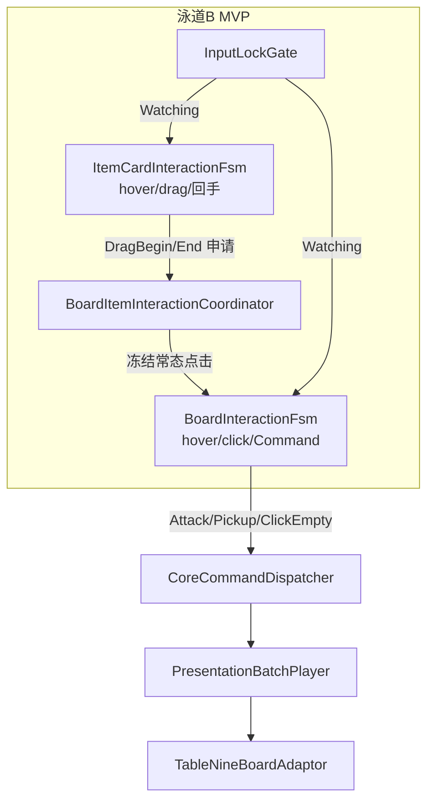

# 泳道 B · 交互输入 FSM（MVP）落地计划

## 现状诊断

### 蓝图 vs 代码对照

| 组件 | 蓝图状态 | 代码现状 | 缺口 |
|------|----------|----------|------|
| `InputLockGate` | ★已落地 | [`InputLockGate.cs`](Assets/Scripts/NineGrid.Presentation/FSM/InputLockGate.cs) 轮询 `IsInputLocked` 广播 | — |
| 道具手牌 FSM | 部分 | [`ItemCardInteractionFsm.cs`](Assets/Scripts/NineGrid.Presentation/FSM/ItemCardInteractionFsm.cs) Hover/Drag/Watching 骨架完整 | **违反 V0.6**：仍自行 `SendUseItemCommand`；释放区 Confirm 应暂缓 |
| 场地 FSM | 待落地 | 无 `BoardInteractionFsm` | 常态点击 Command 全无 |
| 本地反馈 | 部分 | [`ItemCardInteractPerformance`](Assets/Scripts/NineGrid.Presentation/Performance/ItemCardInteractPerformance.cs) 已有 | `CardHoverPerformance` 等 Board 反馈缺失 |
| Command→回放 | 部分 | Core [`CoreCommandDispatcher`](Assets/Scripts/NineGrid.Core/Presentation/CoreCommandDispatcher.cs) + 场景已挂 [`PresentationBatchPlayer`](Assets/Scripts/NineGrid.Presentation/Adaptors/PresentationBatchPlayer.cs) | FSM 发 Command 后**未**调 `PlayDispatchResult`；Item/Board 均未接线 |
| `TableNineViewRegistry` | ★已落地 | CardUid/SlotId 解析 + 批末对齐 | Board FSM 尚未消费 |
| 覆盖层 FSM | 待落地 | 原子表演已有，无 FSM | **本次 MVP 不含** |
| `ItemUseProfileResolver` | 待落地 | 无 | **本次 MVP 不含**（留 Phase 2） |

### 架构权威（V0.6，你已确认）



**与旧指南差异**：[`道具指向交互与场地卡FSM落地指南-2026-06-22.md`](Assets/Notes/道具指向交互与场地卡FSM落地指南-2026-06-22.md) 仍写 `ItemTargetingSession`；按 V0.6 不再引入 Session 独立类，道具使用路由逻辑**内聚在 Board FSM 子态**（MVP 只预留子态挂点，不实现 Profile 分支）。

### 现有 ItemFsm 行为要点

- Watching 已实现：Drag 强制回手、Hover 退出，符合 skill 硬约束。
- `ConfirmUse` + `SendUseItemCommand(uid)` 仅支持 ApplyZone 单参，与 V0.6 冲突且 MVP 不需要。
- 场景 [`MainScene.unity`](Assets/Scenes/MainScene.unity) 已挂 `InputLockGate`、`ItemCardInteractionFsm`、`PresentationBatchPlayer`、`TableNineViewRegistry`、`TableNineBoardAdaptor`。

---

## MVP 目标（可验收）

1. **场地**：鼠标悬停场地卡有高亮；单击相邻格发出正确 Command（Monster→`AttackCommand`，其他卡→`PickupItemCommand`，空格→`ClickEmptyCommand`）。
2. **道具手牌**：Hover/Drag/空白松手回手；**释放区松手也回手**（不发 `UseItemCommand`）。
3. **互斥**：道具 Drag 期间，场地 FSM 冻结常态 hover/click（对齐 canvas `道具使用 idle ≠ 父 idle`）。
4. **输入锁**：Command 接受后升锁 → 两 FSM 进 Watching（仅只读 Hover）；`PresentationFinishedCommand` 批末解锁。
5. **回放闭环**：Board Command 后 `PresentationBatchPlayer` 播放批次并对齐快照。
6. **Reject**：`Evt_ActionRejected` 触发轻量抖动（复用 `ItemCardInteractPerformance.PlayReject` 或 `CardShakePerformance`）。

---

## 实现方案

### 1. 新增 `BoardItemInteractionCoordinator`（薄协调层）

路径：[`Assets/Scripts/NineGrid.Presentation/FSM/BoardItemInteractionCoordinator.cs`](Assets/Scripts/NineGrid.Presentation/FSM/BoardItemInteractionCoordinator.cs)

职责（纯信号，无第三套手势 FSM）：

```csharp
// 示意 API
bool IsItemDragActive { get; }
event Action<int> ItemDragBegan;   // itemUid
event Action ItemDragEnded;        // return or cancel
```

- `ItemCardInteractionFsm` 在 `BeginDrag` / `EndDrag`（含 Watching 强制回手）时通知。
- `BoardInteractionFsm` 订阅：`IsItemDragActive` 时抑制 Normal 子态的 hover/click（可保留场地只读 hover 作介绍，与蓝图「仅允许 hover」一致）。

### 2. 新增 `BoardInteractionFsm`

路径：[`Assets/Scripts/NineGrid.Presentation/FSM/BoardInteractionFsm.cs`](Assets/Scripts/NineGrid.Presentation/FSM/BoardInteractionFsm.cs)

**状态（MVP 仅 Normal + Watching）**：

```text
Idle ──pointer enter──► Hover ──click──► SendCommand ──► Idle
  ▲         │                              (立即清理 Selected 类反馈)
  │         └──pointer exit──► Idle
  └── Watching（InputLockGate）：吞 click；Hover 只读
  └── ItemDragActive：抑制 Normal（由 Coordinator 门控）
```

**Command 路由**（抄 [`RandomAgent.AddBoardInteractionCandidates`](Assets/Scripts/NineGrid.Core.Tests/Simulation/RandomAgent.cs) 邻接规则）：

- 射线/碰撞解析 `cardUid` + `SlotId`（经 `TableNineViewRegistry`）。
- 查询 `BoardModel` + `CardRegistry`：
  - 邻接玩家格 + 有 Monster → `AttackCommand(slot)`
  - 邻接玩家格 + 非空非 Monster → `PickupItemCommand(slot)`
  - 邻接玩家格 + 空 → `ClickEmptyCommand(slot)`
  - 非邻接 / 无效 → 不发 Command，可选 `PlayReject`
- **盲目乐观**：不预先用 Query 挡点击；非法由内核 Reject。

**Command 发送统一出口**（V0.6 场地主导）：

```csharp
var result = commandDispatcher.Send(command);
batchPlayer.PlayDispatchResult(result);  // 显式触发，不只依赖 Update 轮询
```

**依赖引用**：`InputLockGate`、`TableNineViewRegistry`、`CardHoverPerformance`、`CoreCommandDispatcher`（new 或序列化）、`PresentationBatchPlayer`。

**预留子态枚举**（MVP 空实现）：`ItemUseAssist`（合法目标高亮）—— Phase 2 接 `ItemUseProfileResolver` 时展开，避免 MVP 后再大改类结构。

### 3. 新增 `CardHoverPerformance`（Board 本地反馈）

路径：[`Assets/Scripts/NineGrid.Presentation/Performance/CardHoverPerformance.cs`](Assets/Scripts/NineGrid.Presentation/Performance/CardHoverPerformance.cs)

- 从 [`ItemCardInteractPerformance`](Assets/Scripts/NineGrid.Presentation/Performance/ItemCardInteractPerformance.cs) 抽取 Focus 参数（Y 偏移 / sorting boost / 0.2s OutQuad），API：`Play(Transform actor)` / `StopAndRestore(Transform actor)`。
- MVP 不需要 `CardSelectedPerformance`（蓝图 Normal 流为 hover→直接 click，无 Selected 停留态）。
- 开发预览：可复用现有 PreviewTool 模式，或 Inspector 右键试播（非必须）。

### 4. 改造 `ItemCardInteractionFsm`（对齐 V0.6 + MVP）

改动集中在 [`ItemCardInteractionFsm.cs`](Assets/Scripts/NineGrid.Presentation/FSM/ItemCardInteractionFsm.cs)：

| 现状 | MVP 目标 |
|------|----------|
| `ReleaseDrag` 在 applyZone → `ConfirmUse` → `UseItemCommand` | applyZone / 任意松手 → **统一 `PlayReturn` 回手** |
| 自行 `SendUseItemCommand` | **删除** Command 发送；保留 `onUseItemRequested` 事件可废弃或留空 |
| 无 Board 协调 | 注入 `BoardItemInteractionCoordinator`，Drag 生命周期通知 |
| `HandleWatchingChanged` 已有 | 保持；Drag 结束时通知 Coordinator |

Demo 模式：保留热键造卡/布局调试，但 Demo 下也不发 UseItem（与正式路径一致）。

### 5. 场景接线（Unity MCP，禁止手改 .unity）

在 `MainScene` 表现层根节点下：

- 挂 `BoardInteractionFsm`、`BoardItemInteractionCoordinator`
- 串联：`InputLockGate` → 两 FSM；`TableNineViewRegistry` → BoardFsm；`PresentationBatchPlayer` → BoardFsm
- `ItemCardInteractionFsm` 补 Coordinator 引用
- 配置 Board 卡 Collider / 相机引用（若场地演员尚无碰撞体，MCP 给 Board 演员补 2D Collider）

### 6. 验证路径

**手动 PlayMode**（需先 `StartNodeCommand` 或现有测试入口让局进入 `NodePlaying`）：

1. 悬停邻接怪物 → 高亮；点击 → 攻击批次播放 + 输入锁 + Watching。
2. 批末解锁 → 可再次交互。
3. 拖道具 → 场地点击无效；松手回手 → 场地恢复。
4. 升锁中途拖道具 → 强制回手。

**可选 EditMode**：仿 [`P7PresentationContractTests`](Assets/Scripts/NineGrid.Core.Tests/P7PresentationContractTests.cs) 测 Command→锁→Finished 契约（FSM 层 PlayMode 为主）。

### 7. 蓝图同步（完工后）

- Canvas 泳道 B 新增/更新黄色注释：`BoardInteractionFsm` + `CardHoverPerformance` + Coordinator；道具手牌注释改为「MVP：仅手势，Command 待 Phase 2」。
- 更新 [`表现层蓝图落地对照表.md`](Assets/Notes/表现层蓝图落地对照表.md) 泳道 B 行。
- `updatelog` 追加 V0.7.6 摘要。
- 在 [`道具指向交互与场地卡FSM落地指南-2026-06-22.md`](Assets/Notes/道具指向交互与场地卡FSM落地指南-2026-06-22.md) 顶部加 **「V0.6  supersede」** 说明，避免后续 AI 误走 Session 路线。

---

## 明确不在 MVP 范围（Phase 2+）

| 项 | 说明 |
|----|------|
| `ItemUseProfileResolver` + 道具使用 Command | ApplyZone / SingleTarget / MultiPick / OptionOverlay |
| `CardTargetEligiblePerformance` / `CardSelectedPerformance` | 道具指向高亮 |
| `SelectionOverlayMode` FSM | PendingChoice 奖励/房间 |
| `CardHoldPerformance` | 长按态 |
| 泳道 A `NodePlaying` 流程壳 | MVP 假设已在局内；可用测试按钮 `StartNode` 绕过 |

---

## 风险与缓解

- **场地演员无 Collider**：BoardFsm 射线打不到 → MCP 接线时检查 `TableNineViewRegistry` 注册演员并补 Collider。
- **邻接判定**：必须与内核一致（`avatarSlot.IsAdjacentTo`）；集中写在一个 `BoardInteractionRules` 静态方法，避免 FSM 内散落魔法数。
- **BatchPlayer 双触发**：显式 `PlayDispatchResult` + Update 轮询可能重复；BoardFsm 只走显式路径，或给 Player 加「已在播放同 batchId 则跳过」守卫（读现有 [`PresentationBatchPlayer`](Assets/Scripts/NineGrid.Presentation/Adaptors/PresentationBatchPlayer.cs) 的 `mLastPlayedBatchId` 逻辑后决定最小改动）。
- **未 StartNode 时 Phase 非法**：Board 点击全 Reject 属预期；验证文档写明需先进节点。

---

## 建议文件清单

| 操作 | 路径 |
|------|------|
| 新增 | `FSM/BoardInteractionFsm.cs` |
| 新增 | `FSM/BoardItemInteractionCoordinator.cs` |
| 新增 | `FSM/BoardInteractionRules.cs`（邻接 + Command 类型解析） |
| 新增 | `Performance/CardHoverPerformance.cs` |
| 修改 | `FSM/ItemCardInteractionFsm.cs` |
| 修改 | `Assets/Notes/表现层蓝图落地对照表.md` |
| 修改 | Canvas + 落地指南（完工双向同步） |
