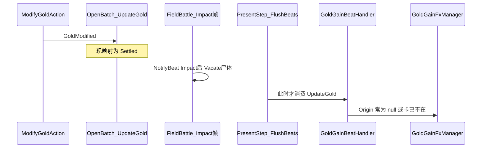

# 金币特效断线定位与复原

## 结论（断在哪儿）

设计链路仍在，**不是 FX 模块被删了**：

**主断点（表现因果断线）**：

1. `[PresentationEventMap.cs](Assets/Scripts/NineGrid.Foundation/NineGrid.Core/Presentation/PresentationEventMap.cs)` 把 `GoldModified → UpdateGold @ Settled`
2. 交战命中通道在 **Impact 帧** 冲刷飘字，随后才 `MarkFieldDead` / Vacate（见 `[FieldBattlePresentationExecutor.cs](Assets/Scripts/NineGrid.Presentation/Cards/Battle/FieldBattlePresentationExecutor.cs)` ~278/388 → ~455）
3. Settled 发生在通道结束后的 `[PresentStep.FlushBeats](Assets/Scripts/NineGrid.Presentation/Flow/Presentation/BatchLockstepSteps.cs)`——此时尸体视图已卸，`[ResolveCardWorldPosition](Assets/Scripts/NineGrid.Presentation/Flow/BattleSession/PresentationOutputProjector.cs)` 拿不到出生点
4. 叠加：`[ModifyGoldAction](Assets/Scripts/NineGrid.Foundation/NineGrid.Core/Domain/Actions/CoreActions.cs)` **从不** `.WithCard(...)`，`[GoldGainBeatHandler](Assets/Scripts/NineGrid.Presentation/Flow/Presentation/GoldGainBeatHandler.cs)` 永远读不到 `CardUid`/`TargetUid`

因此「从死卡爆出 → 飞入图标」的空间因果在 #61 收口后被拆断；内核 `PlayerModel.Coins` 与批次仍在推进，看起来像「内核还在演、表现断线」。

**次断点（加固）**：`[GoldGainPresentationBinder.EnsureInstalled](Assets/Scripts/NineGrid.Presentation/Flow/GoldGainPresentationBinder.cs)` 找到已有实例或 `arch == null` 时可能不订阅，事件静默丢失（无飞币、无音效、无 FlowTrace `GoldGained`）。

MainScene 里 `coinPrefab` / `sinkIcon` / `goldText` 已绑定；FX 本体 `[GoldGainFxManagerSingleton](Assets/Scripts/NineGrid.Presentation/Flow/GoldGainFxManagerSingleton.cs)` 仍完整，**不必重做一套特效**。

## 要不要按新架构改？

**要，但是轻改、不走回头路**：

- **保留** ADR-0007：只走 `BattleBeatScheduler` + handler，不恢复已删的 `PresentGoldGainsFromEventLog` 旁路
- **对齐** ADR-0018：死亡相关、依赖世界坐标的装饰应在 **Vacate 前的 Impact** 消费（与飘字同构）
- 因此把金币锚点从 Settled **改到 Impact**，并补上 CardUid——这是对新管线的适配，不是回退旧扫 EventLog

## 修复步骤

### 0. 实施前 30 秒分流（执行阶段先做）

| 探针                                                | 含义                                 |
| ------------------------------------------------- | ---------------------------------- |
| DevTest **Keypad9**                               | 绿 → FX/绑定正常；红 → 先查 prefab/图标       |
| 击杀后 FlowTrace 有无 `GoldGained`                     | 无 → Binder/Beat 未到；有但无飞币 → 出生点/可见性 |
| Console 有无 `Discarding unconsumed` / `UpdateGold` | 批次吞没                               |

### 1. Core：GoldModified 带上来源卡

- 扩展 `ModifyGoldAction`：可选 `sourceCardUid`，事件加 `.WithCard(uid)`（必要时带 FromSlot）
- `[KillAction](Assets/Scripts/NineGrid.Foundation/NineGrid.Core/Domain/Actions/CoreActions.cs)` 显式 `GoldReward` 加金：传入 `TargetUid`
- `[EconomySystem` OnRemove](Assets/Scripts/NineGrid.Foundation/NineGrid.Core/Systems/EconomySystem.cs) 默认击杀金：传入 `card.Uid`

### 2. 映射：`GoldModified` → Impact

- 改 `[PresentationEventMap](Assets/Scripts/NineGrid.Foundation/NineGrid.Core/Presentation/PresentationEventMap.cs)`：`PresentationBeat.Settled` → `Impact`
- `GoldGainBeatHandler` 逻辑可不动（仍认 `UpdateGold`）；交战命中帧 `NotifyBeat(Impact)` 时尸体仍在，能解析 origin
- 非战斗路径（`PresentEventLogSlice` / 回收 / 商店）仍走 FlushBeats 的 Impact，行为保持

### 3. Binder 订阅加固

- `EnsureInstalled`：已有实例也要 `RegisterEvents()`（或 arch 为空时延后重试）
- 避免「事件发出但无人听」的静默失败

### 4. 文档

- 修订 `[docs/adr/0007](docs/adr/0007-unified-presentation-pipeline.md)` 一句：金币装饰改 Impact（Vacate 前保出生点，对齐 #61 精神 + ADR-0018）
- 同步 `[docs/code-map/presentation.md](docs/code-map/presentation.md)` 中「金币 @ Settled」表述

### 5. 验证

- `unity command recompile` + Console（无本改动新增 Error）
- Keypad9：飞币 + 图标膨胀 + 数值
- 击杀有 `KillGold` 的怪：从尸体附近爆出并吸入 HUD
- 道具回收 / 房内加金：仍有飞币或至少数值追上（origin 可为默认）

## 明确不做

- 不恢复 EventLog 旁路扫金
- 不重写 `GoldGainFxManager` 飞入/吞噬算法
- 不把金币演出重新挂进主线 ack

