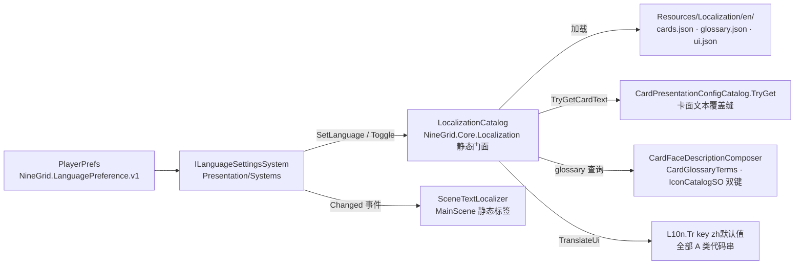

# 本地化（中 ↔ 英）—— 协作格式权威文档

> 长期不变量见 [ADR-0046](../adr/0046-localization-source-language-and-overlay-tables.md)。
> 本文是「怎么补翻译 / 怎么加接线 / 怎么加新语言」的操作权威；改架构先改本文与 code-map，再改代码。

## 0. 总原则（红线级）

- **中文是唯一真源**：内容 JSON、场景 TMP、代码字面量里的中文一律不动；其他语言以**外挂翻译表**运行时覆盖。
- **缺键回退中文，永不空串**：任何语言查表 miss → 显示中文默认值；缺整张表 / 缺文件 = 空表 = 全回退，**静默**（不报错刷屏）；坏 JSON 不替换旧表（只 LogWarning 一条）。
- 不引入 `com.unity.localization` 包，自建轻量层。
- **不翻**：Find/节点名串、contentId/deckId/skillId/装配 id、日志/诊断、Editor 工具、Cheat（F12）与 QuickTest 面板文案、AudioCue/VfxCue 中文 note。

## 1. 架构



| 构件 | 位置 | 职责 |
|------|------|------|
| `LanguageId` / `L10n` / `LocalizationCatalog` | `NineGrid.Core/Localization/` | 语言码、Tr 门面、三表加载与查询（`TablesVersion` 代数供缓存失效） |
| `ILanguageSettingsSystem` / `LanguageSettingsSystem` | `NineGrid.Presentation/Systems/LanguageSettingsSystem.cs` | PlayerPrefs 持久化 + `Changed` 事件；`PresentationSceneRoot.WireHosts` 注册 |
| `SceneTextLocalizer` | `NineGrid.Presentation/Ui/SceneTextLocalizer.cs`（MainScene 根级同名 GO） | 显式序列化 TMP 引用 + ui 键；Awake 捕获中文原文；订阅 Changed 即刷 |
| 主菜单切换按钮 | MainScene `Panels/MainPanel/LanguageToggle` + `GameFlowController.languageHit` | 点击 `Toggle()`；label 走 `menu.language` 键（zh「中文」/ en「English」） |

切换时序：写 PlayerPrefs → 重载表 → 发 `Changed` → 订阅者自刷。切换只发生在主菜单；局内不做实时重投影，切换后新投影/新面板即用新语言。

## 2. 三张翻译表（schema 与路径）

目录：`Assets/Resources/Localization/<lang>/`（zh 为源语言，**无表**）。JSON 一律 UTF-8（无 BOM）。

### cards.json —— 卡牌/卡组文本（键 = contentId / deckId）

```json
{ "schema": 1, "language": "en",
  "entries": {
    "monster.skull_head": { "displayName": "…", "description": "…", "faceIntro": "…" },
    "deck.dragon": { "displayName": "…" }
  } }
```

- 字段全部可选，缺字段回退中文。
- `monster_decks.json` 的 `display_name` 与 deck JSON 的 `displayName` **共用 deckId 键**。
- 生效缝：`CardPresentationConfigCatalog.TryGet`（返回文本覆盖副本，先于 `{装配id.键}` 令牌投影）；monster deck 兜底在 `CardInspectDetailComposer.ResolveDeckIntro`。

### glossary.json —— 词条表（键 = 现行中文词条名，Trim 后）

```json
{ "schema": 1, "language": "en",
  "entries": { "灼烧": { "displayName": "Burn", "intro": "…" } } }
```

- `[[词条]]` 匹配键 = **zh 名 ∪ en 名** 双键（与当前语言无关；`CardFaceDescriptionIconCatalogSO` 构建 lookup 时登记，冲突时中文键权威）。
- 显示名与右键词条行 / hover 解释按当前语言取表，缺回中文。

### ui.json —— 代码串 + 场景静态标签（扁平键）

```json
{ "schema": 1, "language": "en",
  "entries": { "menu.start": "Start", "notice.gold_insufficient": "Not enough gold" } }
```

- 键命名：dot-namespace 小写 —— `menu. / settings. / notice. / briefTip. / floor. / preview. / charselect. / save. / summary. / choice. / hud. / inspect.`。
- 代码侧 API：`L10n.Tr("key", "中文默认值")`；含格式化的取 `{0}` 模板再 `string.Format`。
- 特殊键：`save.date_format` 是 .NET DateTime 格式串（zh `M月d日 HH:mm` / en `MMM d HH:mm`）；`preview.room_info` 是含 `{room}/{floor}/{progress}` 的整段模板；`floor.level` 的 `{0}` 是拉丁数字（Ⅱ→ "Floor Ⅱ"）。

## 3. 四类补翻操作手册

### 3.1 新增 / 修改卡牌翻译

1. 找到卡的 contentId（`Assets/Arts/ContentVisual/cards/*.json` 的 `contentId` 字段，如 `relic.golden_sword`）。
2. 在 `Assets/Resources/Localization/en/cards.json` 的 `entries` 下加一条：键 = contentId，`displayName` / `description` / `faceIntro` 按需给（缺的字段自动回退中文）。
3. **红线**：`{装配id.键}` 令牌原样保留（位置可随英文语序移动）；`[[中文词条名]]` 改成 `[[英文词条名]]` 且必须与 glossary.json 里该词条 `displayName` **逐字一致**；`[code]` 图标代号原样保留。
4. 卡组名：deck JSON（`deck.*`）与 `monster_decks.json` 表行共用 deckId 键，只需在 cards.json 写一条 `"deck.xxx": { "displayName": "…" }`。
5. 验证：Editor Play → 主菜单切英文 → 开局看该卡卡面 / 右键详述。

### 3.2 新增 / 修改词条翻译

1. 词条真源在 `Assets/Resources/Arts/Cards/CardFaceDescriptionIconCatalog.asset`（`displayNameZh` 是键）。
2. 在 `en/glossary.json` 的 `entries` 下加：键 = 中文词条名（与 `displayNameZh` 逐字一致，Trim 后），值 `{ "displayName": "英文名", "intro": "英文解释" }`。
3. 该英文名自动成为 `[[…]]` 的第二匹配键——**翻 cards.json 描述里的 `[[词条]]` 前，先保证 glossary 里有这条**，否则词条着色与右键词条行断链。
4. 验证：切英文 → 有该词条的卡右键详述，词条行标题/正文应为英文；描述内着色词为英文名。

### 3.3 新增代码串（新的玩家可见字面量）

1. 写代码时一律 `L10n.Tr("命名空间.键", "中文原文")`（`NineGrid.Core.Localization`；Core/Content/Presentation 均可直接调用）。含变量的写 `{0}` 模板再 `string.Format`。
2. 键按 §2 命名空间取；中文原文就是 zh 显示值，**不要**再写进任何表。
3. 在 `en/ui.json` 补该键的英文值。
4. **禁区**：`transform.Find`/`FindDeep`/节点名常量、contentId、日志（`Debug.Log*`）、Editor/Cheat/QuickTest 文案——这些不是玩家 UI 文案，禁止包 Tr。
5. 文案 SO（如 `BattleInfoPreviewCopySO`）：资产里保留中文，在**消费处**包 Tr（参考 `BattleInfoPreviewPresenter.ResolveRoomInfoTemplate`）。

### 3.4 新增场景静态标签

1. 找到 MainScene 根级 `SceneTextLocalizer` 对象，在其组件 `entries` 数组加一项：`target` 拖 TMP 引用（PrefabInstance 覆写的标签直接拖实例上的 TMP），`key` 填新 ui 键。**禁止在代码里 Find**。
2. 场景 TMP 里的中文不动（组件 Awake 自动捕获为默认值）。
3. 在 `en/ui.json` 补该键英文值。
4. 保存场景，切换语言验证即刷。

## 4. 翻译红线（表数据必须遵守）

1. `{装配id.键}` 令牌**原样保留**（含大小写与点号）。
2. `[[中文词条名]]` → `[[英文词条名]]`，与 glossary `displayName` 逐字一致。
3. `[code]` 内联图标代号（如 `[Action_Icon]`）原样保留。
4. `\n` 与 `·` 等版式符号按英文习惯处理但保持行数近似；卡面描述/介绍尽量 ≤ ~34 拉丁字符（26 格约束只管中文、仅编辑器，英文靠自律防 UI 溢出）。运行时兜底：help/trap 介绍区域与详述预览描述面板的 TMP 模板自带 autosize（min 3 / max 5–6）；其余经 `CardFacePresentationBinder.ApplyBasicDescription` 写入的描述槽由代码开 autosize（上限=模板原字号，下限 60%，中文短文案视觉不变）。
5. contentId/deckId/skillId、资源路径、Find 串永不出现在译文改动里。
6. 术语锚点：Attack / Armor / HP / Gold / Relic / Item Card / Trap / Monster / Floor / Boss / Deck / Combat / Interaction / Action Count / Move Count / Exit Trap / Recycle / Draw Pile；全表见 `docs/localization/terminology.md`（翻译侧维护）。

## 5. 验证步骤

1. `recompile` 后 Console 无本票新增 Error/Exception/Assert。
2. Play → 主菜单点 `LanguageToggle` → 主菜单按钮/副标题/版本号变英文 → 再点变回中文 → 重启 Play 语言偏好保持。
3. 卡面/词条抽查：切英文开一局，看已翻卡牌的卡面名/描述、右键详述背景介绍、词条行。
4. 表改坏了的症状：Console 一条 `[LocalizationCatalog] 解析 … 失败，保留旧表`；游戏继续用旧表/中文，不崩。

## 6. 加新语言（如 ja）

1. `LanguageId` 加常量 `Ja = "ja"` 并更新 `Normalize`。
2. 建 `Assets/Resources/Localization/ja/` 三表（schema 同 §2，`language: "ja"`；可先只放 ui.json，其余缺 = 回退中文）。
3. 切换 UI：v1 是 zh↔en 二元 `Toggle()`；三语起把 `LanguageSettingsSystem.Toggle` 改为循环列表（或做语言子菜单），`menu.language` 键在各语言表里写本语言名（ja 表写「日本語」）。
4. 词条双键会自动变多键：`CardFaceDescriptionIconCatalogSO` 只登记「当前语言表」里的外语名 + 中文名；若要求「任意语言写的描述在任何语言下都命中」，需在该处改为遍历所有语言表（v1 未做，见 ADR-0046 遗留）。
5. 字体：确认三套 TMP 字体（SmileySans / ZhengGeDianHei / ChangBanDianSong）覆盖目标语言字形；日文假名需另查字表。
6. 翻译表数据 + `terminology.md` 术语列由翻译侧产出。

## 7. 文件所有权

| 文件 | 归属 |
|------|------|
| 全部 `.cs`、MainScene、`en/ui.json`、本 README、code-map、ADR | 基建侧 |
| `en/cards.json`、`en/glossary.json`、`terminology.md` | 翻译侧 |
